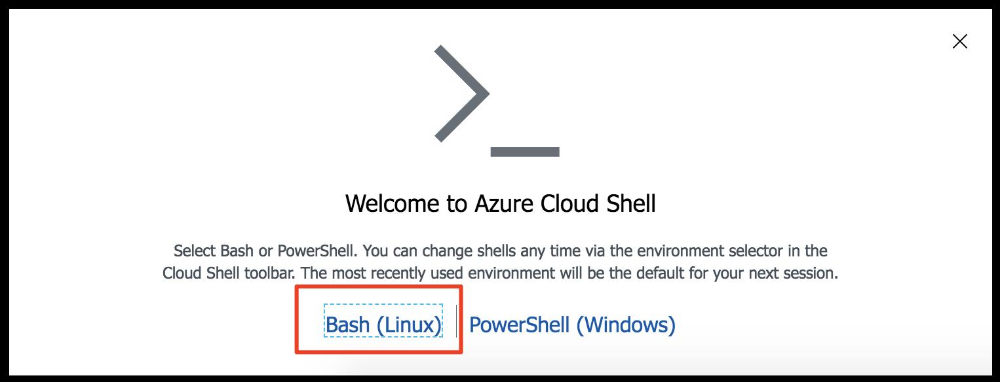
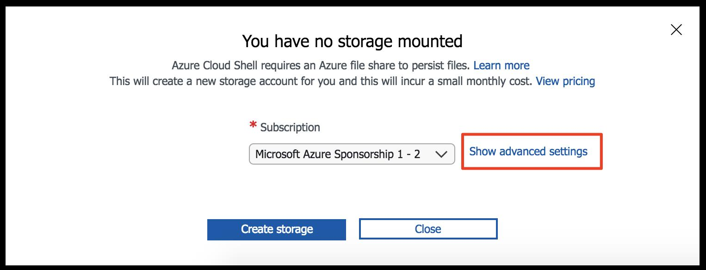
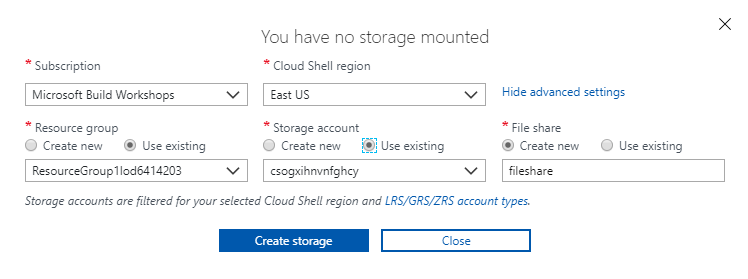

You will perform all the steps in this lab in your web browser using the Azure Portal and Azure Cloud Shell. Azure Portal is a browser-based user interface. Cloud Shell provides a command line experience for managing resources in Azure.

### Log in and configure Cloud Shell

1. Log in to the portal using the following credentials. 
    
    |||
    |---|---|
    |Username|++@lab.CloudPortalCredential(1).Username++|
    |Password|++@lab.CloudPortalCredential(1).Password++|

1. Open a Cloud Shell instance by clicking on its icon located in the upper right of the portal.

    

1. Select **Bash (Linux)**.

    

1. Before Cloud Shell can be used for the first time, you need to configure it with a Storage account to persist files you created. Click on **Show advanced Settings**.

    

1. Enter the following values (note that your values may differ than the screenshot).

    |Name | Value|
    |---|---|
    |Cloud Shell region|East US|
    |Resource group | **Use existing** (**@lab.CloudResourceGroup(265).Name**)|
    |Storage account | **Use existing** (choose the existing account)|
    |File share | **Create name** (name it ++**fileshare**++)|

    

1.  Click **Create storage** to create the file share used by Cloud Shell.