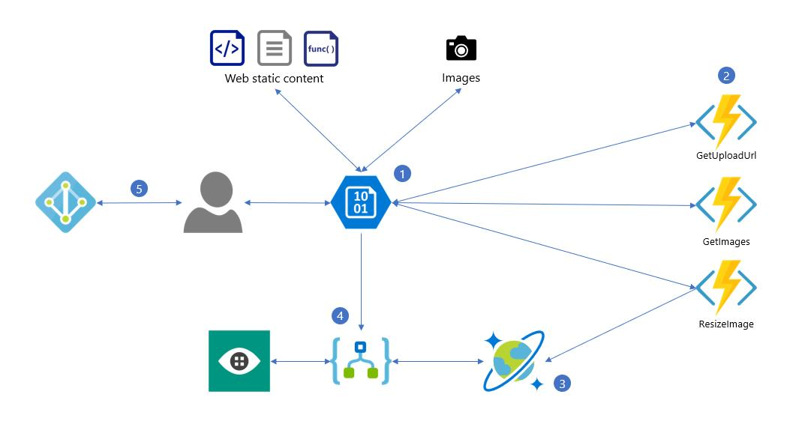

In this walkthrough tutorial, you will deploy a simple web application that enables users to upload their images and automatically get captions describing them. The application will present an HTML-based user interface displaying the list of images already uploaded (after signing in), all managed with a serverless backend.

The application uses Blob Storage (both for web static content and images/thumbnails), Azure Functions, Logic Apps, Cosmos DB, Computer Vision, and Azure Active Directory as pictured below:

## What is covered in this lab?

* Create an Azure Storage account and configure containers to host static websites and images 
* Create an Azure Function for uploading images to blob storage
* Resize images using Azure Functions 
* Store image metadata in Cosmos DB
* Use Cognitive Services Vision API to auto-generate image captions
* Add authentication 

In order to complete this lab you will need  an Azure subscription. Please see the prerequisite section for more details. If you don't have an Azure subscription, create a [free account](https://azure.microsoft.com/en-us/free/?WT.mc_id=A261C142F) before you begin, or you can click the `Hands-on Lab` button below to launch the lab on Hands-on Lab site for integrated instruction, we will provide you the necessary resources, including a temporary Azure subscription for the purpose of this lab.