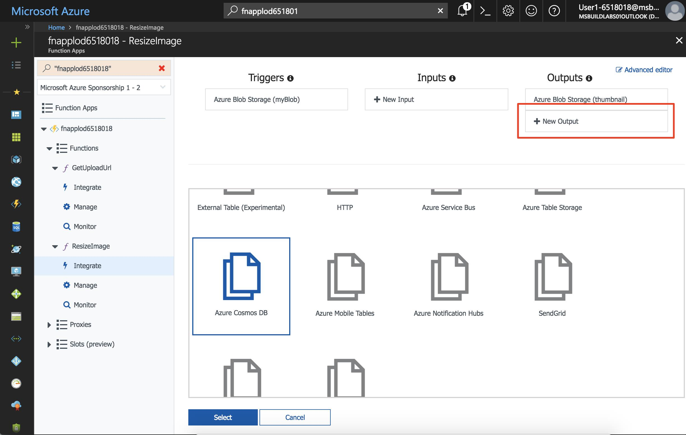
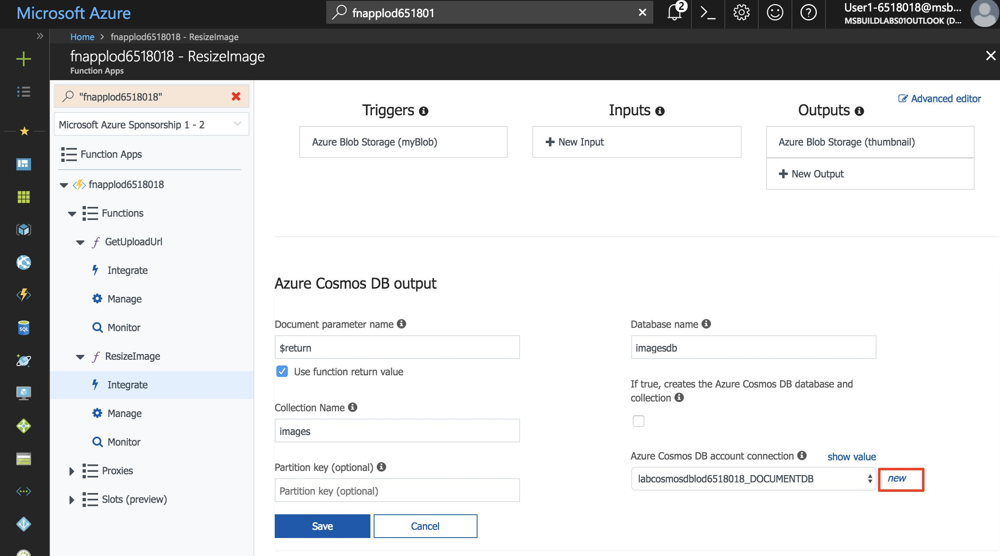
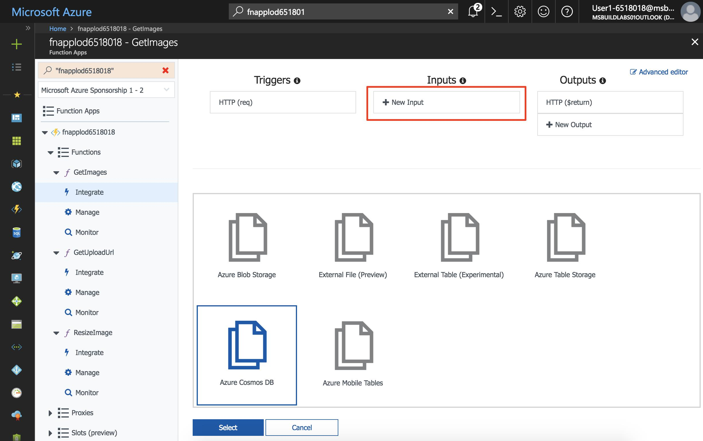
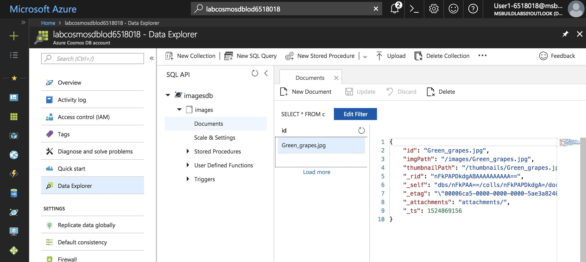

In this exercise, you will create an Azure Cosmos DB to store metadata about the uploaded images. Azure Cosmos DB is Microsoft's globally distributed, multi-model database.

### Create a Cosmos DB account, database, and collection

A Cosmos DB account is an Azure resource that contains Cosmos DB databases.

1. Ensure you are still logged into the Cloud Shell. Create a Cosmos DB account with a unique name of **labcosmosdb** in the same resource group as the other resources in this tutorial.

    ```
    az cosmosdb create -g first-serverless-app -n labcosmosdb
    ```

1. After the Cosmos DB account is created, create a new database named **imagesdb** in the account.

    ```
    az cosmosdb database create -g first-serverless-app -n labcosmosdb --db-name imagesdb
    ```

1. A database can contain one or more collections. After the database is created, create a new collection named **images** in the database with a throughput of 400 request units (RUs).

    ```
    az cosmosdb collection create -g first-serverless-app -n labcosmosdb --db-name imagesdb --collection-name images --throughput 400
    ```

### Save a document to Cosmos DB when a thumbnail is created

The Cosmos DB output binding makes it easy to create documents in a Cosmos DB collection from Azure Functions. You will configure a Cosmos DB output binding in the **ResizeImage** function and modify the function to return a document (object) to be saved.

1. Open the function app in the Azure Portal.

1. In the function app window's left hand navigation, expand the **ResizeImage** function, select **Integrate**.

1. Under **Outputs**, click **New Output**.

1. Find the **Azure Cosmos DB** item and click it. Then click **Select**.

    

1. Fill out the remaining inputs with the following values.

    | Setting      |  Suggested value   | Description                                        |
    | --- | --- | ---|
    | **Document parameter name** | Check **Use function return value** | The value of the textbox is automatically set to **$return**. |
    | **Database name** | imagesdb | Use the name of the database that you created. |
    | **Collection name** | images | Use the name of the collection that you created. |

1. Next to **Azure Cosmos DB account connection**, click **new**. Select the Cosmos DB account you previously created.

    

1. Click **Save** to create the Cosmos DB output binding.

1. Click on the **ResizeImage** function name on the left to open the function.

    **C#**

    1. The Cosmos DB output binding you created is configured to save the function's return value into the database collection. Change the return type of the function from **void** to **object**.

    1. At the end of the function, add the following code block to return the document to be saved:
    
        ```
        return new {
            id = name,
            imgPath = "/images/" + name,
            thumbnailPath = "/thumbnails/" + name
        };
        ```

    **JavaScript**

    1. Change the `context.done()` statement in the `else` clause to return the document to be saved to Cosmos DB.

        ```
        if (error) {
            context.done(error);
        } else {
            context.bindings.thumbnail = stream;

            // *** change these lines
            context.done(null, {
                id: context.bindingData.name,
                imgPath: "/images/" + context.bindingData.name,
                thumbnailPath: "/thumbnails/" + context.bindingData.name
            });
            // ***
        }
    ```

1. Click **Logs** below the code window to expand the logs panel.

1. Click **Save**. Check the logs panel to ensure the function is successfully saved and there are no errors.

### Create a function to list images from Cosmos DB

The web application requires an API to retrieve image metadata from Cosmos DB. You will create an HTTP triggered function that uses a Cosmos DB input binding to declaratively query the database collection.

1. In your function app, hover over **Functions** on the left and click **+** to create a new function.

1. Find the **HttpTrigger** template and click it.

1. Use these values to create a function that generates a blob upload URL.

    | Setting      |  Suggested value   | Description                                        |
    | --- | --- | ---|
    | **Name your function** | GetImages | Type this name exactly as shown so the application can discover the function. |
    | **Authorization level** | Anonymous | Allow the function to be accessed anonymously. |

1. Click **Create** to create the function.

1. When the new function is created, click **Integrate** under the function's name on the left navigation.

1. Click **New Input** and select **Azure Cosmos DB**. Fill out the following values:

    | Setting      |  Suggested value   | Description                                        |
    | --- | --- | ---|
    | **Document parameter name** | documents | Matches parameter name in the function. |
    | **Database name** | imagesdb |  |
    | **Collection name** | images |  |
    | **SQL query** | select * from c order by c._ts desc | Get documents, latest documents first. |
    | **Azure Cosmos DB account connection** | Select the existing connection string |  |

    

1. Click **Save** to create the input binding.

    **C#**

    1. Click the function's name to open the code window, replace all of **run.csx** with the content in [**/csharp/GetImages/run.csx**](https://raw.githubusercontent.com/Azure-Samples/functions-first-serverless-web-application/master/csharp/GetImages/run.csx).

    **JavaScript**

    1. Click the function's name to open the code window, replace all of **index.js** with the content in [**/javascript/GetImages/index.js**](https://raw.githubusercontent.com/Azure-Samples/functions-first-serverless-web-application/master/javascript/GetImages/index.js).

1. Click **Logs** below the code window to expand the logs panel.

1. Click **Save**. Check the logs panel to ensure the function is successfully saved and there are no errors.


### Test the application

1. Obtain the URL of your application.

    ```
    az storage blob url --account-name <webstorage-name> -c \$root -n index.html --output tsv | sed 's/\$root\///'
    ```

1. Open a new browser window and browse to the URL. Select an image file and upload it.

1. After a few seconds, the thumbnail of the new image should appear on the page.

1. Use the Search box to search your Cosmos DB account by name (**labcosmosdb**). Click it to open it.

1. Click **Data Explorer** on the left to browse collections and documents.

1. Under the **imagesdb** database, select the **images** collection.

1. Confirm that a document was created for the uploaded image.

    

### Summary

In this exercise, you learned how to create a Cosmos DB account, database, and collection. You also learned how to use the Cosmos DB bindings to save and retrieve image metadata in the Cosmos DB collection. Next, you will learn how to automatically generate a caption for each uploaded image using Microsoft Cognitive Services.


---