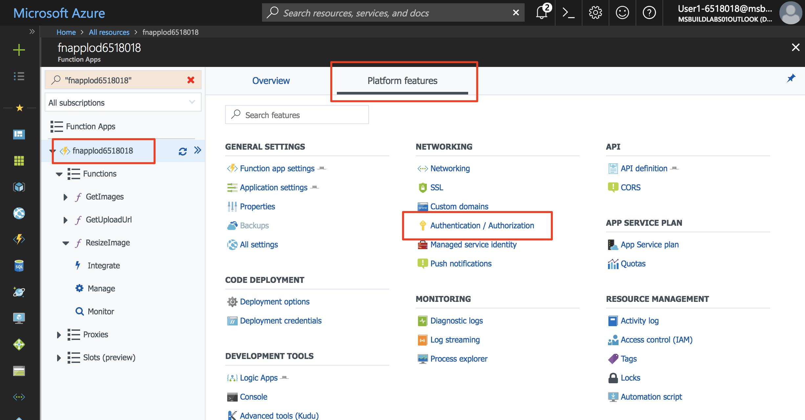
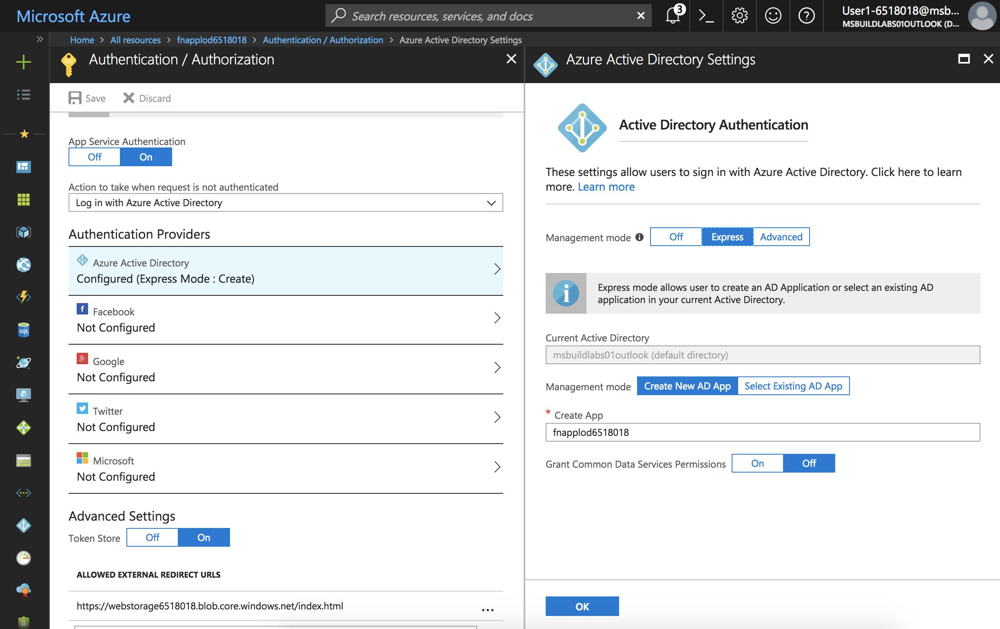

In this exercise, you will create and use the Computer Vision API to generate captions for uploaded images.

### Create a Computer Vision account

Microsoft Cognitive Services are a collection of services available to developers to make their applications more intelligent. The Computer Vision API is a serverless service that processes images using advanced algorithms and returns information about each image. It has a free tier that provides up to 5000 API calls per month.

1. Ensure you are still logged into the Cloud Shell. Create a new Cognitive Services account of kind **ComputerVision** with a unique name in your resource group. For the free tier, use **S1** as the SKU.

    ```
    az cognitiveservices account create -g first-serverless-app -n compvision --kind ComputerVision --sku S1 -l eastus
    ```

### Create Function App settings for Computer Vision URL and key

To call the Computer Vision API, a URL and key are required.

1. Obtain the Computer Vision API key and URL and save them in bash variables.

    ```
    export COMP_VISION_KEY=$(az cognitiveservices account keys list -g first-serverless-app -n compvision --query key1 --output tsv)
    ```
    ```
    export COMP_VISION_URL=$(az cognitiveservices account show -g first-serverless-app -n compvision --query endpoint --output tsv)
    ```

1. Create app settings named **COMP_VISION_KEY** and **COMP_VISION_URL**, respectively, in the function app.

    ```
    az functionapp config appsettings set -n fnapp -g first-serverless-app --settings COMP_VISION_KEY=$COMP_VISION_KEY COMP_VISION_URL=$COMP_VISION_URL -o table
    ```

    Ensure the output contains the appropriate values.

### Call Computer Vision API from ResizeImage function

You will modify the **ResizeImage** function to call the Computer Vision API to describe each uploaded image and save the description in Cosmos DB.

1. Open your function app in the Azure Portal.

    **C#**

    1. Using the left navigation, locate the **ResizeImage** function and open its code window.

    1. Replace the code with the contents of [**/csharp/ResizeImage/run-module5.csx**](https://raw.githubusercontent.com/Azure-Samples/functions-first-serverless-web-application/master/csharp/ResizeImage/run-module5.csx) that uses `HttpClient` to call Computer Vision API and save its result in Cosmos DB.

    **JavaScript**

    1. This function requires the `axios` package from npm to make an HTTP call to the Computer Vision API. To install the npm package, click on the Function App's name on the left navigation and click **Platform features**.

    1. Click **Console** to reveal a console window.

    1. Run the command `npm install axios` in the console. It may take a minute or two to complete the operation.

    1. Click on the function name (**ResizeImage**) in the left navigation to reveal the function, and then replace all of **index.js** with the contents of [**/javascript/ResizeImage/index-module5.js**](https://raw.githubusercontent.com/Azure-Samples/functions-first-serverless-web-application/master/javascript/ResizeImage/index-module5.js).

1. Click **Logs** below the code window to expand the logs panel.

1. Click **Save**. Check the logs panel to ensure the function is successfully saved and there are no errors.

### Test the application

1. Obtain the URL of your application.

    ```
    az storage blob url --account-name <webstorage-name> -c \$root -n index.html --output tsv | sed 's/\$root\///'
    ```

1. Open a new browser window and browse to the URL. Select an image file and upload it.

1. After a few seconds, the thumbnail of the new image should appear on the page. Hover over the image to see the description generated by Computer Vision.


### Summary

In this exercise, you learned how to automatically generate captions for each uploaded image using Microsoft Cognitives Services' Computer Vision API. Next, you will learn how to add authentication to the application using Azure App Service Authentication.


---

## Exercise 6: Add authentication (5 minutes)

Azure Functions is part of the Azure App Service platform. App Service Authentication allows you to quickly add authentication to your function app using one or more of the following services: Facebook, Twitter, Google, Microsoft Account, and Azure Active Directory.

For this exercise, you will configure your application to log in with Azure Active Directory.

### Enable App Service Authentication

1. Open the function app you created earlier.

1. Under **Platform features**, click on **Authentication/Authorization**.

    

1. Select the following values:
    
    | Setting      |  Suggested value   | Description                                        |
    | --- | --- | ---|
    | **App Service Authentication** | On | Enable authentication. |
    | **Action when request is not authenticated** | Log in with Azure Active Directory | Select a configured authentication method (below). |
    | **Authentication Providers** | See below | See below |
    | **Token store** | On | Allow App Service to store and manage tokens. |
    | **Allowed external redirect URLs** | https://webstorage@lab.LabInstanceId.blob.core.windows.net/index.html | Add an entry for the URL of your application. |
    
    **Instructions for AAD (need tabs here for other social logins: Twitter, FB, Google, Microsoft)**

1. Click on **Azure Active Directory** to reveal **Azure Active Directory Settings**.

    1. Select **Express** as the **Management Mode** and fill in the following information.
    
        | Setting      |  Suggested value   | Description                                        |
        | --- | --- | ---|
        | **Management mode** | Express, Create new AD app | Automatically set up a service principal and Azure Active Directory authentication. |
        | **Create app** | fnapp@lab.GlobalLabInstanceId | Enter a unique application name. |
    
    1. Click **OK** to save the Azure Active Directory settings.

    

1. Click **Save** to finish setting up App Service Authentication.

### Modify the web app to enable authentication

1. In the Cloud Shell, ensure that the current directory is the **dist** folder.

    ```
    cd ~/source/www/dist
    ```

1. To enable authentication in your web app, append the following line of code to **settings.js**.

    `window.authEnabled = true`

    Make the change by running the following command or by using a command-line editor like VIM.

    ```
    echo "window.authEnabled = true" >> settings.js
    ```

    Confirm the change was made to the file.

    ```
    cat settings.js
    ```

1. Upload the file to Blob storage.

    ```
    az storage blob upload -c \$root --account-name <webstorage-name> -f settings.js -n settings.js
    ```

### Test the application

1. Obtain the URL of your application.

    ```
    az storage blob url --account-name <webstorage-name> -c \$root -n index.html --output tsv | sed 's/\$root\///'
    ```

1. Open a new browser window and browse to the URL. Click **Log in** and log in.

1. Select an image file and upload it.
    

### Summary

In this exercise, you learned how to enable authentication to the applcation using Azure App Service Authentication.