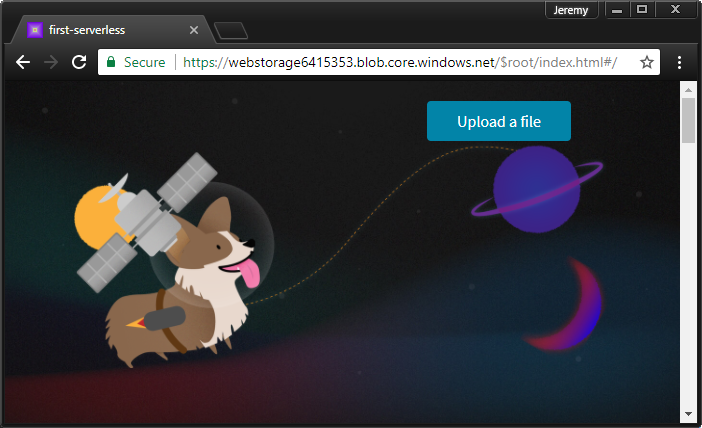

In this exercise, you will create a blob storage account and a container to host files for a static website. You will upload the static files and access the single page application (SPA) directly from blob storage.

### Create a Storage account

A Storage account is an Azure resource that allows you to store tables, queues, files, blobs (objects), and virtual machine disks.

1. In Azure, a Resource Group is a container that holds related Azure resources for ease of management. Create a resource group with the name **first-serverless-app**.

1. The static content (HTML, CSS, and JavaScript files) for this tutorial will be hosted in Blob Storage. Blob Storage requires a Storage account. Create a general purpose V2 Storage account named **webstorage** in the resource group. 

    > **Note:** As resource names should be unique across all of Azure, provide unique name for your resources. For any step in this lab replace **webstorage-name** placeholder with your storage account name.

    ```
    az storage account create -n <webstorage-name> -g first-serverless-app --kind StorageV2 -l eastus --https-only true --sku Standard_LRS
    ```

    By default, running an `az` command returns information in JSON format.

1. Create a Blob container named **$root** in the Storage account and allow its blobs to be publicly accessible. **$root** is a special container that allows files to be accessible at the root URL.

    ```
    az storage container create -n \$root --account-name <webstorage-name> --public-access blob
    ```

### Upload web application

1. The source files for building this tutorial are located in a [GitHub repository](https://github.com/Azure-Samples/functions-first-serverless-web-application). Ensure you are in your home directory in Cloud Shell and clone this repository.

    ```
    cd ~
    ```
    ```
    git clone https://github.com/Azure-Samples/functions-first-serverless-web-application source
    ```

    The repository will be cloned to `~/source`.

1. The client-side web application is located in the **www** folder and is built using the Vue.js JavaScript framework. Change into the folder and run npm commands to install the application's dependencies and build the application. 
   > **Note:** it is perfectly normal to receive a server error that it is unable to load nuxtjs stats.

    ```
    cd ~/source/www
    ```
    ```
    npm install
    ```
    ```
    npm run generate
    ```

    The application is generated at `~/source/www/dist`.

1. Change the current directory to **dist** and upload the application to the Blob container.

    ```
    cd ~/source/www/dist
    ```
    ```
    for file in *.*; do az storage blob upload -c \$root --account-name <webstorage-name> -f $file -n $file; done
    ```
    ```
    az storage container create -n nuxt --account-name <webstorage-name> --public-access blob
    ```
    ```
    az storage blob upload-batch -s nuxt -d nuxt --account-name <webstorage-name>
    ```

    >**Note:** The above instructions create a second container named **nuxt** and upload the contents of the **nuxt** folder. A recently released feature in Storage no longer requires this step. This lab will be updated to reflect this change.

1. Query the URL to the application.

    ```
    az storage blob url -c \$root -n index.html --account-name <webstorage-name> -o tsv | sed 's/\$root\///'
    ```

    Open the URL in a web browser to view the application.

    

### Summary

In this exercise, you created a new storage account named **webstorage** and a blob container named **$root** that stores the static content for your web application and makes the content available publicly. Next, you will learn how to use a serverless function to upload images to Blob storage from this web application.