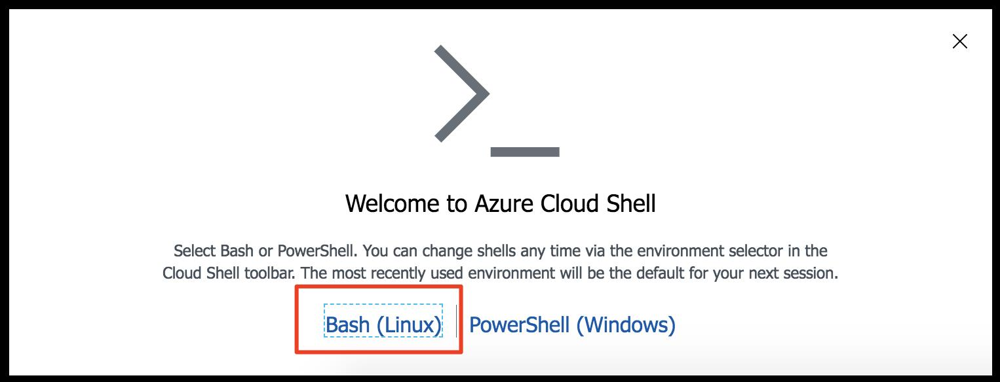
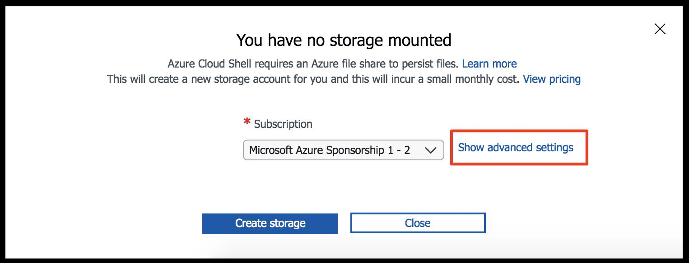
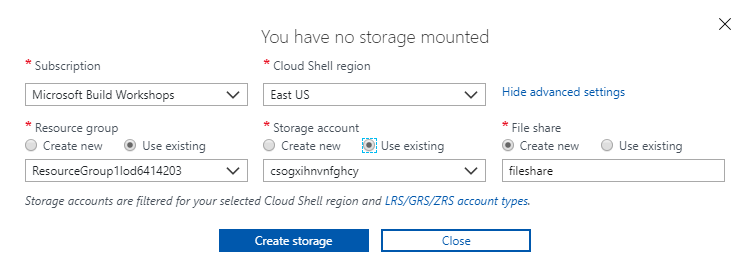

### Prerequisites for the lab

 **Microsoft Azure Account**: You will need a valid and active Azure account for this lab. If you do not have one, you can sign up for a [free trial](https://azure.microsoft.com/en-us/free/)

   * If you are a Visual Studio Active Subscriber, you are entitled for a $50-$150 credit per month. You can refer to this [link](https://azure.microsoft.com/en-us/pricing/member-offers/msdn-benefits-details/) to find out more including how to activate and start using your monthly Azure credit.

   * If you are not a Visual Studio Subscriber, you can sign up for the FREE [Visual Studio Dev Essentials](https://www.visualstudio.com/dev-essentials/) program to create **Azure free account** (includes 1 year of free services, $200 for 1st month).

You will perform all the steps in this lab in your web browser using the Azure Portal and Azure Cloud Shell. Azure Portal is a browser-based user interface. Cloud Shell provides a command line experience for managing resources in Azure.

### Log in and configure Cloud Shell

1. Log in to the azure portal using your subscription credentials.
    
    

1. Open a Cloud Shell instance by clicking on its icon located in the upper right of the portal.

    

1. Select **Bash (Linux)**.

    

1. Before Cloud Shell can be used for the first time, you need to configure it with a Storage account to persist files you created. Click on **Show advanced Settings**.

    

1. Enter the following values (note that your values may differ than the screenshot).

    |Name | Value|
    |---|---|
    |Cloud Shell region|East US|
    |Resource group | **Use existing** (**first-serverless-app-xxxxx**)|
    |Storage account | **Use existing** (choose the existing account)|
    |File share | **Create name** (name it **fileshare**)|

    

1.  Click **Create storage** to create the file share used by Cloud Shell.