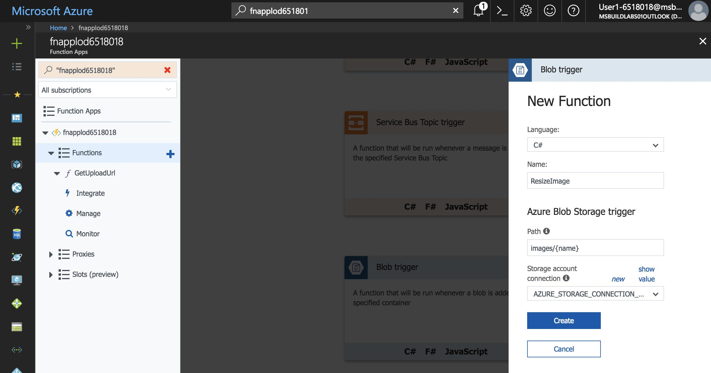
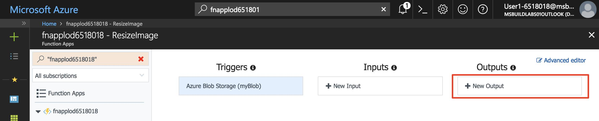
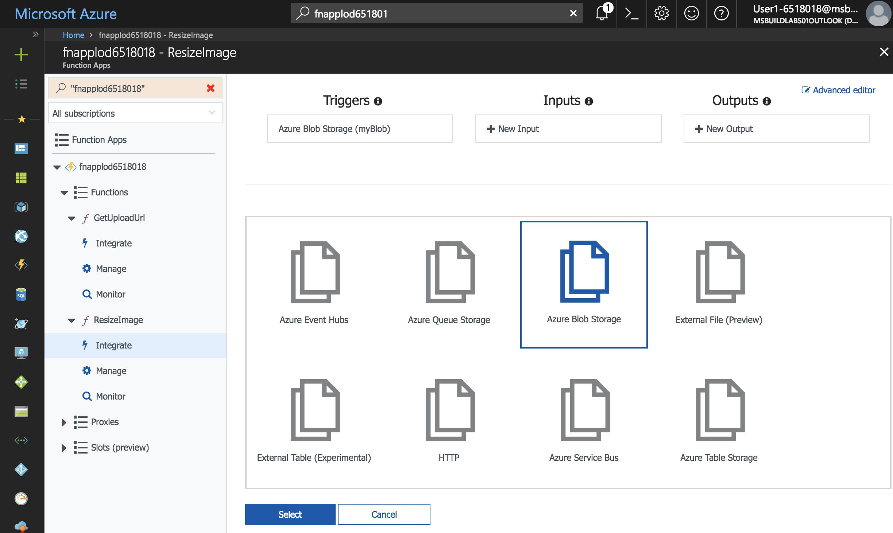
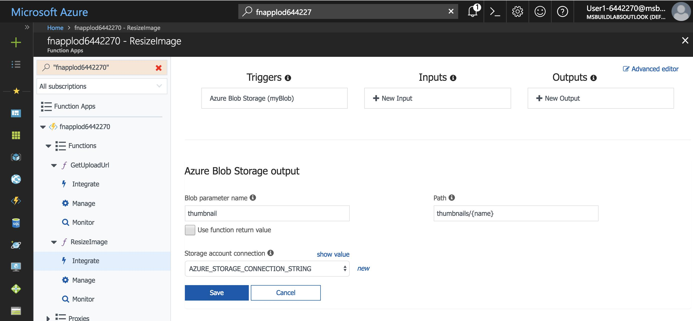
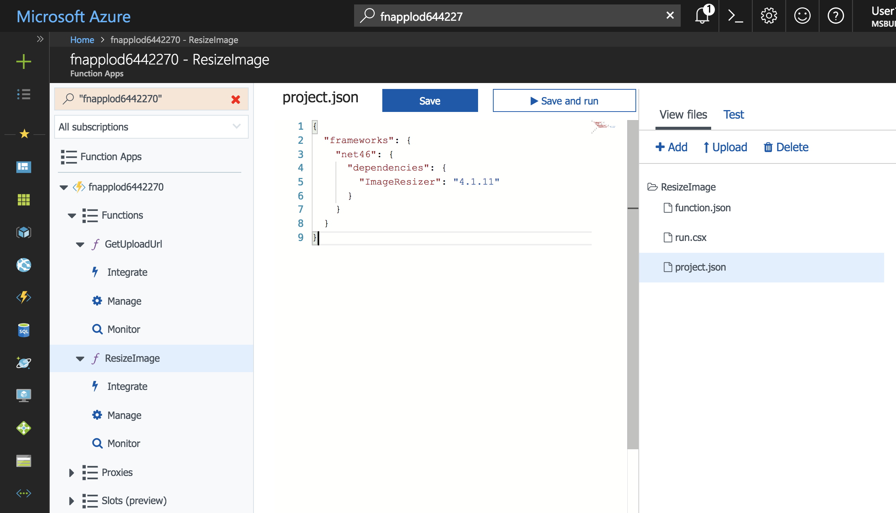

In this exercise, you will create another storage container to store thumbnail images. Then you will create a serverless function to resize uploaded images and store them into the thumbnails container.

### Create a blob storage container for thumbnails

The full size images are stored in a container named **images**. You need another container to store thumbnails of those images.

1. Ensure you are still logged into the Cloud Shell (bash). Create a new container named **thumbnails** in your storage account with public access to all blobs.

    ```
    az storage container create -n thumbnails --account-name <webstorage-name> --public-access blob
    ```

### Create a blob triggered serverless function

A serverless function can be triggered by an event such as the creation of an object in Blob storage. You can create a blob triggered function that generates an image thumbnail when an image is uploaded to the **images** container.

Triggers and bindings are a declarative way to define how a function is invoked and what data it works with. A trigger defines how a function is invoked. A function must have exactly one trigger. Triggers have associated data, which is usually the payload that triggered the function.

Bindings allow functions to input or output data or files.

The function we will create is triggered by a new object Blob storage. It also has a Blob output binding that saves the resized image in the **thumbnails** container.

1. Open your function app in the Azure Portal.

1. In the function app window's left hand navigation, hover over **Functions** and click **+** to start creating a new serverless function. If a quickstart page appears, click **Custom function** to see a list of function templates.

1. Find the **BlobTrigger** template and click it.

1. Use these values to create a function that creates thumbnails as images are uploaded.

    | Setting      |  Suggested value   | Description                                        |
    | --- | --- | ---|
    | **Language** | C# or JavaScript | Choose your preferred language. |
    | **Name your function** | ResizeImage | Type this name exactly as shown so the application can discover the function. |
    | **Path** | images/{name} | Execute the function when a file appears in the **images** container. |
    | **Storage account information** | AZURE_STORAGE_CONNECTION_STRING | Use the environment variable name previously created with the connection string. |

    

1. Click **Create** to create the function.

1. When the function is created, click **Integrate** to view its trigger, input, and output bindings.

1. Click **New Output** to create a new output trigger.

    

1. Select **Azure Blob Storage** and click **Select**. Note that you may have to scroll down to review the Select button.

    

1. Enter the following values.

    | Setting      |  Suggested value   | Description                                        |
    | --- | --- | ---|
    | **Blob parameter name** | thumbnail | The function will output the thumbnail to the parameter with this name. |
    | **Use function return value** | No |  |
    | **Path** | thumbnails/{name} | The thumbnails will be output to a container named **thumbnails**. |
    | **Storage account information** | AZURE_STORAGE_CONNECTION_STRING | Use the environment variable name previously created with the connection string. |

    

    **JavaScript only**

    1. Click on **Advanced editor** in the top right corner of the window to reveal the JSON representing the bindings.

    1. In the `blobTrigger` binding, add a property named `dataType` with a value of `binary`. This configures the binding to pass the blob contents to the JavaScript function as binary data.

    ```
    {
      "name": "myBlob",
      "type": "blobTrigger",
      "direction": "in",
      "path": "images/{name}",
      "connection": "AZURE_STORAGE_CONNECTION_STRING",
      "dataType": "binary"
    }
    ```

1. Click **Save** to create the new binding.

1. Click on the **ResizeImage** function name on the left navigation to open the function's source code.

    **C#**

    1. The function requires a NuGet package called **ImageResizer** to generate the thumbnails. NuGet packages are added to C# functions using a **project.json** file. To create the file, click **View Files** on the right to reveal the files that make up the function.
    
    1. Click **Add** to add a new file named **project.json**.
    
    1. Copy the contents of [**/csharp/ResizeImage/project.json**](https://raw.githubusercontent.com/Azure-Samples/functions-first-serverless-web-application/master/csharp/ResizeImage/project.json) into the newly created file. Save the file. Packages are automatically restored when the file is updated.
    
        
    
    1. Click on **run.csx** under **View Files** and replace its content with the content in [**/csharp/ResizeImage/run.csx**](https://raw.githubusercontent.com/Azure-Samples/functions-first-serverless-web-application/master/csharp/ResizeImage/run.csx).

    **JavaScript** 

    1. This function requires the `jimp` package from npm to resize the photo. To install the npm package, click on the Function App's name on the left navigation and click **Platform features**.

    1. Click **Console** to reveal a console window.

    1. Run the command `npm install jimp` in the console. It may take a minute or two to complete the operation.

    1. Click on the **ResizeImage** function name in the left navigation to reveal the function, replace all of **index.js** with the content of [**/javascript/ResizeImage/index.js**](https://raw.githubusercontent.com/Azure-Samples/functions-first-serverless-web-application/master/javascript/ResizeImage/index.js).

1. Click **Logs** below the code window to expand the logs panel.

1. Click **Save**. Check the logs panel to ensure the function is successfully saved and there are no errors.

### Test the serverless function

1. Obtain the URL of your application.

    ```
    az storage blob url --account-name <webstorage-name> -c \$root -n index.html --output tsv | sed 's/\$root\///'
    ```

1. Open a new browser window and browse to the URL. Select an image file and upload it. The upload completes, but because we have not added the ability to display images yet, the app does not show the uploaded photo.

1. In the Cloud Shell, confirm the image was uploaded to the **images** container.

    ```
    az storage blob list --account-name <webstorage-name> -c images -o table
    ```

1. Confirm the thumbnail was created in a container named **thumbnails**.

    ```
    az storage blob list --account-name <webstorage-name> -c thumbnails -o table
    ```

1. Before moving on to the next tutorial, delete all files in the **images** and **thumbnails** containers.

    ```
    az storage blob delete-batch --account-name <webstorage-name> -s images
    ```
    ```
    az storage blob delete-batch --account-name <webstorage-name> -s thumbnails
    ```

### Summary

In this exercise, you created a serverless function to create a thumbnail whenever an image is uploaded to a Blob storage container. Next, you will learn how to use Azure Cosmos DB to store and list image metadata.


---