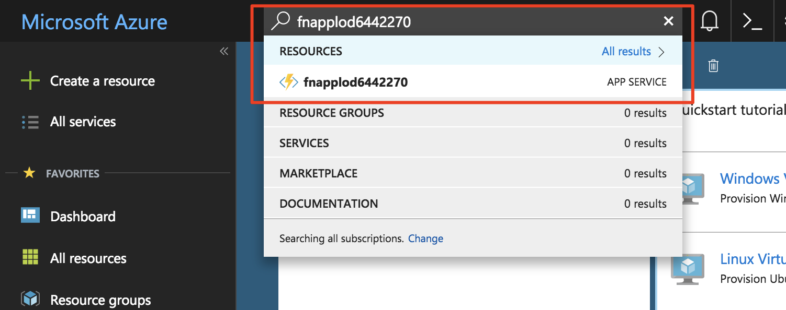
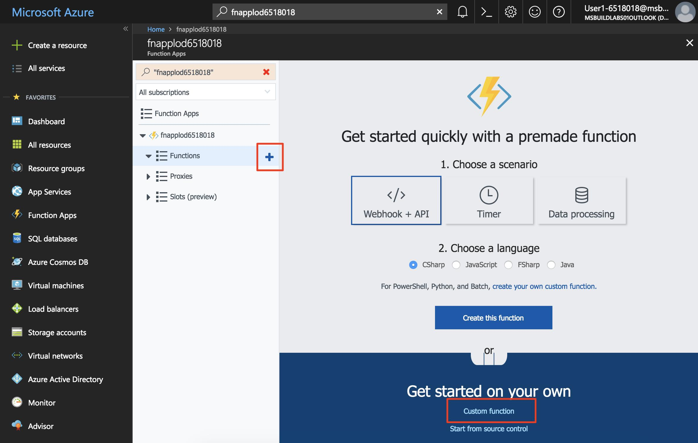
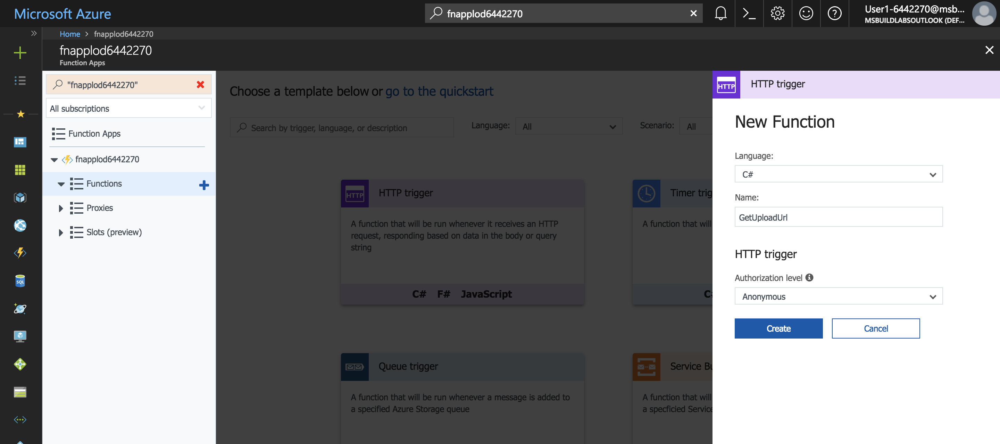
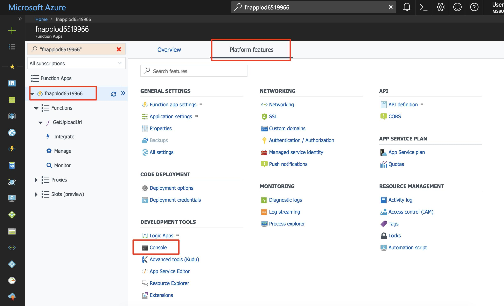
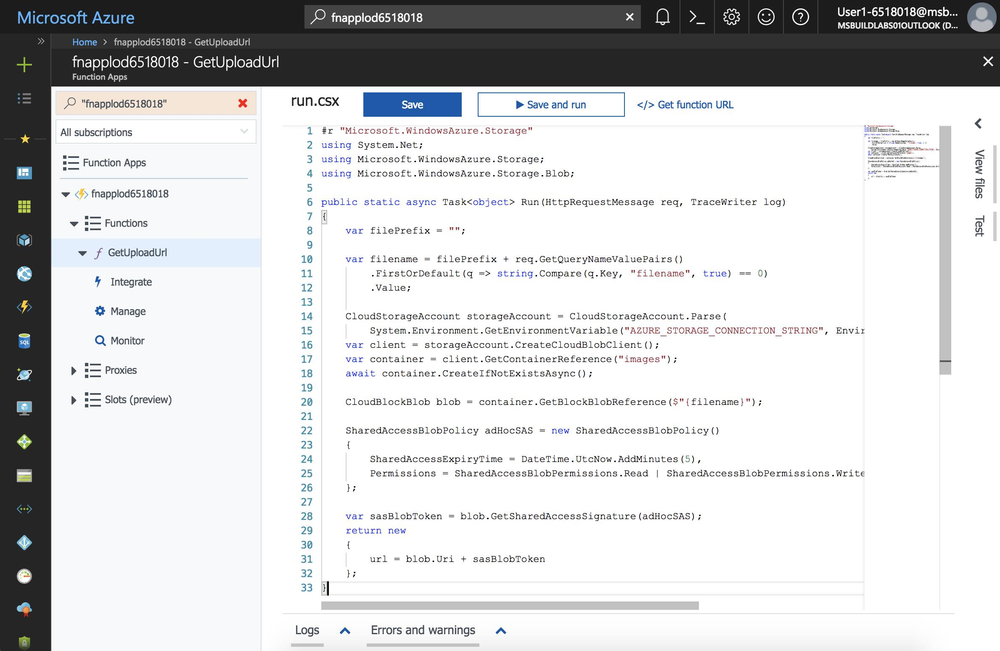
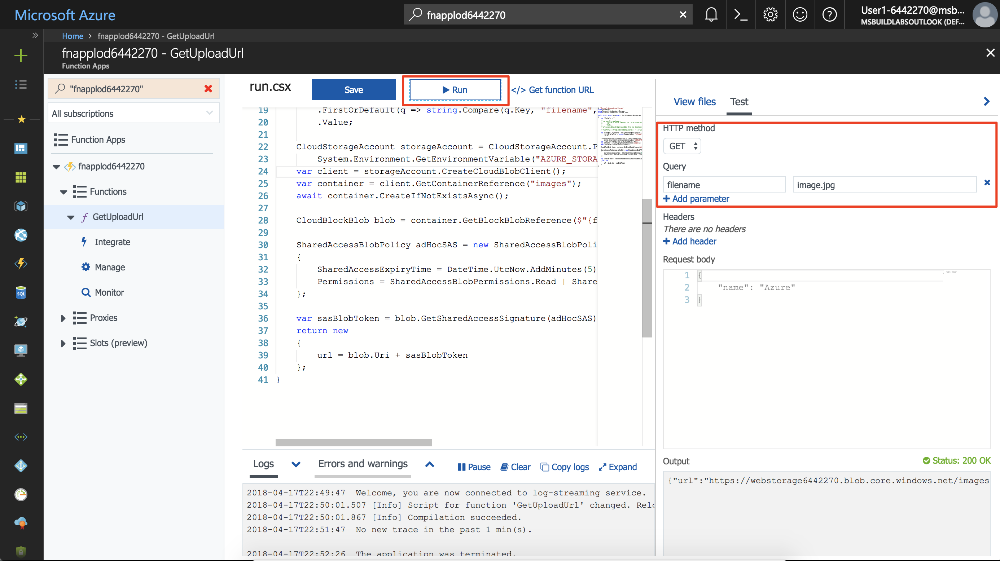
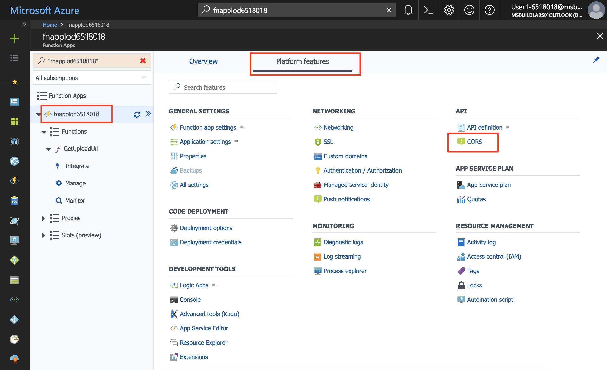
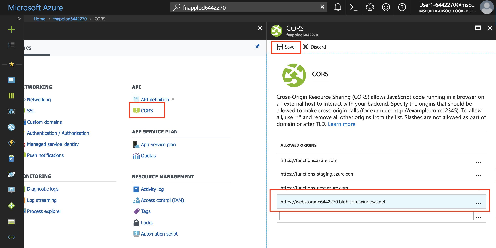

In this exercise, you will create a container for storing and serving images. You will create a serverless function that provides a secure upload URL that the web application will use to upload images to the container.

### Create a blob storage container for images

The application requires a separate storage container to upload and host images.

1. Ensure you are still logged into the Cloud Shell (bash). Create a new container named **images** in your storage account with public access to all blobs.

    ```
    az storage container create -n images --account-name <webstorage-name> --public-access blob
    ```

### Create an Azure Function app

Azure Functions is a service for running serverless functions. A serverless function can trigger on events such as an HTTP request or when a blob is created in a storage container.

An Azure Function app is a container for one or more serverless functions.

1. Create a new Azure Function app named **fnapp** in the resource group named **first-serverless-app**. Function apps require a Storage account; in this tutorial, you will use the existing storage account.

    ```
    az functionapp create -n fnapp -g first-serverless-app -s <webstorage-name> -c eastus
    ```
   > For any step in this lab replace **fnapp** with your function app name.
### Create an HTTP triggered serverless function

The photo gallery web application will make an HTTP request to a serverless function to generate a time-limited URL to securely upload an image to Blob storage. The function is triggered by an HTTP request and uses the Azure Storage SDK to generate and return the secure URL.

1. After the Function app is created, search for its name, **fnapp**, in the Azure Portal using the Search box and click to open it.

    

1. In the function app window's left hand navigation, hover over **Functions** and click **+** to start creating a new serverless function.

1. Click **Custom function** to see a list of function templates.

    

1. Find the **HttpTrigger** template and click the language to use (C# or JavaScript).

1. Use these values to create a function that generates a blob upload URL.

    | Setting      |  Suggested value   | Description                                        |
    | --- | --- | ---|
    | **Language** | C# or JavaScript | Select the language you want to use. |
    | **Name your function** | GetUploadUrl | Type this name exactly as shown so the application can discover the function. |
    | **Authorization level** | Anonymous | Allow the function to be accessed anonymously. |

    

1. Click **Create** to create the function.

    **C#** 

    1. When the function's source code appears, replace all of **run.csx** with the contents of [**csharp/GetUploadUrl/run.csx**](https://raw.githubusercontent.com/Azure-Samples/functions-first-serverless-web-application/master/csharp/GetUploadUrl/run.csx).

    **JavaScript** 

    1. This function requires the `azure-storage` package from npm to generate the shared access signature (SAS) token required to build the secure URL. To install the npm package, click on the Function App's name on the left navigation and click **Platform features**.

    1. Click **Console** to reveal a console window.

        

    1. Run the command `npm install azure-storage` in the console. It may take a minute or two to complete the operation.

    1. Click on the function name (**GetUploadUrl**) in the left navigation to reveal the function, replace all of **index.js** with the content of [**javascript/GetUploadUrl/index.js**](https://raw.githubusercontent.com/Azure-Samples/functions-first-serverless-web-application/master/javascript/GetUploadUrl/index.js).

    
    
1. Click **Logs** below the code window to expand the logs panel.

1. Click **Save**. Check the logs panel to ensure the function is successfully saved and there are no errors.

The function generates what is called a shared access signature (SAS) URL that is used to upload a file to Blob storage. The SAS URL is valid for a short period of time and only allows a single file to be uploaded. Consult the Blob storage documentation for more information on [using shared access signatures](https://docs.microsoft.com/azure/storage/common/storage-dotnet-shared-access-signature-part-1).

### Add an environment variable for the storage connection string

The function you just created requires a connection string for the Storage account so that it can generate the SAS URL. Instead of hardcoding the connection string in the function's body, it can be stored as an application setting. Application settings are accessible as environment variables by all functions in the Function app.

1. In the Cloud Shell, query the Storage account connection string and save it to a bash variable named **STORAGE_CONNECTION_STRING**.

    ```
    export STORAGE_CONNECTION_STRING=$(az storage account show-connection-string -n <webstorage-name> -g first-serverless-app --query "connectionString" --output tsv)
    ```

    Confirm the variable is set successfully.

    ```
    echo $STORAGE_CONNECTION_STRING
    ```

1. Create a new application setting named **AZURE_STORAGE_CONNECTION_STRING** using the value saved from the previous step.

    ```
    az functionapp config appsettings set -n fnapp -g first-serverless-app --settings AZURE_STORAGE_CONNECTION_STRING=$STORAGE_CONNECTION_STRING -o table
    ```

    Confirm that the command's output contains the new application setting with the correct value.


### Test the serverless function

In addition to creating and editing functions, the Azure portal also provides a built-in tool for testing functions.

1. To test the HTTP serverless function, click on the **Test** tab on the right of the code window to expand the test panel.

1. Change the **Http method** to **GET**.

1. Under **Query**, click **Add parameter** and add the following parameter:

    | name      |  value   | 
    | --- | --- |
    | filename | image1.jpg |

1. Click **Run** in the test panel to send an HTTP request to the function.

1. The function returns an upload URL in the output. The function execution appears in the logs panel.

    

### Configure CORS in the function app

Because the app's frontend is hosted in Blob storage, it has a different domain name than the Azure Function app. For the client-side JavaScript to successfully call the function you just created, the function app needs to be configured for cross-origin resource sharing (CORS).

1. In the left navigation bar of the Function app window, click on the name of your function app.

1. Click on **Platform features** to view a list of advanced features.

    

1. Under **API**, click **CORS**.

1. Add an allow origin for the blob endpoint URL, omitting the trailing **/** (**https://webstorage@lab.LabInstanceId.blob.core.windows.net**)

    

1. Click **Save** to commit the change.

### Modify the web app to upload images

The web app retrieves settings from a file named **settings.js**. You will modify the file using Cloud Shell to set the `window.apiBaseUrl` variable to the URL of the Function app.

1. In the Cloud Shell, ensure that the current directory is the **www/dist** folder.

    ```
    cd ~/source/www/dist
    ```

1. Query the function app's URL and store it in a bash variable named **FUNCTION_APP_URL**.

    ```
    export FUNCTION_APP_URL="https://"$(az functionapp show -n fnapp -g first-serverless-app --query "defaultHostName" --output tsv)
    ```

    Confirm the variable is correctly set.

    ```
    echo $FUNCTION_APP_URL
    ```

1. To set the base URL of API calls to your function app, you will write the following line of code to **settings.js**.

    `window.apiBaseUrl = 'https://fnapp.azurewebsites.net'`

    You can make the change by running the following command or by using a command-line editor like VIM.

    ```
    echo "window.apiBaseUrl = '$FUNCTION_APP_URL'" > settings.js
    ```

    Confirm the file was successfully written.

    ```
    cat settings.js
    ```

1. Upload the file to Blob storage.

    ```
    az storage blob upload -c \$root --account-name <webstorage-name> -f settings.js -n settings.js
    ```

### Test the web application

At this point, the gallery application is able to upload an image to Blob storage, *but it cannot display images yet*. You can verify an image is successfully uploaded by checking the contents of the **images** container in the Azure portal.

1. Obtain the URL of your application.

    ```
    az storage blob url --account-name <webstorage-name> -c \$root -n index.html --output tsv  | sed 's/\$root\///'
    ```

1. Open a new browser window and browse to the URL. Select an image file and upload it. The upload completes, but because we have not added the ability to display images yet, the app does not show the uploaded photo.

1. In the Cloud Shell, confirm the image was uploaded to the **images** container.

    ```
    az storage blob list --account-name <webstorage-name> -c images -o table
    ```

1. Before moving on to the next tutorial, delete all files in the **images** container.

    ```
    az storage blob delete-batch --account-name <webstorage-name> -s images
    ```

### Summary

In this exercise, you created an Azure Function app and learned how to use a serverless function to allow a web application to upload images to Blob storage. Next, you learn how to create thumbnails for the uploaded images using a Blob triggered serverless function.


---