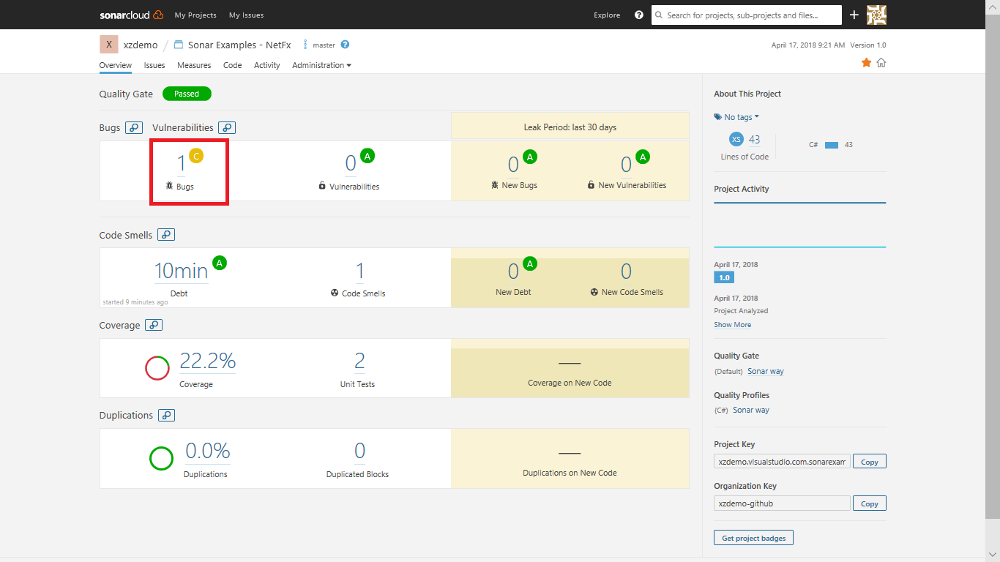
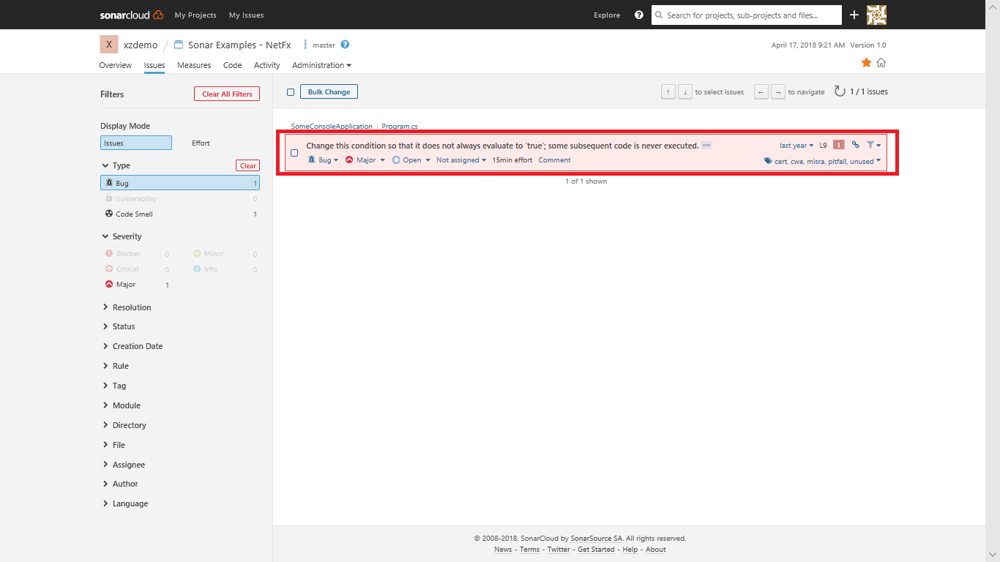
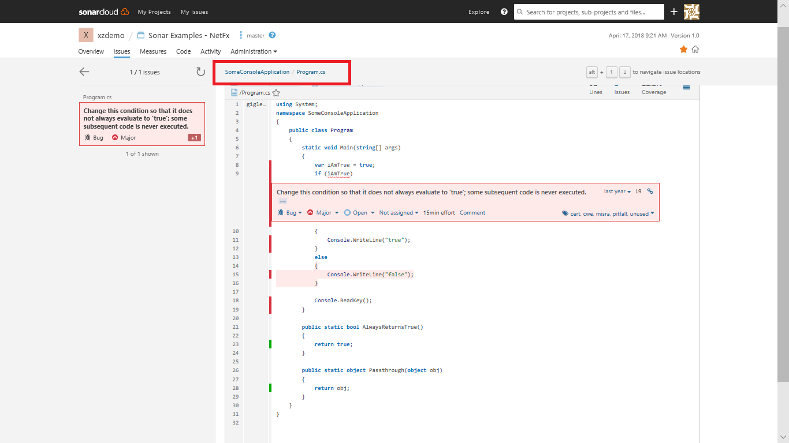
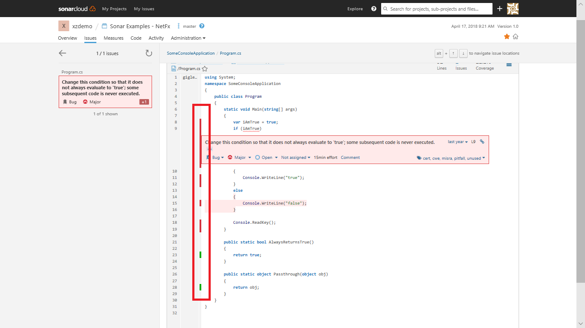

Open the **Sonar Examples - NetFx** project in the SonarCloud Dashboard.  Under ***Bugs and Vulnerabilities***, we can see a bug has been caught.

  

  The page has other metrics such as ***Code Smells***, ***Coverage***, ***Duplications*** and ***Size***. The following table briefly explains each of these terms.

   |Terms|Description|
   |-----|-----------|
   |**Bugs**|An issue that represents something wrong in the code. If this has not broken yet, it will, and probably at the worst possible moment. This needs to be fixed|
   |**Vulnerabilities**|A security-related issue which represents a potential backdoor for attackers|
   |**Code Smells**|A maintainability-related issue in the code. Leaving it as-is means that at best maintainers will have a harder time than they should making changes to the code. At worst, they'll be so confused by the state of the code that they'll introduce additional errors as they make changes|
   |**Coverage**|To determine what proportion of your project's code is actually being tested by tests such as unit tests, code coverage is used. To guard effectively against bugs, these tests should exercise or 'cover' a large proportion of your code|
   |**Duplications**|The duplications decoration shows which parts of the source code are duplicated|
   |**Size**|Provides the count of lines of code within the project including the number of statements, Functions, Classes, Files and Directories|

  >In this example, along with the bug count, a character **C** is displayed which is known as **Reliability Rating**. **C** indicates that there is **at least 1 major bug** in this code. For more information on Reliability Rating, click [here](https://docs.sonarqube.org/display/SONAR/Metric+Definitions#MetricDefinitions-Reliability). For more information on rule types and severities, see [here](https://docs.sonarqube.org/display/SONAR/Rules+-+types+and+severities).

1. Click on the **Bugs** count to see the details of the bug.

   

1. Click on the bug to navigate to the code

   

1. You will see the error in line number 9 of **Program.cs** file as **Change this condition so that it does not always evaluate to 'true'; some subsequent code is never executed.**.

   

   We can also see which lines of code are not covered by tests.

   

   Our sample project is very small and has no historical data. However, there are thousands of [public projects on SonarCloud](https://sonarcloud.io/explore/projects) that have more interesting and realistic results.