We will set up a new build pipeline that integrates with SonarCloud to analyze the **SonarExamples** code. As part of setting up the pipeline we will create a SonarCloud account and organization.

1. In your new Azure DevOps project, go to **Builds** under **Pipelines** tab, then click on **+New** to create a new build pipeline.

1. You have 2 possibilities : Configure the pipeline with the YAML editor, or with the classic assistant.

### **YAML Editor**

1. Select your code location, SonarCloud currently supports Azure repos, Bitbucket Cloud and GitHub for PR decoration. 

    

1. Select the repository where you want to build from
1. Select a default template. Currently there are no SonarCloud template available for YAML edition
1. Click next, you enter into the YAML file you have to fill.

There is currently no YAML assistant while creating the pipeline for the first time. We suggest to “Save and run” your initial template, then go back to edit mode to have it. You will have access to the same UI as for the classic pipeline creation mode.
Please also note that the assistant will not show “Run analysis” task, you have to add it by hand for now, as shown below.

```
- task: SonarCloudAnalyze@1 //no input parameter needed
```

### **Classic Editor**

1. Click **Continue** to accept the default values for **source**, **Team project**, **Repository** and **Default branch**

    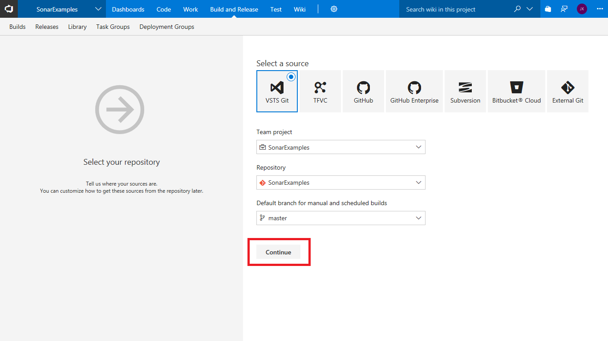

   > The SonarCloud extension contains custom build templates for Maven, Gradle, .NET Core and .NET Desktop applications. The templates are based on the standard Azure DevOps templates but with additional analysis-specific tasks and some pre-configured settings.

2. Select the .NET Desktop with SonarCloud template.

    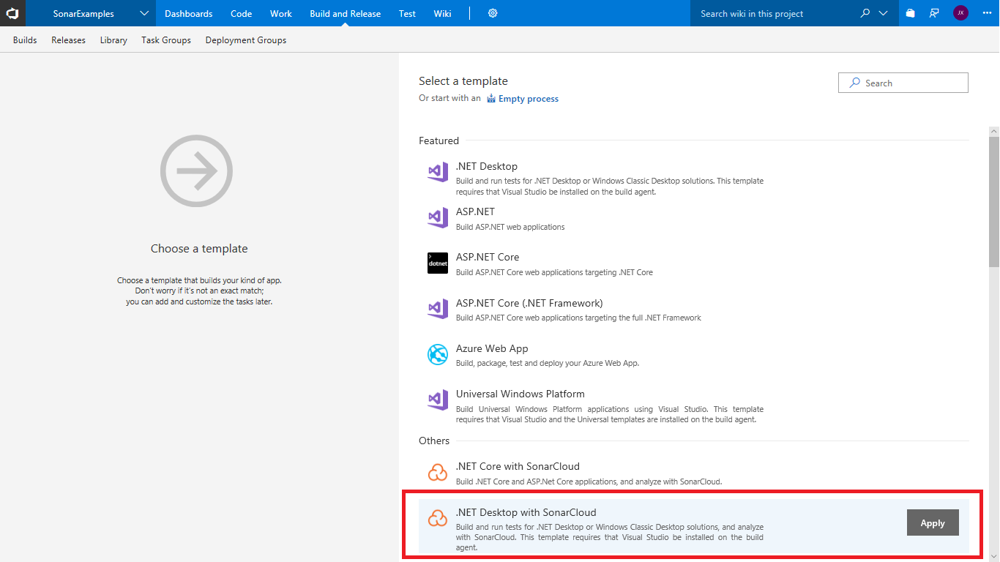

    The template contains all of the necessary tasks and most of the required settings. We will now provide the values for the remaining settings.

3. Select the _Hosted VS2017_ agent queue 

    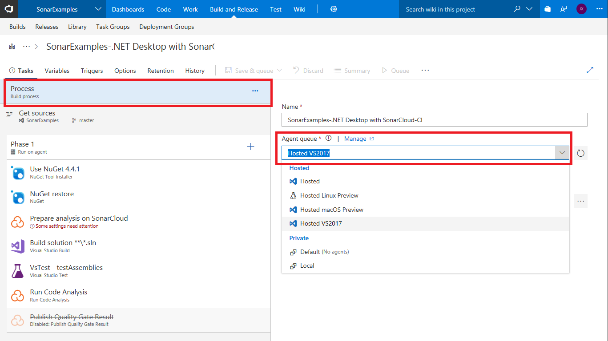

4. Configure the _Prepare analysis on SonarCloud_ task

    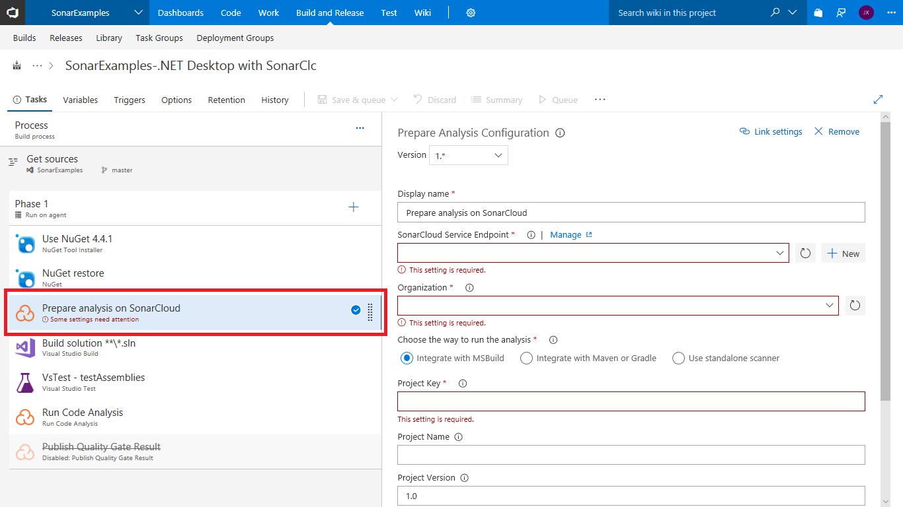

   There are three settings that need to be configured:

   |Setting|Value|Notes|
   |---------|-----|-----|
   |**SonarCloud Service Endpoint**|SonarCloudSamples|The name of the Azure DevOps endpoint that connects to SonarCloud|
   |**Organization**|{your SonarCloud org id}|The unique key of your organization in SonarCloud|
   |**Project Key**|{your Azure DevOps account name}.visualstudio.com.sonarexamples.netfx |The unique key of the project in SonarCloud|

   >Currently the project key must be globally unique across all projects in SonarCloud. In the future, the project key will only need to be unique within your SonarCloud organization.

   We will now create the endpoint and an account on SonarCloud.

5. Create a service endpoint for SonarCloud

   - click on the _New_ button to start creating a new endpoint

    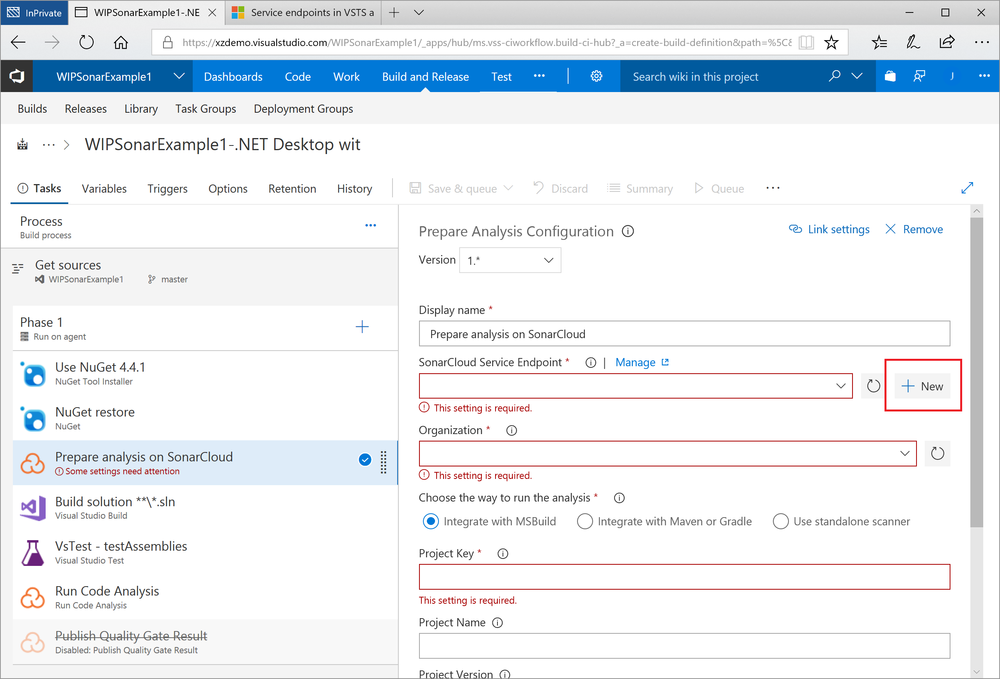

6. Create a SonarCloud account

   A service endpoint provides the information Azure DevOps requires to connect to an external service, in this case SonarCloud. There is a custom SonarCloud endpoint that requires two pieces of information: the identity of the organization in SonarCloud, and a token that the Azure DevOps build can use to connect to SonarCloud. We will create both while setting up the endpoint.

   - click on the **your SonarCloud account security page** link

    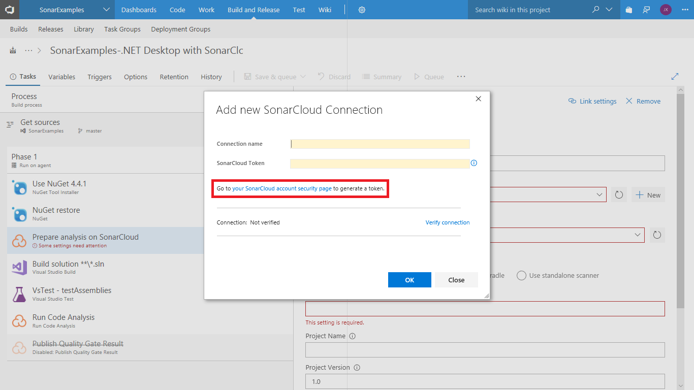

7. Select the identity provider to use to log in to SonarCloud

   As we are not currently logged in to SonarCloud we will be taken to the SonarCloud login page.

   - select the identity provider you want use and complete the log in process

    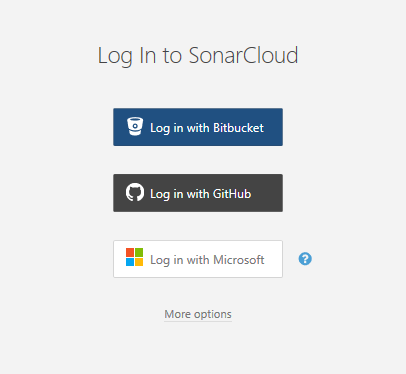

8.  Authorize SonarCloud to use the identity provider

   > The first time you access SonarCloud, you will be asked to grant SonarCloud.io access to your account. The only permission that SonarCloud requires is to read your email address.

    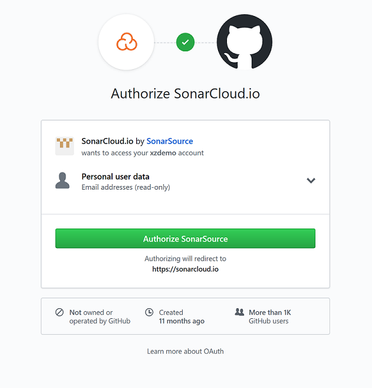

    After authorizing and logging in, we will be redirected to the **Generate token** page.

9. Generate a token to allow Azure DevOps to access your account on SonarCloud:

   - enter a description name for the token e.g. "vsts_build" and click **Generate** 

   - click **Generate**

    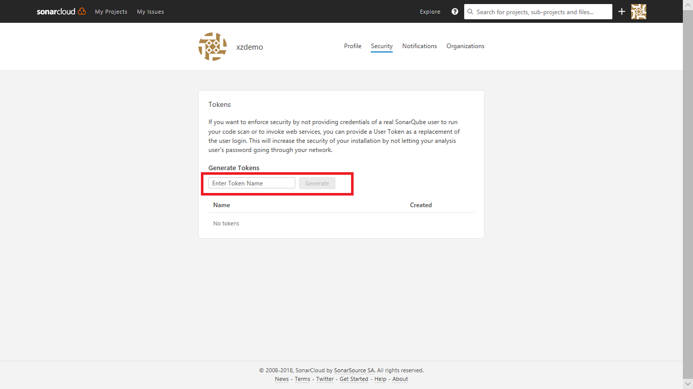

10. Copy the generated token

   - click **Copy** to copy the new token to the clipboard

    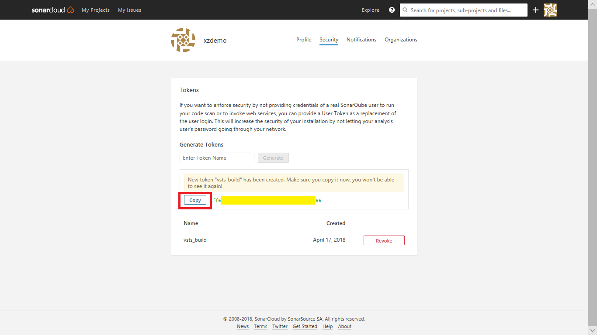


   >You should treat Personal Access Tokens like passwords. It is recommended that you save them somewhere safe so that you can re-use them for future requests.

   We have now created an organization on SonarCloud, and have the token needed configure the Azure DevOps endpoint.

11. Finish creating the endpoint in Azure DevOps
   - return to Azure DevOps **Add new SonarCloud Connection** page, set the **Connection name** to **SonarCloud**, and enter the **SonarCloud Token** you have just created.
   - click **Verify connection** to check the endpoint is working, then click **OK** to save the endpoint.

    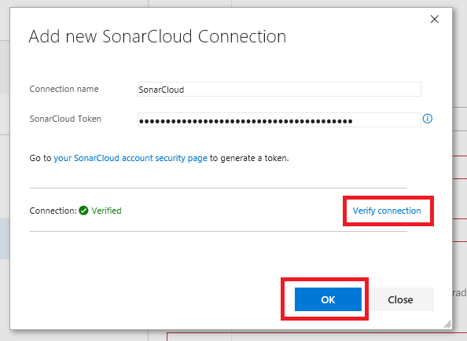

12. Finish configuring the **Prepare analysis on SonarCloud** task.

   - click on the **Organization** drop-down and select your organization.
   - enter a unique key for your project e.g. **[your account].visualstudio.com.sonarexamples.netfx**
   - enter a friendly name for the project e.g. **Sonar Examples - NetFx**

    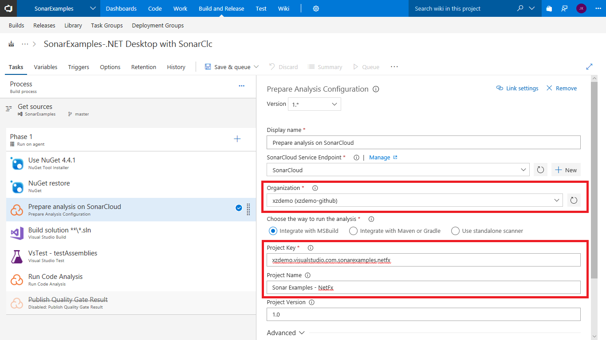

13. [Optional] Enable the _Publish Quality Gate Result_ step

   This step is not required and is disabled by default.
   If this step is enabled, a summary of the analysis results will appear on the _Build Summary_ page. However, this will delay the completion of the build until the 
   processing on SonarCloud has finished.

14. Save and queue the build.

   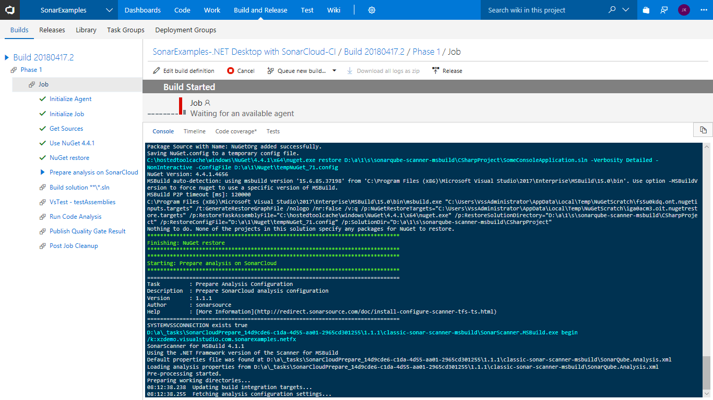

15. If you enabled the _Publish Quality Gate Result_ step above the Build Summary will contain a summary of the analysis report. 

   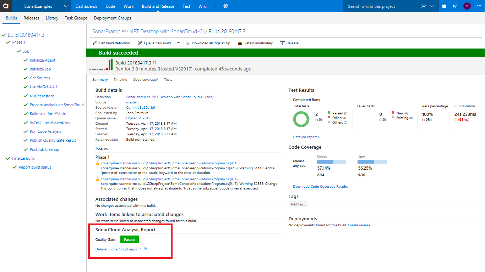

16. Either click on the **Detailed SonarCloud Report** link in the build summary to open the project in SonarCloud, or browse to SonarCloud and view the project.

   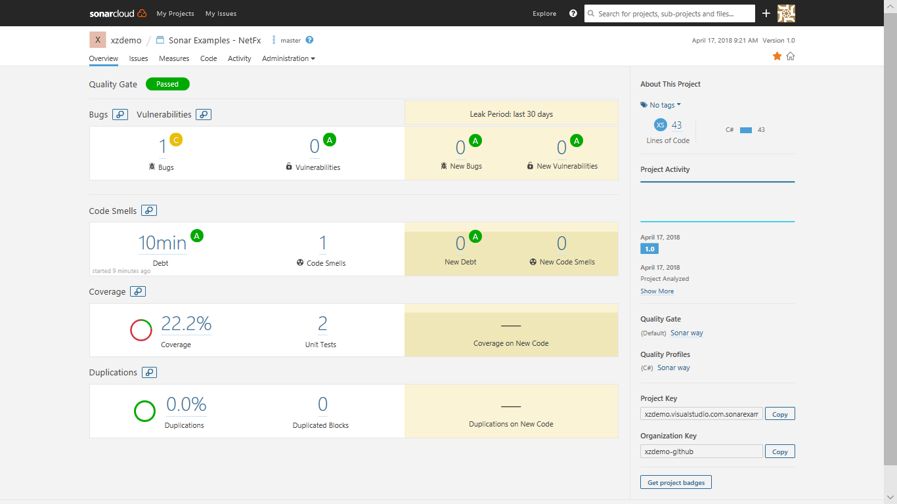

   We have now created a new organization on SonarCloud, and configured a VSTS build to perform analysis and push the results of the build to SonarCloud.