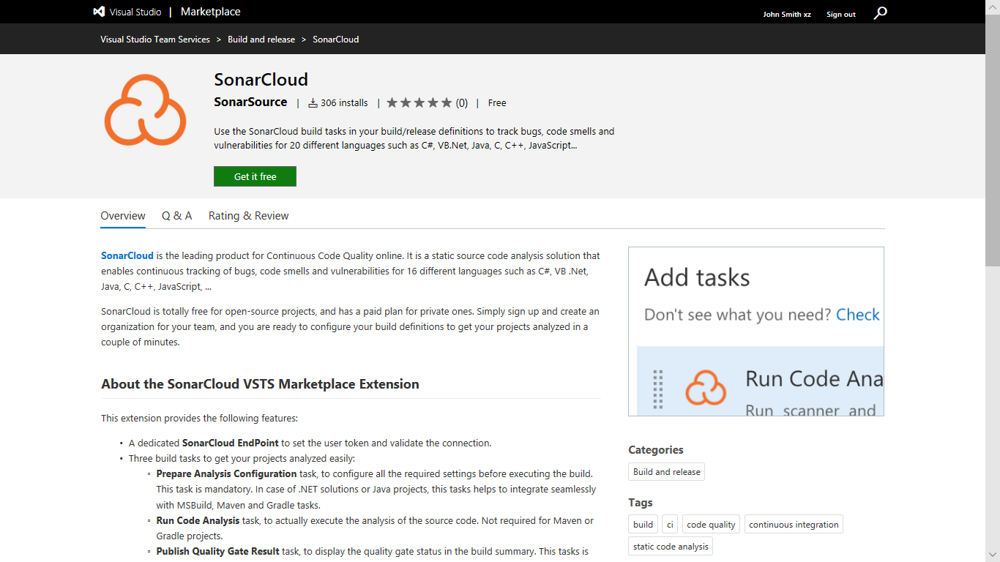
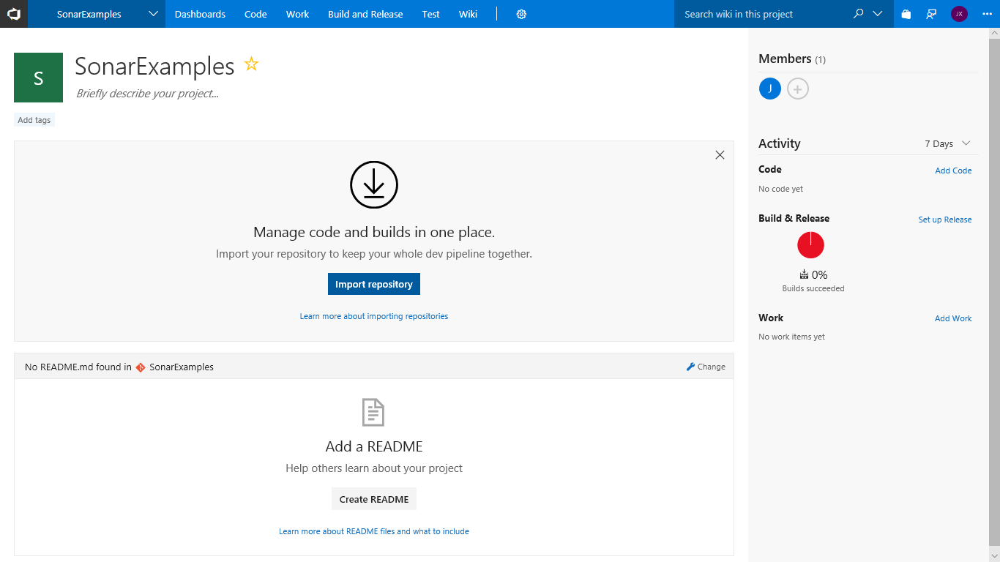

1. Install the SonarCloud VSTS extension to your VSTS account

    - Navigate to the  [SonarCloud extension](https://marketplace.visualstudio.com/items?itemName=SonarSource.sonarcloud) in the Visual Studio Marketplace and click **Get it free** to install it.

    

   >If you do not have the appropriate permissions to install an extension from the marketplace, a request will be sent to the account administrator to ask them to approve the installation.

   The SonarCloud extension contains build tasks, build templates and a custom dashboard widget.

1. Create a new VSTS project for the lab
    
    - Create a new project in your VSTS account called **SonarExamples**

    - Import the **Sonar Scanning Examples repository** from GitHub at https://github.com/SonarSource/sonar-scanning-examples.git

    

    See [here](https://docs.microsoft.com/en-us/vsts/git/import-git-repository?view=vsts)for detailed instructions on importing a repository.

    The scanning examples repository contains sample projects for a number of build systems and languages including C# with MSBuild, and Maven and Gradle with Java.