 Configuring SonarCloud analysis to run when a pull request is created has two parts:
   - the SonarCloud project needs to be provided with an access token so it can add PR comments to VSTS, and
   - a Branch Policy needs to be configured in VSTS to trigger the PR build

1. Create a **Personal Access Token** in VSTS.

   - Follow the instructions in this [article](https://docs.microsoft.com/en-us/vsts/accounts/use-personal-access-tokens-to-authenticate) to create a token with **Code (read and write)** scope.

    > SonarCloud will post comments to the pull request as if it is user who owns the personal access token. The recommended practice is to create a separate "bot" VSTS user for this so that it is clear which comments are from real developers and which are from SonarCloud.
   
   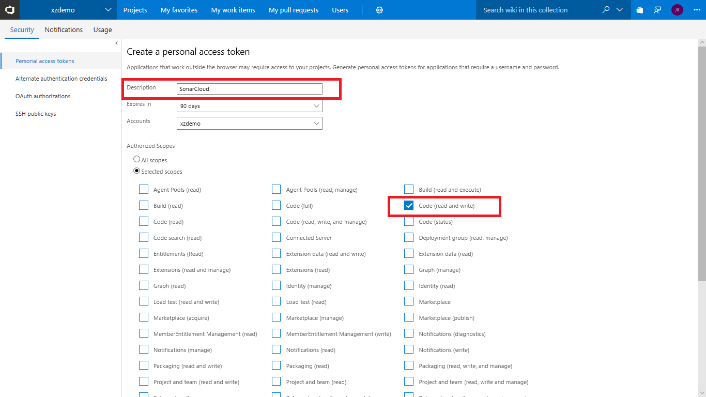

    >You should treat Personal Access Tokens like passwords. It is recommended that you save them somewhere safe so that you can re-use them for future requests.

1. Configure SonarCloud to analyze pull requests

   - browse to the **Sonar Examples - NetFx** dashboard in SonarCloud
   - click on **Administration**, **General Settings**
   
   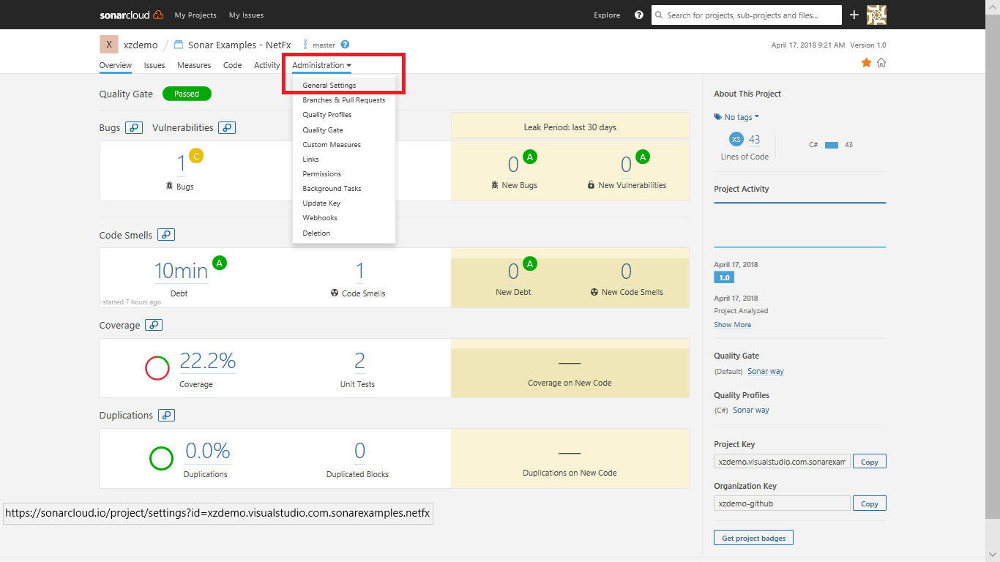

   - select the **Pull Requests** tab
   - set the **Provider** drop-down to **VSTS**
   - set the **Personal access token**
   - click **Save**

   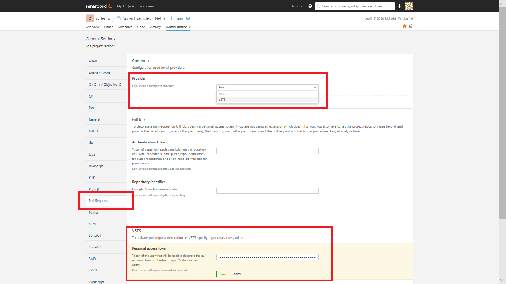

1. Configure the branch policy for the project in VSTS

   - navigate to the **SonarExamples** project in VSTS
   - click on **Code**, **Branches** to view the list of branches

      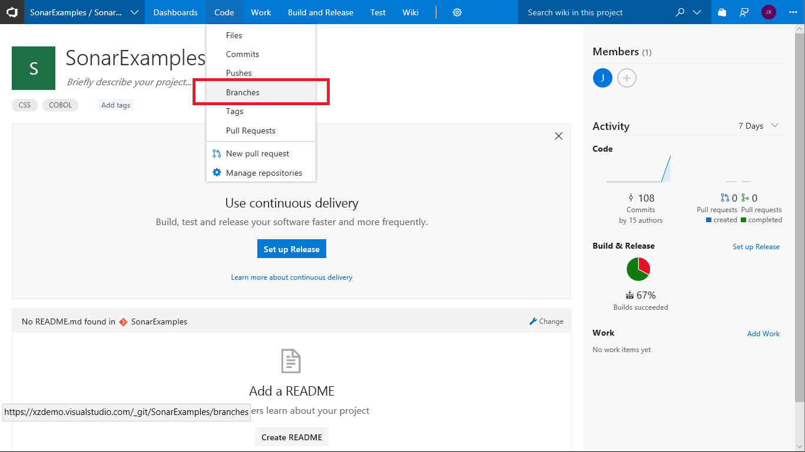

   - click on the settings link ("**...**") for **master** and select **Branch policies**

      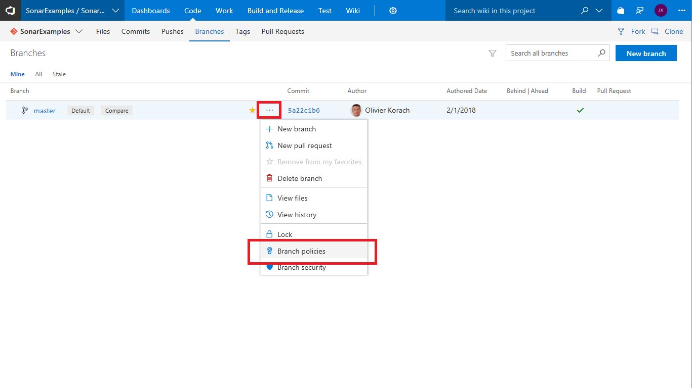

   - click **Add Build Policy**

      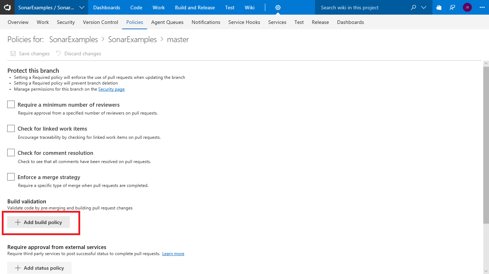

   - select the build definition we created earlier from the **Build definition** drop-down
   - set the **Display name** to **SonarCloud analysis**
   - click **Save**

      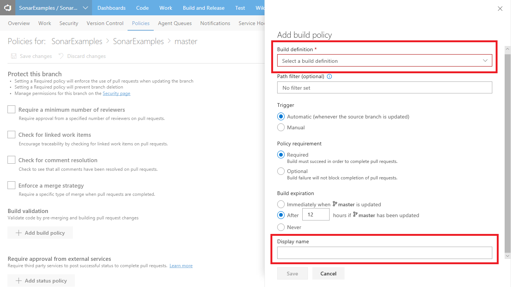

   VSTS is now configured to trigger a SonarCloud analysis when any pull request targeting the **master** branch is created.

1. Create a new pull request
   
   Now we need to make a change to a file and create a new request so we check that the pull request triggers the analysis.

   - navigate to the code file **Program.cs** at **sonarqube-scanner-msbuild/CSharpProject/SomeConsoleApplication/Program.cs** and click **Edit**
   - add an empty method to the code as shown in the following screen shot, then click **Commit...**

   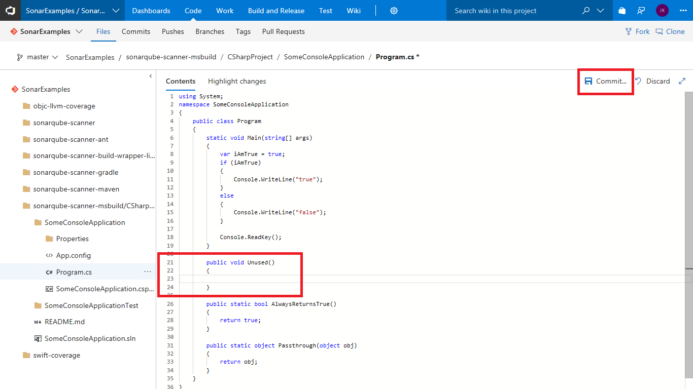

   In the dialogue that appears:
   - change the branch name from **master** to **branch1**
   - check the **Create a pull request** checkbox
   - click **Commit**, then click **Create** on the next screen to submit the pull request

   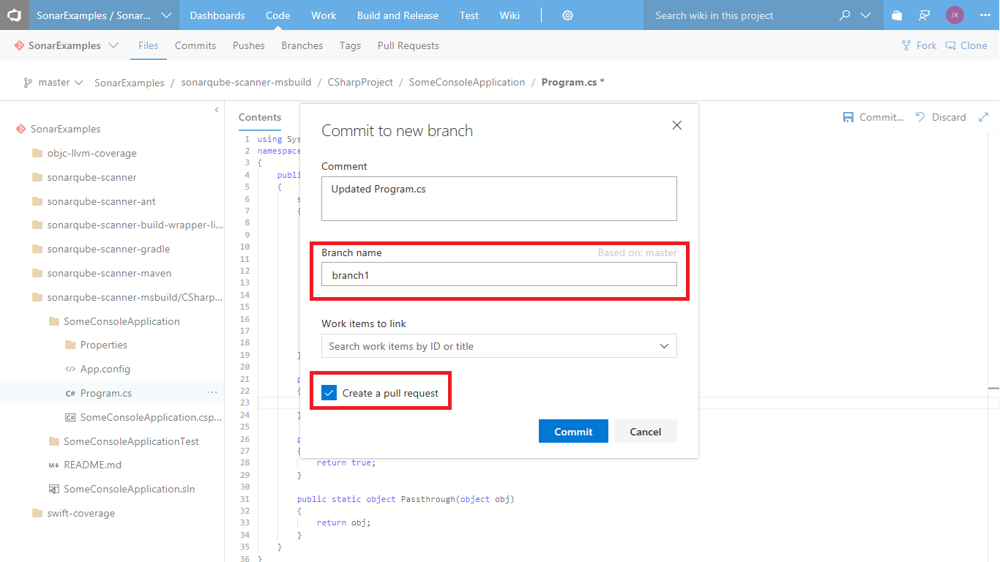
   
   If the pull request integration is correctly configured the UI will show that an analysis build is in progress.
   
   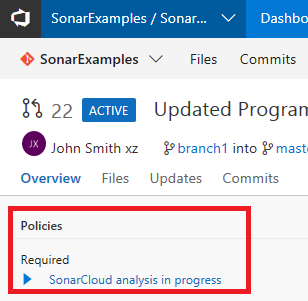

1. Review the results of the Pull Request analysis

   The results show that the analysis build completed successfully, but that the new code in the PR failed the Code Quality check.
   A comment has been posted to the PR for the new issue that was discovered.

   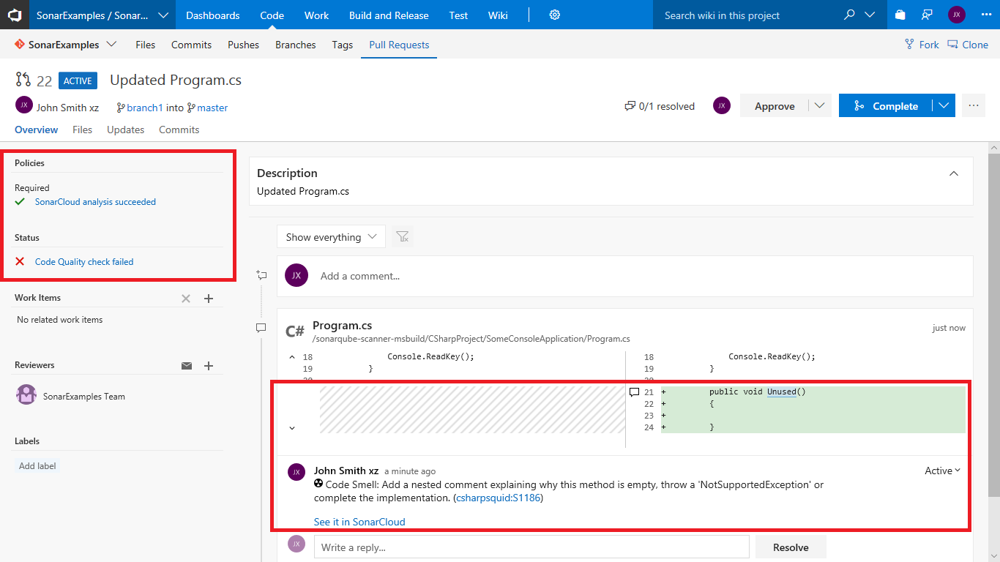

   Note that the only issues in code that was changed or added in the pull request are reported - pre-existing issues in **Program.cs** and other files are ignored.

1. Block pull requests if the Code Quality check failed

   At this point it is still possible to complete the pull request and commit the changes even though the Code Quality check has failed.
   However, it is simple to configure VSTS to block the commit unless the Code Quality check passes:
   - return to the **Branch Policy** page
   - click **Add status policy**
   - select **SonarCloud/quality gate** from the **Status to check** drop-down
   - set the **Policy requirement** to **Required**
   - click **Save**

   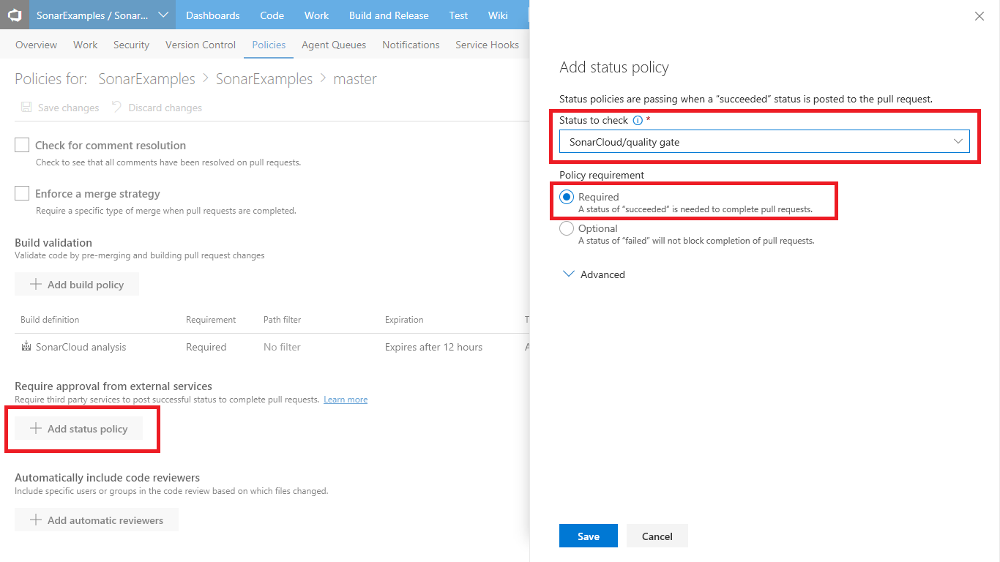

   Users will now be unable to merge the pull request until the Code Quality check is successful, either because all of the issues have been fixed or the the issues have been marked as **confirmed** or **resolved** in SonarCloud.
