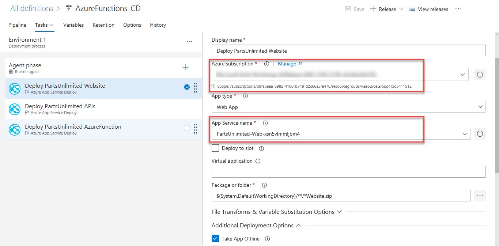
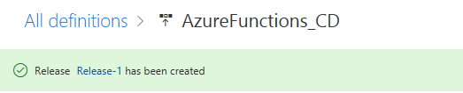
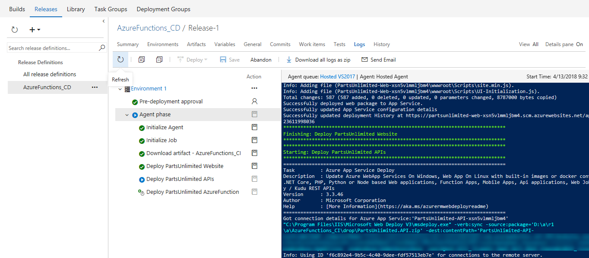

1. Once the build succeeds, click the **Release** option from the **Build & Release** hub.

    

1. In the **Release** page, select the definition **AzureFunctions_CD** and click **Edit**.

     

1. Select the artifact trigger and make sure the **Continuous deployment trigger** is enabled.

     

1. To deploy **PartsUnlimited Website**, click **Tasks**, select the first **Deploy PartsUnlimited Website** task and configure the inputs as shown below.

    

   > To authorize the **Azure Subscription**, first select the **Azure subscription** from the drop down and then the drop down within the **Authorize** button. Click the drop down, choose **Advanced Options** and authorize Team Services to connect to the Azure subscription.

    

    

1. For the **PartsUnlimited APIs**, select the second task and configure the inputs as shown below.

   

1. Select the third task to deploy **PartsUnlimited Azure Function** and configure the inputs  as shown below.

   
  
1. Click **Save**. In the Save dialog box, click **OK**. To test the release definition, click **Release** and then **Create Release**.
  
   

   On the Create new release dialog box, click **Create**.

1. You will notice a new release being created. Select the link to navigate to the release.

   
   
   You can watch the live logs for the deployment as it happens. Wait for the release to be deployed to the Azure web app.

      

   Wait for the release to complete and succeed before proceeding to the next section.

## Verify the deployment

1. Once deployment has completed, go to the **Azure portal**. In your resource group select **PartsUnlimited-Web-xxxxx** and click **Browse**

1. You will see the website as shown below. Navigate to **Oil** category, notice that products are showing discount as **10%**.

   

1. Now log in as user **Administrator@test.com** with password **YouShouldChangeThisPassword1!** and navigate to **Oil** category again. You will notice that for this user **Azure function** routes the request to other API and shows Discount as **30%**

   

   
   
   You have connected PartsUnlimited website to the Web API and used Azure function to retrieve data from either v1 or v2 of the API based on the user ID.