# Deploying Azure Functions using VSTS

## Overview

**Azure Functions** is an event driven, compute-on-demand experience that extends the existing Azure application platform with capabilities to implement the code triggered by events occurring in Azure or third-party service as well as on-premises systems. Azure Functions allows developers to take action by connecting to data sources or messaging solutions thus making it easy to process and react to events. Developers can leverage Azure Functions to build HTTP-based API endpoints accessible by a wide range of applications, mobile and IoT devices.
 
## What is covered in this lab?

 In this lab, you will
* Create a Visual Studio Team Services account and clone the PartsUnlimited project from GitHub
* Setup Azure Functions in Azure portal and add code via Visual Studio
* Setup a build definition in Visual Studio Team Services to build and test the code
* Configure a CD pipeline in Visual Studio Team Services for Website, API and Azure Functions

## Setting up the environment

### Part A: Provision the required Azure resources

 In this lab, you will be using a fictional eCommerce website - PartsUnlimited. The PartsUnlimited team wants to  roll out a new discount for its employees and customers and wants to build Azure Functions that will retrieve the right discount depending on whether the logged in user is an employee or a customer. 

Let's create the Parts Unlimited website. 

1. Open your browser and navigate to [https://portal.azure.com](https://portal.azure.com)

1. Login with the following username and password:
   > Username: ++@lab.CloudPortalCredential(1).Username++    
   > Password: ++@lab.CloudPortalCredential(1).Password++


1. Enter **https://goo.gl/octfDu** to deploy a custom ARM template that contains the PartsUnlimited App.

1. For the **Resource Group** field, select **Use existing** and pick 
@lab.CloudResourceGroup(268).Name from the dropdown.

1. Agree to the terms and conditions and click **Purchase**. 

    It should take approximately 1-2 minutes to provision the resources. Once the deployment is successful, you will see the resources as shown.
   

### Part B: Create Visual Studio Team Services account

Next, you will provision a Team services account.

1. Navigate to https://www.visualstudio.com/team-services/ in a separate tab. Select **Get Started for Free**.

1. You can use the same credentials used above to log in to Azure
     > Username: ++@lab.CloudPortalCredential(1).Username++      
     > Password: ++@lab.CloudPortalCredential(1).Password++

1. Provide a name for your Visual Studio Team Services account and click **Continue** to start the creation process.

1. In 1-2 minutes, your account should be ready with a default project **MyFirstProject** created.

### Part C: Import and clone the project repository

1. Navigate to the **Code** hub. Since there is no code yet, you wil see an empty repository. You can clone the remote repository to your local machine and start adding code or you can import code from an another code repository.

1. For the purpose of this lab, you will import it from **GitHub**. Select **import** and enter https://github.com/sriramdasbalaji/AzureFunctionsBuild.git in the **Clone URL** field and select **Import**

     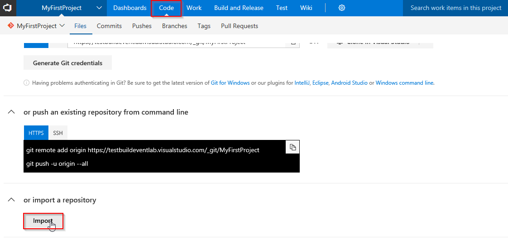

      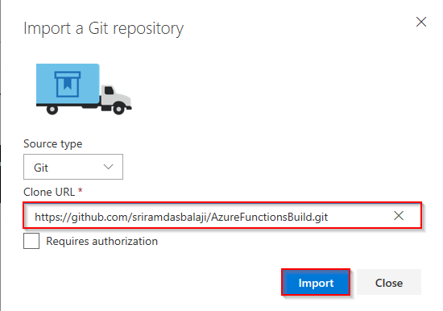

1. When the import is complete, select **Clone** and then select **Clone in Visual Studio**. 

   

   Note that VSTS supports a wide variety of IDEs including Eclipse, IntelliJ, XCode, Android Developer Studio, Visual Studio Code, etc.

1. When the code opens in Visual Studio, if you are prompted to sign into Visual Studio Team Services, use the same credentials(that you used above to create the VSTS account) and select **Clone**

1. You can use the same credentials used above to log in to Azure
     > Username: ++@lab.CloudPortalCredential(1).Username++      
     > Password: ++@lab.CloudPortalCredential(1).Password++

     


1. Once it is cloned, you should see **PartsUnlimited.sln** under **Solutions** in the Team Explorer.
     


## Exercise 1:  Setup Azure Functions

 In this exercise, you will create an **Azure Functions App** from the Azure portal and then add code by creating an **Azure Functions project** in Visual Studio.

The [Azure Functions](https://azure.microsoft.com/en-in/services/functions/) created in this exercise will act as a switching proxy or mechanism to return different (discount) information based on the user logged in to the application.
Although you have used a simple condition here, this could also use more complex rules which could potentially be hidden behind another web api call.

1. Go back to the **Azure Portal**. Select the **+Create a resource** button found on the upper left-hand corner of the Azure portal, then select **Compute > Function App**.
          


1. Use the function app settings as specified in below image. Select **Create** to provision and deploy the function app. 

     

1. Select the Notification icon in the upper-right corner of the portal and watch for the **Deployment succeeded** message. Select **Go to resource** to view your new function app.

    

1. Expand your new function app, then click the **+** button next to **Functions**.

1. In the Get started quickly page, select **WebHook + API, Choose C# as language** for your function, and click **Create this function**. 

     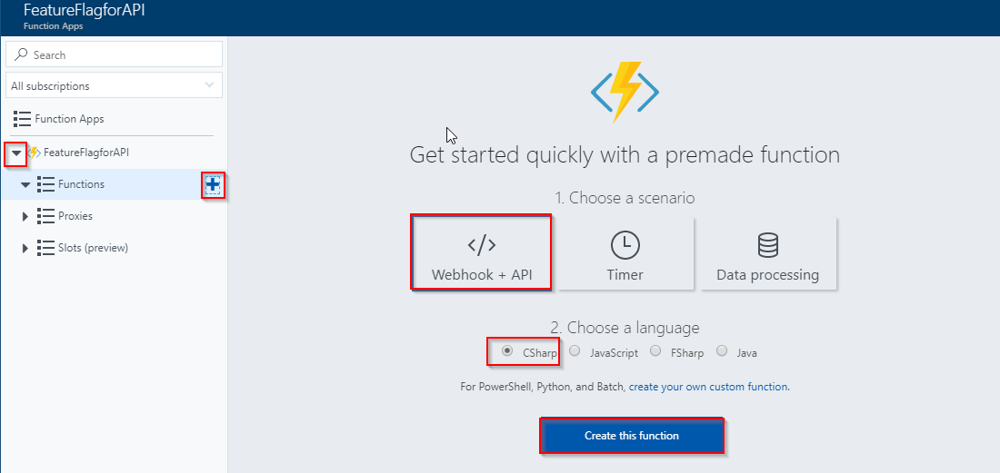

   >In this lab, you are using **C#** as script language for your function, but you can create a function in any [supported language](https://docs.microsoft.com/en-us/azure/azure-functions/supported-languages).
1. Select **HttpTriggerCSharp1** in Functions and click **</>Get Function Url**.

    

1. **Copy** the Azure Function URL and save to notepad. You will need this URL later on.

      

1. Next you will add code to the Functions App. While there are many ways of doing it, you will use Visual Studio in this lab. You will write code to redirect to the right APIs based on the user login, to return different (discount) information.

1. Return to Visual Studio, double click on the **PartsUnlimited.sln** solution to open it.

1. Right click on the solution and select **Add** and select **New Project**.

   

1. Select **Cloud** under **Visual C#** category, select **Azure Functions** as the type of this project. Enter **PartsUnlimited.AzureFunction** for the name and append **\src** at the end of the location, then click **OK**.

     

1. Select **HttpTrigger** template, **Azure Functions v1 (.NET Framework)** from the framework dropdown and click **OK**
    

    

1. Expand the **PartsUnlimited.AzureFunction** project, open **Function 1.cs** and  replace the existing code with the following code.
   ```csharp
     using System;
     using System.Linq;
     using System.Net;
     using System.Net.Http;
     using System.Threading.Tasks;
     using Microsoft.Azure.WebJobs;
     using Microsoft.Azure.WebJobs.Extensions.Http;
     using Microsoft.Azure.WebJobs.Host;

     namespace PartsUnlimited.AzureFunction
    {
    public static class Function1
    {
        [FunctionName("HttpTriggerCSharp1")]
        public static async Task<HttpResponseMessage> Run([HttpTrigger(AuthorizationLevel.Function, "get", "post", Route = null)]HttpRequestMessage req, TraceWriter log)
        {
            var userIdKey = req.GetQueryNameValuePairs().FirstOrDefault(q => string.Equals(q.Key, "UserId", StringComparison.OrdinalIgnoreCase));
            var userId = string.IsNullOrEmpty(userIdKey.Value) ? int.MaxValue : Convert.ToInt64(userIdKey.Value);
            var url = $"https://<<YourAPIAppServiceUrl>>/api/{(userId > 10 ? "v1" : "v2")}/specials/GetSpecialsByUserId?id={userId}";
            using (HttpClient httpClient = new HttpClient())
            {
                return await httpClient.GetAsync(url);
            }
        }
    }
   }
   ```

1. Navigate to the resource group  **@lab.CloudResourceGroup(268).Name** in the Azure Portal. Click **PartsUnlimited-API-XXXXXXX.azurewebsites.net** and click the **Copy** icon under the **URL** section to copy the whole URL. Copy and replace **YourAPIAppServiceUrl** in url variable with API app service name. 

1. Open **StoreController.cs** from the path **PartsUnlimitedWebsite > Controllers > StoreController.cs**

     


1. In **StoreController.cs**, replace the **url**  variable in line 46 with the **Function url** copied in **Step 7**.
 
 1. Click **Changes** in **Team Explorer**, provide a comment and select **Commit all and Push** to push the changes to the remote repository.

      
      
## Exercise 2: Setup continuous integration

Next, in this exercise, we will setup a CI and CD pipeline to deploy the Azure Functions app. Let's start with build first. 

1. On the **Files** tab of the **Code** hub, select **Set up build**.
   
   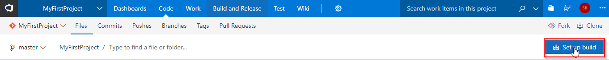

1. This will take you to the **Build and Release** hub in VSTS. It's super easy to setup the build pipeline with the new **ASP.NET Core** template. Select *the template and click **Apply**.
   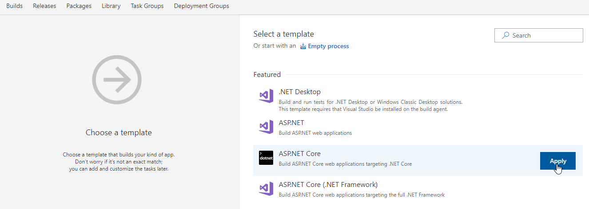

   
1. This should add a bunch of tasks to the the build definition. We can leave most of the the tasks untouched - the default values are fine.
      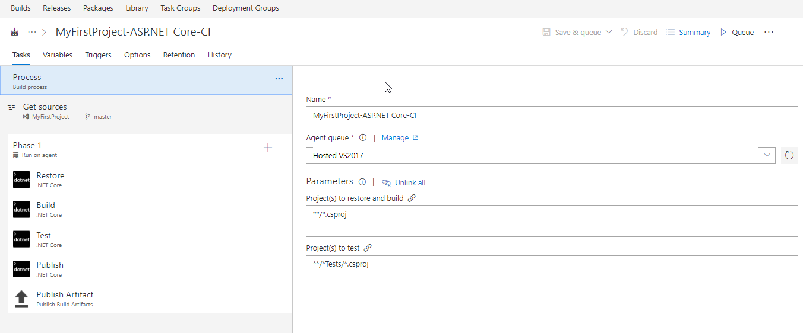

1. You will only need to change the **Publish** task. Select the task and uncheck the **Publish Web Projects** field and enter **\**\**\/\*.csproj** in **Path to Projects** field. This will change -?

   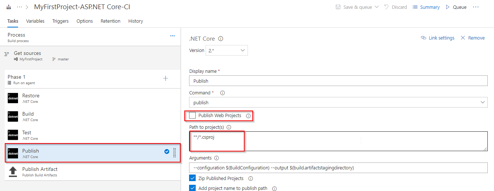
   
   
1. Before we run the build. you will make this a CI build. Click the **Triggers** tab in the build definition. Enable the **Continuous Integration** trigger. This will ensure that the build process is automatically triggered every time you commit a change to your repository

    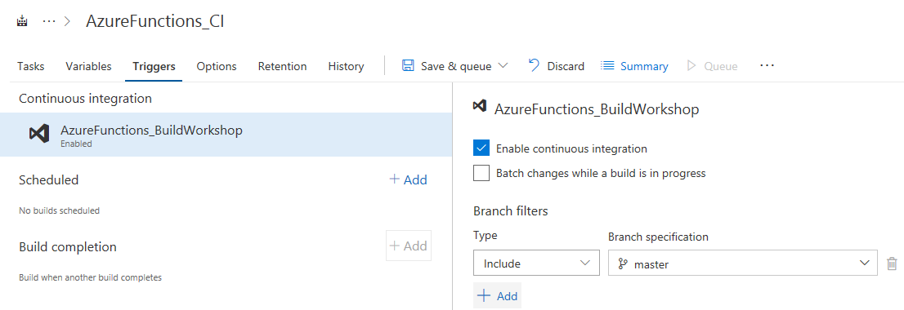

1. Select **Save & queue** to save and start your first build.

A new build is started. You will see a link to the new build on the top of the page. Click the link to watch the live logs of the build as it happens. Wait for the build to complete and succeed before proceeding to the next section.

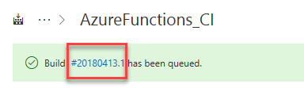

## Exercise 3: Setup continuous deployment

1. Once the build succeeds, click the **Release** action on the build summary page.
  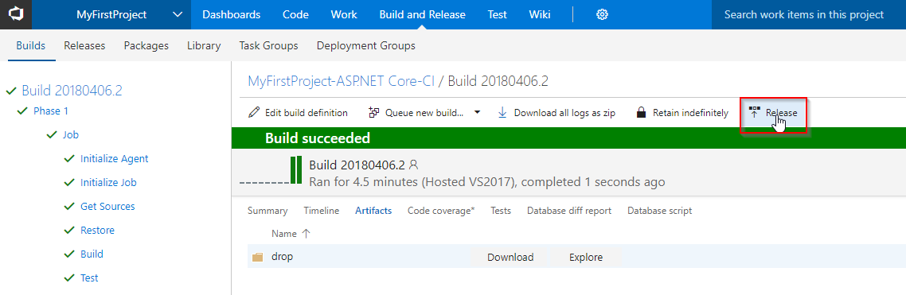

1. In the **Select a Template** panel, click the **Empty Process**.
     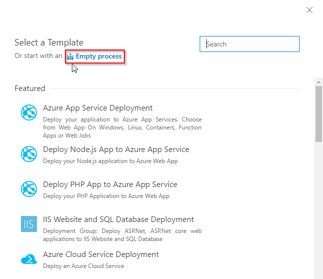

1. Select the artifact trigger and make sure the **Continuous deployment trigger** is enabled.

     

1. Click **Tasks**, and then select **Add task to the Phase** to add the deployment tasks.

    

1. In **Add tasks** panel under **Deploy** section select **Azure App Service Deployment** task. Add this task three times.

   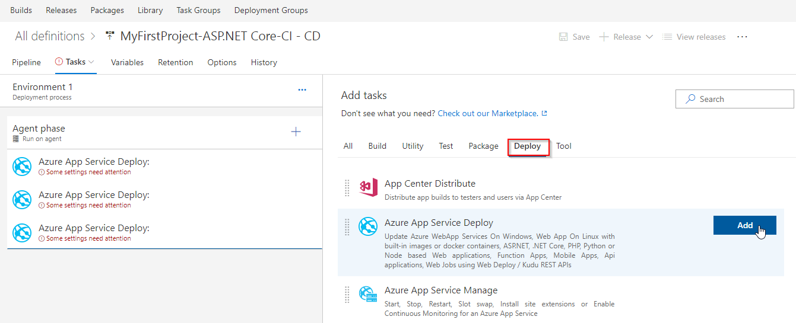

   >To configure the inputs for the **Deploy Azure App Service** tasks in the release definitio, first select the **Azure subscription** and if there is an **Authorize** button next to the input, click on it to authorize Team Services to connect to the Azure subscription

1. Select the first **Azure App Service Deployment** task and configure the inputs as shown below.
     

   This task is to deploy **PartsUnlimited Website**.

1. Select the second task and configure the inputs as shown below.

   

 This task is to deploy **PartsUnlimited APIs**.
1. Select the third task and configure the inputs  as shown below.

   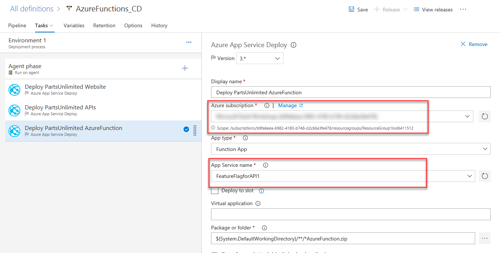
  This task is to deploy **PartsUnlimited Azure Function**.

1. Click **Save**. In the Save dialog box, click **OK**. To test the release definition, click **Release** and then **Create Release**.
  
   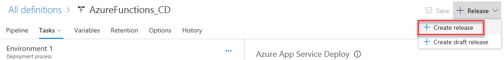

   On the Create new release dialog box, click **Create**.

1. You will notice a new release being created. Select the link to navigate to the release.

   
   
You can watch the live logs for the deployment as it happens. Wait for the release to be deployed to the Azure web app.
    

 Wait for the release to complete and succeed before proceeding to the next section.


## Exercise 4: Verify the website

1. Once deployment has completed, go to the **Azure portal**. In **@lab.CloudResourceGroup(268).Name** resource group select **PartsUnlimited-Web-xxxxx** and click **Browse**

1. You will see the website as shown below. Navigate to **Oil** category, notice that products are showing discount as **10%**.

   

1. Now log in as user **Administrator@test.com** with password **YouShouldChangeThisPassword1!** and navigate to **Oil** category again. You will notice that for this user **Azure function** routes the request to other API and shows Discount as **30%**

   

   
   
   You have connected PartsUnlimited website to the Web API and used Azure function to retrieve data from either v1 or v2 of the API based on the user ID.
