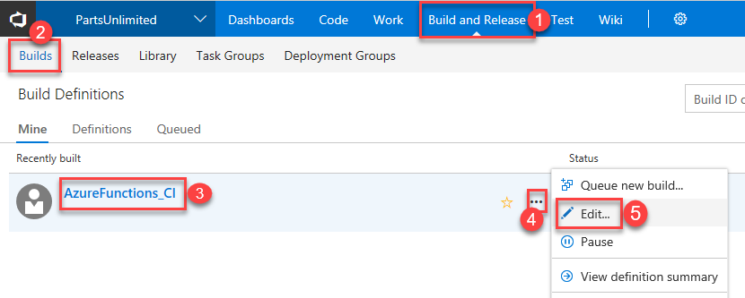
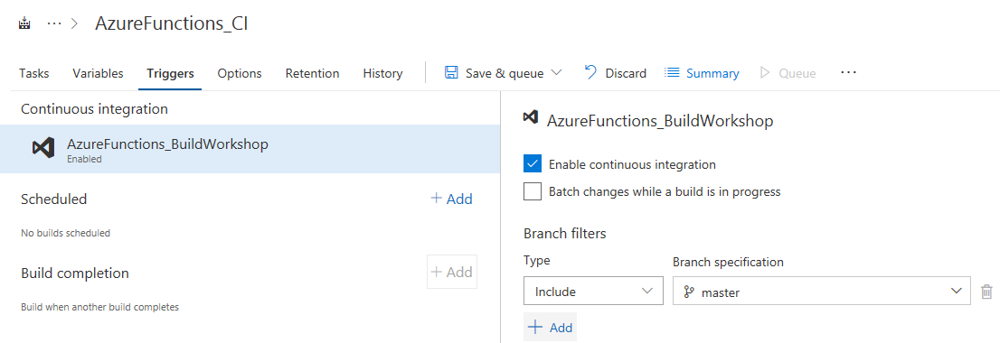
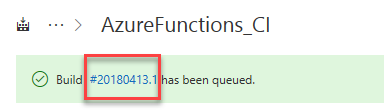

Next, in this exercise, you will look at the build definition to get an insight of how the code is built as part of the the CI pipeline. 

1. Click the **Build and Release** hub in VSTS portal, select the build definition **AzureFunctions_CI** and click the ellipsis ***...*** button and click **Edit** option in the menu to view the tasks within the build definition.

      

1. Before we run the build. you will make this a CI build. Click the **Triggers** tab in the build definition. Enable the **Continuous Integration** trigger. This will ensure that the build process is automatically triggered every time you commit a change to your repository

     

1. Select **Save & queue** to save and start your first build. A new build is started. You will see a link to the new build on the top of the page. Click the link to watch the live logs of the build as it happens. Wait for the build to complete and succeed before proceeding to the next section.

    