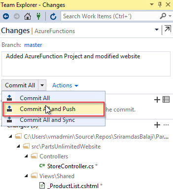

 In this exercise, you will create an **Azure Functions App** from the Azure portal and then add code by creating an **Azure Functions project** in Visual Studio.

The [Azure Functions](https://azure.microsoft.com/en-in/services/functions/) created in this exercise will act as a switching proxy or mechanism to return different (discount) information based on the user logged in to the application.
Although you have used a simple condition here, this could also use more complex rules which could potentially be hidden behind another web api call.

1. Go back to the **Azure Portal**. Select the **+Create a resource** button found on the upper left-hand corner of the Azure portal, then select **Compute > Function App**.
          

1. Use the function app settings as specified in below image. Select **Create** to provision and deploy the function app. 

     

1. Select the Notification icon in the upper-right corner of the portal and watch for the **Deployment succeeded** message. Select **Go to resource** to view your new function app.

    

1. Expand your new function app, then click the **+** button next to **Functions**.

1. In the Get started quickly page, select **WebHook + API, Choose C# as language** for your function, and click **Create this function**. 

     

   >In this lab, you are using **C#** as script language for your function, but you can create a function in any [supported language](https://docs.microsoft.com/en-us/azure/azure-functions/supported-languages).
1. Select **HttpTriggerCSharp1** in Functions and click **</>Get Function Url**.

    

1. **Copy** the Azure Function URL and save to notepad. You will need this URL later on.

      

1. Next you will add code to the Functions App. While there are many ways of doing it, you will use Visual Studio in this lab. You will write code to redirect to the right APIs based on the user login, to return different (discount) information.

1. Return to Visual Studio, double click on the **PartsUnlimited.sln** solution to open it.

1. Right click on the solution and select **Add** and select **New Project**.

   

1. Select **Cloud** under **Visual C#** category, select **Azure Functions** as the type of this project. Enter **PartsUnlimited.AzureFunction** for the name and append **\src** at the end of the location, then click **OK**.

     

1. Select **HttpTrigger** template, **Azure Functions v1 (.NET Framework)** from the framework dropdown and click **OK**
    

    

1. Expand the **PartsUnlimited.AzureFunction** project, open **Function 1.cs** and  replace the existing code with the following code.
   ```csharp
     using System;
     using System.Linq;
     using System.Net;
     using System.Net.Http;
     using System.Threading.Tasks;
     using Microsoft.Azure.WebJobs;
     using Microsoft.Azure.WebJobs.Extensions.Http;
     using Microsoft.Azure.WebJobs.Host;

     namespace PartsUnlimited.AzureFunction
    {
    public static class Function1
    {
        [FunctionName("HttpTriggerCSharp1")]
        public static async Task<HttpResponseMessage> Run([HttpTrigger(AuthorizationLevel.Function, "get", "post", Route = null)]HttpRequestMessage req, TraceWriter log)
        {
            var userIdKey = req.GetQueryNameValuePairs().FirstOrDefault(q => string.Equals(q.Key, "UserId", StringComparison.OrdinalIgnoreCase));
            var userId = string.IsNullOrEmpty(userIdKey.Value) ? int.MaxValue : Convert.ToInt64(userIdKey.Value);
            var url = $"https://<<YourAPIAppServiceUrl>>/api/{(userId > 10 ? "v1" : "v2")}/specials/GetSpecialsByUserId?id={userId}";
            using (HttpClient httpClient = new HttpClient())
            {
                return await httpClient.GetAsync(url);
            }
        }
    }
   }
   ```

1. Navigate to the resource group where you have created resources in the Azure Portal. Click **PartsUnlimited-API-XXXXXXX.azurewebsites.net** and click the **Copy** icon under the **URL** section to copy the whole URL. Copy and replace **YourAPIAppServiceUrl** in url variable with API app service name. 

1. Open **StoreController.cs** from the path **PartsUnlimitedWebsite > Controllers > StoreController.cs**

     


1. In **StoreController.cs**, replace the **url**  variable in line 46 with the **Function url** copied in **Step 7**.
 
 1. Click **Changes** in **Team Explorer**, provide a comment and select **Commit all and Push** to push the changes to the remote repository.

      