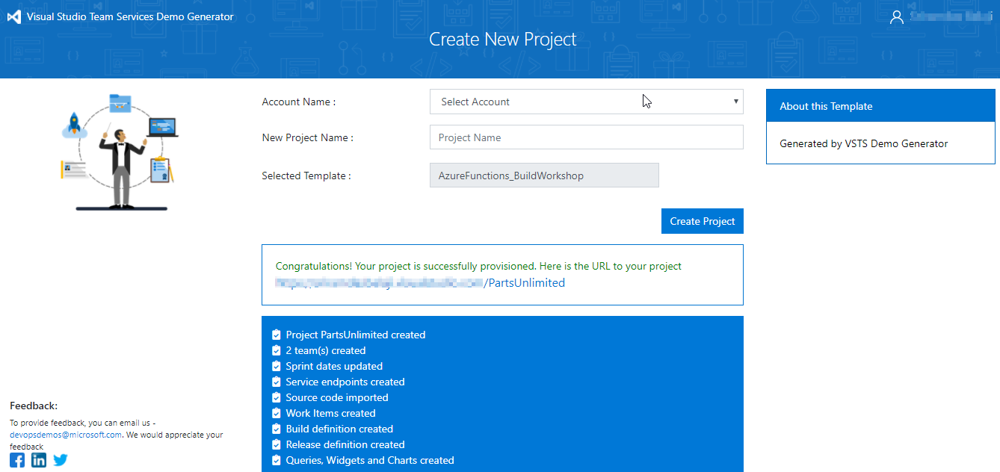

## Prerequisites for the lab

1. **Microsoft Azure Account**: You will need a valid and active Azure account for the Azure labs. If you do not have one, you can sign up for a [free trial](https://azure.microsoft.com/en-us/free/)

   * If you are a Visual Studio Active Subscriber, you are entitled for a $50-$150 credit per month. You can refer to this [link](https://azure.microsoft.com/en-us/pricing/member-offers/msdn-benefits-details/) to find out more including how to activate and start using your monthly Azure credit.

   * If you are not a Visual Studio Subscriber, you can sign up for the FREE [Visual Studio Dev Essentials](https://www.visualstudio.com/dev-essentials/)program to create **Azure free account** (includes 1 year of free services, $200 for 1st month).
1. You will need a Visual Studio Team Services Account. If you do not have one, you can sign up for free [here](https://www.visualstudio.com/products/visual-studio-team-services-vs)

1. Visual Studio 2017 version 15.4 or later with [.Net Core SDK](https://www.microsoft.com/net/learn/get-started/windows#windows), Git and [Azure Development Tools](https://docs.microsoft.com/en-us/azure/azure-functions/functions-develop-vs) for Visual Studio are installed.
### Part A: Create required Azure resources

 In this lab, you will be using a fictional eCommerce website - PartsUnlimited. The PartsUnlimited team wants to  roll out a new discount for its employees and customers and wants to build Azure Functions that will retrieve the right discount depending on whether the logged in user is an employee or a customer. 

Let us create the required resources the Azure Portal. 

1. Open your browser and navigate to [https://portal.azure.com](https://portal.azure.com)

1. Login with you username and password

1. Click **Deploy To Azure** to provision required azure resources for this lab.

   
  

1. Navigate to the **Resource Group** which you have created to view the resources. You should see 3 resources as shown below.

   

### Part B: Generate project data with VSTS Demo Generator

1. Use the [VSTS Demo Generator](https://vstsdemogenerator.azurewebsites.net/?TemplateId=77376&Name=AzureFunctions_BuildWorkshop) to provision the project on your VSTS account.

   > VSTS Demo Generator helps you create team projects on your VSTS account with sample content that include source code, work items,iterations, service endpoints, build and release definitions based on the template you choose during the configuration.

   

1. Click the **Sign In** button to get started. If you are asked for credentials, sign in with the same credentials used above to log in to Azure
   

1. Accept the request for permissions by clicking on the **Accept** button. 

   
     
1. Select the previously created Team Services account from the drop down, provide the project name as **PartsUnlimited** and click Create Project.

    

1. Once the project is created, click on the generated URL to be directed to the project portal in a new tab.

    

1. Navigate to the **Code** hub within the project portal, select **Clone** and then select **Clone in Visual Studio**. 

   

   Note that VSTS supports a wide variety of IDEs including Eclipse, IntelliJ, XCode, Android Developer Studio, Visual Studio Code, etc.

1. When the code opens in Visual Studio, if you are prompted to sign into Visual Studio Team Services, use the same credentials(that you used above to create the VSTS account) and select **Clone**

1. You can use the same credentials used above to log in to Azure
    

     

1. Once it is cloned, you should see **PartsUnlimited.sln** under **Solutions** in the Team Explorer.

     
