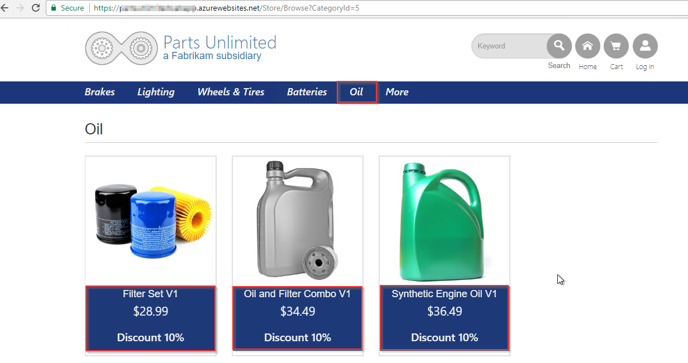
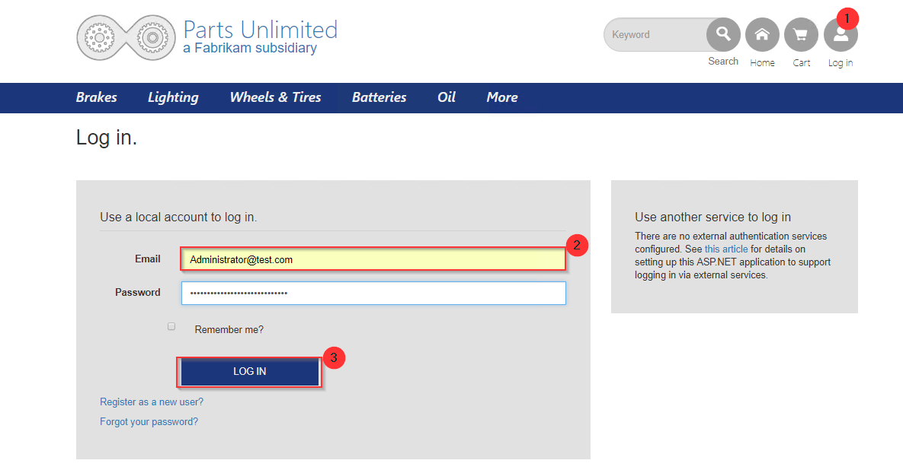
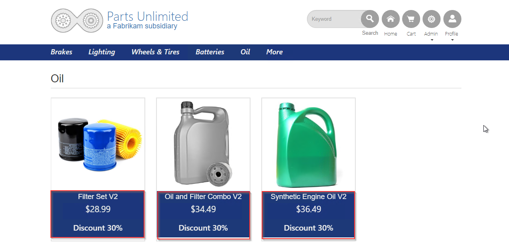

1. Once deployment has completed, go to the **Azure portal**. In **@lab.CloudResourceGroup(268).Name** resource group select **PartsUnlimited-Web-xxxxx** and click **Browse**

1. You will see the website as shown below. Navigate to **Oil** category, notice that products are showing discount as **10%**.

   

1. Now log in as user **Administrator@test.com** with password **YouShouldChangeThisPassword1!** and navigate to **Oil** category again. You will notice that for this user **Azure function** routes the request to other API and shows Discount as **30%**

   

   
   
   You have connected PartsUnlimited website to the Web API and used Azure function to retrieve data from either v1 or v2 of the API based on the user ID.