# Getting Started with Quick Start

----------

In order for our applications to use the Microsoft Graph API, we must have an application ID.

We must register the application in the Microsoft Application Registry. 

> Note: You will need either a [school or work](https://developer.microsoft.com/en-us/office/dev-program) or [Microsoft account](https://signup.live.com/signup?wa=wsignin1.0&ct=1473983465&rver=6.6.6556.0&wp=MBI_SSL&wreply=https://outlook.live.com/owa/&id=292841&CBCXT=out&cobrandid=90015&bk=1473983466&uiflavor=web&uaid=3b7bae8746264c1bacf1db2b315745cc&mkt=EN-US&lc=1033&lic=1)

## Setting up app id
### Register the app in App Registration Portal
First, go to [Microsoft App Registration Portal](https://apps.dev.microsoft.com/)

> **Note:** Login with your  [school or work](https://developer.microsoft.com/en-us/office/dev-program) or [Microsoft account](https://signup.live.com/signup?wa=wsignin1.0&ct=1473983465&rver=6.6.6556.0&wp=MBI_SSL&wreply=https://outlook.live.com/owa/&id=292841&CBCXT=out&cobrandid=90015&bk=1473983466&uiflavor=web&uaid=3b7bae8746264c1bacf1db2b315745cc&mkt=EN-US&lc=1033&lic=1)

After login we follow these steps:

 1. Choose Add an app
  
    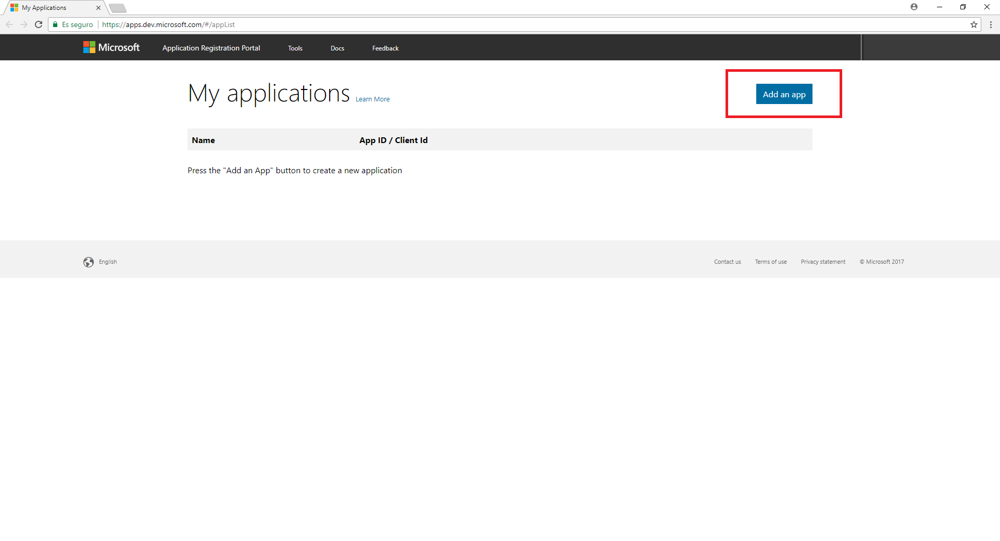 
	

	> **Note**: If you signed in with a work or school account, select the **Add an app** button for **Converged applications**.

 2. Enter an app name and click **Create**
	
	 

	> **Note**: After creation, the page display a list of properties.	

 3. Copy the Application Id and save it to a document as we will need it later 
	
	 

	> **Note**: We will need the **Application Id** to configure our app.	

 4. Now, we click on Add Platform and select Native Application 	
	
	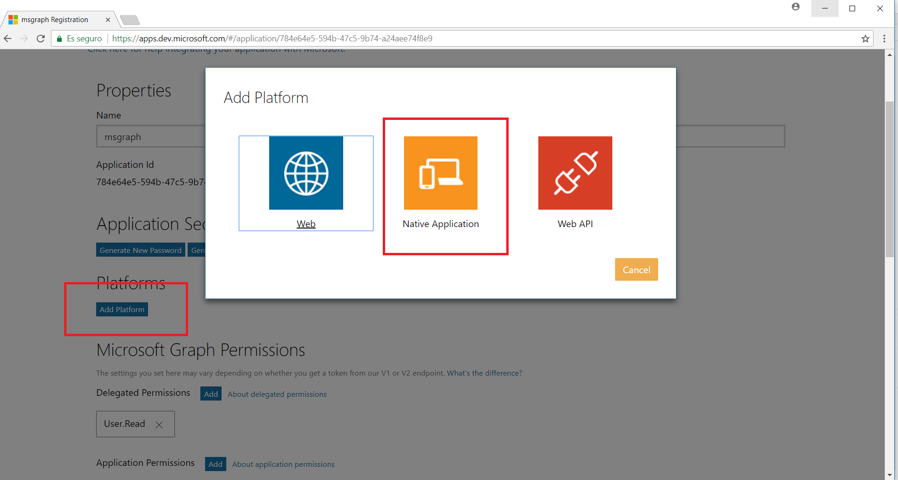 

	> **Note**: In our case we select **Native Application** because we will use an **UWP app**

 5. The Built-in redirect URI value has been created automatically. Save this value to the same document as the Application Id for future reference. 
	
	 
 
 6. Finally, we click on Save. 

## Choosing the project template

Now we will download the UWP application. We will use it and configure it with the Application Id and the Redirect Uri that we saved before.

#### Download UWP project from Github 

Download project from [here](https://github.com/Microsoft/InsiderDevTour18-Labs/tree/master/graph/Microsoft.GraphBase) 

#### Build and Debug

Now we configure the app with the Application Id and Redirect URI.
Open the App.xaml file and add this code:

	<Application.Resources>
        <x:String x:Key="ida:ClientID">ENTERYOURCLIENTID</x:String>
        <x:String x:Key="ida:ReturnUrl">ENTERYOURREDIRECTURI</x:String>
    </Application.Resources>

> Change **ENTERYOURCLIENTID** for your Application Id and **ENTERYOURREDIRECTURI** for the Redirect Uri we saved before

 
To Build and run the applications follow this steps.

1. Now select x86 as build target.
2. Select Local Machine.
3. Build the application.
4. Run the application.

If everything is properly configured you will see:

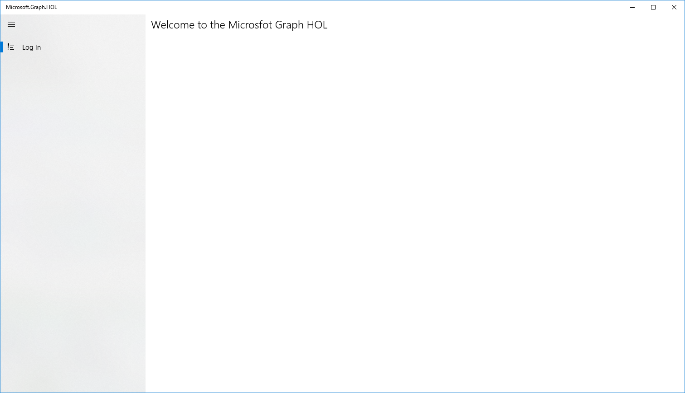 

# Microsoft Graph Explorer

Microsoft Graph Explorer is a tool that allows us to explore and test the Microsoft Graph API.

We are going to take a tour of this tool.

## Sign in to Microsoft Graph Explorer

Go to **[Microsoft Graph Explorer](https://developer.microsoft.com/en-us/graph/graph-explorer)** and click on the Sign in With Microsoft button. 

 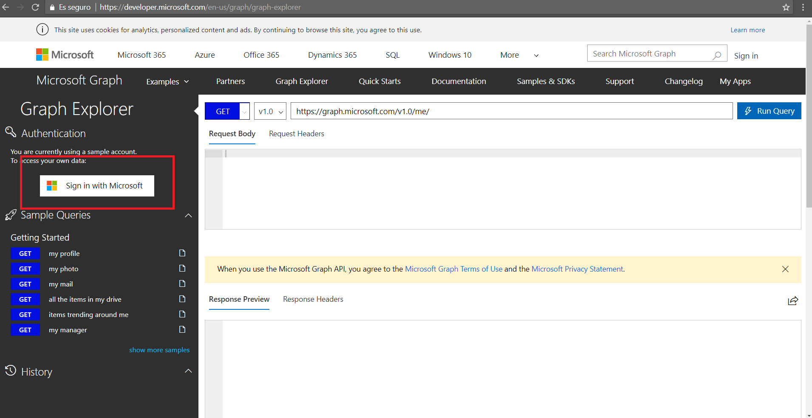 

> Note: You will need login with a [school or work](https://developer.microsoft.com/en-us/office/dev-program) or [Microsoft account](https://signup.live.com/signup?wa=wsignin1.0&ct=1473983465&rver=6.6.6556.0&wp=MBI_SSL&wreply=https://outlook.live.com/owa/&id=292841&CBCXT=out&cobrandid=90015&bk=1473983466&uiflavor=web&uaid=3b7bae8746264c1bacf1db2b315745cc&mkt=EN-US&lc=1033&lic=1)

After the login you can see that on the left side we have several options:

- We can modify our permissions.
- We can log out.
- We can see the APIS with some services by default but we can add APIS from show more samples button.

On the right side we have the view with everything we need to launch the calls against the APIs and see the requests and the response.

Now we will see how to test the Microsoft Graph API in Microsoft Graph Explorer by getting all files in One Drive and how we can manage our permissions.

## Modify user permissions

In order to use and access the different services, we can modify the permissions of our user to give him the necessary privileges to be able to use the desired operations.

- Choose Modify Permissions.

 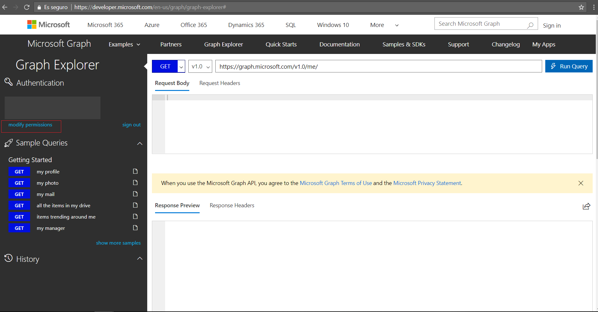 

- Now we can see the list of permissions and you can activate or deactivate individual permissions.

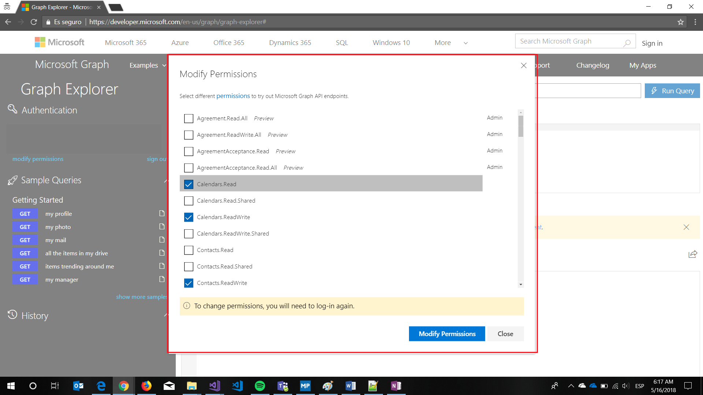 

## Activate OneDrive in Sample Categories

Now we are going to add the OneDrive APIs to Microsoft Graph Explorer to be able to call these services

- Choose show more samples.

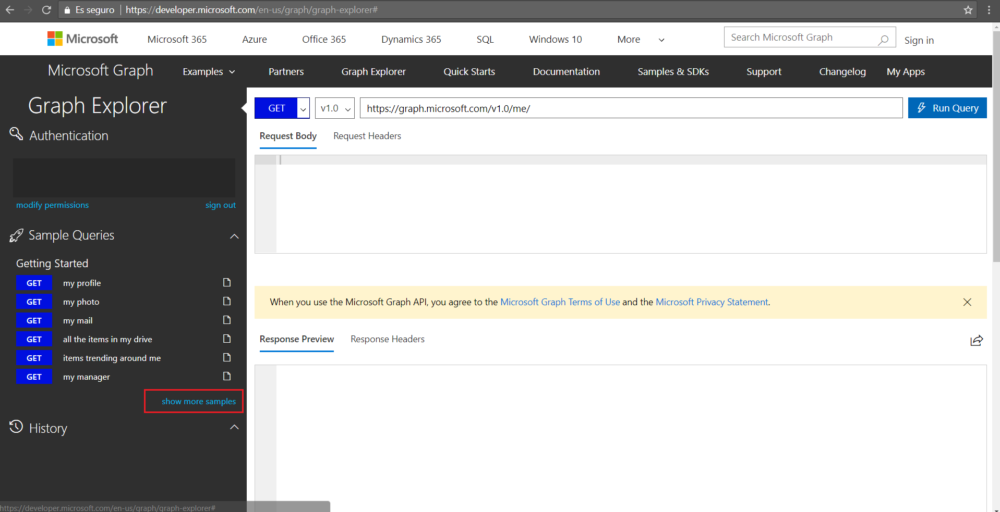 

- Find OneDrive and activate it. 

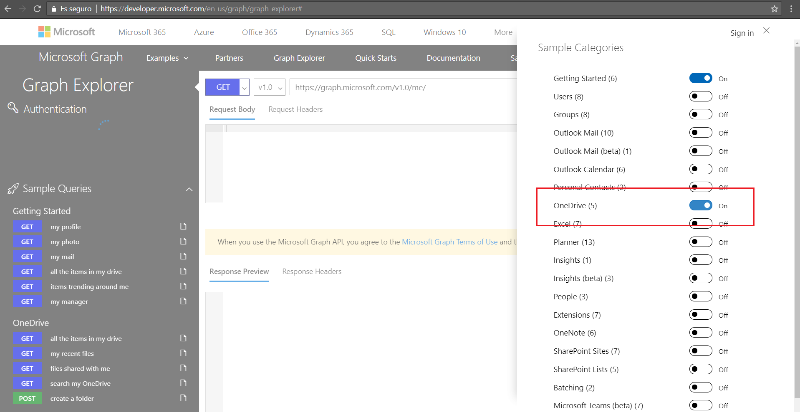 

- Now OneDrive APIs are included in Microsoft Graph Explorer.

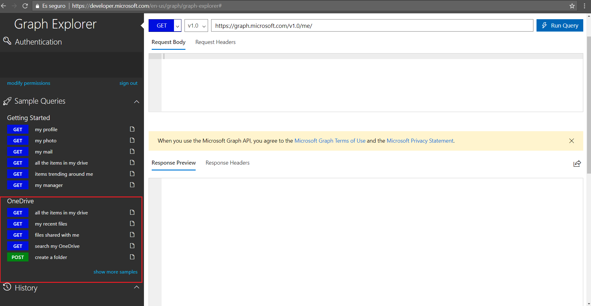 

# Get all items in my drive

We are ready to get all items from OneDrive

- Select in the left menu **all the items in my drive** under **OneDrive** section
- The Microsoft Graph Explorer automatically sends a call to OneDrive API and shows the results.

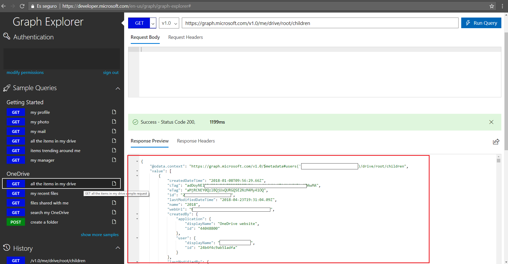 

Now let's get a single file.  
From the left panel select my recent files and copy the id field in the remoteItem object.
To get the single file, put it in the url:

	https://graph.microsoft.com/v1.0/me/drive/items/{your_file_id}

If you want the thumbnails, use this url:

	https://graph.microsoft.com/v1.0/me/drive/items/{your_file_id}/thumbnails
# Sample API calls

At this point we are ready to interact with Microsoft Graph.

To do this we will create a console application to which we add the necessary code to perform authentication using Microsoft Graph and then we will list all the documents that we have in OneDrive.

## Create a console app

Download the base project from [here](https://github.com/Microsoft/InsiderDevTour18-Labs/tree/master/graph/Microsoft.Graph.HOL.ConsoleBase)

## Authenticate user

Now let's add the authentication.

- In App.config add the following underneath the root `<configuration>` tag:

    	<appSettings>
    		<add key="ida:ClientID" value="YOURCLIENTID"/>
    		<add key="ida:ReturnUrl" value="YOURREDIRECTURI"/>
    	</appSettings>
    
	
>Change the value **YOURCLIENTID** for the Application Id that we obtained when registering the application, and do the same with **YOURREDIRECTURI**

- Go to AuthenticationHelper.cs
- Delete the code

   	`throw new NotImplementedException();`

- Add the following code

	      try
            {
                graphClient = new GraphServiceClient(
                    "https://graph.microsoft.com/v1.0",
                    new DelegateAuthenticationProvider(
                        async (requestMessage) =>
                        {
                            var token = await GetTokenForUserAsync();
                            requestMessage.Headers.Authorization = new AuthenticationHeaderValue("bearer", token);                            

                        }));
                return graphClient;
            }

            catch (Exception ex)
            {
                Debug.WriteLine("Could not create a graph client: " + ex.Message);
            }

            return graphClient;

> **Note:** if you see errors underlined in the file, they should disappear when the application is built.

You can see that we use the Microsoft Graph Service Client to authenticate, obtain the token, and later access all of Microsoft Graph resources through the class found in the Microsoft.Graph NuGet package.

The method **GetTokenForUserAsync** obtain the access token after the user are authenticated to send in Authentication header when call the API.

Now you can build and run the process and the application will ask for user credentials via Microsoft Graph.
When you are authenticated, please answer **N** to the answer **Would you like to see your OneDrive items?[Y] Yes or [N] No**

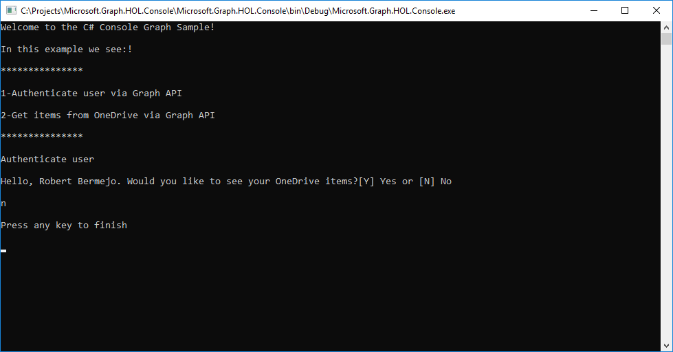

> **Note:** if you an error when signing in about no reply address being registered, then you forgot to save your native application addition in step 6 of the **Setting up app id** section.

## Get call to Get all items in OneDrive
Now we are ready to make calls to the API, we will call OneDrive API to show the name of the documents we have.

> **Advice:** the application ask for a number of documents to show. If you don't want to wait a lot, please enter a small number.

For the call to **OneDrive** follow these steps:

- Go to OneDriveHelper.cs.
- Delete the code.
	
	`throw new NotImplementedException();`
-  Add this code:
 			
	       List<string> filesName = new List<string>();

            try
            {
                var graphClient = AuthenticationHelper.GetAuthenticatedClient();
                var onedrive = graphClient.Me.Drive.Root.Children.Request().GetAsync().Result;

                filesName = GetNameFiles(graphClient, filesName, onedrive, numberOfElements);
               
                return filesName;
            }

            catch (Exception ex)
            {
                Debug.WriteLine("Could not create a graph client: " + ex.Message);
                throw;
            }

There are few interesting points in the code before:

- We call the authentication method to obtain the Microsoft Graph context with the authenticated user.
- After that we can access the different Microsoft Graph resources of the user.
- In our case we access the root of OneDrive.
- And then we search for the files by going through all the folders with the recursive GetNameFiles method.

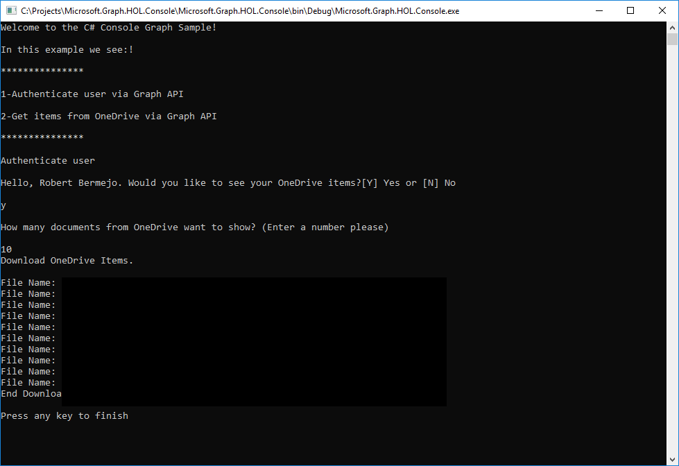

# Adding API calls to your project

Now we have an overview about how to work with Microsoft Graph. Now we will go back to our UWP and add user authentication.

## Add user authentication with Microsoft Graph
Open UWP code in Visual Studio and follow these steps.

- Go to Helpers/AuthenticationHelper.cs
- In GetAuthenticatedClient() Method
- Delete this code:

   	`throw new NotImplementedException();`

- Add the following code:

		if (graphClient == null)
            {
                // Create Microsoft Graph client.
                try
                {
                    graphClient = new GraphServiceClient(
                        "https://graph.microsoft.com/v1.0",
                        new DelegateAuthenticationProvider(
                            async (requestMessage) =>
                            {
                                var token = await GetTokenForUserAsync();
                                requestMessage.Headers.Authorization = new AuthenticationHeaderValue("bearer", token);
                            }));
                    return graphClient;
                }

                catch (Exception ex)
                {
                    Debug.WriteLine("Could not create a graph client: " + ex.Message);
                }
			}
			return graphClient;

As you can see it is exactly the same code that we used in the console application, and this is because for the UWP application we have used the same NuGet package.

> **Note:** In previous steps we configured the **ClientID** and **ReturnURL** field in the App.xaml file. Check that you have added them correctly.

Now run the application and click the **Log in** menu button to authenticate.
