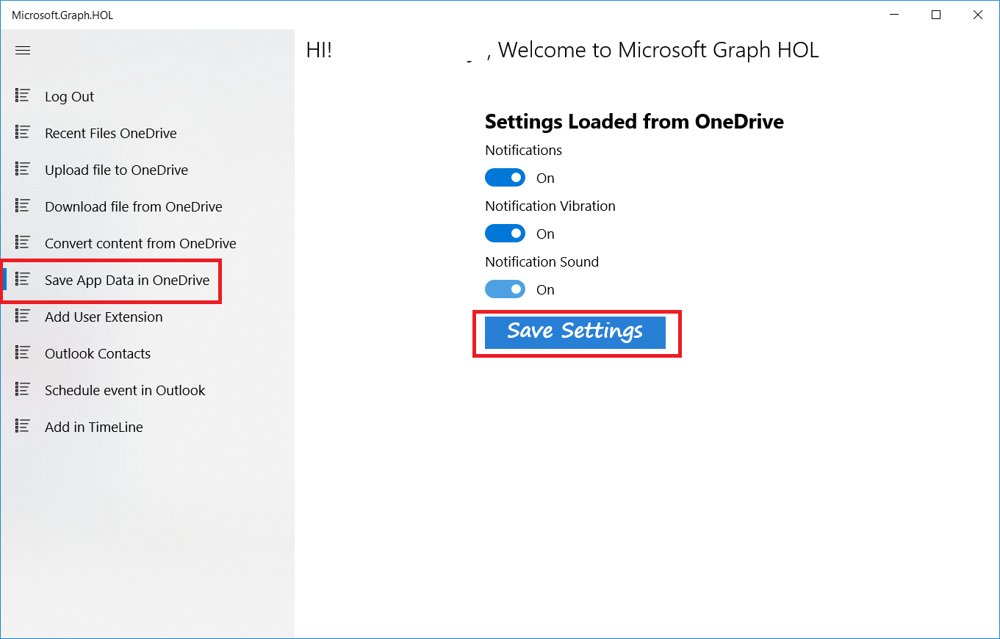
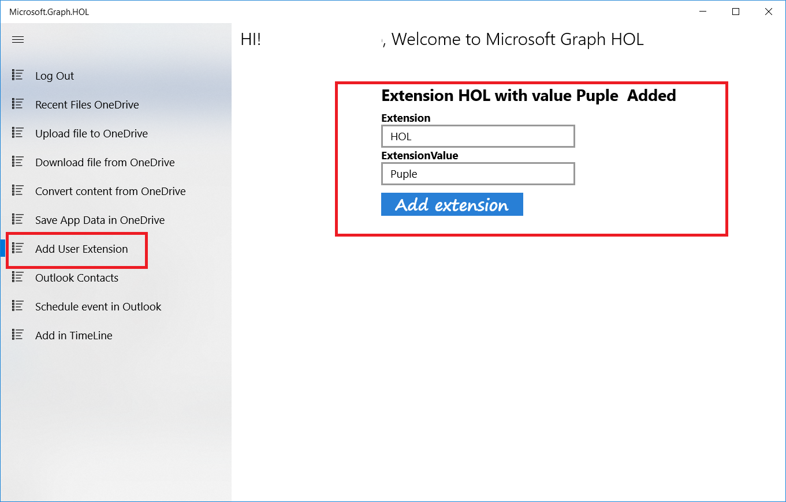

# Integrating MS Graph into your app

----------

# Using OneDrive for app data storage

Now that we have learned how to interact with OneDrive, one of the options we have is to save the information of our application in OneDrive: settings, images, documents, backups ..., 

So, if we install the application in another device we can recover all the information and settings we had.

Specifically in this section we are going to simulate how to save settings in OneDrive and how to recover them after a clean installation.

## Write app settings to OneDrive

In UWP project go to **Helpers/DataSyncHelper.cs** SaveSettingsInOneDrive method and follow the steps:

- Delete the code

	`throw new NotImplementedException();`

- Add the following code

          	try
            {
                var model = JsonConvert.SerializeObject(settingsModel);
                var graphClient = AuthenticationHelper.GetAuthenticatedClient();
          
                using (var contentStream = GenerateStreamFromString(model))
                {
                    var uploadedItem = await graphClient
                                                 .Drive
                                                 .Root
                                                 .ItemWithPath($"Hol/Graph/Settings/settings.txt")
                                                 .Content
                                                 .Request()
                                                 .PutAsync<DriveItem>(contentStream);
                }
            }
            catch (Exception ex)
            {
                Debug.WriteLine("Error get upload settings file in OneDrive: " + ex.Message);
                throw;
            }

- Build and run the application.

- Click the Log in button.

- Select the **Save App Data in OneDrive** option in the menu

- Activate all options

- Click the Save Setting button

- Now go to your OneDrive and you can see the file settings.txt was created in HOL/Graph/Settings. This file contains the app settings.

## Restore settings when installing the app

Now we need to uninstall our UWP app. Search for Microsoft.Graph.HOL App, right click and uninstall.

Now in the UWP project, go to **Helpers/DataSyncHelper.cs** GetSettingsInOneDrive method and follow these steps:

- Delete the code

	`return new SettingsModel();

- Add the following code

            try
            {                
                var graphClient = AuthenticationHelper.GetAuthenticatedClient();

                var settingsStream = await graphClient
                                                .Drive
                                                .Root
                                                .ItemWithPath($"Hol/Graph/Settings/settings.txt")
                                                .Content
                                                .Request()
                                                .GetAsync();

                var settingsString = DeserializeFromStream(settingsStream);
                return JsonConvert.DeserializeObject<SettingsModel>(settingsString);
            }
            catch(Microsoft.Graph.ServiceException ex)
            {
                if (ex.Error.Code.Equals("itemNotFound"))
                {
                    return new SettingsModel();
                }
                Debug.WriteLine("Error get upload file in OneDrive: " + ex.Message);
                throw;
            }
            catch (Exception ex)
            {
                Debug.WriteLine("Error get upload file in OneDrive: " + ex.Message);
                throw;
            }

- Build and run the application.

- Click the Log in button.

- Select the **Save App Data in OneDrive** option from the menu.

- You'll see the options you selected before.

# Writing data to the MS Graph

Microsoft Graph is not a closed tool that gives us a series of classes and functions and nothing else.

One of its strengths is the ability to expand that information with personalized information.

In this section we will see how we can do it.

## Add custom data to resource	

In the UWP project go to **Helpers/UserExtensionHelper.cs** SetExtension method and follow these steps:

- Delete the code

	`throw new NotImplementedException();`

- Add the following code

           try
            {
                var graphClient = AuthenticationHelper.GetAuthenticatedClient();
                var extenion = new OpenTypeExtension
                {
                    ExtensionName = extensionName,
                    AdditionalData = data
                };

                await graphClient.Me.Extensions.Request().AddAsync(extenion);
            }
            catch (Exception ex)
            {
                Debug.WriteLine("Error to set extension in graph: " + ex.Message);
                throw;
            }

- Build and run the application.

- Click the Log in button.

- Select the **Add User Extension** option in menu

- Enter a name for the extension and a value

- Click on Add Extension.

 

After saving the extension, the app calls to Graph to obtain the extension and its value and set it again.
You can see the following code in **UserExtension.xaml.cs** 

 	
		private async void Button_AddExtension_Click(object sender, RoutedEventArgs e)
        {
            try
            {
                this.Progress.IsActive = true;
                var dictionary = new Dictionary<string, object>();
                dictionary.Add(this.txtExtension.Text, this.txtExtensionValue.Text);
				//Save the extension
                await UserExtensionHelper.SetExtension(this.txtExtension.Text, dictionary);
                InfoText.Text = "Extension Added Correctly.Get Extensions....";
				//GetExtension
                var extensionList = await UserExtensionHelper.GetOpenExtensionsForMe();
                var rmyExtension = extensionList.Where(x => x.Display.Equals(this.txtExtension.Text)).First();
                await UserExtensionHelper.DeleteOpenExtensionForMe(this.txtExtension.Text);
                InfoText.Text = $"Extension {rmyExtension.Display} with value {rmyExtension.Properties[rmyExtension.Display].ToString()}  Added";
            }
            catch (Exception ex)
            {
                InfoText.Text = $"OOPS! An error ocurred: {ex.GetMessage()}";
            }
            finally
            {
                this.Progress.IsActive = false;
            }
        }

The code to call Microsoft Graph API to get extension are in **Helpers/UserExtensionHelper.cs** GetOpenExtensionsForMe method:

 		public static async Task<List<ExtensionModel>> GetOpenExtensionsForMe()
        {
            try
            {
                var graphClient = AuthenticationHelper.GetAuthenticatedClient();

                var result = await graphClient.Me.Extensions.Request().GetAsync();

                return result.CurrentPage.Select(r => new ExtensionModel()
                {
                    Display = r.Id,
                    Properties = (Dictionary<string, object>)r.AdditionalData
                }).ToList();
            }
            catch (Exception ex)
            {
                Debug.WriteLine("Error to get sextension in graph: " + ex.Message);
                throw;
            }
        }

   
> **Note:** The Maximum number of extensions by applications is two.
