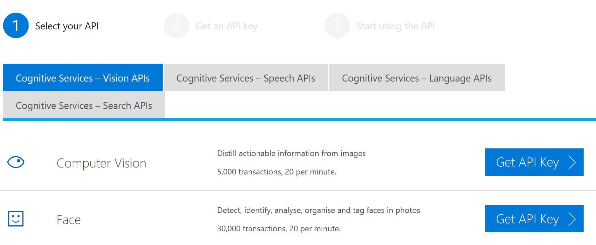
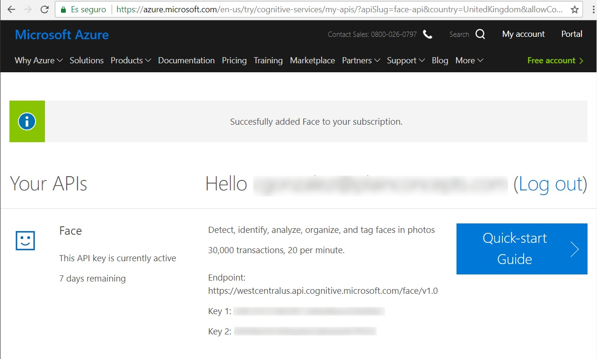
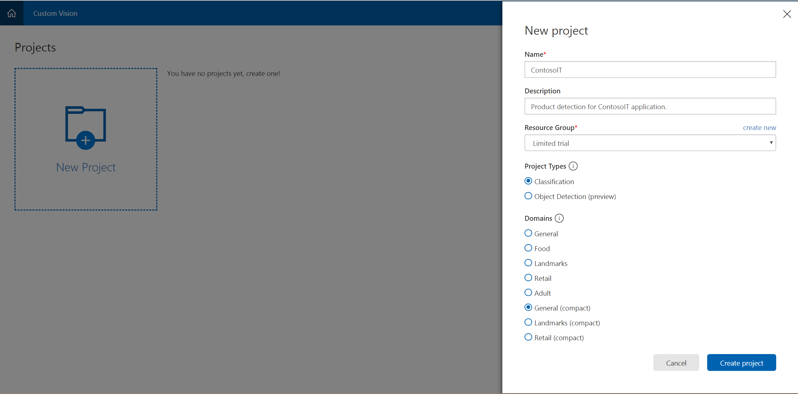
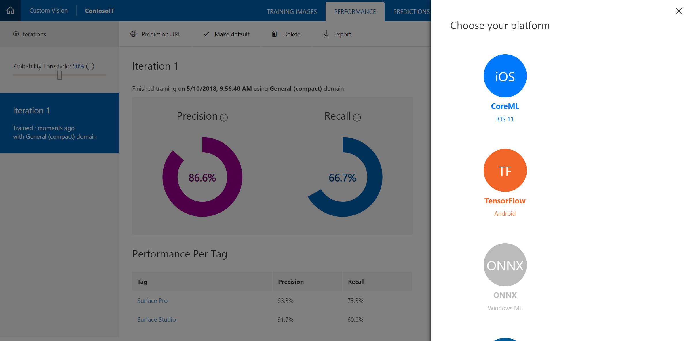

# Intelligence on the Edge Hands-On Lab

## Prerequisites
- <a href="https://developer.microsoft.com/windows/downloads/windows-10-sdk">Windows 10 SDK</a> (Build 17110 or higher)
- <a href="https://developer.microsoft.com/windows/downloads">Visual Studio</a>

## Intelligence at the edge

With the advent of cloud computing, and with more and more scenarios that involve taking advantage of Azure in order to scale better and reduce costs, a new term has started to appear and gain traction: intelligence at the edge. Intelligence at the edge, or edge computing, refers to processing the data as close to the source as possible, and allow systems to perform operational decisions directly, usually with the help of Machine Learning models. Instead of feeding the data back to the data center, processing it and then feeding back the actions to be performed, the whole process is performed close to the data (in the edge).

There are several advantages that come from this edge processing, including:

- Reducing latency associated with the transfer of data between the cloud and device. Many IoT applications require the ability to make quick decisions, and having to wait for the data to make the round-trip to the servers is the opposite of that. The ability of generate data and act on it directly on the edge enables a lot of scenarios and possibilities that were unfeasible before.

- Improving the quality of data available for processing. Since IoT platforms usually have to deal with limited bandwidth, getting the data to the main system takes a lot of time, and sometimes involves discarding data. This has an obvious effect on data quality, and by performing the most urgent analysis direcly on the edge, results can be improved.

By leveraging Azure IoT Edge intelligence at the edge capabilities, a number of new scenarios open up, for example:

- Predict equipment maintenance needs and proactively action on those predictions (shutting down failing equipment before issues get worse, for example)
- Reduce water and electricity costs while increasing yield in farming operations by analyzing sensor information directly on the field
- Analize flight data from drone sensors and apply it to diagnose issues or improve control
- Deliver real-time information from devices on the field

## Intro to machine learning

### What is ML

Machine learning is a term couned in 1959 by Arthur Samuel, that currently defines a field of computer science. By leveraing statistical techniques, machine learning gives machines the ability to learn, improving their performance on a specific task. This is done by combining algorithms and huge amounts of data. By processing this previously collected data, ML algorithms build models that can predict the correct output when presented with a new input. 

This learning capability is specially useful in scenarios where designing and programming explicit algorithms with good performance is difficult or infeasible. The most typical scenarios include detecting spam emails, optical character recognition, computer vision or recommendation algorithms.

The model-building phase is called "training." Once trained with existing data, the model can perform predictions with new, previously unseen data, which is called "inferencing," "evaluation," or "scoring."

### What is a model

The "machine learning model" is the output generated when a machine learning algorithm is trained with a training dataset. The process of training a machine learning model involves providing an algorithm with training data to learn from. 

For example, considering a scenario where we want to detect spam email, the objective is to generate a model which would take in an input in real-time (an email), and generate an output (whether the email is considered spam or not). The training set would include normal and spam emails. Each email information (contents, header, sender domain, etc.) will be evaluated as per the choice of features (or attributes) and algorithm we made.

### What is ONNX

Open Neural Network Exchange (ONNX) provides an open source format for ML models, defining an extensible computation graph model, as well as definitions of built-in operators and standard data types. Initially its focused on the capabilities needed for inferencing (evaluation).

ONNX is being co-developed by Microsoft, Amazon and Facebook as an open-source project. In its initial release the project will support Caffe2, PyTorch, MXNet and Microsoft CNTK Deep learning framework.

## What will this lab cover

### ML as a service

As well as other offerings in Azure under the paradigm of PaaS (Platform as a Service), Machine learning as a Service (MLaaS) is an array of services that provide machine learning tools as part of cloud computing services. MLaaS helps clients benefit from machine learning without the cost, time and risk of establishing an inhouse internal machine learning team. Infrastructural concerns such as data pre-processing, model training, model evaluation, and ultimately, predictions, can be mitigated through MLaaS. 

### WinML

Windows ML is a platform that evaluates trained machine learning models on Windows 10 devices, allowing developers to use machine learning within their Windows applications, including interesting capabilities such as:

- Hardware acceleration. On DirectX12 capable devices, Windows ML accelerates the evaluation of Deep Learning models using the GPU. CPU optimizations additionally enable high-performance evaluation of both classical ML and Deep Learning algorithms.
- Local evaluation. Windows ML evaluates on local hardware, removing concerns of connectivity, bandwidth,and data privacy. Local evaluation also enables low latency and high performance for quick evaluation results.
- Image processing. For computer vision scenarios, Windows ML simplifies and optimizes the use of image, video, and camera data by handling frame pre-processing and providing camera pipeline setup for model input.

### Custom models with Custom vision

The Custom Vision Service is a Microsoft Cognitive Service to build a custom image classifier, simplifying the process of building, deploying and improving an image classifier. The Custom Vision Service provides a REST API and a web interface to upload images and train the classifier.

The Custom Vision Service is designed to work best when the item to classify is prominent in the image. 50 images per class are enough to start prototyping, since the methods used by the Custom Vision Service uses are robust to differences. This also means that the Custom Vision Service is not designed, and will not perform as well, when the differences between images are more subtle, such as minor cracks or dents in a Quality Assurance scenario.

# Emotion detection with Face API
In this section you will create a Machine Learning powered Alarm Clock. Your application will display an alarm ask you to show an emotion on your webcam. The alarm will stay on until you show the requested emotion for at least 3 seconds.

Emotion detection will be implemented in two different ways:
- Using the Azure Cognitive Services Face API
- Using a locally deployed model

# 1. Create the Clock application
Let´s start creating a simple application displaying a clock.

Open your Visual Studio and create a new UWP application. Name it AlarmClock.

Set the platform to x64.

Open Package.appxmanifest file, go to Capabilities section and ensure WebCam option is checked.

Add the following nuget packages to your aplication:
- Microsoft.Toolkit.Uwp.UI.Controls
- Microsoft.ProjectOxford.Face

Open the MainPage.xaml and add the following namespace to the Page node:

    xmlns:controls="using:Microsoft.Toolkit.Uwp.UI.Controls"

Now, replace the Grid node by the one below. This grid has 4 rows, containing:
- The webcam preview
- A message with the emotion required to stop the alarm
- A message with the currently detected emotion
- The clock, that will blink while the alarm is on 

```
    <Grid Background="Black">
        <Grid.RowDefinitions>
            <RowDefinition Height="*"></RowDefinition>
            <RowDefinition Height="60"></RowDefinition>
            <RowDefinition Height="60"></RowDefinition>
            <RowDefinition Height="250"></RowDefinition>
        </Grid.RowDefinitions>
        <controls:CameraPreview Grid.Row="0" x:Name="camera" />
        <TextBlock Grid.Row="1" x:Name="EmotionText" VerticalAlignment="Center" HorizontalAlignment="Center" Foreground="White" FontSize="30"></TextBlock>
        <TextBlock Grid.Row="2" x:Name="DetectedEmotion" VerticalAlignment="Center" HorizontalAlignment="Center" Foreground="White" FontSize="30"></TextBlock>
        <Border Grid.Row="3" Background="Red" x:Name="Alarmbackground">
            <TextBlock x:Name="TimeText" VerticalAlignment="Center" HorizontalAlignment="Center" TextAlignment="Center" Foreground="White" FontSize="200">12:00:00</TextBlock>
        </Border>
    </Grid>
```

Now open the MainPage.xaml.cs file.

Replace the current using clauses with the ones below. 

Note the first two Microsoft.ProjectOxford.Face and Microsoft.ProjectOxford.Face.Contract. Those are used to access the Cognitive Services Face API. We will go back to that later.

    using Microsoft.ProjectOxford.Face;
    using Microsoft.ProjectOxford.Face.Contract;
    using Microsoft.Toolkit.Uwp.Helpers.CameraHelper;
    using System;
    using System.Collections.Generic;
    using System.IO;
    using System.Linq;
    using System.Runtime.InteropServices.WindowsRuntime;
    using System.Threading.Tasks;
    using Windows.Graphics.Imaging;
    using Windows.Media;
    using Windows.Storage;
    using Windows.Storage.Streams;
    using Windows.UI;
    using Windows.UI.Xaml;
    using Windows.UI.Xaml.Controls;
    using Windows.UI.Xaml.Media;
    using Windows.UI.Xaml.Navigation;

Lets add the code to update the clock. 

Add the following global variable

    private DispatcherTimer clockTimer;

Add the methods below to update the clock TextBlock at regular intervals.

    protected async override void OnNavigatedTo(NavigationEventArgs e)
    {
        clockTimer = new DispatcherTimer();
        clockTimer.Interval = TimeSpan.FromMilliseconds(300);
        clockTimer.Tick += Timer_Tick;
        clockTimer.Start();
    }

    private void Timer_Tick(object sender, object e)
    {
        TimeText.Text = DateTime.Now.ToString("HH:mm:ss");
    }

# 2. Add the alarm
For simplicity sake, the alarm will start when the application starts, and will keep on until the desired emotion is detected for at least 3 seconds.

Add the following global variables:
    
    private bool alarmOn = true;
    private SolidColorBrush red = new SolidColorBrush(Color.FromArgb(255, 255, 0, 0));
    private SolidColorBrush black = new SolidColorBrush(Color.FromArgb(255, 0, 0, 0));
    

At the end of the Timer_Tick method, add the code below. This will make the background blink from red to black while the alarmOn variable is true.

    if (alarmOn)
    {
        Alarmbackground.Background = Alarmbackground.Background == black ? red : black;
    }
    else
    {
        Alarmbackground.Background = black;
    }

# 3. Ask for an emotion
The Face API can detect 8 different emotions ("Neutral", "Happiness", "Surprise", "Sadness", "Anger", "Disgust", "Fear" and "Contempt").

In this section, you will randomly choose one of them and ask the user to show it on camera.

Add some global variables:

    private List<string> labels;
    private string expectedEmotion;

Add the following code at the end of OnNavigatedTo method:

    labels = new List<string>()
    {
        "Neutral",
        "Happiness",
        "Surprise",
        "Sadness",
        "Anger",
        "Disgust",
        "Fear",
        "Contempt"
    };

    Random random = new Random();
    expectedEmotion = labels[random.Next(labels.Count)];
    EmotionText.Text = $"Show {expectedEmotion} to Dismiss";

# 4. Capture frames
Now, let's capture images from the webcam, to later use them for the emotion detection part.

The CameraPreview FrameArrived event will trigger when a new frame is available. So you can use that to capture it.

At the end of the OnNavigatedTo method, add:

    camera.FrameArrived += Preview_FrameArrived;

And now add the code to pick the frames. No we have called the method AnalyzeFrame, as we will complete it later with the Emotion Detection

    private async void Preview_FrameArrived(object sender, FrameEventArgs e)
    {
        camera.FrameArrived -= Preview_FrameArrived;

        await AnalyzeFrame(e.VideoFrame);

        camera.FrameArrived += Preview_FrameArrived;
    }

    private async Task AnalyzeFrame(VideoFrame frame)
    {
        if (!alarmOn)
            return;

        var bitmap = frame.SoftwareBitmap;
        if (bitmap == null)
            return;

        // Analyze the frame
    }

# 5. Detect emotion using Cognitive Services

The Face API receives an image and returns the result of the face detection, including the emotion. You can provide the image as a URL or as a Stream. In this section we will do the later.

Also, to speed up the process, we will scale down the image to 200 pixels height, although the API does not really need that.

The code below make receive the frame you have captured, scales it down, and returns the emotion detected by Cognitive Services. 

You need to provide a valid Subscription Key, we will see how to get it on the next section.

If you account is not in westus datacenter, you need to change that in the apiBaseUrl.

    private async Task<string> DetectEmotion(SoftwareBitmap image)
    {
        // Set correct subscriptionKey and API Url.
        string subscriptionKey = "YOUR SUBSCRIPTION KEY";
        string apiBaseUrl = "https://westus.api.cognitive.microsoft.com/face/v1.0";

        using (InMemoryRandomAccessStream imageStream = new InMemoryRandomAccessStream())
        {
            SoftwareBitmap bitmap = SoftwareBitmap.Convert(image, BitmapPixelFormat.Rgba16);
            BitmapEncoder encoder = await BitmapEncoder.CreateAsync(BitmapEncoder.PngEncoderId, imageStream);
            encoder.SetSoftwareBitmap(bitmap);
            var ratio = bitmap.PixelHeight / 200;
            encoder.BitmapTransform.ScaledHeight = (uint)Math.Round((double)bitmap.PixelHeight / ratio);
            encoder.BitmapTransform.ScaledWidth = (uint)Math.Round((double)bitmap.PixelWidth / ratio);
            await encoder.FlushAsync();

            imageStream.Seek(0);

            var faceServiceClient = new FaceServiceClient(subscriptionKey, apiBaseUrl);

            Face[] faces = await faceServiceClient.DetectAsync(imageStream.AsStream(), false, true, new FaceAttributeType[] { FaceAttributeType.Emotion });
            var detectedFace = faces?.FirstOrDefault();
            return detectedFace == null ? null : detectedFace.FaceAttributes.Emotion.ToRankedList().FirstOrDefault().Key;
        }
    }

At the top of the class, add a new global variable:

        private string detectedEmotion = string.Empty;

At the end of AnalyzeFrame method, add:

    // Analyze the frame
    string detectedEmotion;
    try
    {
        detectedEmotion = await DetectEmotion(bitmap);
    }
    catch
    {
        return;
    }

You can see that, for simplicity, we are ignoring any error.

## 6. Get you account key
Open a browser window and go to https://azure.microsoft.com/services/cognitive-services/. 

Click on "Try Cognitive Services for free" and look for Face API in the next page. 



Click on "Get API Key". Accept the service conditions and log in with your preferred account.



Copy any of the displayed keys to your clipboard and paste it in the DetectEmotion method.

    string subscriptionKey = "YOUR SUBSCRIPTION KEY";

## 7. Stop the alarm when emotion is detected
Finally, we need to stop the alarm when the required emotion is detected for at least three seconds.

Add another global variable to keep trace of the time:

    private DateTime? expectedEmotionStart;

Add the following method to check if the alarm must be turned off:

    private async Task ProcessEmotion(string detectedEmotion)
    {
        if (!string.IsNullOrWhiteSpace(detectedEmotion))
        {
            TimeSpan? elapsedTime = null;

            if (expectedEmotion.Equals(detectedEmotion, StringComparison.CurrentCultureIgnoreCase))
            {
                // Set start time of the emotion to now only on the first detection on a row
                var now = DateTime.Now;
                expectedEmotionStart = expectedEmotionStart ?? now;
                elapsedTime = now - expectedEmotionStart;

                // if the user has been doing the same emotion for over 3 seconds - turn off alarm
                if (expectedEmotionStart != null && elapsedTime >= TimeSpan.FromSeconds(3))
                {
                    alarmOn = false;
                }
            }
            else
            {
                expectedEmotionStart = null;
            }

            await Dispatcher.RunAsync(Windows.UI.Core.CoreDispatcherPriority.Normal, () =>
            {
                DetectedEmotion.Text = string.Format("Detected {0} ({1})", detectedEmotion, elapsedTime.HasValue ? elapsedTime.Value.Seconds : 0);
            });
        }
        else
        {
            await Dispatcher.RunAsync(Windows.UI.Core.CoreDispatcherPriority.Normal, () =>
            {
                DetectedEmotion.Text = "Face not detected";
            });

            expectedEmotionStart = null;
        }
    }

Add a call to ProcessEmotion at the end of AnalyzeFrame method:

    await ProcessEmotion(detectedEmotion);

You can now run the application and make a try.

## 8. Use a local model for Emotion detection
In this section we will add a previously trained model to the project and use it instead of Cognitive Services.

Lets start by downloading the model from the <a href="https://gallery.azure.ai/Model/Emotion-recognition-in-faces-FER">Azure AI Gallery</a>.

Drag and drop the FER-Emotion-Recognition.onnx file you have download to the Assets folder in your Solution Explorer.

A new FER-Emotion-Recognition.cs file is created with the necessary code to create and execute the model.

Right-click on the FER-Emotion-Recognition.onnx file on your Solution Explorer and open Properties. 

On the Properties panel, set Build Action to "Content" and Copy to Output Directory to "Copy if newer"

Add the last global variable to hold the model you will create

    private CNTKGraphModel model;

Add the method below to Initialize the model.

    private async void InitializeModel()
    {
        string modelPath = @"ms-appx:///Assets/FER-Emotion-Recognition.onnx";
        StorageFile modelFile = await StorageFile.GetFileFromApplicationUriAsync(new Uri(modelPath));
        model = await CNTKGraphModel.CreateCNTKGraphModel(modelFile);
    }

Add a call to InitializeModel at the end of the MainPage constructor.

    public MainPage()
    {
        this.InitializeComponent();
        this.InitializeModel();
    }

Create a new DetectEmotion method using the local model instead of Cognitive Services. Note that, in this case, the VideoFrame obtained from the camera can be used directly.

    private async Task<string> DetectEmotion(VideoFrame frame)
    {
        var emotion = await model.EvaluateAsync(new CNTKGraphModelInput() { Input338 = frame });
        var index = emotion.Plus692_Output_0.IndexOf(emotion.Plus692_Output_0.Max());
        string label = labels[index];

        return label;
    }

In the AnalyzeFrame method, replace the call to the previous DetectEmotion with this new one:

    detectedEmotion = await DetectEmotion(frame);
    //detectedEmotion = await DetectEmotion(bitmap);

That's all, you can test the application again.

## Product detection with Custom Vision

In this section you will create an application that uses a model to detect which product appears in an image and show help for the detected product. 

## 1. Download the example
Let's start by downloading the <a href="https://aka.ms/winmllab">ContosoIT</a> UWP application and uncompress it in a folder of your choice.

This application allows the user to pick an image of the product from the disk or from the webcam. It already includes the help for two different products, Surface Pro and Surface Studio.

You will need to add intelligence to the application, so it can detect which of those two products is in the provided image.

Open the project using Visual Studio. You can run it if you want to take a look. Note that, no matters which image you pick, it will always detect Surface Pro as the product.

## 2. Create your Custom Vision project
In this section you will create the Custom Vision model you will use in the ContosoIT application.

Open a browser and go to the <a href="https://customvision.ai/projects">Custom Vision</a> site and log in with your account, or create one for free if you don't have one.

Create a new project with the following settings:
- Name: ContosoIT
- Project Types: Classification
- Domains: General (compact)  

Make sure you pick "General (compact)" and not "General", so you can later export the model.



## 3. Train your model
In this section you will use some images of each product to train the model. The ContosoIT application you have downloaded already contains a set of images for this purpose.

Click on "Add images" on the menu at the top of the page, and then in "Browse local files".

Go to your ContosoIT application folder and select all images in \resources\training\surface-pro.

Add a "surface-pro" tag and upload the files. 

Repeat the process with the images in \resources\training\surface-studio folder, but this time set the tag as "surface-studio"


Click Train at the top of the page. The Performance tab will open and show Iteration 1 is in process. Wait until it finish and your model is ready to test.

## 4. Test the model
Click on "Quick test" on the top of the Performance tab.

Select the image you wan to use. You have a couple of images in the \resources\prediction\ folder of your ContosoIT application for this purpose.

A prediction will appear with the probability of each of the two classes supported by the model.

Note that those classes correspond with the tags you set before.

## 5. Export the model
Now, you can export your model so you can integrate it in your application.

Click export on the Performance tab main menu. Several export options will appear.

Choose ONNX, click Export and then Download. 



## 6. Integrate your model in the ContosoIT application
In this section, you will add your model to your application, and get some code to create an instance of the model and run predictions using C#.

First, as your model file has been downloaded with a automatically generated name, rename it to ContosoIT.onnx

Now, on Visual Studio, ensure the selected platform of your UWP application is x64.

Drag and drop your ContosoIT.onnx file to the Assets folder on your Solution Explorer.

A new ContosoIT.cs file is created with the necessary code to create and execute the model.

Right-click on the ContosoIT.onnx file on your Solution Explorer and open Properties. 

On the Properties panel, set Build Action to "Content" and Copy to Output Directory to "Copy if newer"

Review the ContosoIT.cs code to use some more meaningful names. All names starts by two GUIDs, replace them with ContosoIT. Your file should now contain the ContosoITModelInput, ContosoITModelOutput and ContosoITModel classes

## 7. Run the model from your application
There is only one more thing to do. You need to edit the Devices page of your application to make it use your model.

In your Visual Studio project, open Pages/DevicesPage.xaml.cs

Add the following using clause at the top of the file

    using Windows.Storage.Streams;

Add a global variable to contain the model. This way we don't need to initialize a new one for each prediction

    private ContosoIT.ContosoITModel model;

Add a method to Initialize the model. Note the path of your onnx file is used during model creation.

    private async Task InitializeModel()
    {
        string modelPath = @"ms-appx:///Assets/ContosoIT.onnx";
        StorageFile modelFile = await StorageFile.GetFileFromApplicationUriAsync(new Uri(modelPath));
        model = await ContosoIT.ContosoITModel.CreateContosoITModel(modelFile);
    }

Call the method InitializeModel from the OnNavigatedTo event handler, before the BeginDetection call.

    protected override async void OnNavigatedTo(NavigationEventArgs e)
    {
        base.OnNavigatedTo(e);

        await InitializeModel();

        var selectedFile = (DetectionDataParametersModel)e.Parameter;
        await BeginDetection(selectedFile);
    }      

Your application is storing the image you pick as an StorageFile. You will need to convert that to a VideoFrame, because that is what the model expect as an input. 

To do so, add the following method:

    private async Task<VideoFrame> ImageToVideoframe(StorageFile imageFile)
    {            
        using (IRandomAccessStream imageStream = await imageFile.OpenAsync(FileAccessMode.Read))
        {
            // Create the decoder from the stream
            BitmapDecoder decoder = await BitmapDecoder.CreateAsync(imageStream);

            // Get the SoftwareBitmap representation of the file
            SoftwareBitmap softwareBitmap = await decoder.GetSoftwareBitmapAsync();

            VideoFrame imageFrame = VideoFrame.CreateWithSoftwareBitmap(softwareBitmap);

            return imageFrame;
        }
    }

And finally, to glue all that together. Look for the comment that says "Your code goes here" and replace the following line:

    var classLabel = "surface-pro";

With these ones:

    ContosoITModelInput modelInput = 
        new ContosoITModelInput() { data = await ImageToVideoframe(detectionDataParameters.SelectedFile) };
    ContosoITModelOutput modelResult = await model.EvaluateAsync(modelInput);
    var classLabel = modelResult.classLabel.FirstOrDefault();

Now, the detected product is no longer fixed to "surface-pro", instead, it is the result of the evaluation of your selected image using your classification model.

Use the test images you used before on the Custom Vision web and check the results.

## 8. What's next
That's it, you have finished the Lab. You can go to <a href="https://azure.microsoft.com/overview/machine-learning/">Azure Machine Learning</a> to learn more about Azure's integrated, end-to-end data science environment.

