<!-- ## Exporting a Windows Mixed Reality UWP App from Unity --> 

## 1. Creating Unity project and importing assets

For this lab, there are some necessary assets we need to import. Download these two unity packages and save them locally in your computer.  

* [Holotoolkit.Unitypackage](https://github.com/Microsoft/InsiderDevTour18-Labs/blob/master/MR/Holotoolkit.unitypackage)  
This is a snapshot of the [Microsoft Mixed Reality Toolkit](https://github.com/Microsoft/MixedRealityToolkit-Unity/), a collection of scripts and components intended to accelerate development of applications targeting Microsoft HoloLens and Windows Mixed Reality headsets.  
    
* [SpatialSoundLab.Unitypackage](https://github.com/Microsoft/InsiderDevTour18-Labs/blob/master/MR/SpatialSoundLab.unitypackage)   
Is a custom package prepared for this lab. It contains the assets (models, materials and audio clips) that we will be using to create this spatial sound experience.

Once you have your assets files available, we can create the Unity project.  

1. Open the Unity Editor and click *New*. 
2. Name the project whatever you want (e.g. SpeakerPlacement).     
3. Make sure the template is set to 3D, turn off analytics and click `Create project`.    
4. To import the unity packages, click on *Assets->Import Package->Custom Package* menu item and navigate to the Holotoolkit.unitypackage you saved earlier.  

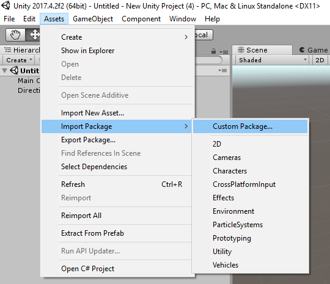

5. Do not unselect any items, so we can import all files. Click `Import`.   

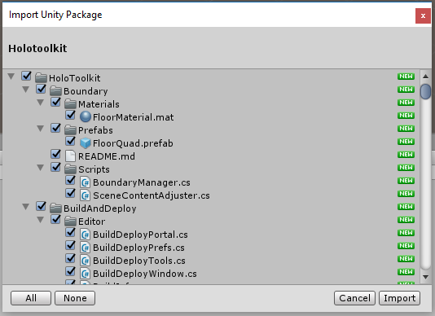

Importing might take a few minutes and go through several import phases.  
You will know that your package imported correctly if when done there is a folder called 'Holotoolkit' under the Assets folder in the Project Window. 
 
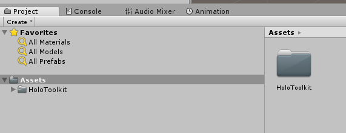

6. Repeat the same import steps above and import the SpatialSoundLab.UnityPackage file.
7. Ensure that your Assets folder now has both packages. 

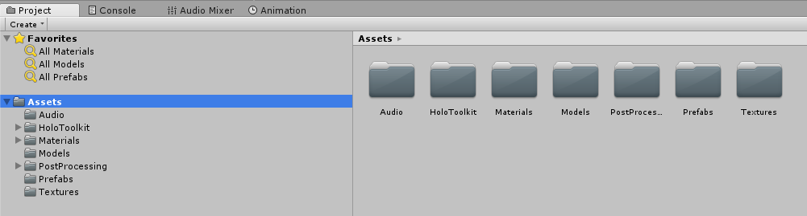

## 2. Applying project settings 

Next, we need to configure our Unity project to target Windows Mixed Reality app. The Mixed Reality Toolkit will be helpful for this task. 

1. In the top menu navigate to *Mixed Reality Toolkit->Configure* and select *Apply Mixed Reality Project Settings*. 

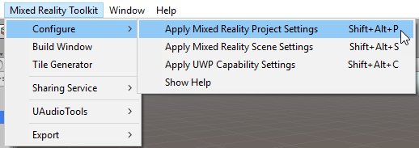

2. Check the box labeled *Use Toolkit-specific InputManager Axes* (if it has not been checked already) and hit `Apply`.

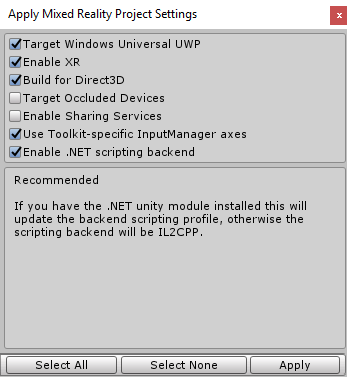

Just for reference, here is what each option is doing:

- *Target Windows Universal UWP* is telling Unity what our target will be. You can see the different many different options for target platform from *File->Build Settings* menu item.  
- *Build for Direct3D* is setting of the *Build Type* (in Build Settings) to *D3D*. For Mixed Reality apps that target occluded headsets, XAML is not supported. 
- Checking the *Enable XR* option is equivalent checking the *Virtual Reality Supported* option in *Player Settings->XR Settings*. 
- *Enable .NET scripting* is the equivalent of selecting *Player Settings->Other Settings->Scripting Backend* to *.NET*. 
IL2CPP would have worked too, but for consistency across the lab, we recommend .NET.  
- *Use Toolkit-specific InputManager axis* modifies the *Edit->Project Settings->Input Manager* axis to support all Axis that the toolkit uses.  In short, it adds support for Xbox controller and Mixed Reality Controllers. 
- If you are only building for immersive headsets, you can check *Target Occluded Devices*. As we may port this to HoloLens, let's leave it unchecked. 

That takes care of adding Mixed Reality support, but there are a few more settings needed that are specific to the Universal Windows Platform. 

3. In the top menu navigate to *Mixed Reality Toolkit->Configure* and select *Apply UWP Capability Settings*.

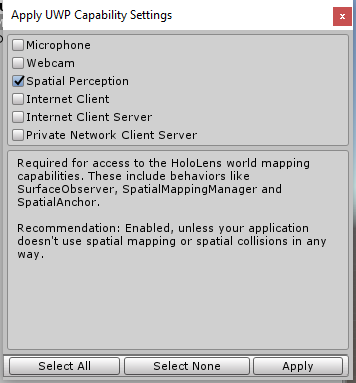

4. Check the *Spatial Perception* box if you intend to port this app to HoloLens. This will allow us to map the environment and find surfaces to place the speakers on.  
5. Click `Apply` to save this choice. 
6. Next, navigate to your *File->Build Settings* dialog using 'ctrl + shift + B', select *Universal Windows Platform*, and then click *Switch Platform*. Add your open scene to the build by checking the box next to your scene's name and clicking *Add Open Scenes*. If you are prompted to save your scene, go ahead and save it with any name you want. We called our scene `Main`. 

## 3. Applying scene settings and adding Mixed Reality objects 
Next, we need to configure our Scene. Let's add the objects that will handle camera movement and controller input. 

1. In the top menu navigate to *Mixed Reality Toolkit->Configure* and select *Apply Mixed Reality Scene Settings*

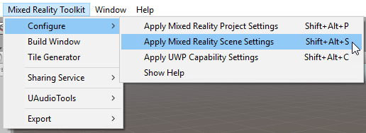

2. Leave all the default settings checked and click `Apply`. 

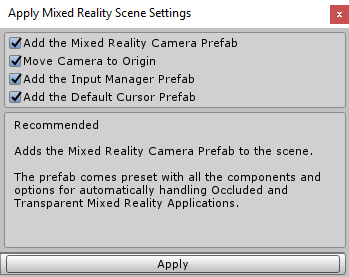

Just for reference, here is what all these options do: 
- A *MixedRealityCameraParent* prefab is added to the scene. This prefab adds a default (main) camera at the origin (0,0,0) and it also adds support for motion controllers and boundary. 
- An *InputManager* prefab is added to the scene. This prefab adds support for input (via gaze, touch, gestures, and Xbox controller) to our scene. 
- A *DefaultCursor* has been added to the scene.   

You should be able to see all the objects that were added in the *Hierarchy* panel in Unity. 

With that, the project and scene are now configured and primed for making a UWP MR application. 

Go ahead and save your scene and project. We recommend you do that at the end of each step in our lab.  

3. Click *File->Save Scenes*. If prompted for a name for your scene, call it `Main` (or whatever you please).
4. Click *File->Save Project*.  

Note: For a more detailed overview of all the setting we applied, see [this guide](https://docs.microsoft.com/en-us/windows/mixed-reality/unity-development-overview#configuring-a-new-unity-project-for-windows-mixed-reality) to configuring Mixed Reality projects. 

## 4. Deploying to headsets
You do not have to do this now, but when or if you choose to build the project, use the following guides to get it running.

### To deploy the project to an immersive headset.
1. Navigate to the *Mixed Reality Toolkit->Build Window*.   
2. Click `Open in Visual Studio`. This step will take a few minutes, as it is compiling all the assets and creating or updating a visual studio solution. 

> Note: If Unity says there is no "open project solution" and asks if you still want to build, select *Yes, Build*  

3. After your build (in Unity) completes, it should launch Visual Studio.  
4. In Visual Studio's standard toolbar, change the active solution platform from *ARM* to *x64* and ensure that *Local Machine* is selected as deployment target.

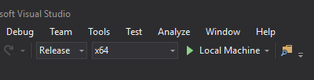

If you are not debugging, we also recommend you also change from *Debug* to *Release* because Unity debug builds often run a little slow.  

5. Run the app by hitting play.

### To deploy the project to a HoloLens.
For deploying to HoloLens, the steps are very similar to immersive headset steps above, we just choose a different target device and the platform is x86. 

1. Navigate to the *Mixed Reality Toolkit->Build Window*. 
2. Click `Open in Visual Studio`. This step will take a few minutes, as it is compiling all the assets and creating or updating a visual studio solution. 

> Note: If Unity says there is no "open project solution" and asks if you still want to build, select *Yes, Build*  

3. After your build (in Unity) completes, it should launch Visual Studio.  
4. In Visual Studio's standard toolbar, change the active solution platform from *ARM* to *x86* and choose the right target pending how you are deploying:    
   - If you are deploying using USB, select *Device*. 
   - If you are deploying over Wi-Fi, use *Remote machine* and configure the remote machine settings.  

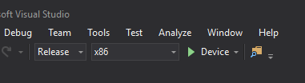

If you are not debugging, we also recommend you also change from Debug to Release because Unity debug builds often run a little slow.

5. Run the app by hitting play.

See the [Windows Developer site](https://docs.microsoft.com/en-us/windows/uwp/publish/) for details on publishing to the Microsoft Store.
