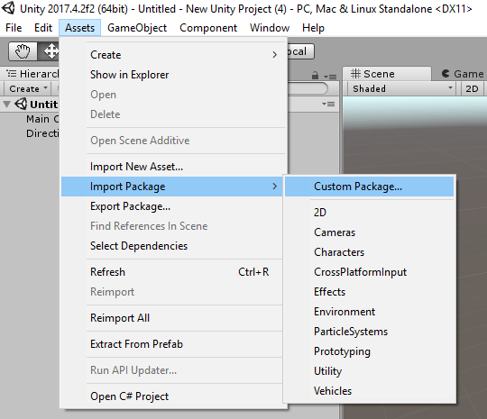
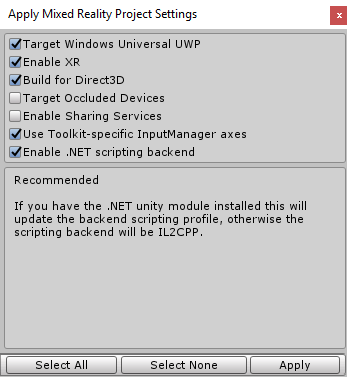
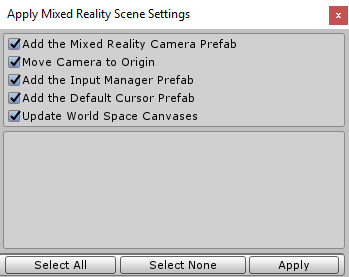
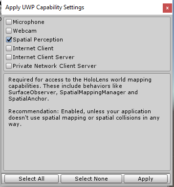

## 2. Exporting a Win MR UWP app from Unity

Let's start by creating a new Unity project. Open the Unity Editor and click 'New'. Name the project whatever you want, make sure the template is set to 3D, and click 'Create project'. For this lab, there are some necessary assets we need to import. These should be included in the lab files.

* [Holotoolkit.Unitypackage](https://github.com/Microsoft/InsiderDevTour18-Labs/blob/master/MR/Holotoolkit.unitypackage)

    This is the [Microsoft Mixed Reality Toolkit](https://github.com/Microsoft/MixedRealityToolkit-Unity/), a collection of scripts and components intended to accelerate development of applications targeting Microsoft HoloLens and Windows Mixed Reality headsets.  
    
* [SpatialSoundLab.Unitypackage](https://github.com/Microsoft/InsiderDevTour18-Labs/blob/master/MR/SpatialSoundLab.unitypackage)
    
    The second contains the assets (models, materials and audio clips) we will be using to create this spatial sound experience.

To import these, click on Assets -> Import Package -> Custom Package and navigate to the files above. It may take Unity a few minutes to import everything.

To start building Mixed Reality applications, there are some settings we need to change in Unity. The Mixed Reality Toolkit makes this super simple. Select the "Apply Mixed Reality Project Settings" option in the Unity Editor:

`Mixed Reality Toolkit -> Configure -> Apply Mixed Reality Project Settings`

If we were only building for immersive headsets, we would check Target Occluded Devices. As we may port this to HoloLens we can use the default settings. 

Next, we need to include a few scene objects that will handle camera movement and controller input. Select the "Apply Mixed Reality Scene Settings" option in the Unity Editor:

`Mixed Reality Toolkit -> Configure -> Apply Mixed Reality Scene Settings`

Use the default setting.

We still need to make a few more changes to ensure that we can build this project out to Visual Studios as a UWP app. Select the "Apply UWP Capability Settings" option in the Unity Editor.

`Mixed Reality Toolkit -> Configure -> Apply UWP Capability Settings`

Make sure to check Spatial Perception if you intend to port this app to HoloLens. This will allow us to map the environment and find surfaces to place the speakers on.

Next, navigate to your Build Settings using `ctrl + shift + B`, select Universal Windows Platform, and then click Switch Platform. Add your open scene to the build by checking the box next to your scene's name and clicking "Add Open Scenes".

That's it! The project and scene is now configured and primed for making a UWP MR application. For a more detailed overview of these setting changes, see [this guide](https://docs.microsoft.com/en-us/windows/mixed-reality/unity-development-overview#configuring-a-new-unity-project-for-windows-mixed-reality) to configuring Mixed Reality projects. When or if you choose to build the project, use the following guides to get it running.

### To deploy the project to an immersive headset.
1. Navigate to the Build Window: Mixed Reality Toolkit -> Build Window.
2. Click on Open in Visual Studio.	
	
	>**Note:** If Unity says there is no "open project solution" and asks if you still want to build, select "Yes, Build"
	
3. Navigate to Build -> Configuration Manager in Visual Studios or use the drop-down at the top of the page and select x64 in your platform options.
4. In the debug toolbar, select "Local Machine" as the target (or remote device if you are pushing to another machine).
5. Run the app by hitting play.

See the [Windows Developer site](https://docs.microsoft.com/en-us/windows/uwp/publish/) for publishing to the Microsoft Store.

### To deploy the project to a HoloLens.
1. Navigate to the Build Window: Mixed Reality Toolkit -> Build Window.
2. Press Open in Visual Studio.
	
	>**Note:** If Unity says there is no "open project solution" and asks if you still want to build, select "Yes, Build"
3. Navigate to Build -> Configuration Manager in Visual Studios or use the drop-down at the top of the page and select x86 in your platform options.
4. In the debug toolbar, select the emulator or the device that you're using.
5. Run the app using the debug toolbar.