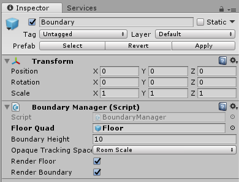
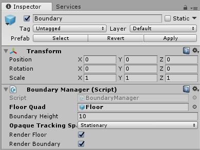

## 4. Environment Setup (VR)

First we need a virtual living room.

- In the project window find RoomPrefab.prefab in the Assets -> Prefabs folder and drag it into the hierarchy window.

You can customize this as much as you are comfortable with. Before we can jump in and move around the room, we need to define the Floor Quad (the boundary of movement) and the [experience scale](https://docs.microsoft.com/en-us/windows/mixed-reality/coordinate-systems) of our app.

1. In the hierarchy window, expand the RoomPrefab so we can see all its children.
2. In the hierarchy window, expand MixedRealityCameraParent and click on Boundary.
3. From the hierarchy, drag the RoomPrefab -> Floor object into the Floor Quad property of the Boundary Manager.
	
	>**Note:** Alternatively, you can define properties using the target button to the right of the property. Be careful to select whether you want the instance (Scene object) or the prefab (Assets object).
4. Click File -> Save Scene as SpatialSoundLab or whatever pleases you most.

Next, we need to choice an experience scale. If you have room to move around, you can leave the Opaque Tracking Space of the Boundary object as Room Scale. If you don't, then:

- Change this to Stationary.
- Select the MixedRealityCameraParent in the hierarchy and change the Transform -> Position -> Y to 0.8. This will move the camera to a natural eye level.

Thanks to the 'Apply Mixed Reality Scene Settings' step, all the movement and camera operations are handled for us and configured with the [Windows MR default controls](https://docs.microsoft.com/en-us/windows/mixed-reality/navigating-the-windows-mixed-reality-home#immersive-headset-input-support). If you click run (play) in the Unity Editor, you will be able to move around using the standard MR controls.