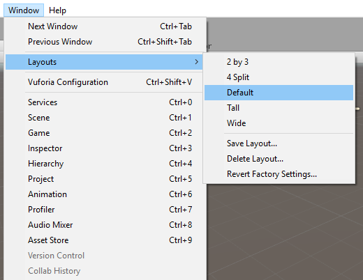
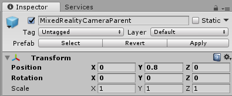

<!-- ## 4. Environment Setup (VR) --> 

To run the speaker placement app in a virtual reality (aka occluded or immersive) headset, we need to create the virtual room and configure the environment so we can teleport around it.  

## 1. Switching to default layout [optional]
If you are new to Unity, we recommend that you use Unity's default window layout for the following steps. 
The descriptions we are providing are based on that point of reference.

To switch to default layout, select *Window->Layouts->Default* in Unity.
 
This shall give you a layout similar to the one below. Please note the different names of the panels (which we will call panels) in Unity, as we will reference these by name on our instructions. 
 
 

## 2. Creating a virtual room
Let's start by adding the room that we have prepared ahead of time to our scene.

1. In Unity's *Project* panel, find the `RoomPrefab.prefab` in the *Assets->Prefabs* folder and drag it into the *Hierarchy* panel. Ensure that you are dragging it into an empty part of the hierarchy, so the room does not get added as a child to any other object.  

Since adding it to the hierarchy adds it to the scene, you should now see the room in the *Scene* panel.   
Feel free to 'explore' the room using the key & mouse combinations below, just make sure that you are not moving the objects around. If you accidentally move or reposition the objects in the scene, just delete the `RoomPrefab` from the hierarchy and add it again. 

- To orbit around the scene, press *Alt* and then drag your mouse around in the direction you want to orbit. 
- To move around the scene, use the arrow keys (Left, Right, Up, Down). 
- To move towards an object and center the scene towards it, select the object then press *Shift+F*. 

For more options and techniques for navigating the scene, checkout Unity's <a href="https://docs.unity3d.com/Manual/SceneViewNavigation.html" target="_blank">Scene navigation</a> documentation. 

## 3. Configuring our space type 

The *MixedRealityCameraParent* game object that we added in the prior section has a *Boundary* object that we need to configure to be able to navigate within our virtual room. Let's first set the floor.
 
1. In the *Hierarchy* panel, expand the *RoomPrefab* so we can see all its children.
2. In the *Hierarchy* panel, expand *MixedRealityCameraParent* and select (or click on) the *Boundary* object. This should select it in the *Hierarchy* panel and show the properties for the *Boundary* in the *Inspector* panel.
3. With the *Boundary* object still selected (being careful not to click on anything else in the hierarchy window), scroll down the hierarchy window, find the `Floor` object and drag it into the *Floor Quad* property of the *Boundary Manager* in the *Inspector* panel.

<!--  -->

> Note: If you don't want to drag and drop (e.g. don't have a mouse to select with precision) you can set the properties using the target button to the right of the 'Floor Quad' property in the inspector, just make sure when selecting the target to choose the objects that are in the Scene tab, not in the Assets tab.  

Since we are going for a "standing-scale" configuration, let's change the space type to stationary.   

4. With *Boundary* still selected make sure the *Opaque Tracking Space Type* is set to `Stationary`.
	

<a href="https://docs.microsoft.com/windows/mixed-reality/coordinate-systems" target="_blank">To learn more about the different configurations in Mixed Reality Experiences, check [this documentation</a>. 
	
5. One more tweak - select the *MixedRealityCameraParent* in the *Hierarchy* panel and change the *Transform->Position->Y* to 0.8. This will move the camera to a natural eye level.

	

## 4. Exploring the virtual room. 
We are now ready to transport ourselves into our virtual room.  

If you have a headset, here is a few tips on what to look for when you explore the scene: 
- The headset should be tracking your head movement and you will see different parts of the room, as you move your head; it should track your head as if you were in the room. 
- Walk around the room (take a step sideways) and notice how the headset tracks your position. 

If you are using the simulator, follow the instructions from <a href="https://docs.microsoft.com/windows/mixed-reality/using-the-windows-mixed-reality-simulator" target="_blank">these documents</a> on how to setup the simulator and how to control it using keyboard, mouse or Xbox controller.  

Don't wait any longer, Click the play icon in the Unity Editor, put on your headset, and explore the virtual room. 

<!-- 

 ## 5. Recap on our room and camera setup. 

If you are wondering how is it that we wrote no code and there is so much functionality in the scene, it goes back to the 'Apply Mixed Reality Scene Settings' step we did earlier. That setup our camera (MixedRealityCameraParent->MainCamera)  and the platform tracks the     

Thanks to the 'Apply Mixed Reality Scene Settings' step, all the movement and camera operations are handled for us and configured with the <a href="https://docs.microsoft.com/windows/mixed-reality/navigating-the-windows-mixed-reality-home#immersive-headset-input-support" target="_blank">Windows MR default controls</a>. 

Click run (the play icon) in the Unity Editor and put on your headset so you can explore the virtual room. 

Note: if you
you will be able to move around using the standard MR controls or the controls chosen during setup if you are using the MR simulator. 

--> 
