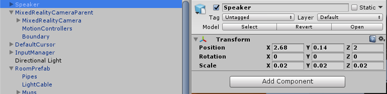
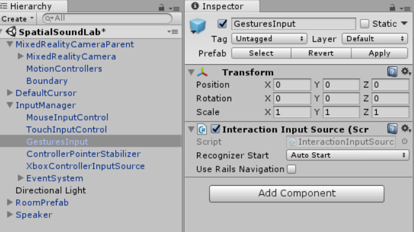
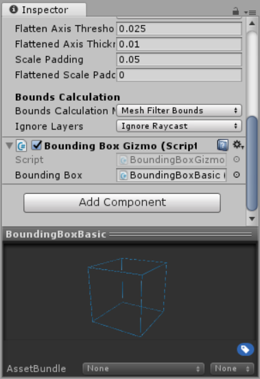
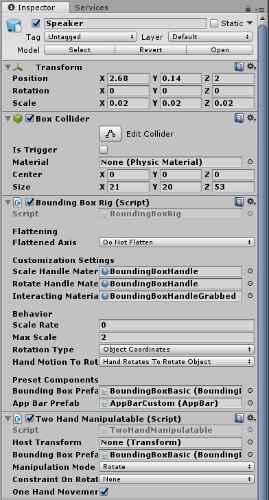

<!-- ## 5. Controls --> 

In this step, we will be creating a speaker prefab and adding it to the virtual living room. We will then add Motion Controller support to our scene so the user can move and rotate the speaker. 

## 1. Adding the speaker to our room
1. Navigate to the *Models* folder in the *Project* panel and drag the `Speaker3` model into the *Hierarchy* panel, making sure it is a root object and not a child to any objects in the scene.   
2. Rename the speaker by right clicking and selecting *Rename*. Please rename it to `Speaker`.
3. Select the *Speaker* in the scene and then in the *Inspector* panel change the following transform properties:    
   - Set Scale to (0.02, 0.02, 0.02)    
   - Set Position (2.68, 0.14, 2) 

   

## 2. Adding Controller support
In an earlier step, when we applied the Mixed Reality Settings to the scene, we added motion controller support to our scene.  
Let's recap how those checkboxes translate into motion controllers just working in our scene: 

- The *MixedRealityCameraParent* element we added has a child object called *MotionControllers*, and this has a script called *MotionControllerVisualizer*.  This script will track and render our controller model (position, rotation, as well as input events). 

- The *InputManager* object that was added is listening for input events across many input sources. Look at it's children and you will see it has objects for Mouse, Touch, Xbox, and GesturesInput; the *GestureInput* object has an *InteractionInputSource* that is listening to motion controller events from *InteractionManager*. These are the motion controller events that will be used to manipulate our speaker.  

   

## 3. Manipulating the speaker
For the user to be able to move and rotate the speaker, we need to add physics to the speaker so that our gaze can send raycasts that collide with the speaker. 

1. Select the *Speaker* in the *Hierarchy* panel so that we can tweak its properties and add behaviors in the *Inspector* panel.  
2. In the *Inspector* panel, click *Add Component* and then find and select `Box Collider`.  
3. On the *Box Collider* that you just added, change the *Size* property to (21, 20, 53) so it encompasses the speaker.

Next, we will add a Bounding Box behaviour from the Mixed Reality toolkit: 

1. In the *Project* panel, navigate to the *Holotoolkit->UX->Scripts->BoundingBoxes* folder, select the `BoundingBoxRig.cs` script, and drag it into the *Inspector* panel, so it is added to the *Speaker* components. 
2. As we don't need to scale the speakers, you can change the *Scale Rate* to 0.

 <!--  -->

The BoundingBoxRig component attaches a gizmo to the game object -in this case to our speaker-. This gizmo allows the user to rotate, delete, move and scale the object with either motion controllers or the HoloLens (tap and manipulation) gestures.

3. With the *Speaker* still selected, click *Add Component* and in the search window, type *Two Hand Manipulatable*, then click on the script that is highlighted from the search result.  
4. Change the *Manipulation Mode* of this component to *Rotate* to avoid scaling the speakers.

This script makes it possible to manipulate objects with two hands either using motion controllers or the tap and hold gesture with a HoloLens. 

5. In the *Project* panel find `BoundingBoxBasic` in the *Assets->HoloToolkit->UX->Prefabs->BoundingBoxes* folder and drag it into the *Bounding Box Prefab* property of the *Speaker*'s *Bounding Box Rig* script.
6. Repeat this action and drag `BoundingBoxBasic` into the *Bounding Box Prefab* property of the *Two Hand Manipulateable* component.

This BoundingBoxBasic prefab contains the visuals that are rendered during the manipulation, that is why we are adding it to each component. 

7. In the *Project* panel find the `AppBarCustom` prefab in the *Assets->Prefabs* folder, drag it into the *App Bar Prefab* property of the *Bounding Box Rig* component for the speaker. 

<!--  -->

That was a lot of changes, so let's confirm that your *Inspector* view for the *Speaker* game object looks like this right now:

## 4. Running the app and re-positioning speaker 

Save the scene and run it to test your additions. 

Here are the interactions you should try:       
- Selecting the speaker and moving it around (it should track your controller)    
- Clicking in the appbar for the speaker to get the anchors that allow you to rotate it.     
- Resizing/scaling it (if you did not disable this earlier).    
