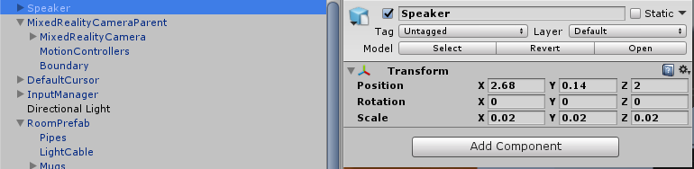

## 5. Controls

In this step, we will be creating a speaker prefab and adding it to the virtual living room and then use the Mixed Reality Toolkit to enable the user to move and rotate it. To add a speaker to our scene: 

1. Navigate to the Models folder in the project window.
2. Drag the Speaker3 model into the hierarchy window and rename it to "Speaker".
3. Select the speaker in the scene (if it is not already selected) and change the Transform -> Scale to (0.02, 0.02, 0.02).
4. Change the Transform -> Position (2.68, 0.14, 2) to place the speaker precariously on the edge of the coffee table. If you don't want to place it here, make sure you at least move the speaker inside the room using the Unity Transform Tools in the scene view or inspector window.
5. Save our scene (ctrl-s).

	

To allow the user to move and rotate the speaker.

1. Navigate to Add Component -> Physics -> Box Collider (or use the search bar to find your component). This box defines the area that can be hit by a raycast.
2. Change the Size property of the Box Collider to (21, 20, 53) so it encompasses the speaker.
3. Click Add Component -> Bounding Box Rig. This MRToolkit script generates a gizmo around the object that allows the user to rotate, delete, move and scale an object with either motion controllers or the HoloLens tap interaction.
4. As we don't need to scale the speakers, you can change the Scale Rate to 0 if you'd like.
5. With the speaker still selected, click Add Component -> Two Hand Manipulatable. This is another MRToolkit script that makes it easy to manipulate objects with two hands either using motion controllers or the tap and hold gesture with a HoloLens.
6. You can change the Manipulation Mode of this component to rotate if you want to avoid scaling the speakers.
7. In the project window find BoundingBoxBasic in Assets -> HoloToolkit -> UX -> Prefabs -> BoundingBoxes and drag it into the Bounding Box Prefab property of the Speaker's Bounding Box Rig script.
8. Do this again dragging, BoundingBoxBasic into the Bounding Box Prefab property of the Two Hand Manipulateable component.
9. In the project window find AppBarCustom in Assets/Prefabs. Now this is exactly the same as the MRtoolkit AppBar, but seeing as we won’t be removing the speakers, you can uncheck the Use Remove and Use Hide properties (if they aren't already deselected). Then drag it into the App Bar Prefab Property of the Bounding Box Rig in the hierarchy.
10. Save the scene, and run it to test your additions.

	

That's it for moving the speaker. You can now move the speaker in the editor and change its position in the room during run time.