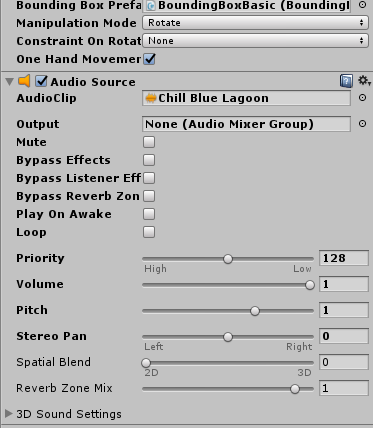
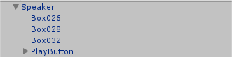
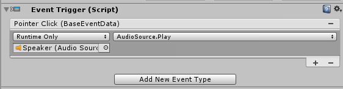
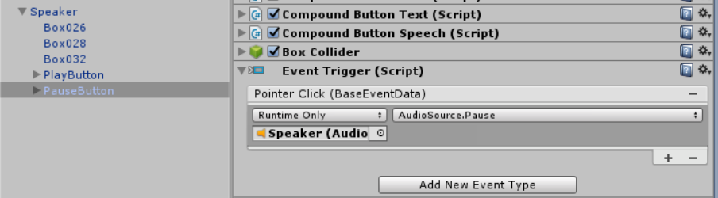
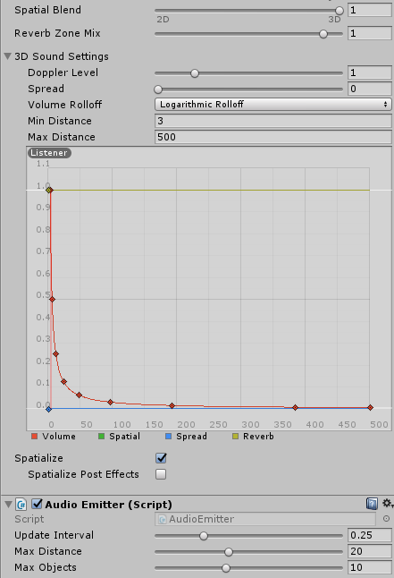

<!-- ## 6. Spatial Sound --> 

Now that we have our speaker, we need to play (and pause) spatial sound.
In this section, we will add the playback controls, and our audio source. 

Since some of the tasks we will accomplish here are similar to earlier tasks, we will take a mostly list-based approach to the instructions, so you can go a little faster.  

Please verify your work with the screen shots we include at the end of each major step, and for extra references, just follow the links within the instructions.   
 

## 1. Adding an audio source 

To be able to play sound from the speaker, we need to add a Unity [AudioSource](https://docs.unity3d.com/ScriptReference/AudioSource.html) component to it.   

1. Select the *Speaker* in our scene and click *Add Component->Audio->Audio Source*.
1. Click on the small target icon on the right side of the *Audio Clip* property in the *Audio Source* component and select `Chill Blue Lagoon`.
1. Uncheck *Play On Awake*, as we will be controlling the playback using buttons. We'll change the settings to accommodate spatial sound later.
 
	

## 2. Adding playback controls to the speaker
To add the play button to the speaker:

1. In the *Project* panel, find the `CircleButton` prefab in *Assets->HoloToolkit->UX->Prefabs->Buttons*, and drag it into the *Hierarchy* panel for the scene as a child of the *Speaker*.
2. Rename the added button to `PlayButton`.  
	

3. Change the *PlayButton* Transform Scale property to (90, 90, 90) to make it larger.
4. With *PlayButton* selected, click *Add Component->Event->Event Trigger*.
5. Click *Add New Event Type->Pointer Click*.
6. Click the '+' button at the bottom of the empty event list.
7. Drag the *Speaker* from the *Hierarchy* into the event drop box that says *None (Object)*
8. Click the *No Function* drop-down and select *AudioSource->Play()*.

	

To add the pause button to the speaker: 

1. Duplicate the *PlayButton* (using 'Ctrl+D' or right-clicking the asset in the *Hierarchy* and selecting *Duplicate*) and rename it to `PauseButton`.   
2. Change the *Event Trigger* function for the *PauseButton* to *AudioSource->Pause()*.

	

These buttons should work now, but they will be hard to use when positioned on top of each other. 
The other issue is that they will not be facing the user unless the speaker is as well. To resolve this:

1. Change the *PlayButton* Transform Position to (-6, 18, 0).
2. Change the *PauseButton* Transform Position to (6, 18, 0).
3. In the *Hierarchy* panel, right click on the *Speaker* and click *Create Empty* to make an empty child object. Rename the added *GameObject* to `ButtonBillboard`. To rename the object you can right click on it and select *Rename*. 
4. Drag both buttons into the *ButtonBillboard* as children objects.
5. With the *ButtonBillboard* selected in the *Inspector* panel, click *Add Component->Billboard*. You can find the *Billboard* component via the search bar. This *Billboard* script from the mixed reality toolkit that makes the object always turn to face the camera, and is particularly useful for UI elements.
6. Ensure you have the following structure for the billboard. 

	

To make it easier to differentiate between play and pause, it would be nice to have some icons other than the default ones. There are a few ways to do this, but we'll go with a simple one given the size of our project.

1. With the *PlayButton* selected, scroll down in the *Inspector* to the *Compound Button Icon* component.
2. Check *Override Icon*.
3. Drag the `Start` sprite from the *Assets->Textures* folder into the *Icon Override* property of the *Compound Button Icon* component. 
4. Do the same steps for the *PauseButton* with the `Pause` sprite.

	

## 3. Adding spatial sound 
Now we have a speaker that we can move around the virtual living room and turn on and off. However, there is no spatial sound to boost presence within the experience. 

Spatial Sound, in Unity, is enabled using an audio spatializer plugin. The plugin files are bundled directly into Unity so enabling spatial sound is easy.

1. Go to *Edit->Project Settings->Audio*
2. Change the *Spatializer Plugin* from *None* to *MS HRTF Spatializer*. 

Since the Microsoft spatializer currently only supports 48000Hz, you should also set your *System Sample Rate* to 48000 (if it is not already) to prevent an HRTF failure.

Now we need to configure the audio clip itself.

1. In the *Hierarchy* panel, select the *Speaker*.
2. In the *Inspector* panel, scroll down to  the *Audio Source* component and check the *Spatialize* option.
3. Set *Spatial Blend* to 3D (numeric value 1).
4. Expand the *3D Sound Settings* menu.
5. For this experience a good 3D sound setting is to use a *Logarithmic Rolloff* for the *Volume Rolloff* and change the *Min Distance* to 3.
6. With *Speaker* selected, click *Add Component->Audio Emitter*. This is a MRTK class that uses an attached AudioSource and a subset of the Unity Audio Filters to support applying and managing audio influences, for example occlusion.

## 4. Save and run 

Our speaker is now complete. Let's now make our speaker into a prefab. 

1. Drag the *Speaker* into the *Assets->Prefabs* folder to turn it into a prefab.  

By making the speaker a prefab, we now have it as a reusable entity; we can make as many speaker instances as we want for our scene or even for other scenes in this project. 

Let's now Save our scene (Ctrl+S) and run it to review our progress.  

Here are some of the fun things to try:   
- Play and Pause the sound.    
- Drag the speaker close to you and notice if the sound gets louder/clearer.     
- Drag the speaker as far away from you and see if the sound volume changes.   
  Don't forget you can teleport yourself within the room (by pressing the jumpstick button forward and pointing at spot in the floor that you want to teleport towards. This can help you get further away from the speaker.   
	
