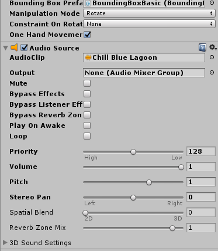
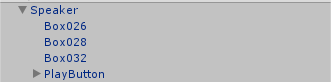
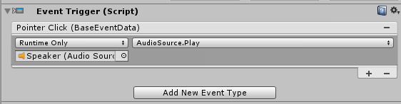
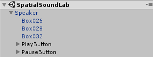
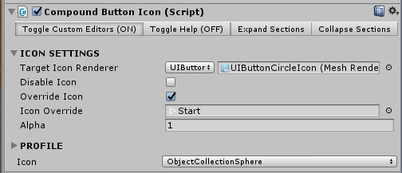
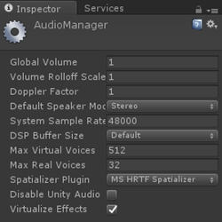
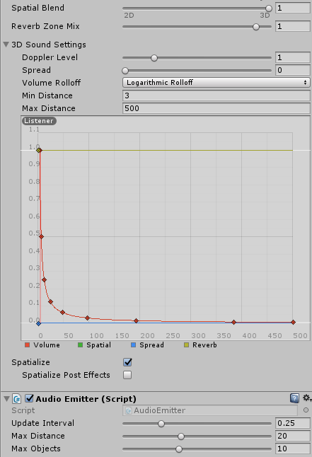

## 6. Spatial Sound

 To add a sound to the speakers:

- Click on the speaker in our scene and click Add Component -> Audio -> Audio Source.
- Click on the target to the side of the Audio Clip property and select 'Chill Blue Lagoon'.
- Uncheck Play On Awake, as we will be controlling the playback using buttons. We'll change the settings to accommodate spatial sound later.

	

To add the play button to the speaker:

1. In the project window, find the CircleButton prefab in Assets -> HoloToolkit -> UX -> Prefabs -> Buttons, and drag it into the Hierarchy as a child of the Speaker.
2. Rename this to PlayButton.

	

3. Change the PlayButton Transform Scale property to (90, 90, 90) to make it larger.
4. With PlayButton selected, click Add Component -> Event -> Event Trigger.
5. Click Add New Event Type -> Pointer Click.
6. Click the '+' button at the bottom of the empty event list.
7. Drag the Speaker from the Hierarchy into the event drop box or click the target beside the drop box and find the Speaker in the scene tab.
8. For this event, click the 'No Function' Dropdown and click AudioSource -> Play().

	

To add the pause button to the speaker:
- Duplicate the PlayButton (using ctrl + D or right-clicking the asset in the hierarchy and selecting Duplicate) and rename it to PauseButton.
- Change the Event Trigger function for the PauseButton to AudioSource -> Pause().

	

These buttons should work now, but they will be hard to use when positioned within one another. The other issue is that they will not be facing the user unless the speaker is as well. To resolve this:

1. Change the PlayButton Transform Position to (-6, 18, 0).
2. Change the PauseButton Transform Position to (6, 18, 0).
3. In the Hierarchy window, right click on the Speaker and click Create Empty to make an empty child object. Rename this to ButtonBillboard.
4. Drag both buttons into the ButtonBillboard as children objects.
5. With the ButtonBillboard selected in the Inspector window, click Add Component -> Billboard. This is a MRToolkit script that makes the object always turn to face the camera, and is particularly useful for UI elements.
6. Save the scene.

	

To make it easier to differentiate between play and pause, it would be nice to have some icons other than the default ones. There are a few ways to do this, but we'll go with a simple one given the size of our project.

1. With the PlayButton selected, scroll down in the inspector to the Compound Button Icon component.
2. Check Override Icon.
3. Drag the Start sprite from the Assets -> Textures folder into the Icon Override property.
4. Do the same steps for the PauseButton with the Pause sprite.

	

Now we have a speaker that we can move around the virtual living room and turn on and off. However, there is no spatial sound which breaks the presence of the experience. 

Spatial Sound, in Unity, is enabled using an audio spatializer plugin. The plugin files are bundled directly into Unity so enabling spatial sound is as easy as going to Edit -> Project Settings -> Audio and changing the Spatializer Plugin in the Inspector to the MS HRTF Spatializer. 

Since the Microsoft spatializer currently only supports 48000Hz, you should also set your System Sample Rate to 48000 (if it is not already) to prevent an HRTF failure:

Now we need to configure the audio clip itself:

1. In the Hierarchy panel, select the Speaker.
2. In the Inspector panel, under the Audio Source component, check the Spatialize option.
3. Set Spatial Blend to 3D (numeric value 1).
4. Expand the 3D Sound Settings menu.
5. For this experience a good 3D sound setting is to use a Logrithmic Rolloff for the Volume Rolloff and change the Min Distance to 3.
6. Click Add Component -> Audio Emitter. This is a MRToolkit class that uses an attached AudioSource and a subset of the Unity Audio Filters to support applying and managing audio influences, for example occlusion.
7. Now drag the Speaker into the Assets -> Prefabs folder to turn it into a prefab.
8. Save the scene.

	

We can now use this prefab to make as many speaker instances in our scene (or a completely different scene) as we want. You can move them in the editor or use the MRToolkit controls during run time to experience the spatial sound!