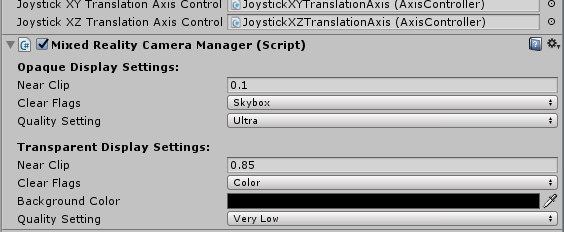
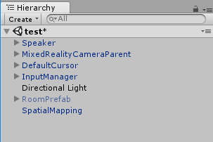
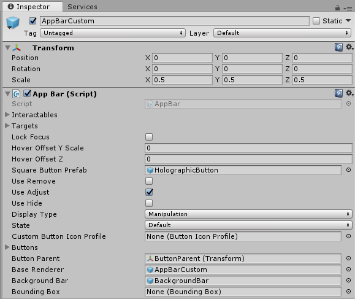

<!-- ## 7. HoloLens (optional) --> 

So far, our experience only works with an immersive headset. However, with just a few changes, we can extend it to cover the whole Mixed Reality continuum (using HoloLens).  

Since we used the Mixed Reality Toolkit for the camera, interactions and buttons, all we need to do is turn off the environment so it doesn't obstruct the HoloLens user's view of their real environment. 


## 1. Hiding the virtual room.
We need to write a script that detects whether the app is being run with an immersive headset or a HoloLens, and then hide the virtual living room if required.

First, we'll add a Tag to the RoomPrefab so we can access it inside our script. 


1. Select the RoomPrefab in the hierachy window.
2. Click on the Tag dropdown in the inspector window and select 'Add Tag'...

	

3. Press the '+' icon to create a new Tag and call it HMDUOnly.

	

4.  Now click on the RoomPrefab in the Hierarchy again and select HMDUOnly from the dropdown.

There are many ways to select [gameobjects inside of a script](https://docs.unity3d.com/Manual/ControllingGameObjectsComponents.html). Using a tag is a very flexible technique; we can easily add it to any object we want to hide (if we have more than one) and then iterate through and hide them all using FindGameObjectsWithTag(); this approach is not the most performant way, but it will be fine for our lab. 


Since we are going to be targeting different headsets, we will add a game manager object to do the proper checks and prepare our environment accordingly. 

1. In Unity's top menu, click 'GameObject->Create Empty'.   
2. In the Hierarchy, rename this added 'GameObject' to 'GameManager'.
3. In the inspector, click 'Add Component->New Script' and name it GameManager with C sharp as the selected language. Click 'Create and Add' to create it. 
4. Double click the GameManager script in the Inspector or Assets window to open it.
5. We only need to run this test once when the app starts. We will do this inside the Start() function. So we can delete the Update() function.
- Replace the code in the GameManager script with this:

```csharp
using System.Collections;
using System.Collections.Generic;
using UnityEngine;

// We need the UnityEngine.XR.WSA namespace to access Holographic Settings which contain 
// functions which effect the performance and presentation of Holograms on Windows 
// Holographic platforms.
using UnityEngine.XR.WSA;

public class GameManager : MonoBehaviour {
	
	void Start () {
   		// Check if the MR headset display is transparent (not opaque).
    	if(!HolographicSettings.IsDisplayOpaque){ 
        	// If that is the case, then we need to hide the virtual living room
        	GameObject[] HMDUOnlyObjects = GameObject.FindGameObjectsWithTag("HMDUOnly");
        	for (int i = 0; i < HMDUOnlyObjects.Length; i++){
           		// Set active to false disables the object.
            	HMDUOnlyObjects[i].SetActive(false); 
        	}
    	}
	}
}
```

Lastly, to ensure that the experience runs fine on the HoloLens, we need to check that the camera background is set to black. 

In the Hierarchy window, click on the MixedRealityCameraParent->MixedRealityCamera object to display it in the inspector. Check that the Mixed Reality Camera Manager->Transparent Display Settings->Background Color is set to black (#000000).  In Hololens, the black color is not rendered, and that is what lets the real world cone through in the see-through display. 




## 2. Adding Spatial Mapping 

We're almost done! Now we want to enable [Spatial Mapping](https://docs.microsoft.com/en-us/windows/mixed-reality/spatial-mapping). Spatial mapping provides a detailed representation of real-world surfaces in the HoloLens environment, allowing developers to create a convincing mixed reality experience. In this case, it allows users to place the speakers naturally without them being obscured inside real-world surfaces.

Now to add spatial mapping:

- Find the SpatialMapping prefab in the project window: 'Assets->HoloTookit->SpatialMapping->Prefabs'.
- Drag it into the scene hierachy.

	


## 3. Hololens Gestures 

Our interactions up until now were for motion controllers. We can reuse our BoundingBox approach with HoloLens, but we want to optimize the interactions with a few tweaks:  


As we don't want the Bounding Box Gizmo to rotate and move controls being obscured :

- Find the AppBarCustom prefab in the 'Assets->Prefabs' folder in the project window.
- Make sure the Hover Offset Y Scale property is set to 0.

	


Lastly, we will need to use a different method for moving the speaker and switch to it programatically if the app is being run on a HoloLens (or emulator). 

- Select the Speaker prefab in the Project window.
- Click 'Add Component->Tap To Place'. This is a MRTK script that allows us to easily tap on objects/holograms and move them around. This will also add an Interpolator script to the Speaker.
- Disable the 'Tap To Place' script (by unchecking it in the inspector in its header) so it won't start by default. 

	

- Add a script to the Speaker called SpeakerMovement by clicking 'Add Component->New Script' and calling it 'SpeakerMovement'.

- Replace the code in the script with this:
	
```csharp
using System.Collections;
using System.Collections.Generic;
using UnityEngine;
using UnityEngine.XR.WSA;
// namespace for the TwoHandManipulatable script
using HoloToolkit.Unity.InputModule.Utilities.Interactions;
// namespace for the TapToPlace script
using HoloToolkit.Unity.SpatialMapping;

public class SpeakerMovement : MonoBehaviour {

	void Start () {
		if(!HolographicSettings.IsDisplayOpaque){ 
			GetComponent<TwoHandManipulatable>().enabled = false;
			GetComponent<TapToPlace>().enabled = true;
		}
	}
}
```

This code does a similar check to our earlier game manager check, testing if we are running in a HoloLens device; if we are, it disables manipulation and enable the TapToPlace gesture listener.

Because we made the changes above on the Speaker prefab, all of the speakers in the scene should be updated with the change. If you happened to change one of the Speaker instances, then, in the top right of the Inspector window, click Apply to update the prefab.


That's it! You can now run and build the app on either an immersive headset or a HoloLens and place, rotate, and control speakers around the room.