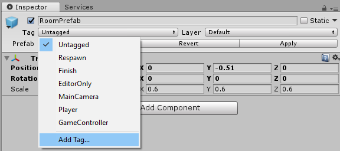
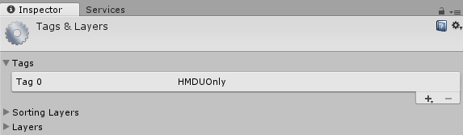
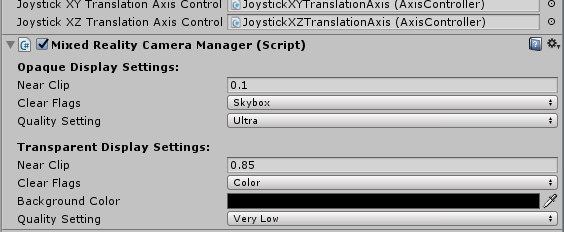
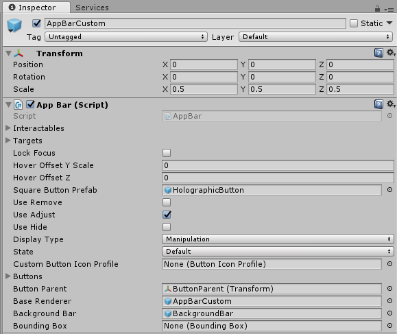
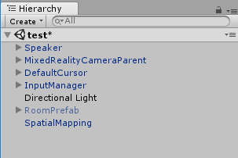
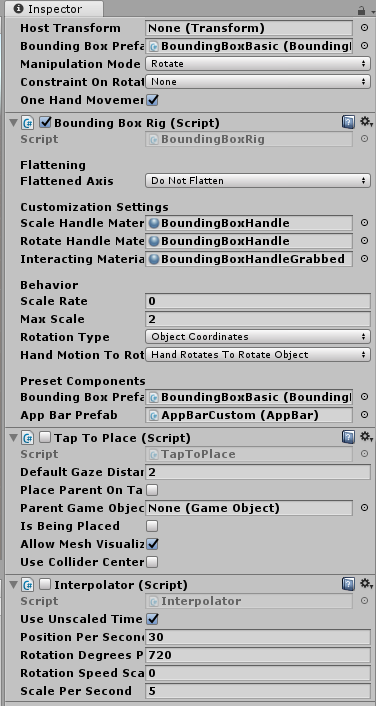

## 7. HoloLens (optional)

Although this only works properly on a HMDU, there is little we need to change in order to make this a full MR experience. Because we used the MRToolkit for the camera, interactions and buttons, all we need to do is turn off the environment so it doesn't obstruct the HoloLens user's view of their real environment. We need to write a script that detects whether the app is being run with a HMDU or a HoloLens, and then hide the virtual living room if required.

First, we'll add a Tag to the RoomPrefab so we can access it inside our script. 

- Select the RoomPrefab in the hierachy.
- Click on the Tag dropdown in the inspector window and select Add Tag...

	

- Press the '+' icon to create a new Tag and call it HMDUOnly.

	

- Now click on the RoomPrefab in the Hierarchy again and select HMDUOnly from the dropdown.

There are a number of ways to select [gameobjects inside of a script](https://docs.unity3d.com/Manual/ControllingGameObjectsComponents.html). With this method, we can easily add the tag to any object we want to hide (if we have more than one) and then iterate through and hide them all. For this lab, however, we just need to hide the room.

- Using the menu click GameObject -> Create Empty and in the Hierarchy rename this to GameManager.
- Click Add Component -> New Script and name it GameManager with C sharp as the selected language.
- Double click the GameManager script in the Inspector or Assets window to open it.
- We only need to run this test once when the app starts. We will do this inside the Start() function. So we can delete the Update() function.
- Replace the code in the GameManager script with this:

			using System.Collections;
			using System.Collections.Generic;
			using UnityEngine;
			// We need the UnityEngine.XR.WSA namespace to access Holographic Settings which contain 
			// functions which effect the performance and presentation of Holograms on Windows 
			// Holographic platforms.
			using UnityEngine.XR.WSA;
	
			public class GameManager : MonoBehaviour {
		    	void Start () {
		       		// Check if the MR headset display is transparent (not opaque).
		        	if(!HolographicSettings.IsDisplayOpaque){ 
		            	// If that is the case, then we need to hide the virtual living room
		            	GameObject[] HMDUOnlyObjects = GameObject.FindGameObjectsWithTag("HMDUOnly");
		            	for (int i = 0; i < HMDUOnlyObjects.Length; i++){
		               		// Set active to false disables the object.
		                	HMDUOnlyObjects[i].SetActive(false); 
		            	}
		        	}
		    	}
			}

Lastly, to ensure that the experience runs fine on the HoloLens, we need to check that the camera background is set to black. In the Hierarchy window, open up the MixedRealityCameraParent -> MixedRealityCamera object. Check that the Mixed Reality Camera Manager -> Transparent Display Settings -> Background Color is set to black.

We're almost done! Now we want to enable [Spatial Mapping](https://docs.microsoft.com/en-us/windows/mixed-reality/spatial-mapping). Spatial mapping provides a detailed representation of real-world surfaces in the HoloLens environment, allowing developers to create a convincing mixed reality experience. In this case, it allows users to place the speakers naturally without them being obscured inside real-world surfaces.

As we don't want the Bounding Box Gizmo rotate and move controls being obscured either:

- Find the AppBarCustom prefab in the Assets -> Prefabs folder in the project window.
- Make sure the Hover Offset Y Scale property is set to 0.

	

Now to add spatial mapping:

- Find the SpatialMapping prefab in the project window: Assets -> HoloTookit -> SpatialMapping -> Prefabs.
- Drag it into the scene hierachy.

	

Lastly, we will need to use a different method for moving the speaker and switch to it programatically if the app is being run on a HoloLens (or emulator). 

- Select the Speaker prefab in the Project window.
- Click Add Component -> Tap To Place. This is a MR Toolkit HoloLens script that allows us to easily tap on objects/holograms and move them around.
- Disable it so it won't start by default. This will also add an Interpolator script to the Speaker.

	

- Add a script to the Speaker called SpeakerMovement by click Add Component -> New Script and calling it SpeakerMovement.
- Replace the code in the script with this:

			using System.Collections;
			using System.Collections.Generic;
			using UnityEngine;
			using UnityEngine.XR.WSA;
			// namespace for the TwoHandManipulatable script
			using HoloToolkit.Unity.InputModule.Utilities.Interactions;
			// namespace for the TapToPlace script
			using HoloToolkit.Unity.SpatialMapping;
			
			public class SpeakerMovement : MonoBehaviour {
			
				void Start () {
					if(!HolographicSettings.IsDisplayOpaque){ 
						GetComponent<TwoHandManipulatable>().enabled = false;
						GetComponent<TapToPlace>().enabled = true;
					}
				}
			}

After including the namespace for the scripts involved, we use the same test as we did with the GameManager. Next, simply enable and disable the scripts. Because we changed the Speaker prefab, all of the speakers in the scene should be updated with the change. If you happened to change one of the Speaker instances, then, in the top right of the Inspector window, click Apply to update the prefab.

That's it! You can now run and build the app on either a HMDU or a HoloLens and place, rotate, and control speakers around the room.