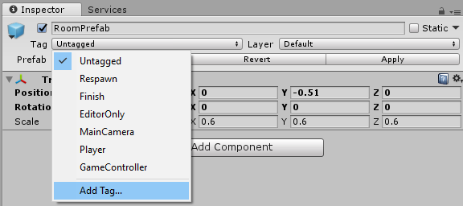
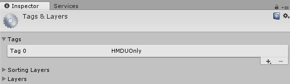

<!-- ## 7. HoloLens (optional) --> 

So far, our experience only works with an immersive headset. However, with just a few changes, we can extend it to cover the whole Mixed Reality continuum (using HoloLens).  

Since we used the Mixed Reality Toolkit for the camera, interactions and buttons, we only need to make a few adjustments to our project.

## 1. Hiding the virtual room
We need to write a script that detects whether the app is being run with an immersive headset or a HoloLens. If it is running with a HoloLens we want to hide the virtual room to allow the user to interact with their real environment. To do this we will first add a *Tag* to the *RoomPrefab* so we can access that tag inside our script. 

1. Select the *RoomPrefab* in the *Hierarchy* panel.
2. Click on the *Tag* dropdown in the *Inspector* panel and select *Add Tag...*

	

3. Press the '+' icon to create a new tag and call it `HMDUOnly`.

	

4.  Now click on the *RoomPrefab* in the *Hierarchy* panel again and select *HMDUOnly* tag from the *Tag* dropdown menu in the *Inspector* panel.

There are many ways to select [gameobjects inside of a script](https://docs.unity3d.com/Manual/ControllingGameObjectsComponents.html). By using a tag, we can easily add it to any object we want to hide (if we have more than one) and then iterate through and hide them all. Using the method `FindGameObjectsWithTag` is not the most performant way, but it will be fine for our lab. 

5. In Unity's top menu, click *GameObject->Create Empty*.   
6. In the *Hierarchy* panel, rename this added empty *GameObject* to `GameManager`.
7. In the *Inspector* panel, click *Add Component->New Script* and name it `GameManager` with *C sharp* as the selected language. Click *Create and Add* to create it. 
8. Double click the *GameManager* script in the *Inspector* panel or *Assets* panel to open it.
9. Replace the code in the *GameManager* script with the code below. We only need to run this test once when the app starts. We will do this inside the `Start()` function and we can delete the `Update()` function.

```csharp
using System.Collections;
using System.Collections.Generic;
using UnityEngine;

// We need the UnityEngine.XR.WSA namespace to access Holographic Settings which contain 
// functions which effect the performance and presentation of Holograms on Windows 
// Holographic platforms.
using UnityEngine.XR.WSA;

public class GameManager : MonoBehaviour {
	
	void Start () {
   		// Check if the MR headset display is transparent (not opaque).
    	if(!HolographicSettings.IsDisplayOpaque){ 
        	// If that is the case, then we need to hide the virtual living room
        	GameObject[] HMDUOnlyObjects = GameObject.FindGameObjectsWithTag("HMDUOnly");
        	for (int i = 0; i < HMDUOnlyObjects.Length; i++){
           		// Set active to false disables the object.
            	HMDUOnlyObjects[i].SetActive(false); 
        	}
    	}
	}
}
```

Lastly, to ensure that the experience runs fine on the HoloLens, we need to check that the camera background is set to black. 

10. In the *Hierarchy* panel, click on the *MixedRealityCameraParent->MixedRealityCamera* object. In the *Inspector* panel scroll to the bottom and check that the *Mixed Reality Camera Manager->Transparent Display Settings->Background Color* is set to black.


## 2. Add spatial mapping
We're almost done! Now we want to enable [Spatial Mapping](https://docs.microsoft.com/windows/mixed-reality/spatial-mapping). Spatial mapping provides a detailed representation of real-world surfaces in the HoloLens environment, allowing developers to create a convincing mixed reality experience. In this case, it allows users to place the speakers naturally without them being obscured inside real-world surfaces.

First let's make sure the Bounding Box controls for rotate and move won't be obscured.

1. Find the *AppBarCustom* prefab in the *Assets->Prefabs* folder in the *Project* panel.
2. Make sure the *Hover Offset Y Scale* property is set to 0.

	

Next let's add the spatial mapping components to our scene.

3. Find the *SpatialMapping* prefab in the *Assets->HoloTookit->SpatialMapping->Prefabs*.
4. Drag it into the scene *Hierarchy* panel.

	

## 3. HoloLens gestures
Our interactions up until now were for motion controllers. We will now need to use a different method for moving the speaker and switch to it programmatically if the app is being run on a HoloLens (or emulator). We can reuse our BoundingBox approach with HoloLens, but we want to optimize the interactions with a few tweaks.

1. Select the *Speaker* prefab in the *Project* panel.
2. Click *Add Component->Tap To Place*. This is a MR Toolkit HoloLens script that allows us to easily tap on objects/holograms and move them around.
3. Disable it so it won't start by default. To disable the script, simply uncheck the box next to the script's name in the *Inspector* panel. This component will also add an Interpolator script to the *Speaker* prefab.

	

4. Add a script to the *Speaker* by clicking *Add Component->New Script* and calling it `SpeakerMovement`.
5. Double click the script to edit it and replace the code in the script with the code below.
	
```csharp
using System.Collections;
using System.Collections.Generic;
using UnityEngine;
using UnityEngine.XR.WSA;
// namespace for the TwoHandManipulatable script
using HoloToolkit.Unity.InputModule.Utilities.Interactions;
// namespace for the TapToPlace script
using HoloToolkit.Unity.SpatialMapping;

public class SpeakerMovement : MonoBehaviour {

	void Start () {
		if(!HolographicSettings.IsDisplayOpaque){ 
			GetComponent<TwoHandManipulatable>().enabled = false;
			GetComponent<TapToPlace>().enabled = true;
		}
	}
}
```

After including the namespace for the scripts involved, we use the same test as we did with the GameManager when we wanted to hide the room. This time if it detects a HoloLens it will disable one script and enable the other. Since we changed the *Speaker* prefab, all of the speakers in the scene should be updated with the change. If you happened to change one of the Speaker instances, then, in the top right of the *Inspector* panel, click *Apply* to update the prefab.

That's it! You can now run and build the app on either an immersive headset or a HoloLens and place, rotate, and control speakers around the room.
