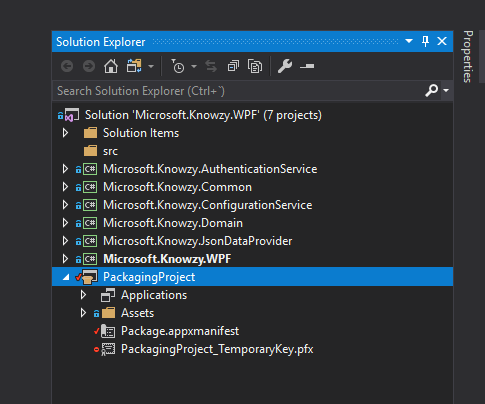
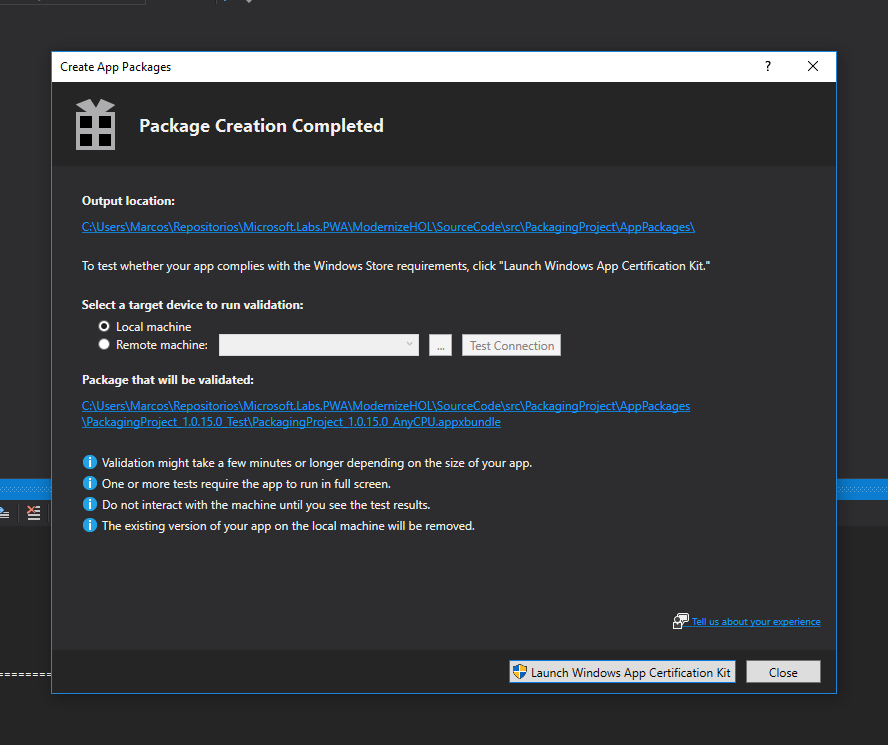
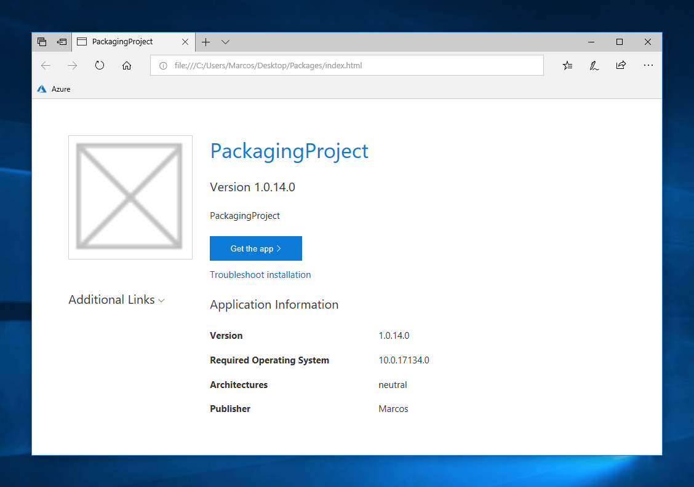

Distribution and versioning
===========================

In this section we’ll learn how our WPF app can be packaged for
distribution as Universal Windows Platform (UWP) apps. Currently, [ MSIX
Packaging SDK](https://github.com/Microsoft/msix-packaging) is available on GitHub for developers to mess around with and  It is expected to be in a Windows Insider preview in the June timeframe, but in this case we’ll use App Installer to package our app.

Packaging our WPF app for side-loading
--------------------------------------

1.  **Right-click** on the solution, click **Add**, **New Project...** Choose
    **Windows Application Packaging (Visual C\#)** template, located at **Visual
    C\#**, **Windows Universal**. This new project will generate packages for us
    which can be both uploaded to the Store or side-loaded.

2. **Right-click** on the new project
    **Applications**, **Add Reference...** Check **Microsoft.Knowzy.WPF** and
    click **OK**

Now our package will automatically contain our WPF app.

You can customize the app name, its icons and a few more options at
Package.appxmanifest file, but we’ll stick with predefined values for now.

Finally, in order to generate the package, **right-click** on *PackagingProject*
and choose **Store**, **Create App Packages...** This will open a new
wizard which will guide you through the process:

1.  Firstly, choose **I want to create packages for sideloading**, Next
    uncheck **Enable automatic updates** for now.

2.  We can customize the output location, version and architectures, among other
    things, but we'll leave the default values; when a package is created the versions will auto-increase automatically, so we don’t have to take worry about this.

3.  Once the process ends, a new dialog will link us to the path where the
    package was created, accompanied by the chance to pass the Windows App
    Certification Kit, if we’d like to go public through the Store, which’s not
    our case, so click **Close**.

    

Right now we can simply **double-click** on the **.appxbundle** file and the
new set-up process will start, install your app locally and add it to the
Start menu, as if it was done through the Store (we even can uninstall it in
the same way).

Enabling automatic updates
--------------------------

Before proceeding, we’ll need to target the latest Windows 10 SDK to enable the
following scenario:

1.  We need to target the latest Windows 10 SDK to be able to configure the automatic updates. **Right-click** on the packaging project, **Properties **and **Package  **tab. Within **Targeting **area, change **Target **and **Min **versions to “**Windows 10, version 1803 (10.0; Build 17134)**”.

2.  As you'll remember, we unchecked the option '*Enable automatic updates*' on the packaging wizard,
    so now we repeat the process but checking this option. As a difference with previous time we did it,
    this time a new step is shown asking where the updates will live, letting us
    choose between a network resource path or a web URL. For the sake of
    simplification we’ll choose a network path.

3.  In order to serve a local path to the local network first we create a new empty
    folder at Desktop. **Right-click** on it, **Properties**, **Sharing **tab,
    **Advanced Sharing**... Just check **Share this folder** and click **OK**.
    If you open a new **Windows Explorer** and type **\\\\localhost\\** at the
    address bar, you’ll notice your shared folder is now available .Right now we
    only have read access through the share, but we could also write on it if we access
    through the local folder.

4.  Back to the wizard, paste the folder path of the previous step into **Installation URL** (i.e.
    “\\\\localhost\\Packages”) and leave **Check everytime the application
    runs** selected (this way the app will check for updates at the specified
    URL upon start, managing the updating process for us).

5.  Finally **click **on **Create **and wait for the process to end.

A windows will appear with the summary of the process , click on **Output
**location and copy every file and folder contained into the served folder
--remember it was placed at Desktop\\.

If you **double-click** at **index.html **you’ll appreciate a similar experience
to the one Windows Store serves. By clicking on **Get the app **will launch the
set-up as before, but now the app will look for updates everytime it's launch.

If we make any change to our app, we should generate and copy the package back to
the shared folder. This way the installed package will know a new update is available when it
starts, and it will kindly ask us to update.
