# Foundations of Office 365 #
## Microsoft Teams and more ##

### What is Teams? ###

Teams is the next-generation team collaboration tool in the Office 365 suite. By combining new and existing apps and services, users can find all relevant team content in a single application.

Out of the box it includes:
* Audio and video conferencing 
* Permanent chat
* Online meetings and broadcasts
* Shared files in SharePoint
* Team notes in OneNote
* Team tasks in Planner
* Shared email inbox, calendar and email address
* Available for web, desktop and mobile

### Extending Teams ###

In addition to the built-in components, Teams has several ways to incorporate external content.

### Tabs ###

* Planner
* Power BI
* Trello
* Your custom Tab

### Bots ###
* Who bot
* Your custom Bot

### Connectors ###
* Twitter
* JIRA
* Salesforce
* Your custom connector

### Messaging extensions ###
* Youtube
* Your custom extension

## Exercise 1: Create a Team ##

### Prerequisites ###
1. [Microsoft Office 365 Tenant configured for Teams](https://docs.microsoft.com/en-us/microsoftteams/platform/get-started/get-started-tenant)

> **IMPORTANT:** Be sure to enable external apps for Teams and sideloading as indicated in the guide for later exercises.

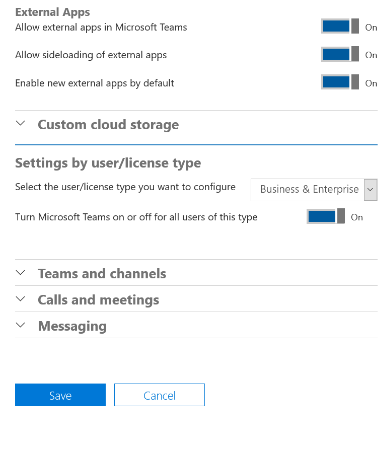

### Steps ###

> **Note:** this tutorial is run from a web browser but the desktop experience is nearly identical.

1. Browse to https://teams.microsoft.com and login with your Office 365 account.

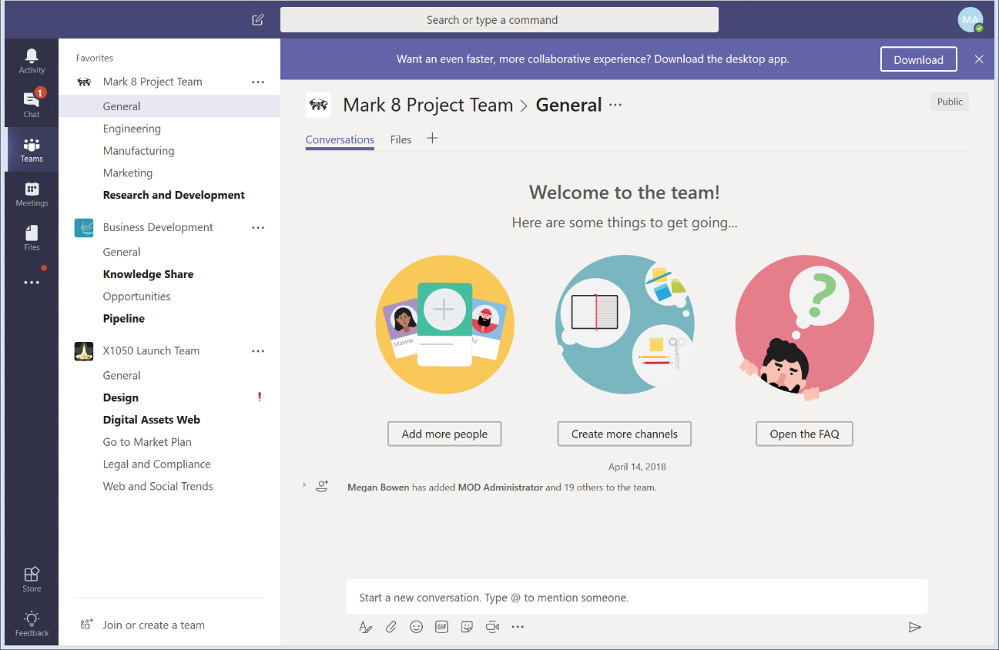
	
2. Click on “Join or create a team” in the bottom left corner

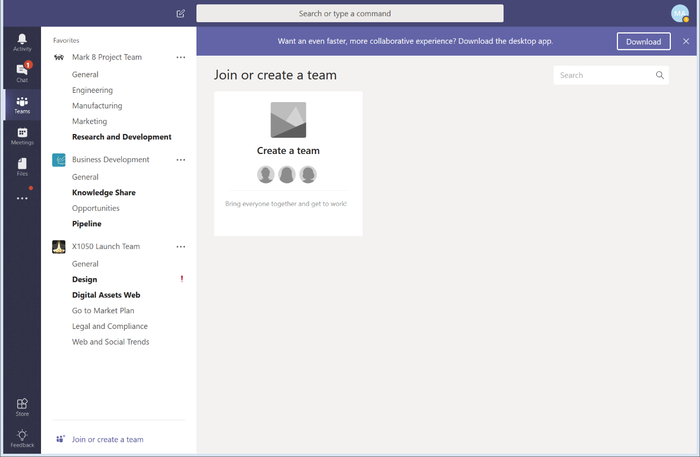

3. Enter the team name as “Lunch”, description and access policy.

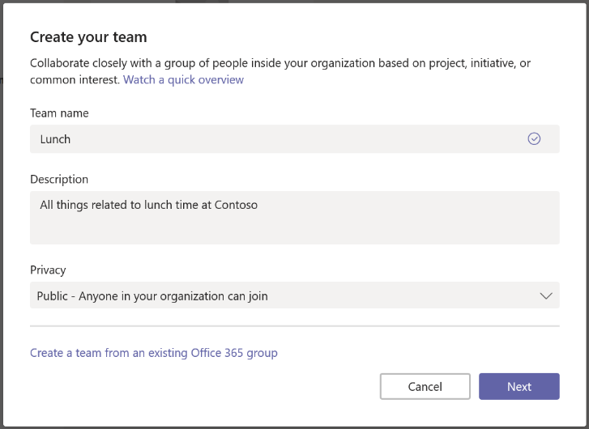  

> **Note:** Choose the name carefully as this will become the team’s globally visible email address.

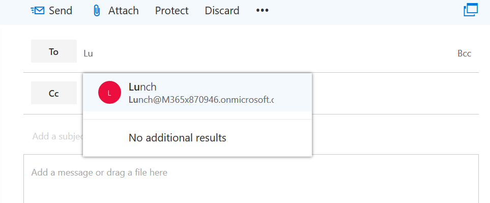

4. Skip the invitation screen.
5. Congratulations on creating your first Team!
6. In your newly created “Lunch” team, write your first post on the General channel.
7. Each Team has a default General channel but adding more channels is a good way to focus content.  Create a “Cafeteria” channel in the Lunch team.

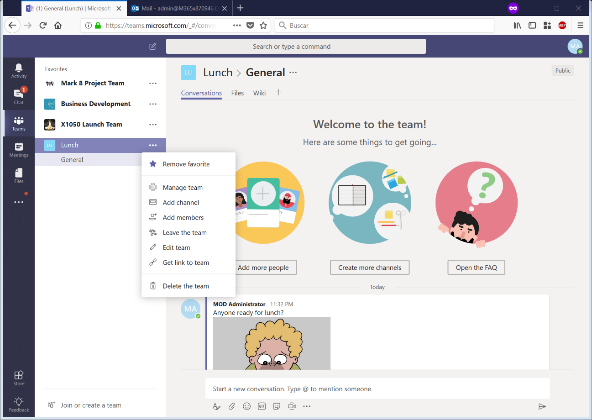

8. In the Cafeteria channel, click on Files and Upload a file.

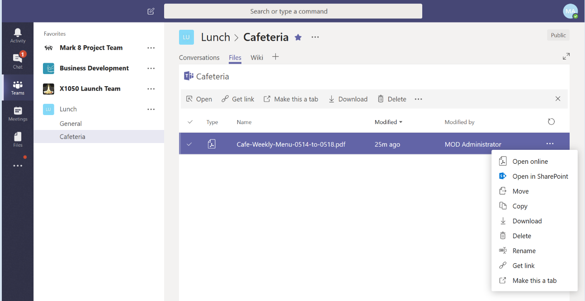

9. Click on the ellipsis menu (…) to the right of the file name and choose “Make this a tab”.

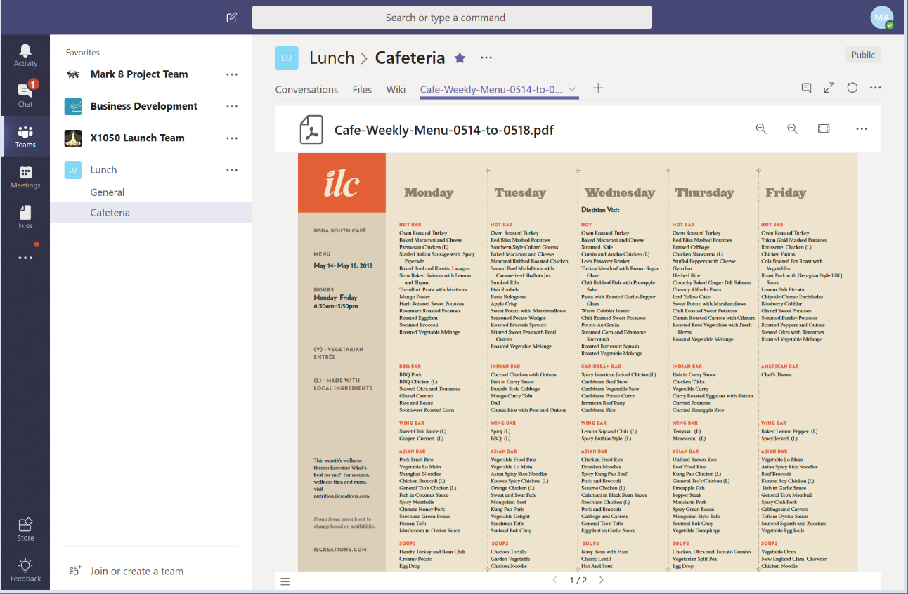

10. Click on the + button in the tab section to add another tab.

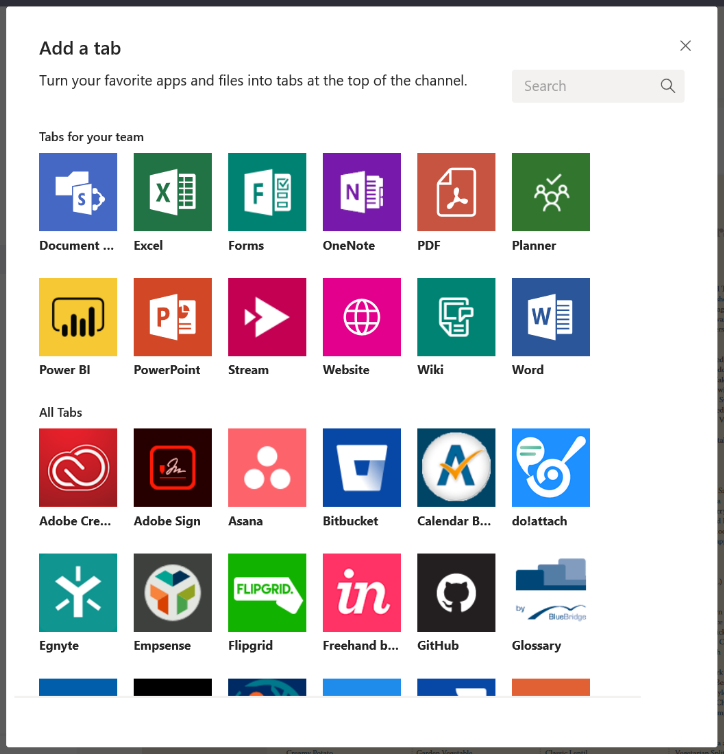

11. Now that you have seen Teams from a user's perspective, read on to see what a developer can do!

# Graph APIs #
## Microsoft Graph API use and purpose ##
Microsoft Graph is a central API in Office 365 that provides unified access to user resource, relationships and intelligence via a single REST endpoint.

## Security and permissions ##
- All results are scoped to the context of the current user.
- All applications using Graph API must be granted access by the user or tenant administrator.

## Tour of Graph API calls ##
| Operation        | URL           |
| ------------------------ |:-------------:| 
| GET my profile	      | https://graph.microsoft.com/v1.0/me |
| GET my files	      | https://graph.microsoft.com/v1.0/me/drive/root/children |
| GET my photo	      | https://graph.microsoft.com/v1.0/me/photo/$value |
| GET my calendar events	      | https://graph.microsoft.com/v1.0/me/events |
| GET my manager	      | https://graph.microsoft.com/v1.0/me/manager |
| GET users in my organization	      | https://graph.microsoft.com/v1.0/users |
| GET people related to me	      | https://graph.microsoft.com/v1.0/me/people |
| GET items trending around me	      | https://graph.microsoft.com/beta/me/insights/trending |
| GET my tasks assigned to me across plans	      | https://graph.microsoft.com/v1.0/me/planner/tasks/ |
| POST Create a new task	      | https://graph.microsoft.com/v1.0/planner/tasks |
| GET data from my Excel file	      | https://graph.microsoft.com/v1.0/me/drive/items/{id}/workbook/ |
| POST new row to my Excel file	      | https://graph.microsoft.com/v1.0/me/drive/root:/demo.xlsx:/workbook/tables/Table1/rows/add |

## Exercise 2: Graph Explorer ##
1.	In a web browser, navigate to https://developer.microsoft.com/en-us/graph/graph-explorer
2.	Click on the “Run Query” button

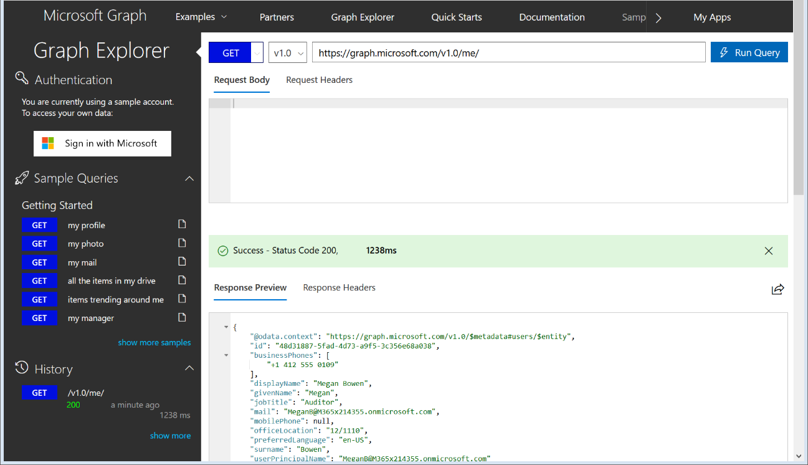

3.	A sample JSON Response will be displayed below.
4.	Click on the button “Sign in with Microsoft” to log in to your Office 365 tenant from the previous exercise.  Take note of the permissions requested in the consent screen.

5.	Click on “show more samples” and activate the “Groups” sample category.

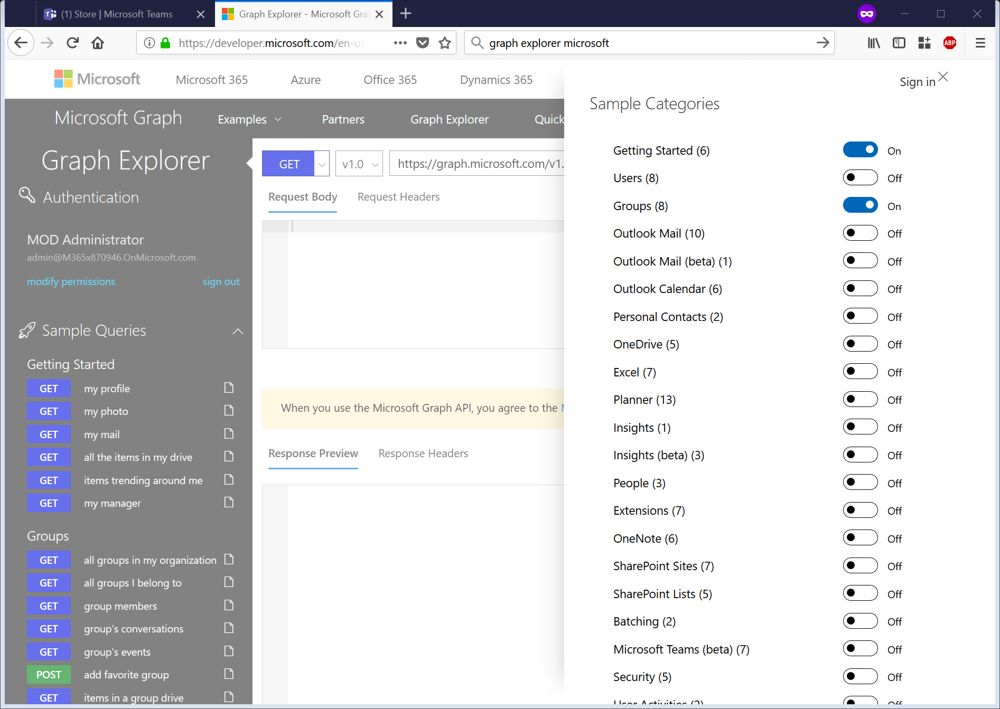

6.	Click on the “GET all groups I belong to” link.  You should receive a permissions error.

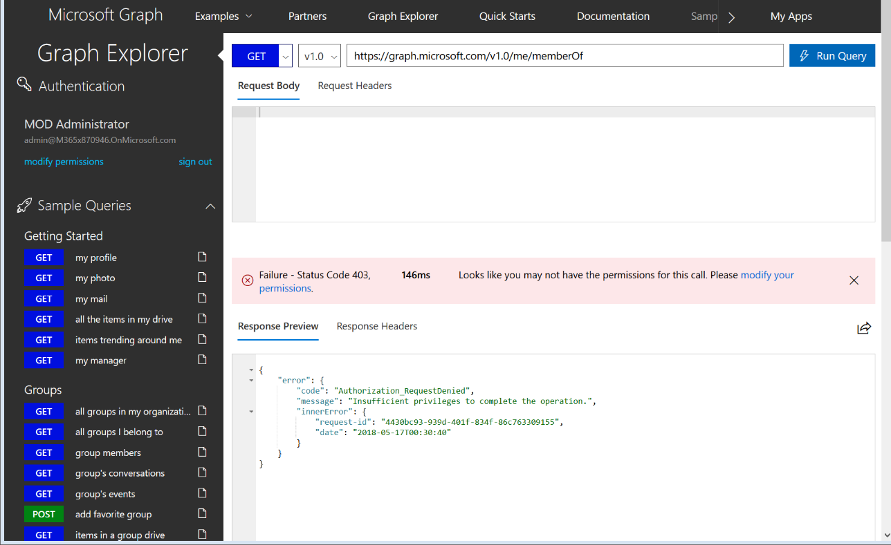

7.	This is Graph API’s security protecting the user from unauthorized requests.  During the initial consent screen, no “Group” permissions were requested or granted so the query about Groups is denied.

8.	Click on “modify permissions” and scroll down to activate the “Directory.Read.All”  permission. Click “Modify Permissions” to save.

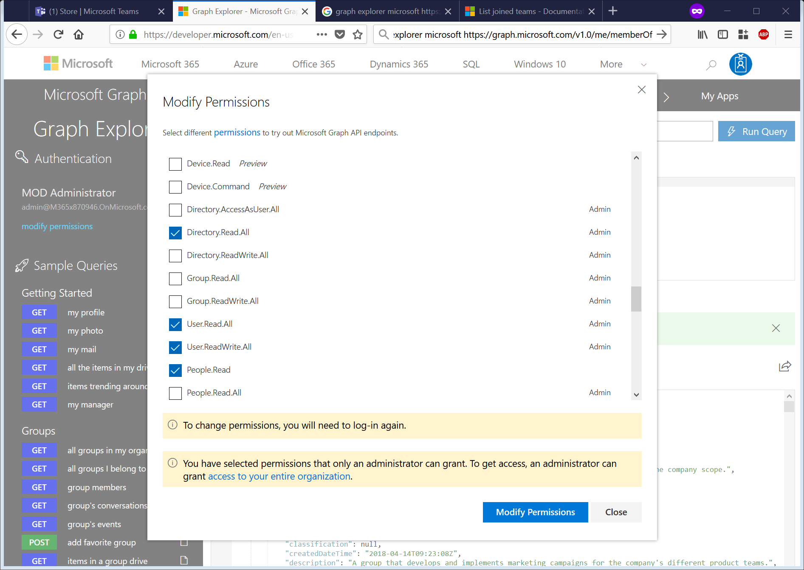

9.	The session is logged out and a new consent screen is presented with the new permission request.

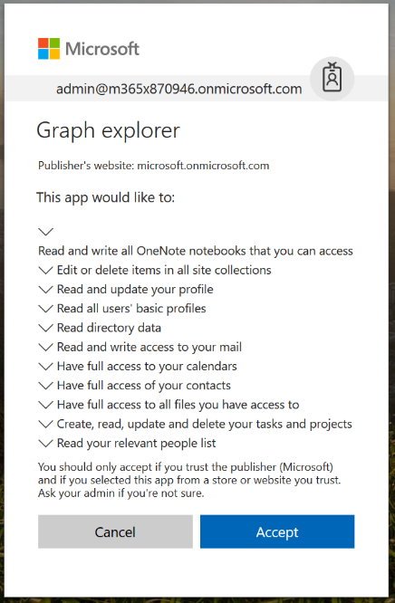

10.	Upon returning to the Graph Explorer screen, select “all groups I belong to” and the last JSON item will show the Team recently created.
 
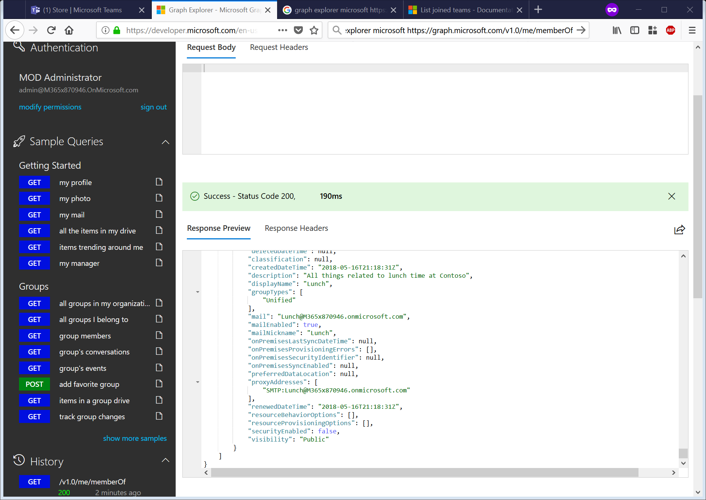

# Canvases across Office 365 #

### Marketplace ###
Office 365 and Azure offer thousands of apps and turn-key solutions built by Microsoft and software developers in the AppSource marketplace.  Developer can monetize their own apps once the product has been reviewed and approved by Microsoft.

[Microsoft AppSource](https://appsource.microsoft.com/en-us/marketplace/apps?src=office&page=1&product=office)

### PowerApps ###
Canvas apps in PowerApps are built without the need to code, using drag-and-drop tools and prebuilt templates to create a multi-platform (web, desktop and mobile) application.  PowerApps can be used for everything from a simple vacation request form with validation to a multi-faceted audit tool for field technicians.

PowerApps can be integrated with many systems utilizing [Connectors](https://docs.microsoft.com/en-us/powerapps/maker/canvas-apps/connections-list):
- Teams
- SharePoint Online
- Dynamics 365
- On-premise SQL Server

Custom connectors can be built to integrate PowerApps with any system: [Custom connectors in PowerApps](https://docs.microsoft.com/en-us/powerapps/maker/canvas-apps/register-custom-api)

#### Further information ####
- [Overview of creating apps in PowerApps](https://docs.microsoft.com/en-us/powerapps/maker/index)
- [Create an app from a PowerApps template](https://docs.microsoft.com/en-us/powerapps/maker/canvas-apps/get-started-test-drive)

###  Flow & Logic Apps ###
Microsoft Flow and Azure Logic Apps are cloud-based integration workflow engines that have an easy to use web UI. Utilizing the same Connectors as PowerApps, these workflows can integrate with any service in Office 365 and Azure, as well as hundreds of third-party services.
> **Note**: Flow is targeted at business users creating self-service workflows while Logic Apps is meant for developers and integrators.

#### Further information ####
- [Get started with Microsoft Flow](https://docs.microsoft.com/en-us/flow/getting-started)
- [Create a flow in Microsoft Flow](https://docs.microsoft.com/en-us/flow/get-started-logic-flow)
- [What is Azure Logic Apps?](https://docs.microsoft.com/en-us/azure/logic-apps/logic-apps-overview)
- [Quickstart: Build your first logic app workflow - Azure portal](https://docs.microsoft.com/en-us/azure/logic-apps/quickstart-create-first-logic-app-workflow)
- [Compare Flow, Logic Apps, Functions, and WebJobs](https://docs.microsoft.com/en-us/azure/azure-functions/functions-compare-logic-apps-ms-flow-webjobs)

### Power BI ###
Power BI delivers rich interactive visualizations of data. Users can quickly build executive dashboards and slice data. Power BI has a growing library of ready-made visuals and developers can built further custom visuals if needed.

#### Further information ####
- [What can developers do with Power BI?](https://docs.microsoft.com/en-us/power-bi/developer/what-can-you-do)
- [Use developer tools to create custom visuals](https://docs.microsoft.com/en-us/power-bi/service-custom-visuals-getting-started-with-developer-tools)

### Yammer ###
Yammer is an enterprise communication service designed to facilitate conversations and knowledge sharing between groups.  Yammer can be extended with apps that access the content and groups based in Yammer.

#### Further information ####
- [Build Your First App](https://developer.yammer.com/docs) 

###  Office Add-ins ###
Office Add-ins are embedded HTML panes that render in all Office versions (web, desktop and mobile).  These panes can interact with the content being edited in the Office application as well as external services.

- [JavaScript API for Office](https://dev.office.com/reference/add-ins/javascript-api-for-office)

#### Outlook Add-ins ####
- [Outlook add-ins overview]( https://docs.microsoft.com/en-us/outlook/add-ins/)
- [Build your first Outlook add-in](https://docs.microsoft.com/en-us/outlook/add-ins/quick-start?tabs=visual-studio)
	
#### Excel Add-ins ####
- [Excel add-ins overview](https://docs.microsoft.com/en-us/office/dev/add-ins/excel/excel-add-ins-overview)
- [Build an Excel add-in using React](https://docs.microsoft.com/en-us/office/dev/add-ins/excel/excel-add-ins-get-started-react)
	
#### Word Add-ins ####
- [Word add-ins overview](https://docs.microsoft.com/en-us/office/dev/add-ins/word/word-add-ins-programming-overview)
- [Build your first Word add-in](https://docs.microsoft.com/en-us/office/dev/add-ins/word/word-add-ins?tabs=visual-studio)

#### PowerPoint Add-ins ####
- [PowerPoint add-ins](https://docs.microsoft.com/en-us/office/dev/add-ins/powerpoint/powerpoint-add-ins)
- [Build your first PowerPoint add-in](https://docs.microsoft.com/en-us/office/dev/add-ins/powerpoint/powerpoint-add-ins-get-started?tabs=visual-studio)

#### OneNote Add-ins ####
- [Build your first OneNote add-in](https://docs.microsoft.com/en-us/office/dev/add-ins/onenote/onenote-add-ins-getting-started)

#### Project Add-ins ####
- [Task pane add-ins for Project](https://docs.microsoft.com/en-us/office/dev/add-ins/project/project-add-ins)
- [Build your first Project add-in](https://docs.microsoft.com/en-us/office/dev/add-ins/project/project-add-ins-get-started)
	
### SharePoint Framework ###
SharePoint is a platform for building collaboration and publication sites suited to many corporate needs.  SharePoint is very easy to customize and has a large developer community.

#### Further information ####
- [Overview of the SharePoint Framework](https://docs.microsoft.com/en-us/sharepoint/dev/spfx/sharepoint-framework-overview)
- [Overview of SharePoint client-side web parts](https://docs.microsoft.com/en-us/sharepoint/dev/spfx/web-parts/overview-client-side-web-parts)
- [Build your first SharePoint client-side web part](https://docs.microsoft.com/en-us/sharepoint/dev/spfx/web-parts/get-started/build-a-hello-world-web-part)
- [Overview of SharePoint Framework Extensions](https://docs.microsoft.com/en-us/sharepoint/dev/spfx/extensions/overview-extensions)
- [Build your first SharePoint Framework Extension](https://docs.microsoft.com/en-us/sharepoint/dev/spfx/extensions/get-started/build-a-hello-world-extension)
- [SharePoint Add-ins](https://docs.microsoft.com/en-us/sharepoint/dev/sp-add-ins/sharepoint-add-ins)
- [Get started creating provider-hosted SharePoint Add-ins](https://docs.microsoft.com/en-us/sharepoint/dev/sp-add-ins/get-started-creating-provider-hosted-sharepoint-add-ins)
- [SharePoint Framework (SPFx) enterprise guidance](https://docs.microsoft.com/en-us/sharepoint/dev/spfx/enterprise-guidance)
- [SharePoint Best Patterns and Practices sample code](https://github.com/SharePoint/PnP)

### Teams apps ###
Teams is a team collaboration tool combining audioconferencing, chat, files and more in a single tool.

- [Apps for Microsoft Teams](https://docs.microsoft.com/en-us/microsoftteams/platform/concepts/apps/apps-overview)

### Graph API ###
Graph API is a unified API providing simple access to a user's objects in Office 365, including OneDrive files, calendar, connections and more.
- [Graph API Overview](https://developer.microsoft.com/en-us/graph/docs/concepts/overview)
- [Graph Explorer](https://developer.microsoft.com/en-us/graph/graph-explorer) 

### Office 365 APIs ###
Office 365 has extensive APIs to cover each service in the platform beyond the information offered in the Graph API.
- [Overview of Office 365 file handlers](https://msdn.microsoft.com/en-us/office/office365/howto/using-cross-suite-apps)
- [Create file handlers in Office 365](https://msdn.microsoft.com/en-us/office/office365/howto/create-file-handler-extensions)

