# Build tailored team hubs in Microsoft Teams #

## Fundamentals of Teams Development ##
As mentioned earlier in this lab, each Team created has a General channel and optional additional channels.
Each channel can be configured with different components to better fit its purpose:
- Tabs
- Bots
- Connectors
- Message extensions

### Tabs ###
Tabs allow external web pages to be embedded in the Teams user interface, allowing complete control over the user interaction experience.  Tabs are isolated from each other in IFrames and Teams provides user context to the external web page.
  
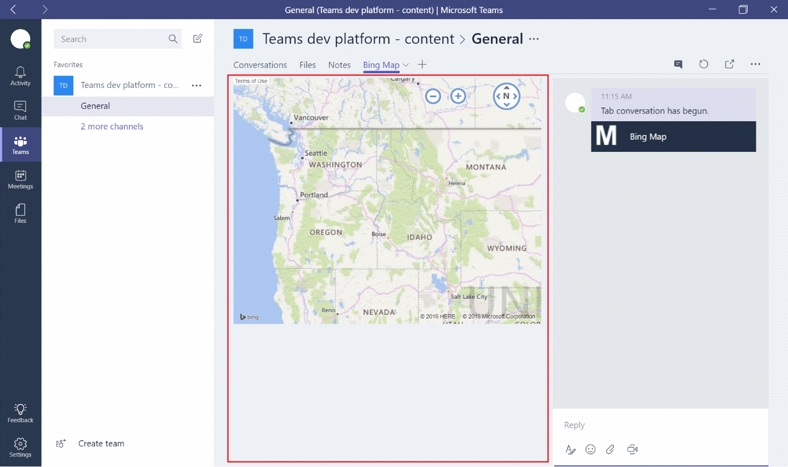


### Bots ###
Bots allow conversational or command style interaction via a chat interface between the user and your Bot application.  Any bot using the Microsoft Bot Framework is compatible with Teams and can be enhanced for Teams using cards, channel metadata for activities and understanding messaging extensions.

Users can interact in two manners: direct 1:1 chats or mention a bot with a hashtag in a Team channel.
  
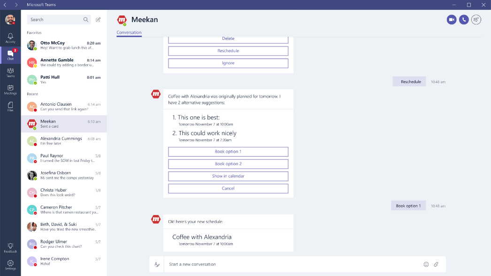


### Cards ### 
Cards are a condensed graphic representation of objects throughout Office 365, including Teams.  Each card can have properties, attachments and action buttons.  In Teams, card can be shown in chats with bots, messaging extensions and connectors.
There are several types of cards to employ depending on the object type and user interaction required.
  
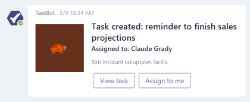


### Messaging Extensions ### 
Messaging extensions enable users to search external services for objects and select an object for embedding in a channel conversation.  This mechanism combines the Microsoft Bot Framework with Cards to add rich content to chats.
  


### Office 365 Connectors ###
Connectors bring content and events from external systems into Team conversations using Cards and incoming webhooks.  The cards generated can be static or actionable, allowing complete interaction from within Teams.
  
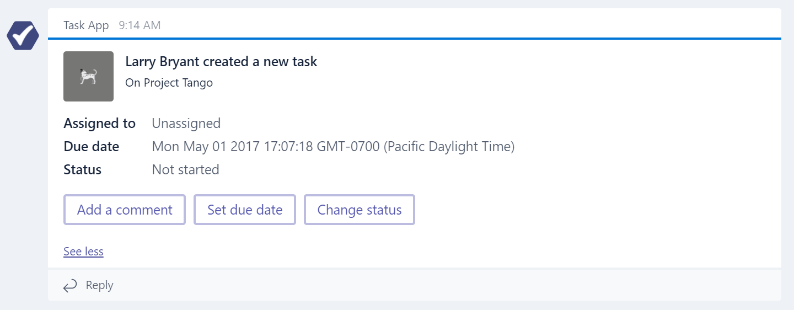


 
## Exercise 3: Simple example with Tabs ##
###  Adapt an existing web app to work with Microsoft Teams ###
In this example, we will demonstrate how to transform an existing web app into a Team App.  

Our existing app shows the daily lunch menu, complete with images and nutritional information using a simple React app.

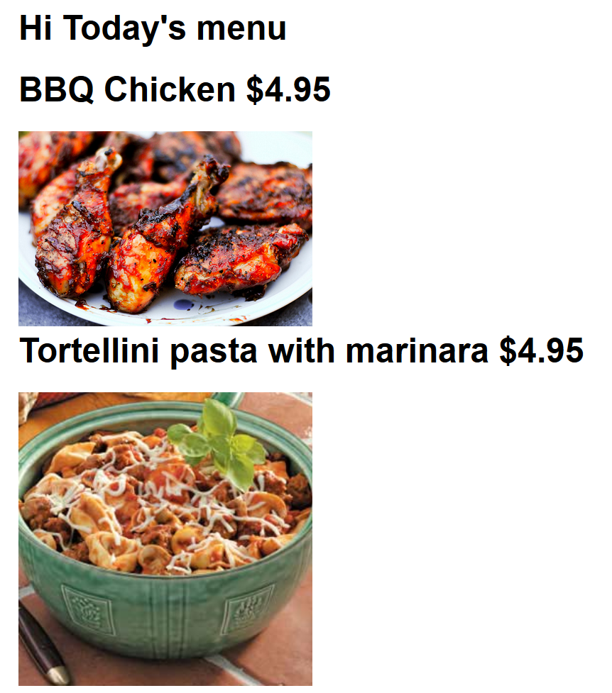

### Build and deploy the existing web app ###

#### Prerequisites ####
1. [Microsoft Office 365 Tenant configured for Teams](https://docs.microsoft.com/en-us/microsoftteams/platform/get-started/get-started-tenant)
2. Azure subscription
3. [Node LTS and npm](https://nodejs.org/en/)
4. [Visual Studio Code](https://code.visualstudio.com/)


**Requirements for converting your web app into a Teams tab:**
1. The content must be served via HTTPS.
2. The page should render properly within an IFrame.
3. The Microsoft Teams JavaScript client SDK must be included and call `microsoftTeams.initialize()`.
4. The app must include an initial configuration page to display during tab setup.

## Create Azure App Service ##
1. Login to Azure portal

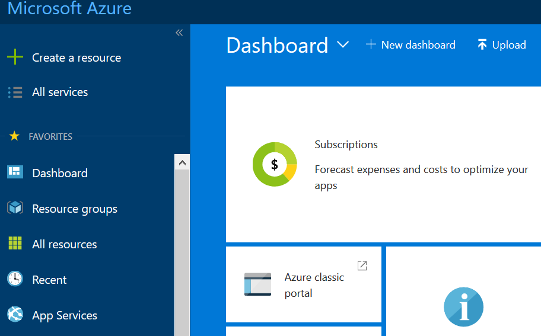

2. Select **App Services**, followed by **+Add** then choose the **Web App** template.  Lastly, click **Create**.

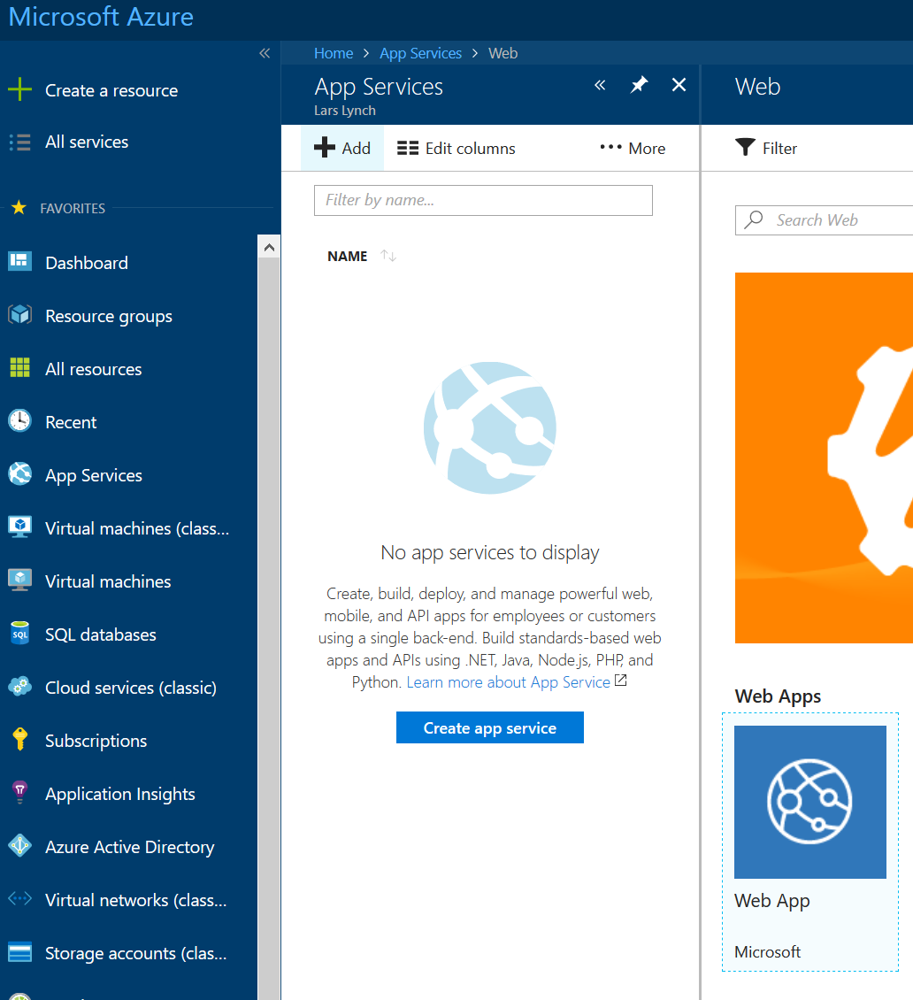

3. Complete the web app details and click on **Service Plan** to choose a new free service plan.
4. Enter a name for the new service plan and change the pricing tier to **F1 Free**

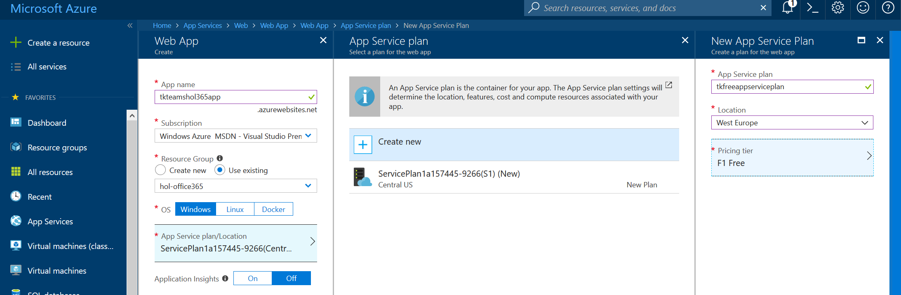

5. Click **OK** to create the service plan and **Create** to provision the web app.

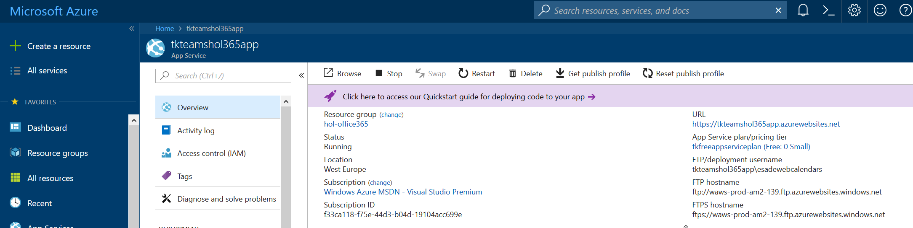

## Create simple React web app ##
1. Run **Visual Studio Code** and open an **Integrated Terminal**

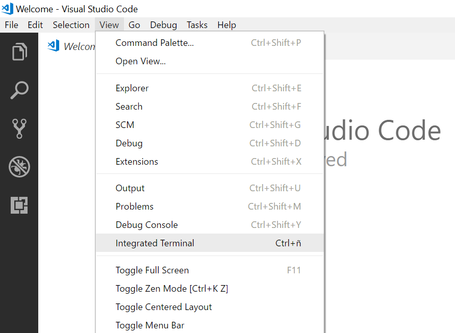

2. In the Powershell terminal that opens, run this command to globally install the NPM React template:
```
	npm install -g create-react-app
```	
3. Change to your development directory, create the React app and run it:
```
	cd c:\temp
	create-react-app lunchmenu 
	cd lunchmenu 
	npm start
```
4. A web browser opens to http://localhost:3000 and displays the web app

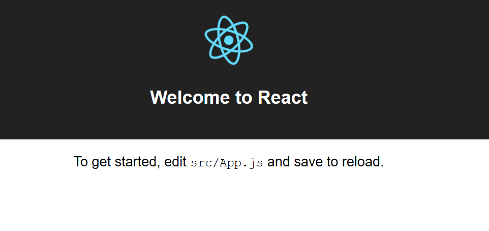

5. Return to Visual Studio Code and open the **lunchmenu** folder

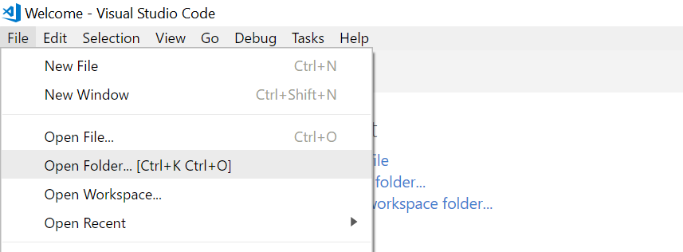

6. Download this [assets.zip](../media/assets.zip) file and unpack the images and JSON to the **lunchmenu\src\assets** folder.
7. Create these new files in Visual Studio Code:
- **src\MenuContainer.js** - A React parent container component
- **src\MenuItem.js** - A React component for rendering each item on the lunch menu
- **src\MenuItem.css** - The CSS for each menu item
- **public\web.config** - A modified web.config to route all web requests to index.html, necessary for SPA

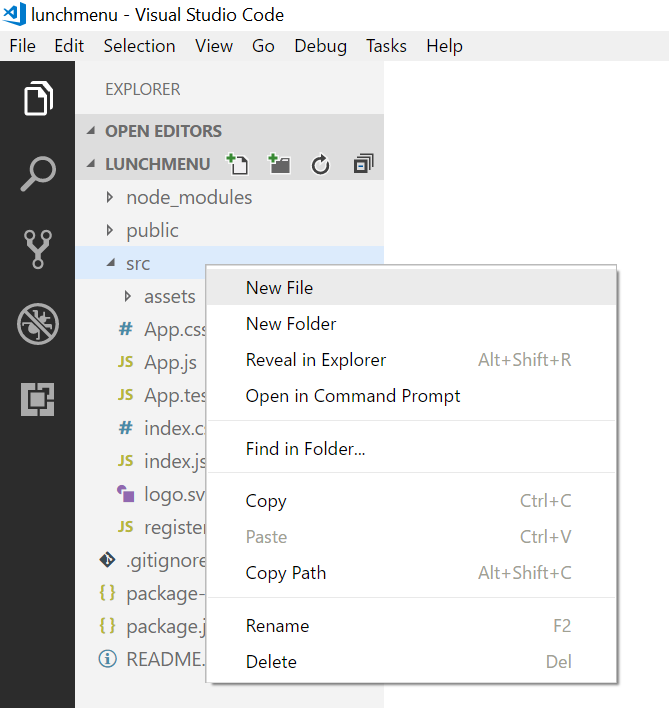

8.  Complete the new files with the following:
**src\MenuItem.js**
```js
import React, { Component } from 'react';

import './MenuItem.css';

class MenuItem extends Component {

    constructor(props) {
        super(props);
        this.state = {showImage: true};
    
        // This binding is necessary to make `this` work in the callback
        this.handleClick = this.handleClick.bind(this);
      }

      handleClick() {
        this.setState(prevState => ({
            showImage: !prevState.showImage
        }));
      }

    render(props) {
      return (
        <div className="MenuItem" onClick={this.handleClick}>
        <span className={this.state.showImage ? 'visible' : 'hidden'}><h1>{this.props.data_url.title} {this.props.data_url.price.toLocaleString(navigator.language,{style: 'currency', currency:'USD'})}</h1></span>
        <span className={this.state.showImage ? 'hidden' : 'visible'}><h1>{this.props.data_url.title} {this.props.data_url.price.toLocaleString(navigator.language,{style: 'currency', currency:'USD'})}</h1>          
            <div className="nutrition-container">
            <div>
            <table className="nutrition-table-1">
            <tr><td colSpan="2"><span className="nutrition-label">Serving size</span></td><td colSpan="2">{this.props.data_url.nutrition_table.serving_size}</td><td></td></tr>
            <tr><td colSpan="2"><span className="nutrition-label">Calories</span></td><td colSpan="2">{this.props.data_url.nutrition_table.calories}</td><td></td></tr>
            <tr><td colSpan="2"><span className="nutrition-label">Total fat </span>{this.props.data_url.nutrition_table.total_fat[0]}</td><td colSpan="2">{this.props.data_url.nutrition_table.total_fat[1]}</td></tr>
            <tr><td colSpan="2"><span className="nutrition-label">Saturated fat </span>{this.props.data_url.nutrition_table.saturated_fat[0]}</td><td colSpan="2">{this.props.data_url.nutrition_table.saturated_fat[1]}</td></tr>
            <tr><td colSpan="2"><span className="nutrition-label">Polyunsaturated fat </span>{this.props.data_url.nutrition_table.polyunsaturated_fat[0]}</td><td colSpan="2">{this.props.data_url.nutrition_table.polyunsaturated_fat[1]}</td></tr>
            <tr><td colSpan="2"><span className="nutrition-label">Monounsaturated fat </span>{this.props.data_url.nutrition_table.monounsaturated_fat[0]}</td><td colSpan="2">{this.props.data_url.nutrition_table.monounsaturated_fat[1]}</td></tr>
            <tr><td colSpan="2"><span className="nutrition-label">Cholesterol </span>{this.props.data_url.nutrition_table.cholesterol[0]}</td><td colSpan="2">{this.props.data_url.nutrition_table.cholesterol[1]}</td></tr>
            <tr><td colSpan="2"><span className="nutrition-label">Sodium </span>{this.props.data_url.nutrition_table.sodium[0]}</td><td colSpan="2">{this.props.data_url.nutrition_table.sodium[1]}</td></tr>
            <tr><td colSpan="2"><span className="nutrition-label">Potassium </span>{this.props.data_url.nutrition_table.potassium[0]}</td><td colSpan="2">{this.props.data_url.nutrition_table.potassium[1]}</td></tr>
            <tr><td colSpan="2"><span className="nutrition-label">Total carbohydrate </span>{this.props.data_url.nutrition_table.total_carbohydrate[0]}</td><td colSpan="2">{this.props.data_url.nutrition_table.total_carbohydrate[1]}</td></tr>
            <tr><td colSpan="2"><span className="nutrition-label">Dietary fiber </span>{this.props.data_url.nutrition_table.dietary_fiber[0]}</td><td colSpan="2">{this.props.data_url.nutrition_table.dietary_fiber[1]}</td></tr>
            <tr><td colSpan="2"><span className="nutrition-label">Sugar </span>{this.props.data_url.nutrition_table.sugar[0]}</td><td colSpan="2">{this.props.data_url.nutrition_table.sugar[1]}</td></tr>
            <tr><td colSpan="2"><span className="nutrition-label">Protein </span>{this.props.data_url.nutrition_table.protein[0]}</td><td colSpan="2">{this.props.data_url.nutrition_table.protein[1]}</td></tr>
            </table>
            </div>
            
            <div>
            <table className="nutrition-table-2">
            <tr><td>Vitamin A</td><td>{this.props.data_url.nutrition_table.vitamin_a[0]}</td><td>{this.props.data_url.nutrition_table.vitamin_a[1]}</td><td>Vitamin C</td><td>{this.props.data_url.nutrition_table.vitamin_c[0]}</td><td>{this.props.data_url.nutrition_table.vitamin_c[1]}</td></tr>
            <tr><td>Calcium</td><td>{this.props.data_url.nutrition_table.calcium[0]}</td><td>{this.props.data_url.nutrition_table.calcium[1]}</td><td>Iron</td><td>{this.props.data_url.nutrition_table.iron[0]}</td><td>{this.props.data_url.nutrition_table.iron[1]}</td></tr>
            <tr><td>Vitamin D</td><td>{this.props.data_url.nutrition_table.vitamin_d[0]}</td><td>{this.props.data_url.nutrition_table.vitamin_d[1]}</td><td>Vitamin B-6</td><td>{this.props.data_url.nutrition_table.vitamin_b_6[0]}</td><td>{this.props.data_url.nutrition_table.vitamin_b_6[1]}</td></tr>
            <tr><td>Vitamin B-12</td><td>{this.props.data_url.nutrition_table.vitamin_b_12[0]}</td><td>{this.props.data_url.nutrition_table.vitamin_b_12[1]}</td><td>Magnesium</td><td>{this.props.data_url.nutrition_table.magnesium[0]}</td><td>{this.props.data_url.nutrition_table.magnesium[1]}</td></tr>
            </table>
            </div>
            </div>
        </span>
        </div>
      );
    }

     
}

export default MenuItem;
```
**src\MenuItem.css**
```css
.hidden  {
    display:none;
}

.visible {
    display: inherit;
}

.menu-image {
    width:30%;
}

.nutrition-label {
    font-weight: bold;
}


.nutrition-table-1, .nutrition-table-2 {
    flex: 0.5;
}

.nutrition-container {
    display: flex;
    justify-content: center;
    
}

.nutrition-container div {
    max-width: 30%;
}
```


**src\MenuContainer.js**
```js
import React, { Component } from 'react';

import image_1 from './assets/barbecue-chicken.jpg';
import image_2 from './assets/tortellini.jpg';
import image_3 from './assets/eggplant.jpg';
import data_1 from "./assets/chicken_data.json";
import data_2 from "./assets/tortellini_data.json";
import data_3 from "./assets/eggplant_data.json";

import MenuItem from './MenuItem';   

class MenuContainer extends Component {
      render(props) {
          return (
            <div className="MenuContainer">
                <header className="App-header">
                <h1 className="App-title">Today´s menu</h1>
            </header>                
            <MenuItem data_url={data_1} image_url={image_1}/>
            <MenuItem data_url={data_2} image_url={image_2}/>
            <MenuItem data_url={data_3} image_url={image_3}/>
            </div>
          );
 }
}
export default MenuContainer;
```


**public\web.config**
```xml
<?xml version="1.0"?>
<configuration>
 <system.webServer>
 <rewrite>
 <rules>
 <rule name="React Routes" stopProcessing="true">
 <match url=".*" />
 <conditions logicalGrouping="MatchAll">
 <add input="{REQUEST_FILENAME}" matchType="IsFile" negate="true" />
 <add input="{REQUEST_FILENAME}" matchType="IsDirectory" negate="true" />
 <add input="{REQUEST_URI}" pattern="^/(api)" negate="true" />
 </conditions>
 <action type="Rewrite" url="/" />
 </rule>
 </rules>
 </rewrite>
 </system.webServer>
</configuration>
```
9. Edit the **src\App.js** file to the following:
**src\App.js**
```js
import React, { Component } from 'react';
import './App.css';
import MenuContainer from './MenuContainer';


class App extends Component {
  render() {
    return (
      <div className="App">
        <MenuContainer />
      </div>
    );
  }
}

export default App;
```

10. Run these commands to build the project and create a ZIP file of the build folder:
```
npm run build
cd build
Compress-Archive -Path * -DestinationPath lunchmenu-build.zip
```
11. Open a web browser and go to https://YOUR_APP_NAME.scm.azurewebsites.net/ZipDeploy.
> **Note**: This is not the same site as your Azure Web App but requires the same credentials.

12. Drag the **build\lunchmenu-build.zip** file onto the file list in the browser and it will unzip and deploy the files to your web app.

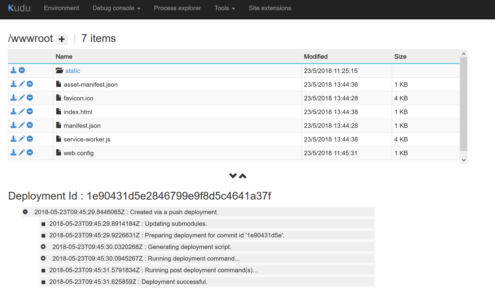

13. Browse to https://YOUR_APP_NAME.azurewebsites.net/ and confirm your React app is working.

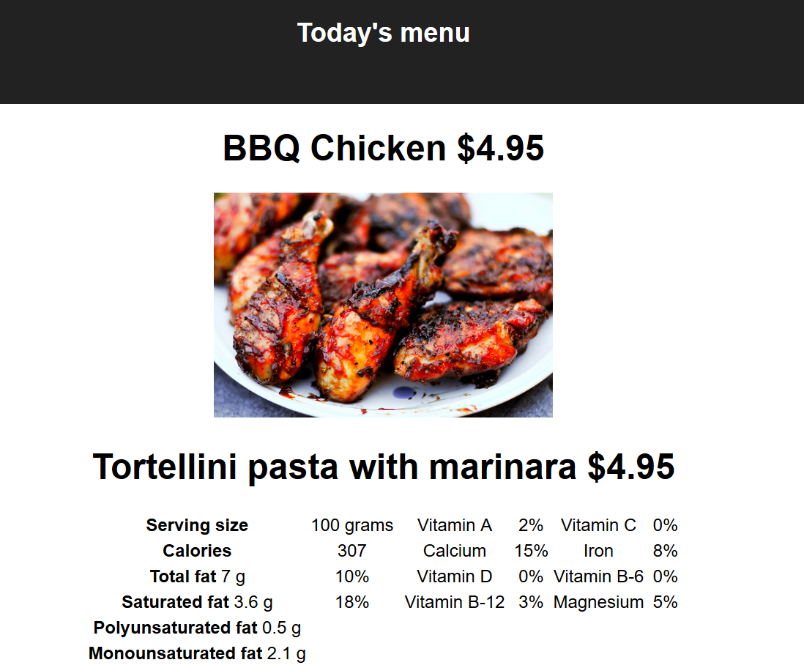


## Convert React app to Team tab ##


1. In the terminal window in Visual Studio Code run these commands to install the packages for the Teams JS API and React SPA client-side routing:
```
npm install @microsoft/teams-js
npm install react-router-dom
```
> **Note:** If you aren't using npm, you can simple add a JS include to your HTML file:
```html
<script src="https://statics.teams.microsoft.com/sdk/v1.2/js/MicrosoftTeams.min.js" ></script>
```

2. Edit **src\App.js** to handle client routing for two pages.
```js
import React, { Component } from 'react';
import { NavLink, Switch, Route } from 'react-router-dom';

import './App.css';
import ConfigurePage from './ConfigurePage';
import MenuContainer from './MenuContainer';

const App = () => (
  <div className='app'>
   
     <Main />
  </div>
);

const Navigation = () => (
  <nav>
     <ul>
      <li><NavLink to='/'>Home</NavLink></li>
      <li><NavLink to='/config'>Config</NavLink></li>
    </ul> 
  </nav>
);

const Home = () => (
  <MenuContainer />
);


const Config = () => (
   <ConfigurePage />
);

const Main = () => (
  <Switch>
    <Route exact path='/' component={Home}></Route>
    <Route exact path='/config' component={Config}></Route>
  </Switch>
);

export default App;
```

3. Edit the **src\MenuContainer.js** file to get the user's UID upon loading.
```js
import React, { Component } from 'react';

import image_1 from './assets/barbecue-chicken.jpg';
import image_2 from './assets/tortellini.jpg';
import image_3 from './assets/eggplant.jpg';
import data_1 from "./assets/chicken_data.json";
import data_2 from "./assets/tortellini_data.json";
import data_3 from "./assets/eggplant_data.json";

import MenuItem from './MenuItem';   

import * as microsoftTeams from '@microsoft/teams-js';  //NEW: the Teams API include

class MenuContainer extends Component {
    /*NEW: create the username property in the component state*/
    constructor(props) {
        super(props);
        this.state = {userName: ""};   
    }   
    /*NEW: retrieve the username via async call to Teams API.  Lambda functions are needed to maintain the proper 'this' context.*/
    componentDidMount() {       
        microsoftTeams.initialize();    
        microsoftTeams.getContext(   
            (context) =>  { this.setState({ userName: context.upn}) } 
        );      
      }
    /*NEW: add the username to the title*/
    render(props) {
          return (
            <div className="MenuContainer">
                <header className="App-header">
                <h1 className="App-title">Hi {this.state.userName}, here is today´s menu</h1>  
            </header>
                
            <MenuItem data_url={data_1} image_url={image_1}/>
            <MenuItem data_url={data_2} image_url={image_2}/>
            <MenuItem data_url={data_3} image_url={image_3}/>
            </div>
          );
 }
}
export default MenuContainer;
```
4. Edit the **src\index.js** file for client side routing:
```js
import React from 'react';
import ReactDOM from 'react-dom';
import './index.css';
import App from './App';
import registerServiceWorker from './registerServiceWorker';

import { BrowserRouter } from 'react-router-dom';  //NEW: the SPA router include

/* The SPA method for rendering the App component */
ReactDOM.render((
    <BrowserRouter>
      <App />
    </BrowserRouter>
    ), document.getElementById('root'));
registerServiceWorker();
```
5. Create a new file **src\ConfigurePage.js** in Visual Studio Code with the following:
```js
import React, { Component } from 'react';
import * as microsoftTeams from '@microsoft/teams-js';            

class ConfigurePage extends Component {
    componentDidMount() {
        microsoftTeams.initialize();
    
        microsoftTeams.settings.setSettings({
            contentUrl: "https://YOUR_APP_NAME.azurewebsites.net/", // Mandatory parameter - the URL to show in the tab including query parameters if needed
            entityId: "MY_UNIQUE_IDENTIFIER", // Mandatory parameter - a unique ID or text for state tracking in the tab
            suggestedDisplayName: "Lunch Menu", //Optional parameter - the suggested text to display on the tab
			removeUrl: "https://YOUR_APP_NAME.azurewebsites.net/", // Optional parameter - the URL to show after a tab is removed
            websiteUrl: "https://YOUR_APP_NAME.azurewebsites.net/" //Optional parameter - the URL linked in the button “**Go to website**”
      });

       /* Register the function to call when the user clicks on the Save button when configuring a new tab */ 
      microsoftTeams.settings.registerOnSaveHandler(function(saveEvent){           
            saveEvent.notifySuccess();  // this call confirms a correct tab configuration and allows the process to continue.
        }); 
        
    microsoftTeams.settings.setValidityState(true);  // Activate the Save button when configuring a tab according to form validation. This form has no input, so it can be activated immediately.   
    }
    render(props) {
        return (
          <div className="ConfigurePage">           
                <p>No configuration options at the moment.</p>                
          </div>
        );
      }      
  }
  export default ConfigurePage;
```

6. Run these commands to build the project and create a ZIP file of the build folder:
```
npm run build
cd build
Compress-Archive -Path * -DestinationPath lunchmenu-build.zip
```
7. Open a web browser and go to https://YOUR_APP_NAME.scm.azurewebsites.net/ZipDeploy.

8. Drag the update **build\lunchmenu-build.zip** file onto the file list in the browser and it will unzip and deploy the updated files to your web app.

9. Browse to https://YOUR_APP_NAME.azurewebsites.net/config and confirm your React app is working with the new configuration page.

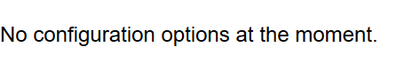


 
## Create an app manifest using Teams App Studio ##
1. Browse to https://teams.microsoft.com
2. Click on the **Store** icon and choose the **App Studio" app and click **Install**

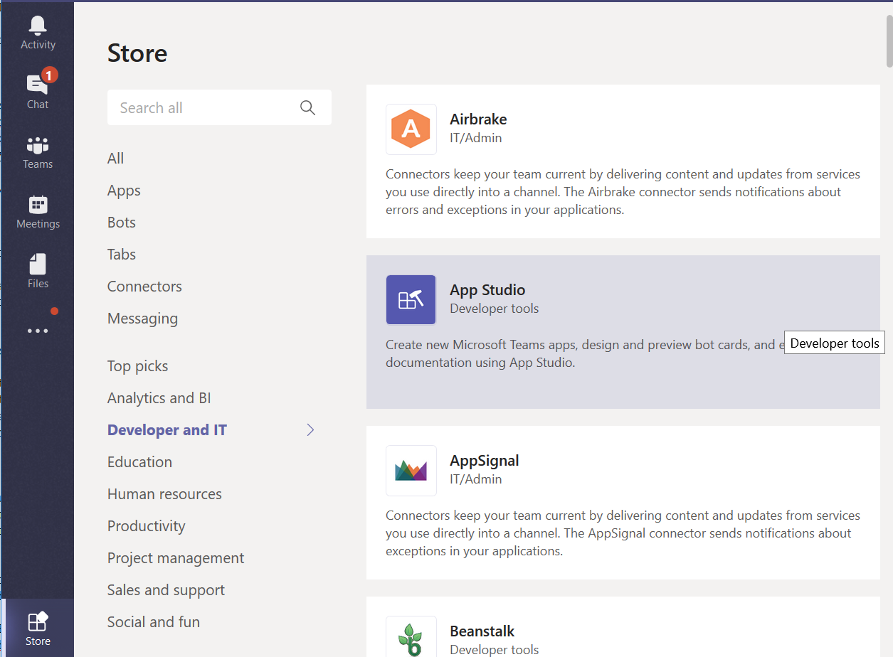

3. Click on the **Open** button next to the App option to go to the App Studio

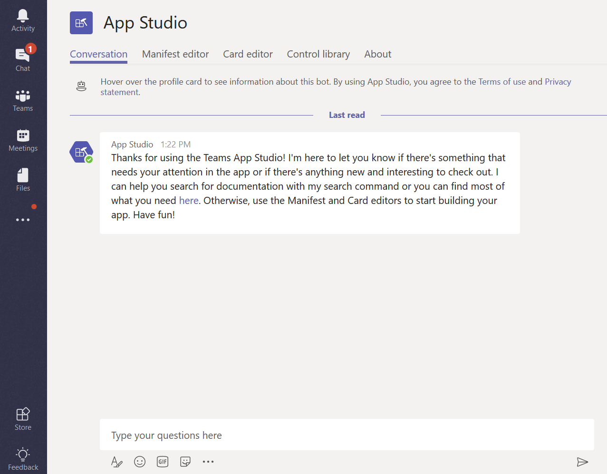

4. Change to the **Manifest editor** panel, click **Login** and accept the permissions requests.

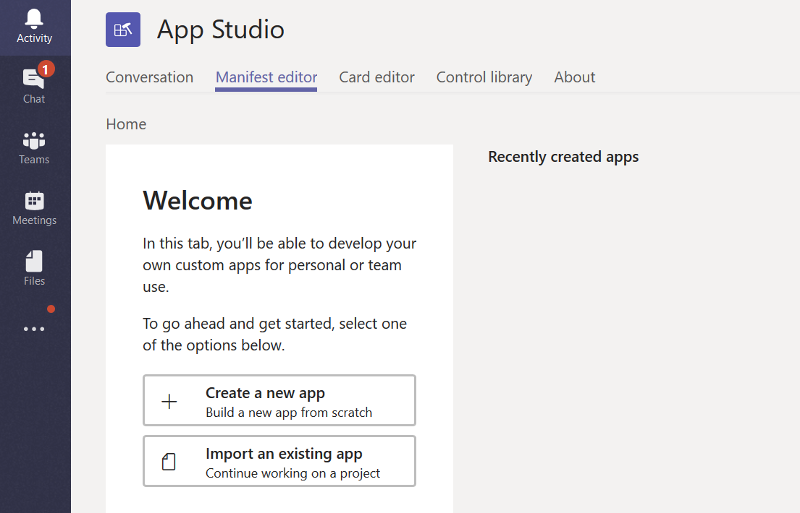

5. Click on **+ Create a new app** and then on the new app card added in the app list.

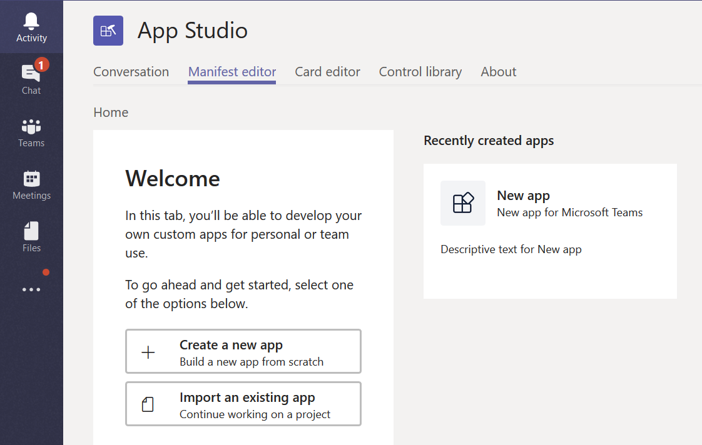

6. Complete the manifest form with your app details.  Here are the two icons for the manifest:  and 

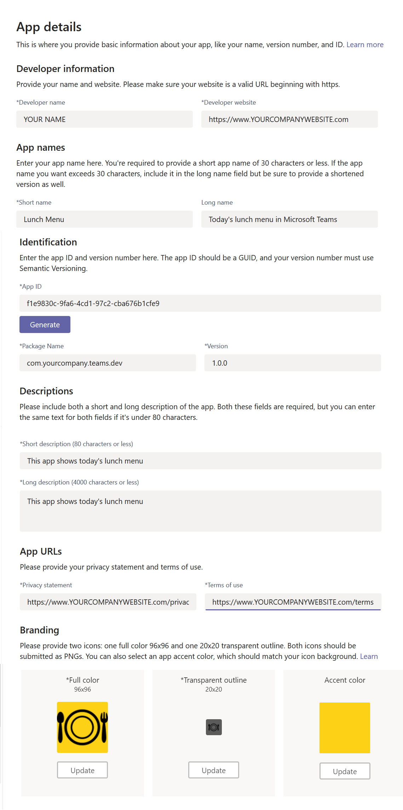
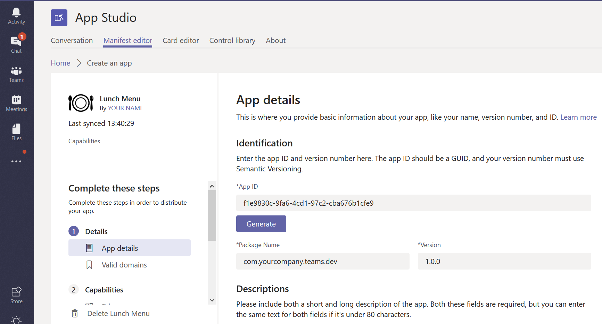
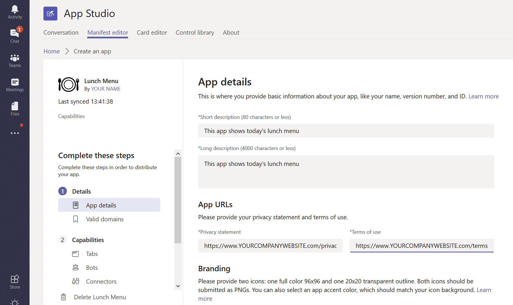
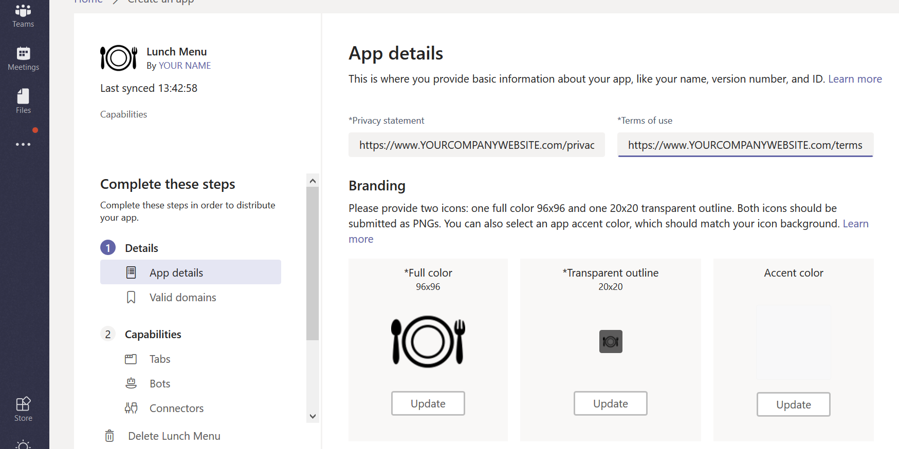

7. Click on the **Valid domains** selector from the left panel and add these Valid domains:
- secure.aadcdn.microsoftonline-p.com
- *.microsoftonline.com
- *.sharepointonline.com
- *.teams.microsoft.com

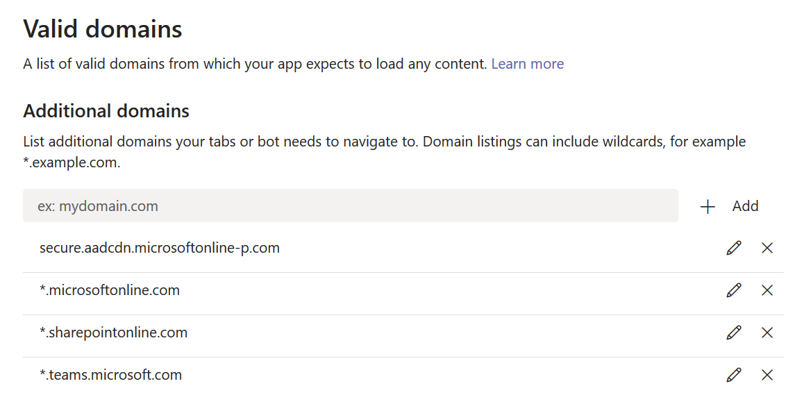


8. Click on the **Tabs** selector from the left panel under **Capabilities** and add a **Team tab** with this config URL: https://YOUR_APP_NAME.azurewebsites.net/config

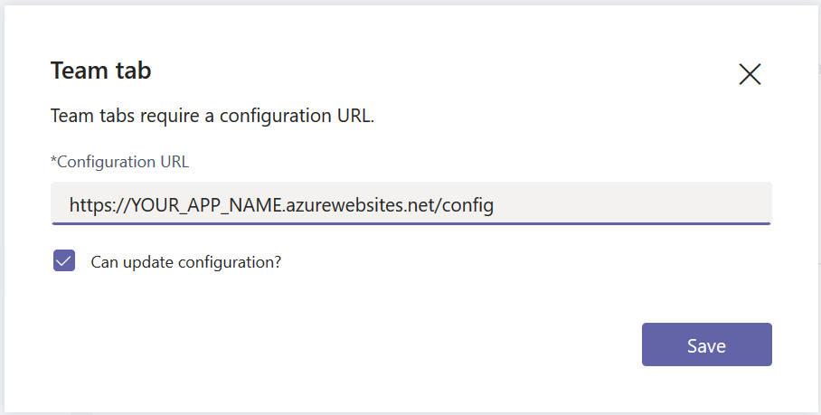

9. Click on the **Test and Distribute** selector from the left panel under **Distribute** and then the **Export** button to download and save the **LunchMenu.zip** manifest file to your desktop.


## Sideload an app to a Team
> **Note**: For these steps, the Office 365 tenant must be configured to allow Teams app sideloading (uploading an app file instead of choosing from the Teams app store) 

1. Choose the Teams section and click on the ellipsis next to the **Lunch** team.

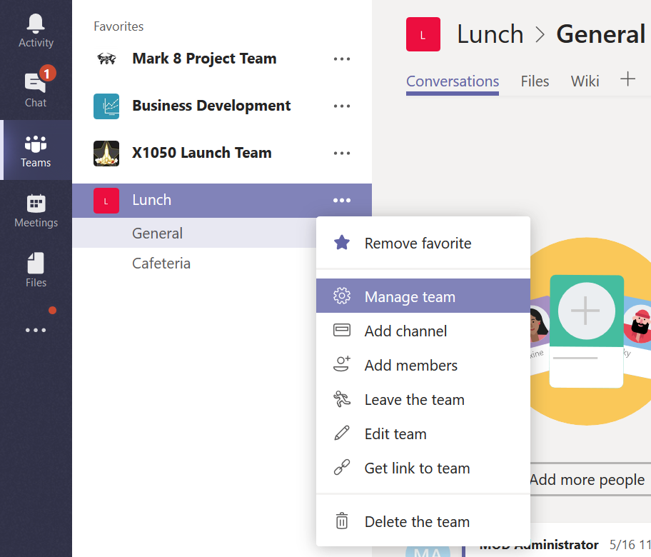

2. Choose the **Apps* section and click on the **Upload a custom app** link in the bottom right corner.

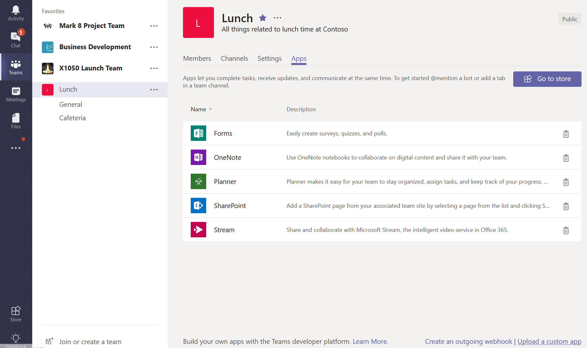

3. Locate and select the **Lunchmenu.zip** file previously downloaded and when uploaded the app will appear in the Team app list.

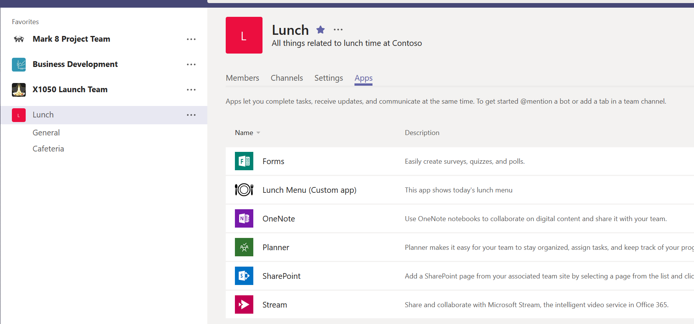


## Add the custom app to a Team channel

1. Choose the **General** channel in the **Lunch** team and click on the **+** to add the new Lunch Menu app to the channel.


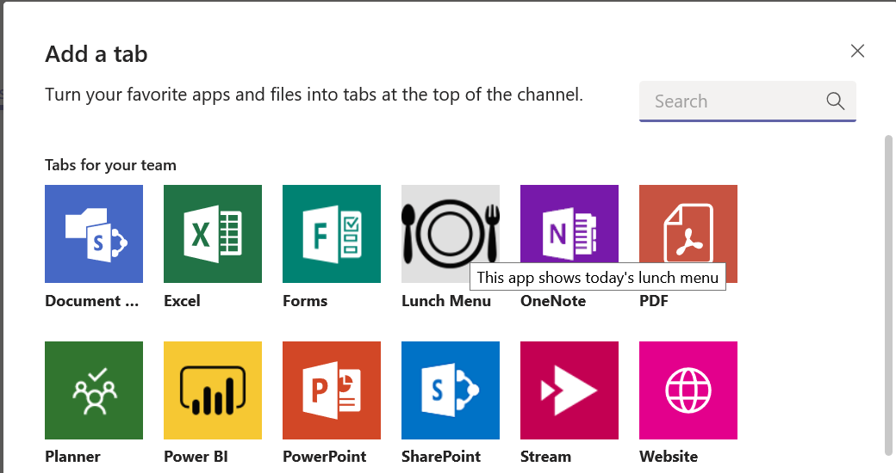

2. The configuration screen appears and renders the page returned from the configuration URL.
> **Note**: If the `microsoftTeams.settings.setValidityState(true);` not called in the configuration page, the **Save** button is never activated and the user cannot proceed.

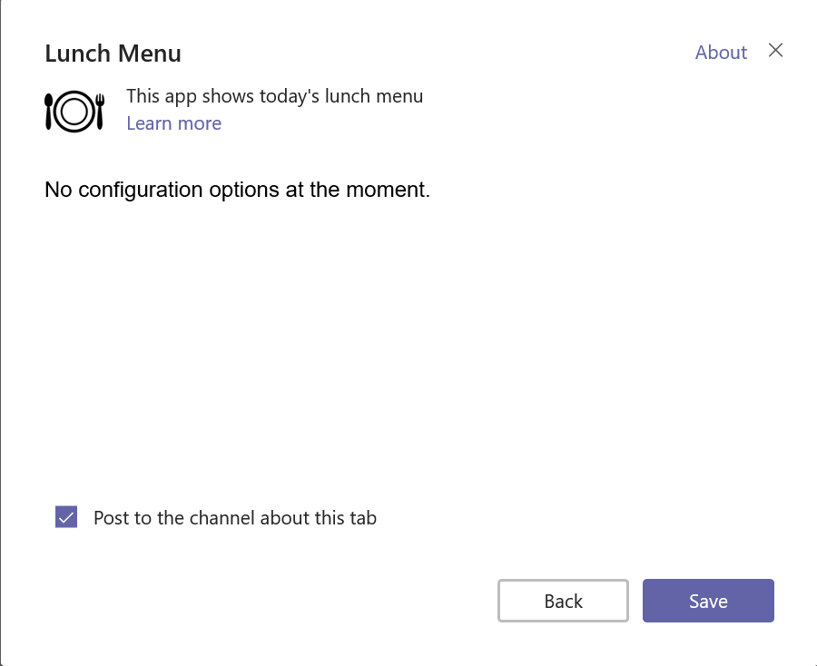

3. The custom tab is added to the channel and rendered correctly

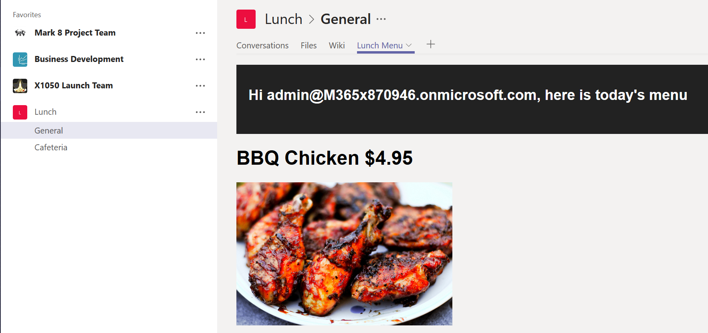


## Add Team UI components ##
To maintain the Teams and Office 365 look and feel, you can include the Teams CSS or React components to your project.  

Further details are in the **Control Library** in the Teams App Studio.

Color styling information is available here: [Teams - Design guidelines - color](https://docs.microsoft.com/en-us/microsoftteams/platform/resources/design/components/color)


