# Build a Responsive Web App

## Prerequisites

This part is **optional**, if you want to use our Knowzy [ASP.NET](https://www.asp.net/) example project continue with this part.

1. To start, clone or download the repository code from LOCATION REQUIRED

1. Open the folder: `PWA/source code/`
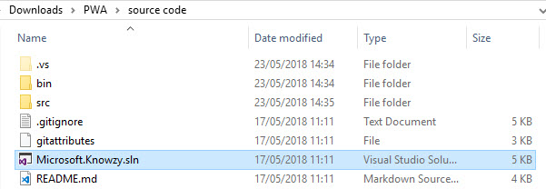

1. Execute the **Microsoft.Knowzy.sln** solution to open the project in visual studio.

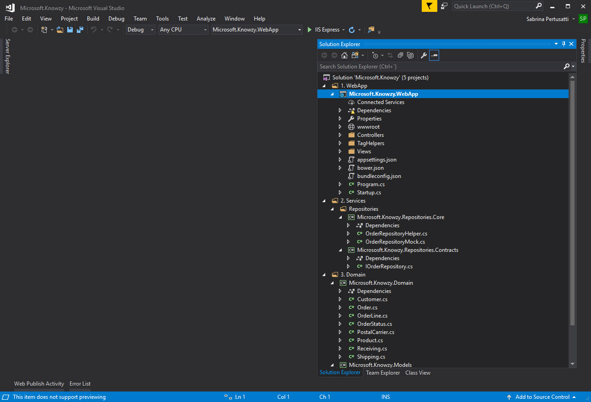

1. Now run your web app in a browser, by pressing F5 in Visual Studio or by clicking the start button:


## Responsive Web Design

Responsive web design makes your web page look good on all devices (desktops, tablets, and phones) using HTML and CSS to resize, hide, shrink, enlarge, or move the content to optimize it for different screen sizes.

Our website doesn't yet have a responsive design, so let see what happens if we simulate a mobile screen:
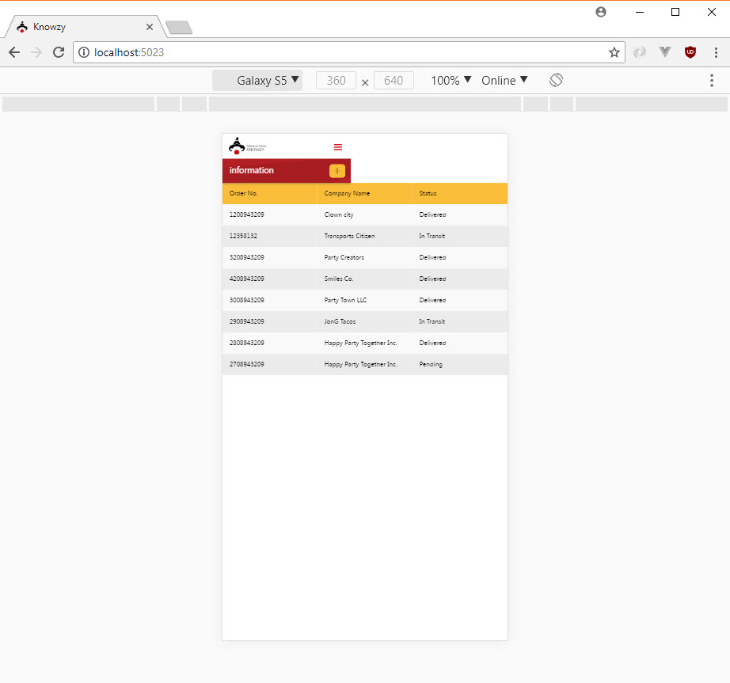

You can see that the header changes but the list still displays text that is too small to read. To adapt it to the smaller screen we will add some *media queries*, a CSS feature that enable webpage content to adapt to different screen sizes and resolutions.

### Make your website responsive.

Let's fix the list's text size. The problem is due to the CSS class named `container-main` having a fixed width:

```css

.container-main {
    width: 800px;
    padding-right: 15px;
    padding-left: 15px;
    margin: 0 auto;
}
```


1. To fix it, open the file `\wwwroot\css\site.css`
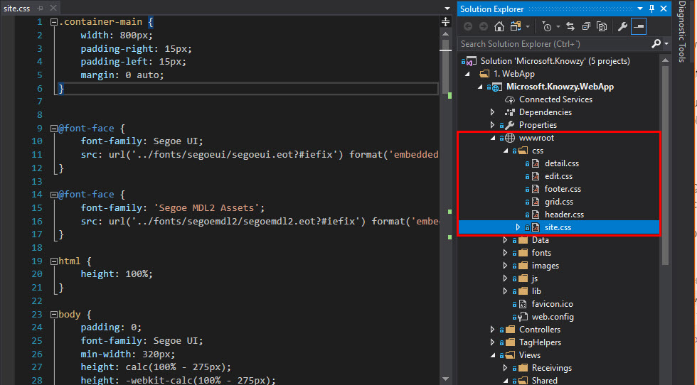

2. We can now adapt the CSS to other screens sizes by adding some media queries. For example, to modify the container width to screen sizes of 320px, 768px, 992px, and 1200px, we make the following changes:

    ```css

    @media all and (min-width:320px) {
        .container-main {
            width: 100%;
        }
    }

    @media all and (min-width:768px) {
        .container-main {
            width: 750px;
        }
    }

    @media all and (min-width:992px) {
        .container-main {
            width: 970px;
        }
    }

    @media all and (min-width:1200px) {
        .container-main {
            width: 1170px;
        }
    }
    ```

    Be sure to add these rules *below* the "container-main" rule, so the media queries will override the width of the main rule.

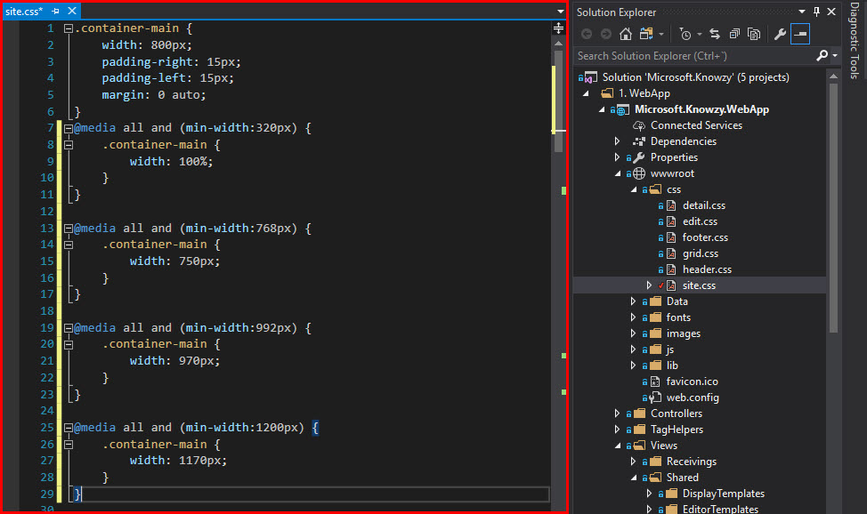

Congratulations! Your app is now ready to be viewed on devices with different screen sizes and orientations.
    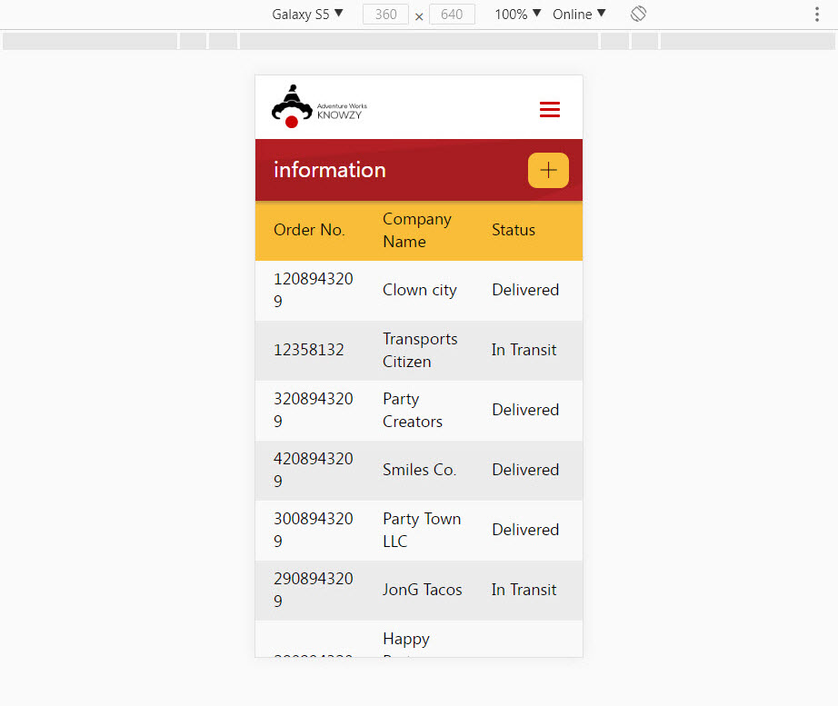


### Deploy your [ASP.net](https://www.asp.net/) App Changes (optional)


If you want to publish the application to Azure, follow these steps or continue locally using IIS and skip to the next step.

**Important!** you will need an Azure account to use Azure services. If don't have an account, you can create one for free here: [Azure free account](https://azure.microsoft.com/en-us/free/).

Using Azure services:

1. In Visual Studio, select the "Microsoft.Knowzy.WebApp" in the solution explorer, then choose Build > Publish...

    **NOTE:** Some configurations of Visual Studio may have the "publish" option as its own menu.

    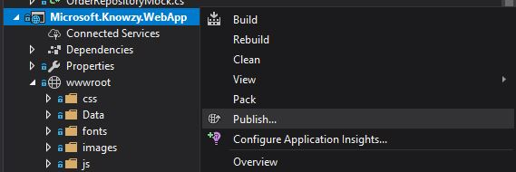

2. Choose "Microsoft Azure App Service" from the selection screen.

    

3.  Sign into your Azure account to create a new Azure App Service.

    **Important!:** Use the **default Web App Name** to avoid conflicts.

    Press "New..." button to create the Resource Group, and the App Service Plan.

    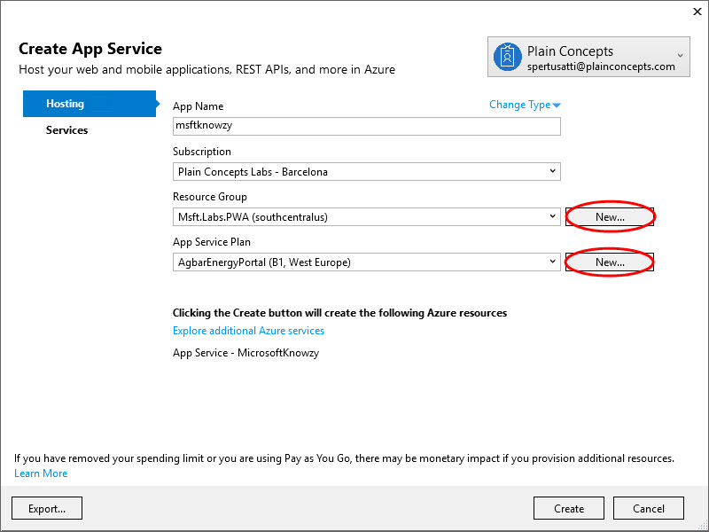

4. Click "Create" to create the app in Azure. When it finishes you should see the next step "Publish".

    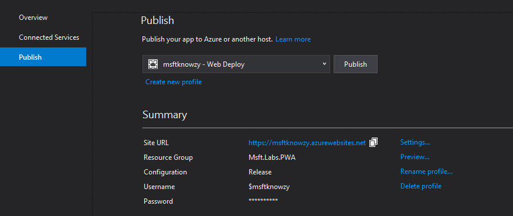

    Save the generated **Site url**. This is the url of your published website.

5. Make sure the application isn't running, and click "Publish". When it finishes will automatically show the application.

    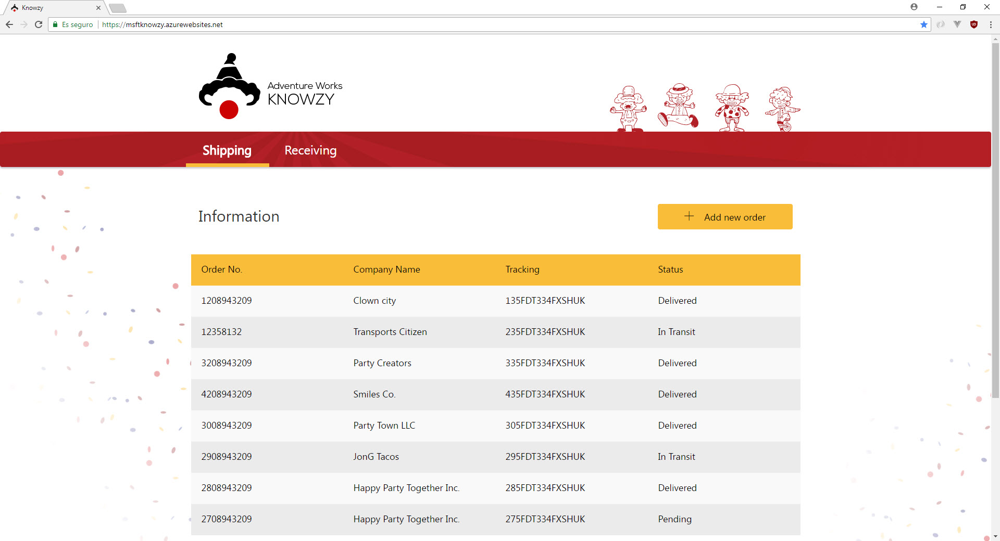


## Deployment Errors

When attempting to deploy, you may run into an issue where Azure complains that a certain .dll is locked. If this is the case, you'll have to perform the following steps:

    1. Sign into [https://portal.azure.com](https://portal.azure.com) with the same credentials you used to deploy your web app

    2. Select "App Services" from the left-most menu (see 1 in the figure below)

    3. Select your web app (see 2 in the figure below)

    4. Press "Restart" on the top menu bar (see 3 in the figure below)

        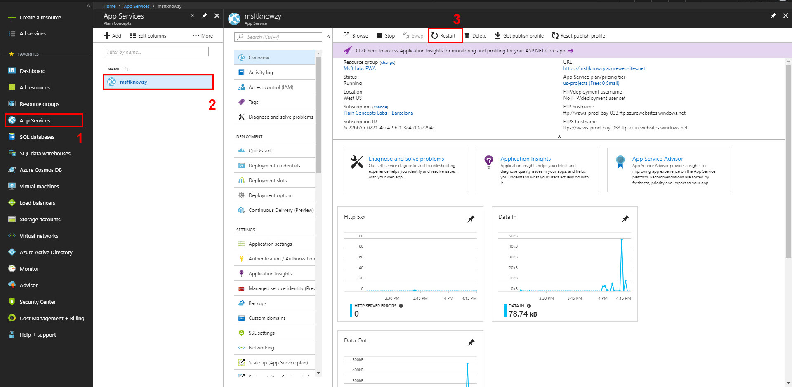

    5. Once your web app has finished restarting, re-deploying your web app should be successful.
