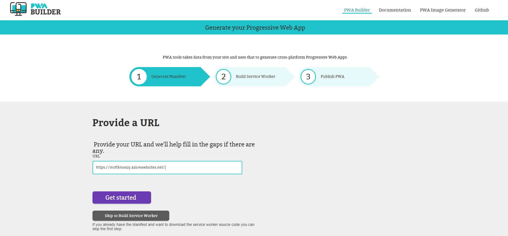
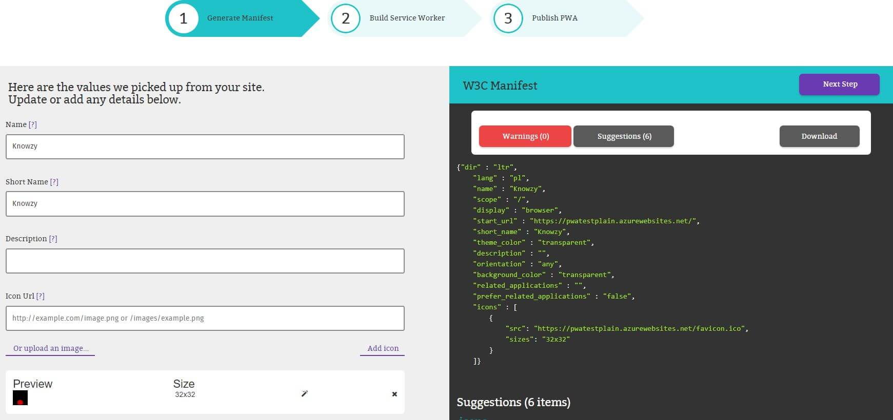
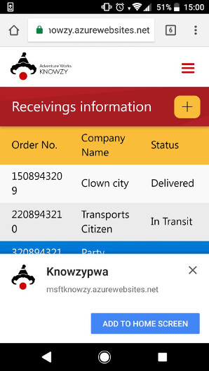

# Build a PWA with PWA Builder

## Prerequisites

This step requires that you have completed the previous section, **Build a Responsive Web App**.

## Manifest

The *Manifest* for a web app is a JSON-based manifest file that provides a centralized place to put metadata associated with a web application (including app name, icons, presentation, and so on.). PWAs use this manifest to control the appearance and behavior of the app when it is installed and launched from the user's device.

The manifest contains startup parameters and application defaults for when a web application is launched on different devices.

The manifest contains the following parameters:

+ The `name`:
The name member is a string that represents the name of the web application as it is usually displayed to the user (e.g., amongst a list of other applications, or as a label for an icon).

+ The `short_name`:
The short_name member is a string that represents a short version of the name of the web application. It is intended to be used where there is insufficient space to display the full name of the web application.

+ The `scope`:
The scope member is a string that defines when the manifest settings are used. For example, if the scope is set to the app, once user navigates away from the app, the manifest no longer applies and everything appears as a standard web page.

+ The `icons`
The icons member is an array of ImageResources that can serve as iconic representations of the web application in various contexts. For example, they can be used to represent the web application amongst a list of other applications, or to integrate the web application with an OS's task switcher and/or system preferences.

Learn more about the content in [MDN web docs](https://developer.mozilla.org/en-US/docs/Web/Manifest).

### Provide a URL

The first step is to build the manifest for your application using the **pwabuilder.com** web site. The builder will search in the home page of your site looking for information about the app in specific meta tags.

1. Open a browser and navigate to [https://preview.pwabuilder.com/](https://preview.pwabuilder.com/).
2. In the URL textbox, enter the https URL of your site and click on **Get Started**.

    > **Note** Your website URL will likely default to the http version in the browser but all Azure websites also have a valid https certificate so https can be used on any azure website.

### Generate manifest
The builder will search in the home page of your site looking for an existing manifest. If it doesn't find one, it will generate information about the app and store it specific meta tags, or propose default values. It will also show any warnings or suggestions to address potential issues in the collected metadata. Be sure you address any warnings before you continue.

### Add Images

The builder site also checks whether the manifest has defined the expected icon sizes for the different platforms (Windows, Android, iOS) and helps to generate the missing sizes.

1. For our site, we don't have any image defined in the manifest so we'll proceed uploading an image with our app logo. To do this, click on the **Upload an image…** link at the left pane.

2. Save the below the Knowzy logo to your PC by right clicking and "Save image as".

    

3. Browse to the location of the image you downloaded. If you want to generate the missing sizes, make sure the **Generate missing images from this image** checkbox is marked.

    > **Note:** The **Upload image** option will generate the required image sizes for Windows 10, and suggested images for other platforms.

    
    

4. Click **Submit**. In our example, the missing image sizes are automatically generated and added to the manifest.

    

  > **Note:** The next options are required to show the download banner in other devices:
  >+ The `short_name ` (used in home page)
  >+ The `name` (used in the banner to download)
  >+ An icon png 192x192 size (pwabuilder generate it automatically on generating images)
  >+ The `start_url` ( set the home page for the application when users access from a different device)

  You might find it difficult to see the download banner. For now let's ignore that and move onto the next step.

  

5.  Change the display mode to `Standalone` as we want the web application to look and feel like a standalone native application.

### References

- [PWA Builder](https://preview.pwabuilder.com/)
