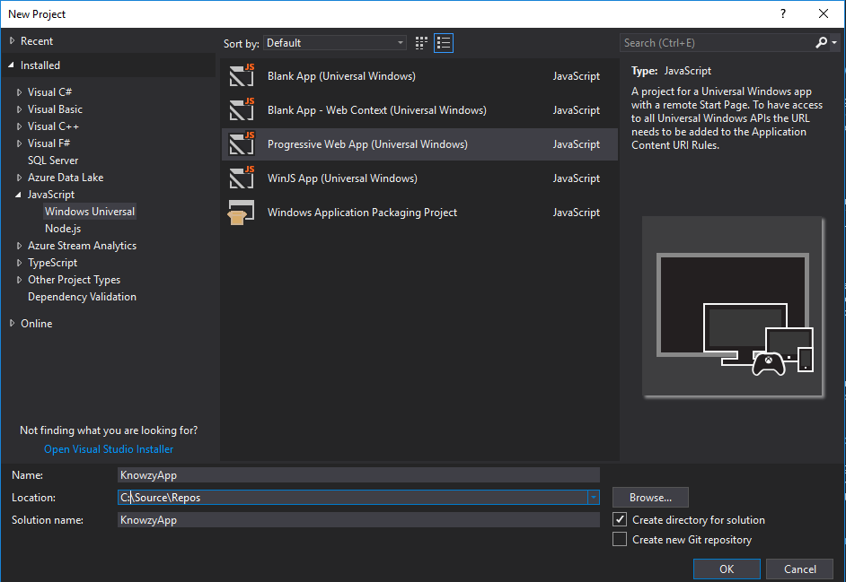
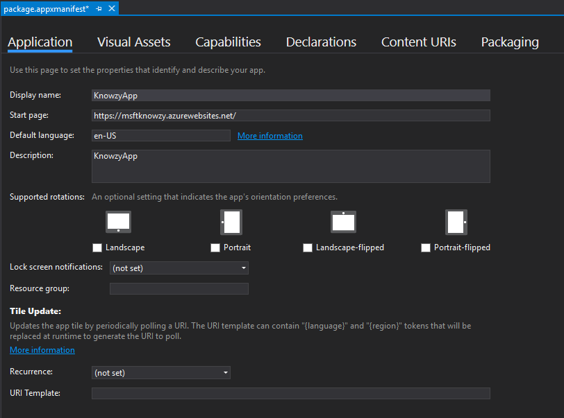
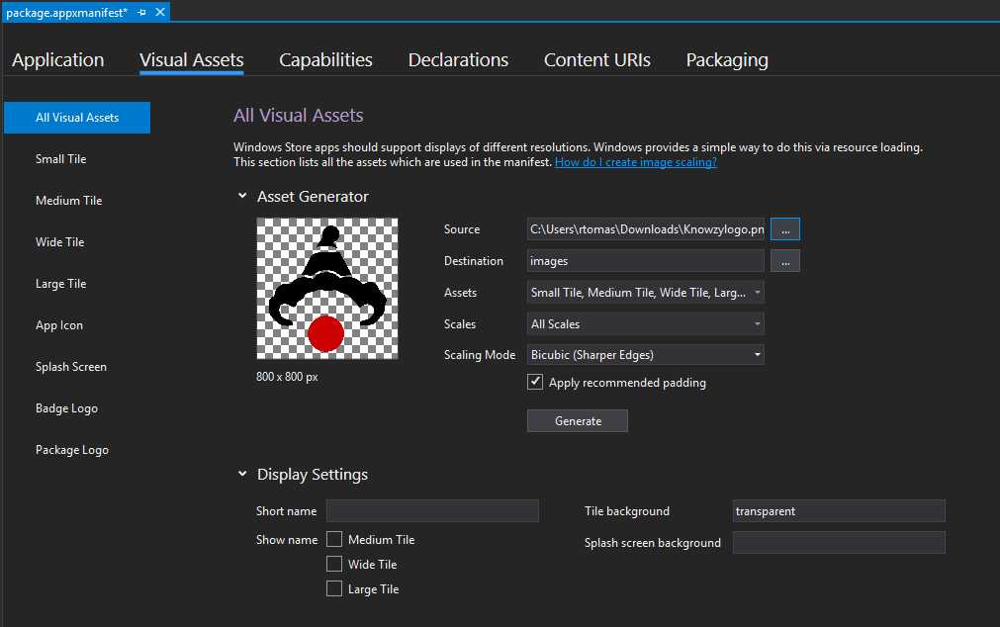
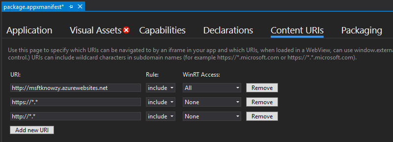
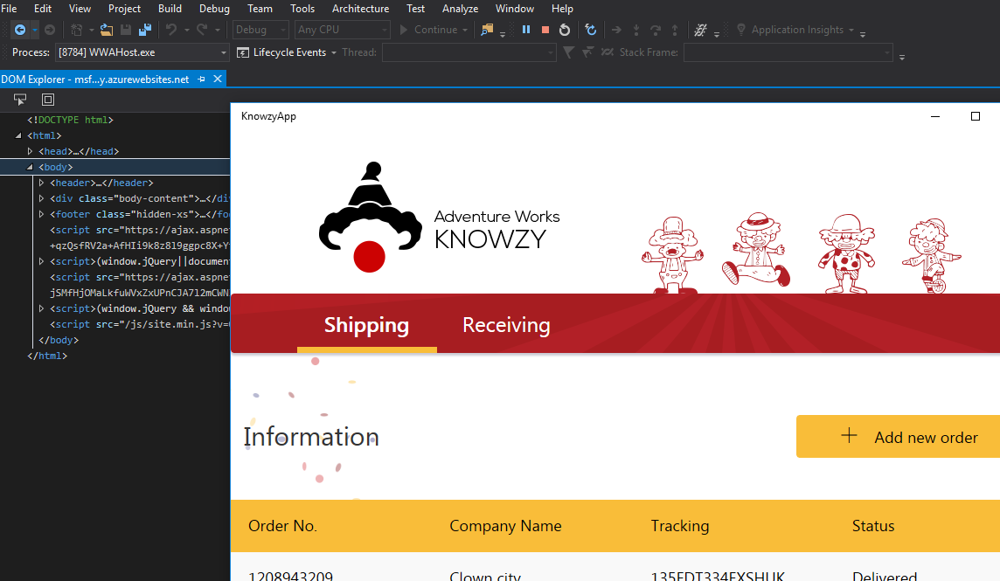

# Run in VS

Prerequisites:
- Visual studio 2017 Professional, Enterprise, Community or Preview editions.
- From the Visual Studio Installer, choose the workload `Universal Windows Platform development`

1. Create a new PWA project in visual studio using a predefined template

 

2.  Open the appxmanifest file and set the url of our web app as a start page: `https://msftknowzy.azurewebsites.net/`

 

3. Select the visual assets tab, select a source image and click the generate button to create the set of images for our pwa app.

 

4. Allow to navigate to our url web app.

 

5. Hit F5 to debug the pwa app in Visual Studio.

 
