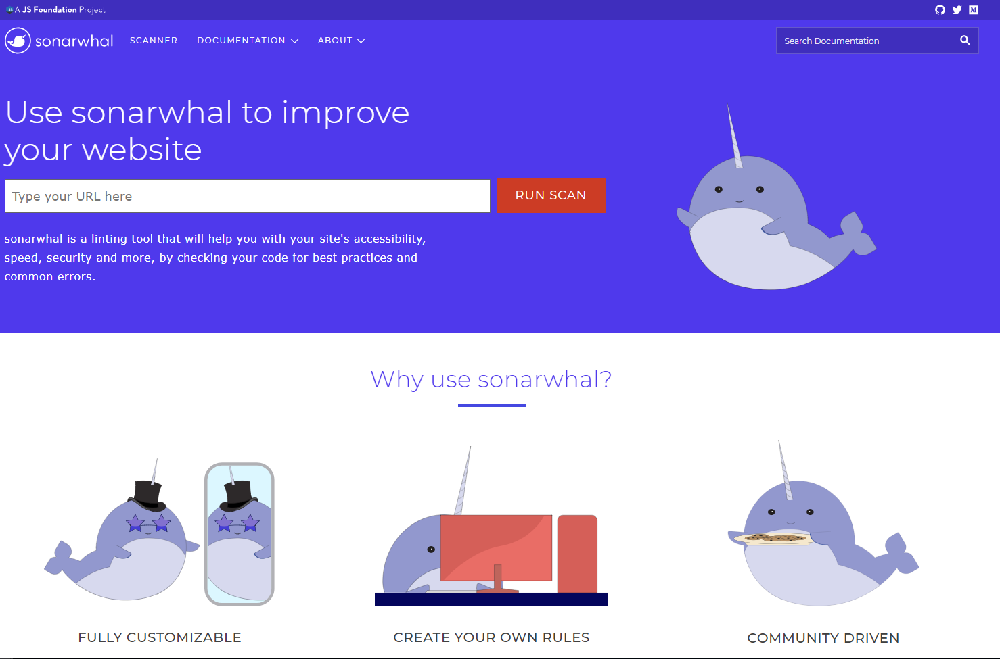
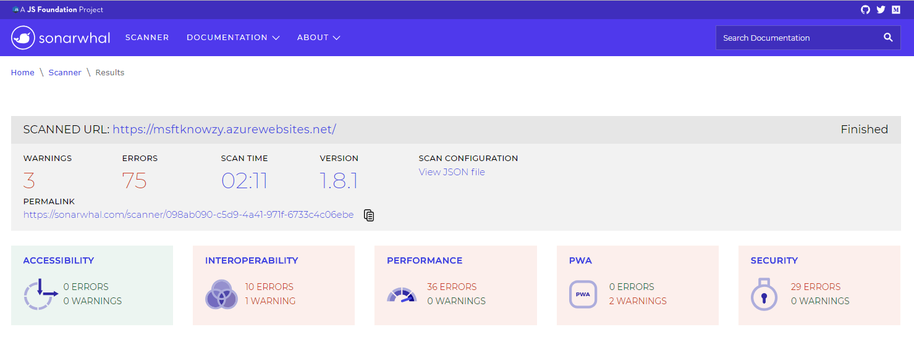
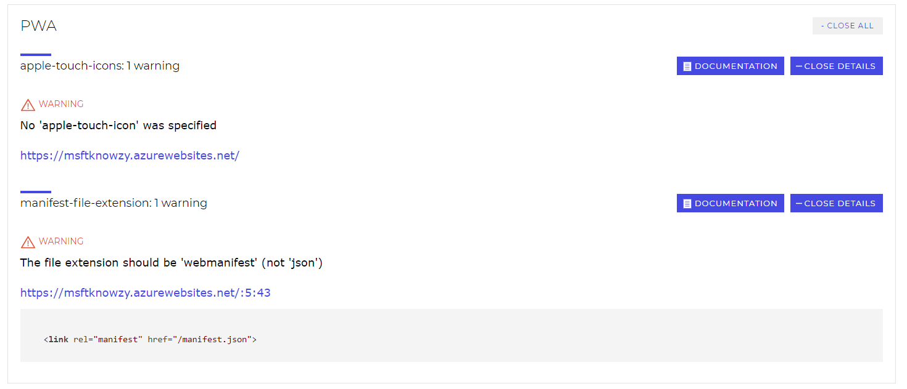
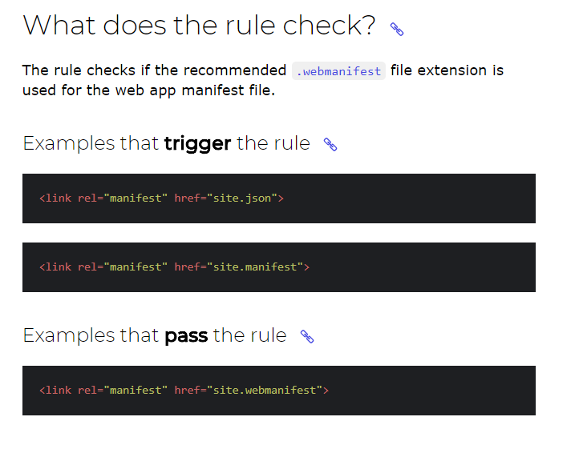
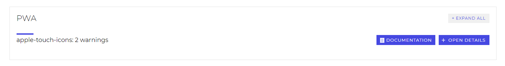
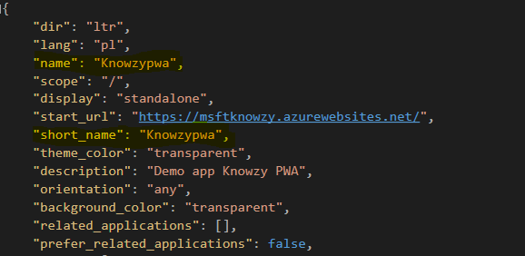
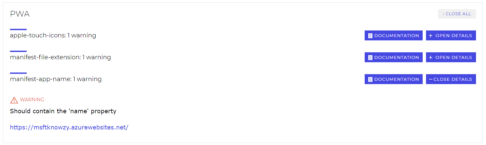
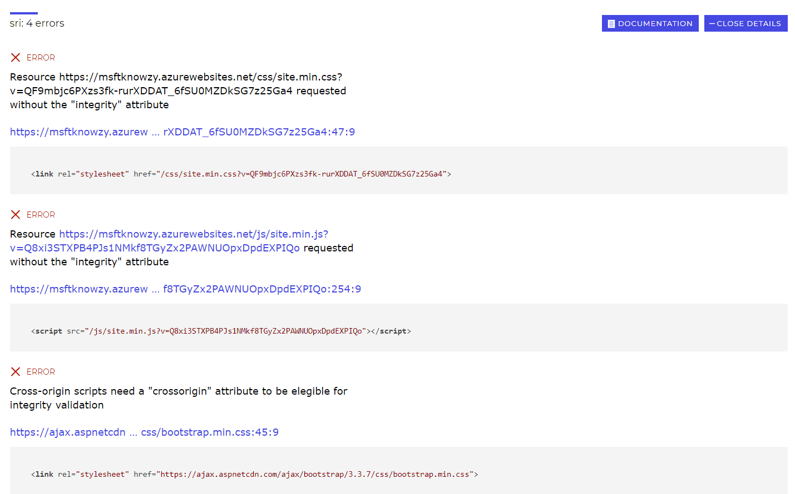
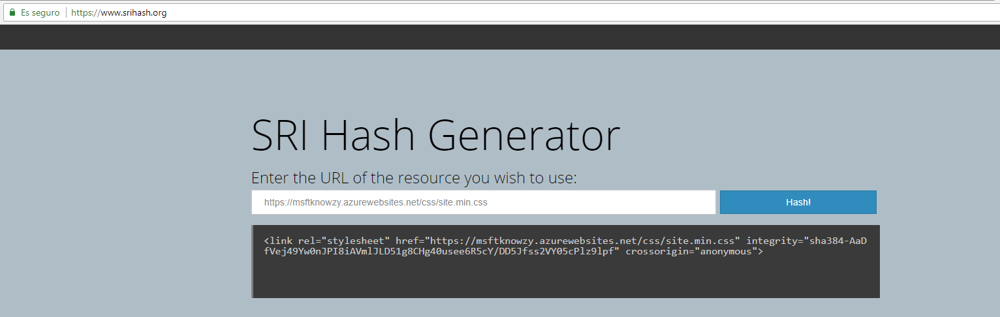

# App quality review

To be able to test the quality of our web app and get different metrics we will use a tool called `Sonarwhal`.

**What is sonarwhal?**
sonarwhal is a linting tool for the web, with a strong focus on the developer experience: easy to configure, develop, and well documented.

sonarwhal doesn’t want to reinvent the wheel. For that reason it tries to integrate other tools and services that do a great job, and contribute back where appropriate. For example, we are using aXe for accessibility, SSL Server Test for checking the certificate configuration, etc.

**What is sonarwhal’s goal?**
We have a few:

Bring the community together to decide what best practices are in several areas.
Help web developers write the best possible code.
Clean up the web of bad practices.
Promote community tools and services that do an awesome job but could not be known by everybody.


1. Go to the online version [Sonarwhal online](https://sonarwhal.com/)

<br>

2. Introduce the url of the web app to be analyzed, hit the `RUN SCAN` button and wait for the report to be finished.

<br>

3. Go to the PWA section and check out that the web app has no errors so that it is PWA compliant.

<br>


### Pwa suggestions

On the PWA section, there is the possibility to see the details of the error/warning as well as a link to a page that shows the documentation about that error/warning and suggestions on how to solve it.

1. Hit the documentation button of the warning `The file extension should be 'webmanifest' (not 'json')` and check what might be the cause that triggered the warning and the suggestion to pass the rule.

<br>

2. Navigate to the directory `Microsoft.Knowzy.WebApp\wwwroot\` in the source code and rename the manifest extension as `manifest.webmanifest`.

3. Navigate to the file located at `Microsoft.Knowzy.WebApp\Views\Shippings\Index.cshtml` in the source code and replace the manifest link with `<link rel="manifest" href="~/manifest.webmanifest">`

4. Publish your web app again in Azure **See step 2 - Deploy your ASP.net App Changes**.

5. Scan again the web app using Sonarwhal and check that the webmanifest warning has been solved.

<br>

6. Now let's consider that we created a manifest with some required parameters missing such as `name` and `short_name`. Modify the manifest located at `Microsoft.Knowzy.WebApp\wwwroot\` in the source code and remove the name and short_name parameters.

<br>

7. Publish the web app again in Azure.

8. Go to Sonarwhal and execute the scan again. Noticed now that there is a warning in the PWA section stating that the name is missing.

<br>

9. Include again the `name` and `short_name` in the manifest. Publish in Azure the changes and execute Sonarwhal again. The warning should disappear.

### SRI suggestions

Apart from PWA suggestions, Sonarwhal offers other suggestions for performance, security, accessibility and interoperability.

In the security section, the Subresource Integrity `SRI` feature enables you to mitigate the risk of attacks, by ensuring that the files your Web app fetches, for instance from a CDN, have been delivered without a third-party having injected any additional content into those files.

1. On the Security section, go to the SRI section and click the Details button to check the cause of the security issues.

<br>

2. As Sonarwhal suggested, in our web app is missing the integrity attribute in scripts and stylesheets. Go to the following link to generate the hash the each script and stylesheet [SRI Hash Generator](https://www.srihash.org/)

3. On the Hash generator site, introduce the URL of the site.min.css stylesheet `https://msftknowzy.azurewebsites.net/css/site.min.css` and copy the integrity hash in the stylesheet link in the _Layout.cshtml file located in the directory `Microsoft.Knowzy.WebApp\Views\Shared\` as shown below:

<br>

```JS
#Microsoft.Knowzy.WebApp\Views\Shared\_Layout.cshtml
<link rel="stylesheet" href="~/css/site.min.css" asp-append-version="true" integrity="sha384-AaDfVej49Yw0nJPI8iAVmlJLD51g8CHg40usee6R5cY/DD5Jfss2VY05cPlz9lpf" />
```

4. Do the same previous steps for the site.min.js script `https://msftknowzy.azurewebsites.net/js/site.min.js` script.

5. Add the integrity hash for the bootstrap CDN stylesheet as shown below:

```JS
#Microsoft.Knowzy.WebApp\Views\Shared\_Layout.cshtml
<link rel="stylesheet" href="https://ajax.aspnetcdn.com/ajax/bootstrap/3.3.7/css/bootstrap.min.css"
              asp-fallback-href="~/lib/bootstrap/dist/css/bootstrap.min.css"
              asp-fallback-test-class="sr-only" asp-fallback-test-property="position" asp-fallback-test-value="absolute" integrity="sha384-BVYiiSIFeK1dGmJRAkycuHAHRg32OmUcww7on3RYdg4Va+PmSTsz/K68vbdEjh4u" crossorigin="anonymous"/>
```
6. Launch again Sonarwhal scan and check that all the SRI security issues have been solved.

**Other app quality review tools:**

+ [Page speed insight](https://developers.google.com/speed/pagespeed/insights/): PageSpeed Insights analyzes the content of a web page, then generates suggestions to make that page faster.
+ [Accessibility analyzer](https://wave.webaim.org): WAVE can help you evaluate the accessibility of your web content.
+ [Webaim - contrast checker:](https://webaim.org/resources/contrastchecker/) checks the contrast ratio of a color.
+ [W3C developers tools](https://w3c.github.io/developers/tools/): W3C offers a variety of open source tools to use with your website.
