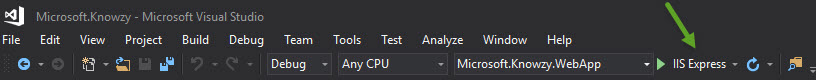
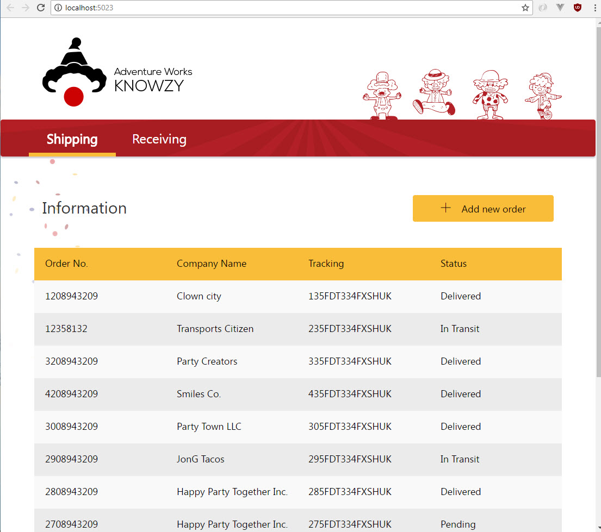
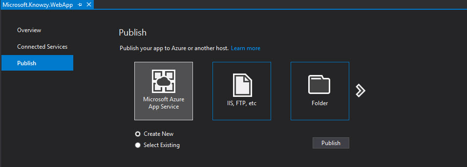
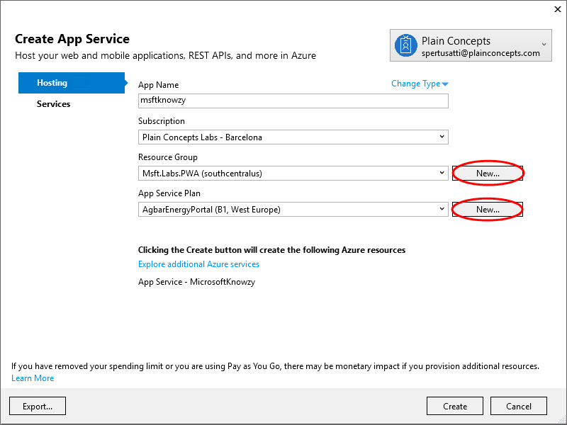
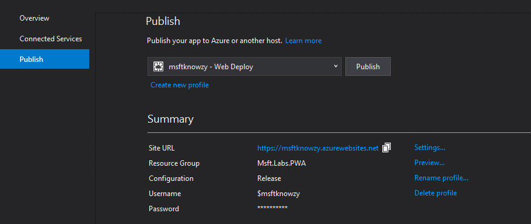
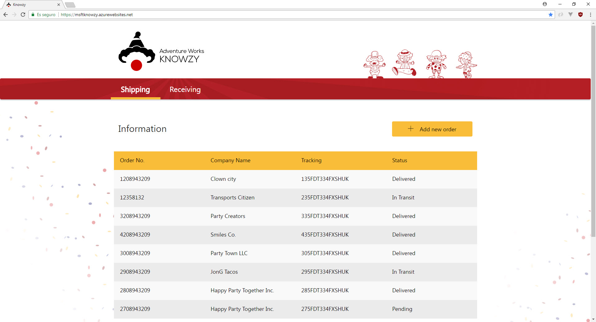
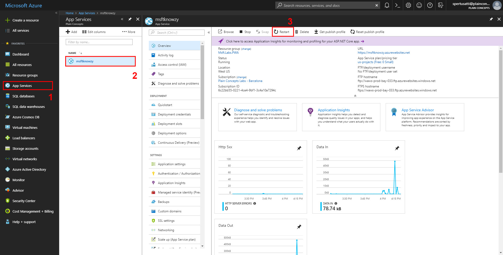

# Build a Responsive Web App

## Prerequisites 

To start clone or download the repository code and open the folder: `PWA/source code final/src/1. WebApp/Microsoft.Knowzy.WebApp/` and execute the **Microsoft.Knowzy.sln** solution to open the project in visual studio.


## Task
### Make your website responsive.
  Most of the work has already been done to make sure that your site works well across different devices, but you will need to make a few adjustments to the code base to ensure that it flows properly for screens of all sizes.  You should also make sure that the webapp works across platforms, since some of the Knowzy contractors carry Android tablets instead of Windows 10 devices.


  **Doing your webapp responsive**
  1. Open up your site.css file at the following path:
        
        \wwwroot\css\site.css
    and find the following declaration toward the top of the page:
    
        ```css

        .container-main {
            width: 800px;
            padding-right: 15px;
            padding-left: 15px;
            margin: 0 auto;
        }
        ``` 


2. Add a declaration for the "container-main" class inside of a media query.
Media queries resize the page properly for different screen sizes. You will want to create media queries with style declarations for the screen sizes of 320px, 768px, 992px, and 1200px like below:

    ```css

    @media all and (min-width:320px) {
        .container-main {
            width: 100%;
        }
    }

    @media all and (min-width:768px) {
        .container-main {
            width: 750px;
        }
    }

    @media all and (min-width:992px) {
        .container-main {
            width: 970px;
        }
    }

    @media all and (min-width:1200px) {
        .container-main {
            width: 1170px;
        }
    }
    ```

    Be sure to add these rules *below* the "container-main" rule, so the media queries will override the width of the main rule.

3. View your web app in a browser (you can do this by hitting F5 in visual studio or clicking on the start button), and adjust the width of your window to test responsiveness of the design.
If you have a tablet device, you can change the orientation of your device to make sure that the page response properly.  
 
    

    
Congratitulations! Your app is now ready to be viewed on devices with different screen sizes and orientations.
    


### Deploy your ASP.net App Changes


Now you can publish them to your website on Azure.

**Important!** you will need an Azure account to use Azure services, if don't have any you can create for free in [Azure](https://azure.microsoft.com/en-us/free/). 
For more information you can follow this small tutorial: [How to create up a new Microsoft Azure account.](https://www.acronis.com/en-us/articles/create-microsoft-azure-account/)

Using azure services:

1. In Visual Studio select the "Microsoft.Knowzy.WebApp" in the solution explorer, then choose Build > Publish... 

    **NOTE:** Some configurations of Visual Studio may have the "publish" option as its own menu.

    

2. Choose "Microsoft Azure App Service" from the selection screen

    

3.  Sign into your Azure account to create a new Azure App Service.

    >**NOTE:** Use the **default Web App Name** to avoid conflicts.
    
    Press "New..." button to create the Resource Group, and the App Service Plan.

    

4. Click "Create" to create the app in azure. When it finishes you should see the Publish next step:

    

    Save the generated **Site url**, is the url of your website published.

5. Click on "Publish button" with the application stopped, when it finishes will show automatically the application.


    


## Deployment Errors
* When attempting to deploy, you may run into an issue where Azure complains that a certain .dll is locked. If this is the case, you'll have to perform the following steps:
    1. Sign into [https://portal.azure.com](https://portal.azure.com) with the same credentials you used to deploy your web app

    2. Select "App Services" from the left-most menu (see 1 in the figure below)

    3. Select your web app (see 2 in the figure below)

    4. Press restart on the top menu bar (see 3 in the figure below)

        

    5. Once your web app has finished restarting, re-deploying your web app should be successful.


### Continue to [Build your PWA >> ](pwa_03_start.md)
