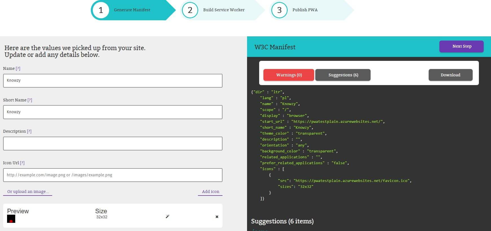
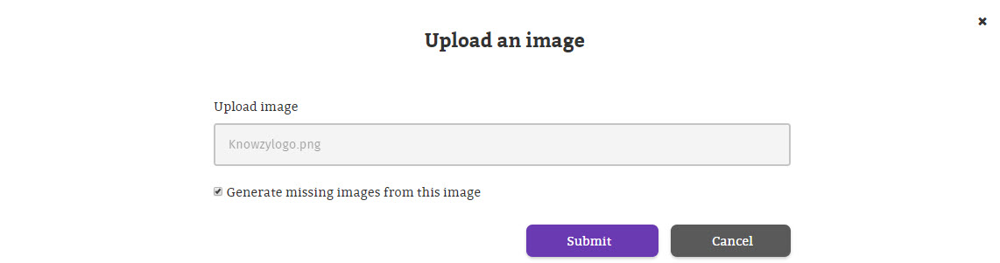
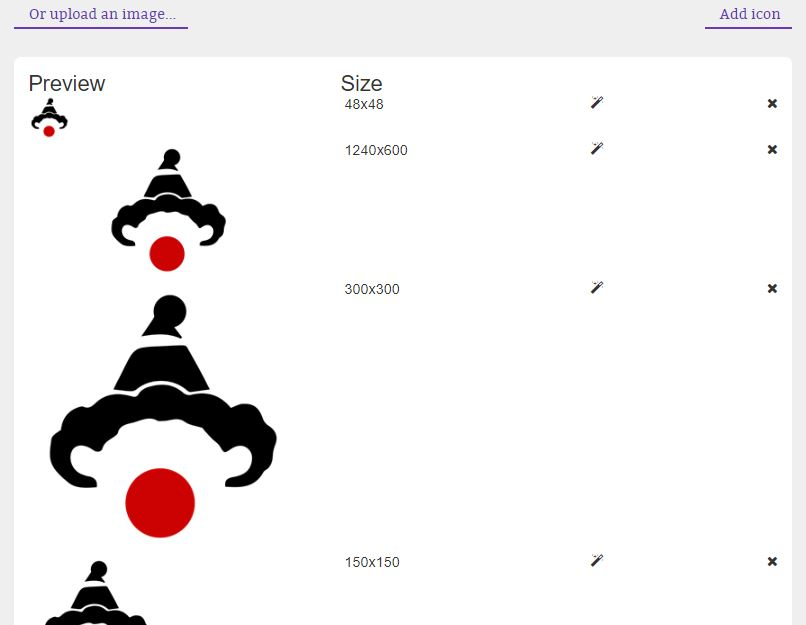
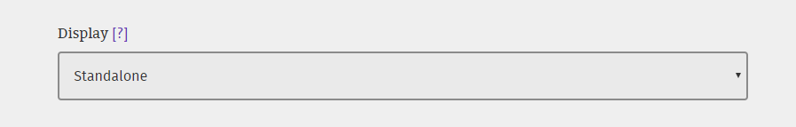
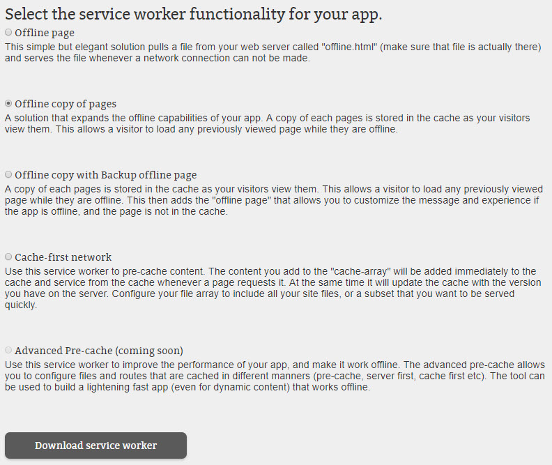

# Build a PWA with PWA Builder

## Prerequisites 

This task has a dependency on [Build a Responsive Web App](pwa_02_buildWebApp.md) task and the prerequisites found there.

## Manifest 

The Manifest for Web Apps is a JSON-based manifest file that provides a centralized place to put metadata associated with a web application (like app name, icons, presentation, etc.), thus solving the problem of having to maintain an heterogeneous set of meta tags and link tags to support each platform. PWAs use this manifest to control the appearance and behavior of the app when it is installed and launched from the user device.

A manifest contains startup parameters and application defaults for when a web application is launched on different devices, the manifest is used.

Parameters you can find in a manifest:
+ The `name`:
The name member is a string that represents the name of the web application as it is usually displayed to the user (e.g., amongst a list of other applications, or as a label for an icon).

+ The `short_name`:
The short_name member is a string that represents a short version of the name of the web application. It is intended to be used where there is insufficient space to display the full name of the web application.

+ The `description`: 
The description member allows the developer to describe the purpose of the web application.

+ The `scope`:
The scope member is a string that represents the navigation scope of this web application's application context.

+ The `icons`
The icons member is an array of ImageResources that can serve as iconic representations of the web application in various contexts. For example, they can be used to represent the web application amongst a list of other applications, or to integrate the web application with an OS's task switcher and/or system preferences.

Learn more about the content in [ webAppManifest dictionary](https://www.w3.org/TR/appmanifest/#dir-member) from w3 page.

### Provide a URL 

The first step is to build the Manifest for your application using the **pwabuilder.com** web site. The builder will search in the home page of your site looking for information about the app in specific meta tags, so let's start.

1. Open a browser and navigate to [https://www.pwabuilder.com](https://www.pwabuilder.com).
2. In the URL textbox, enter the https version of your URL of your site and click on **Get Started**. 

    > **Note** Your website URL will likely default to the http version in the browser but all azure websites also have a valid https certificate so https can be used on any azure website.

 

### Generate manifest
The builder will search in the home page of your site looking for an existing manifest. If not, it will gather information about the app in specific meta tags or propose default values for the manifest properties. It will also show any warnings or suggestions to address potential issues in the collected metadata. Be sure you address any warnings before you move on. 

 

### Add Images

The builder site also checks whether the manifest has defined the expected icon sizes for the different platforms (Windows, Android, iOS) and helps to generate the missing sizes.

1. For our side, we don't have any image defined in the manifest so we'll proceed uploading an image with our app logo. To do this, click on the **Upload an image…** link at the left pane. 

2. Save the below Knowzy logo to your PC by right clicking and "save image as".

     

3. Browse to the location of the image you downloaded and if you want to generate the missing sizes, make sure the **Generate missing images from this image** checkbox is marked. 

    > **Note:** The **Upload image** option will generate the required image sizes for Windows 10, and suggested images for other platforms.

     
    

4. Click **Submit**. In our example, the missing image sizes are automatically generated and added to the manifest.

     

  > **Note:** The next options are required to show the download banner in other devices: 
  >+ The `short_name ` (used in home page)
  >+ The `name` (used in the banner to download)
  >+ An icon png 192x192 size (must include the type image/png)
  >+ The `start_url` ( set the home page for the application when users access from a different device)

  

5.  Change the display mode to `Standalone` as we want the web application to look and feel like a standalone native application.

 

## Build Service Worker

During this step you will choose functionalities you want to add to your app. The builder will include code to use sample service workers implementing those features from a repository. *[Learn more about service workers](https://docs.pwabuilder.com/what/is/a/pwa/2018/02/03/what-is-a-service-worker.html).* There are a number of service workers to choose from on this page, but Knowzy is looking for a way to make sure it's field agents can access the app data when they have poor or no network connection.

1. For this functionality we'll choose the "Offline copy of pages" service worker.
 
 

2. How to add the manifest and service worker to your site, will be explained in the **Add manifest and service worker (sw)** section.  

### References

- [PWA Builder](https://www.pwabuilder.com)

### Continue to [Add manifest and sw >> ](pwa_04_sw.md)

