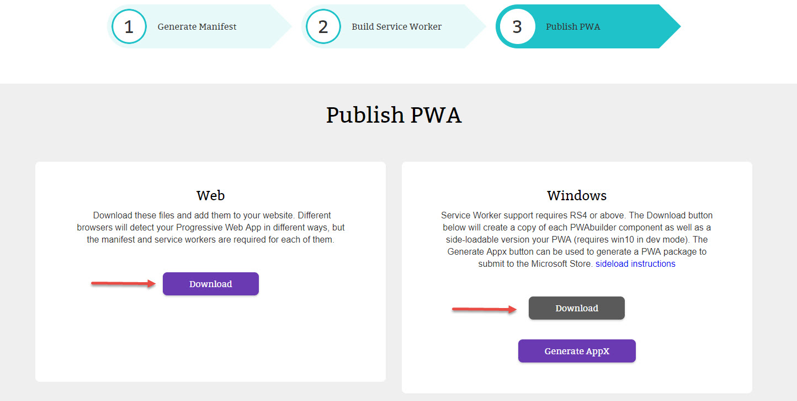
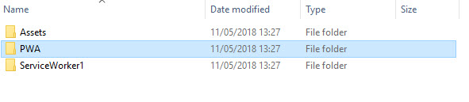
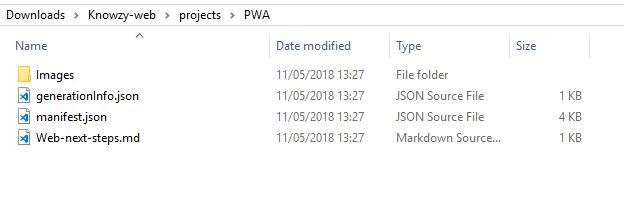
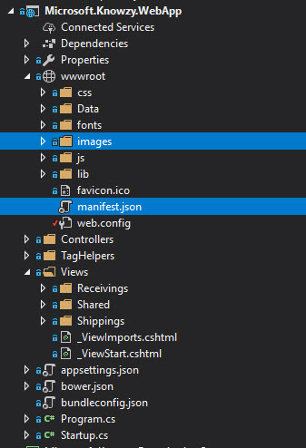
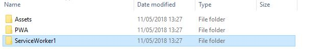
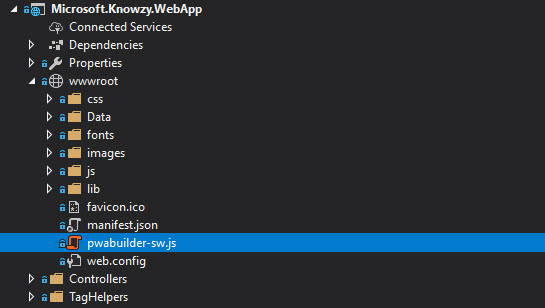
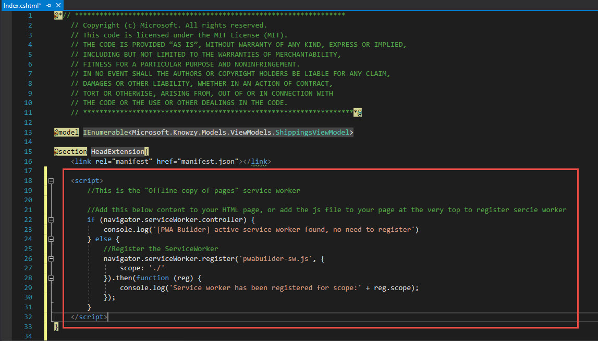
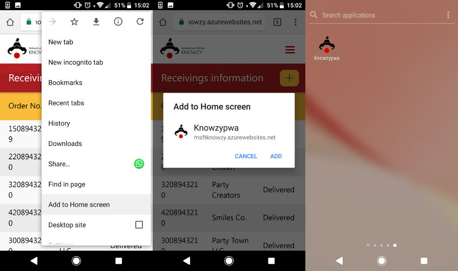

## Add Web App Manifest to your site

1. Once you have done the previous step 1 and step 2 of PWABuilder tool, go to the next step 3.

2. Download the Web and Windows 10 code (you will use the Windows 10 downloaded files later).


 

3. Open the **WEB** downloaded files and go to the PWA folder inside projects (ex: \Downloads\Knowzy-web\projects\PWA).
 

4. Pull the "manifest.json" file and the "images" folder that are inside of the PWA folder that you obtained from the zip file in the previous step.
 

1. Add the manifest.json and the "images" folder to the **wwwroot** path of your site (ex: ...\source code\src\1. WebApp\Microsoft.Knowzy.WebApp\wwwroot).

    >Remember, if you change the path of your "images" folder, you need to update the json in your manifest file to reflect your changes.

    The easiest way to add new content to a project is to drag and drop the contents from the file explorer into the solutions explorer of your project.
 

2. Reference the manifest in your **Index.cshtml** page with a link tag:

    ````html
    <link rel="manifest" href="manifest.json"></link>
    ````
    
    This can be done by opening the **`Views\Shippings\Index.cshtml`**  
    (ex: ...\source code\src\1. WebApp\Microsoft.Knowzy.WebApp\Views\Shippings\Index.cshtml)
    and add the following to the top of the document:
    ```html

      @section HeadExtension{ 
          <link rel="manifest" href="manifest.json"></link>
      }
    ```
 


  ### Add Service Worker code to your site
  
  Return to your donwloaded PWA folder and go to projects (Downloads\Knowzy-web\projects\)

1. Copy only the pwabuilder-sw.js file from the "ServiceWorker1" folder to de wwwroot of your site.
 
 

2. Open up the landing page of your app (index.cshtml) and add a new script tag in the head from within a HeadExtension section like so:
      ```html
      @section HeadExtension{ 
          <link rel="manifest" href="manifest.json"></link>
          <script></script>
      }
      ```
3. Add the following registration code inside the new script tag:

    ```js
    //This is the service worker with the combined offline experience (Offline page + Offline copy of pages)
    if(navigator.serviceWorker) {
      //Add this below content to your HTML page, or add the js file to your page at the very top to register service worker
      if (navigator.serviceWorker.controller) {
        console.log('[PWA Builder] active service worker found, no need to register')
      } else {

        //Register the ServiceWorker
        navigator.serviceWorker.register('pwabuilder-sw.js', {
          scope: './'
        }).then(function(reg) {
          console.log('Service worker has been registered for scope:'+ reg.scope);
        });
      }
    }
    ```

 

### Re-Publish Changes

Now that you have these powerful new features running locally, you can publish them to your website to be consumed as a PWA.

1. In Visual studio choose Project > Publish... or right click on Microsoft.Knowzy.WebApp and publish

    

2. Choose "Microsoft Azure App Service" from the selection screen.

    > **NOTE** if your Visual Studio project is still debugging your Azure server or your local server, you may need to halt the server before re-publishing.

    

3.  Click on "Publish button", when it finishes will show automatically the application result.

    

  ```Important!``` to show the download banner from other device, the website **must be accedded at least of two times.**
   *[Learn more about app install banners](https://developers.google.com/web/fundamentals/app-install-banners/).* 
   In case of having problems you can do it manually by chrome settings, `add to home screen`:

  

### References

- [PWA Builder](https://www.pwabuilder.com)


### Continue to [test your pwa >> ](pwa_05_test.md)

