# Quick Start 1: Azure DevOps Project

The Azure DevOps Project simplifies the initial configuration of a continuous integration (CI) and continuous delivery (CD) pipeline to deploy your app on Azure in a few quick step. It sets you up with everything you need for developing, deploying, and monitoring your app.


## Exercise 1: Setting up Sample Java project using Azure DevOps Project

1. Sign into the [Microsoft Azure portal](https://portal.azure.com).

1. Choose the **+ Create a resource** icon in the left navigation bar, then search for **DevOps project**. Then choose **DevOps Project** in the list and click on **Create**

    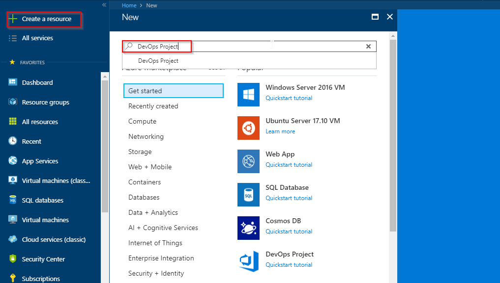

1. Select the **Java** sample application and click on **Next**. The Java samples include a choice of several application frameworks.

   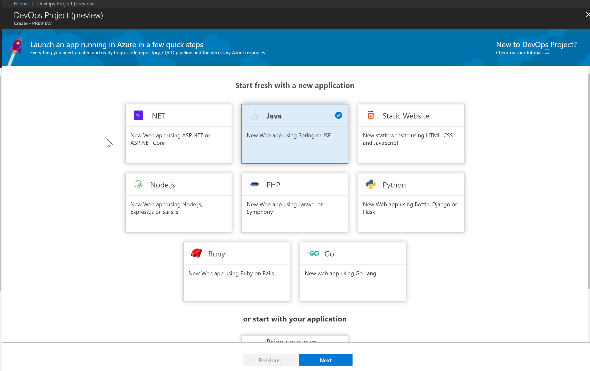

1.  Select the default sample framework is **Spring**. choose **Next**.

1. Select **Web App For Containers** and choose **Next**.

1. Finally, you will need to provide a Team Services account. Since you do not have one, you will create a new VSTS account. Provide a name for your VSTS **account** and **project** and choose **Done**.

    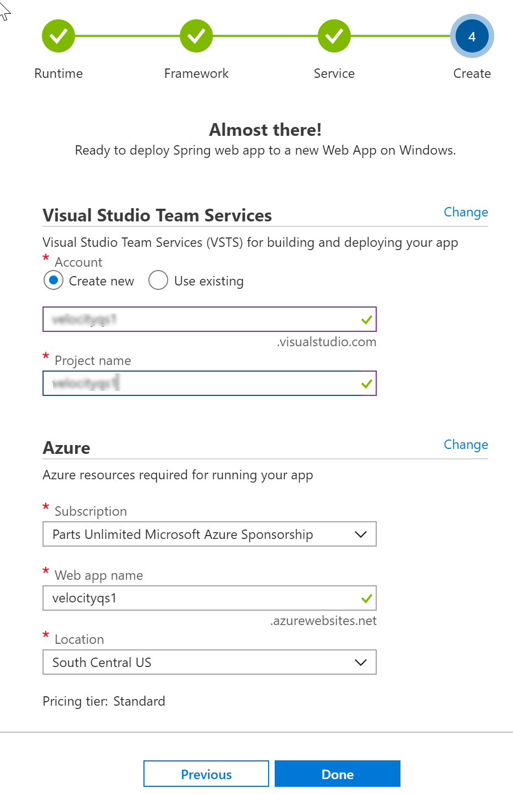

7. In a few minutes, the **project dashboard** loads in the Azure portal. A sample java application is set up in a repository in your VSTS account, a build executes, and your application deploys to Azure. This dashboard provides visibility into your **code repository**, **VSTS CI/CD pipeline**, and your **application in Azure**. 
   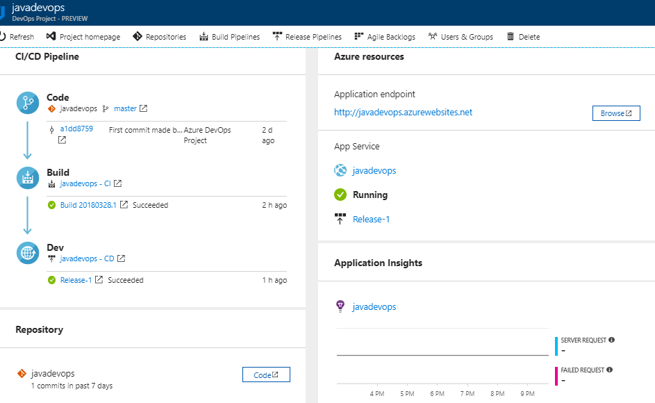

8.  On the right side of the dashboard, select **Browse** to view your running application.

    The web app look like as shown in below figure
    
    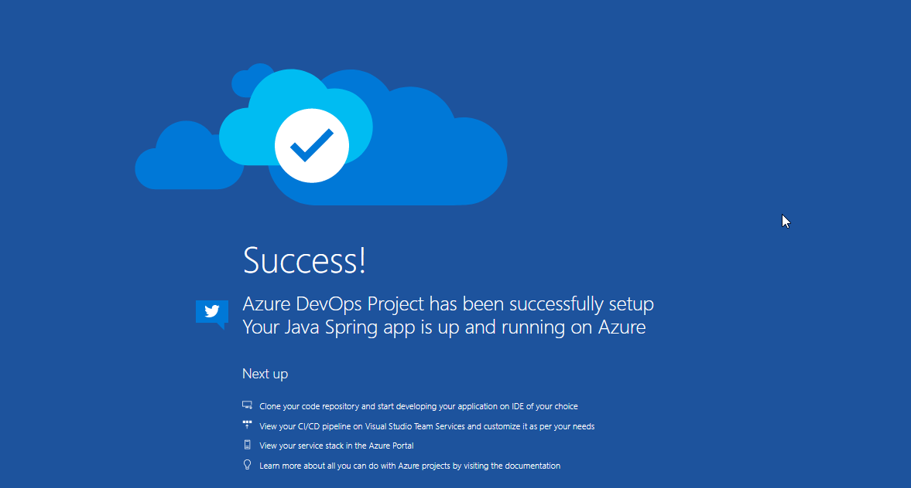

   The **Azure DevOps project** automatically configures a CI build and release trigger. You're now ready to collaborate with a team on a Java app with a CI/CD process that automatically deploys your latest work to your web site.

## Exercise 2: Examine the VSTS CI/CD pipelines configured by Azure DevOps Project

  The Azure DevOps project automatically configured a full VSTS CI/CD pipeline in your VSTS account. Explore and customize the pipeline as needed. Follow the steps below to familiarize yourself with the VSTS build and release definitions.

1. Select **Build Pipelines** from the top of the Azure DevOps project dashboard. This link opens a browser tab and opens the VSTS build definition for your new project.

    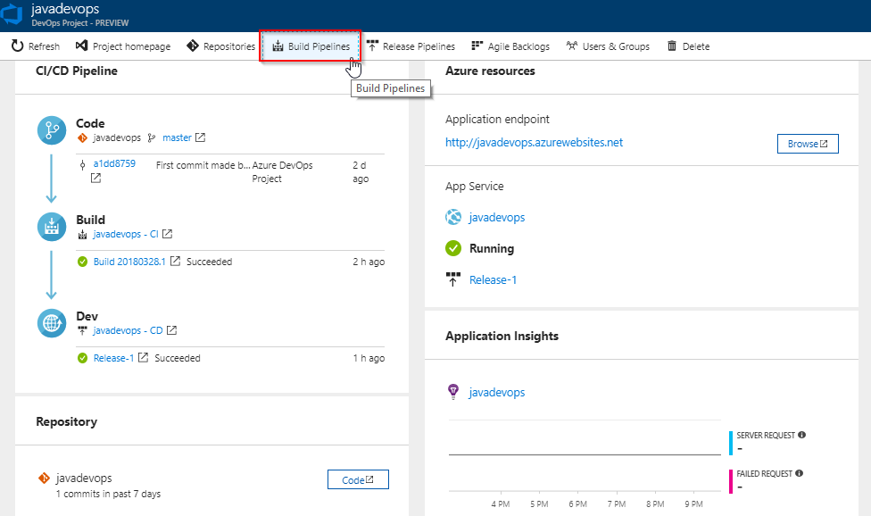

2. Select the **ellipsis** that appears. This action opens a menu where you can perform several activities such as queue a new build, pause a build, and edit the build definition. Select **Edit**.
      
    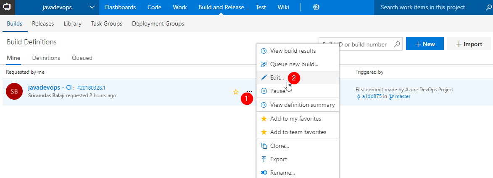

3. From this view, **examine the various tasks** for your build definition. The build performs various tasks such as fetching sources from the Git repository, restoring dependencies, and publishing outputs used for deployments.

     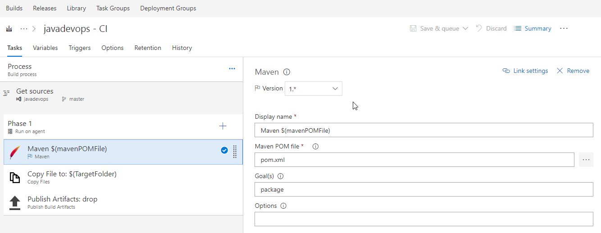

1. Select **Build and Release**, then choose **Releases**. The Azure DevOps project created a VSTS release definition to manage deployments to Azure.
     
      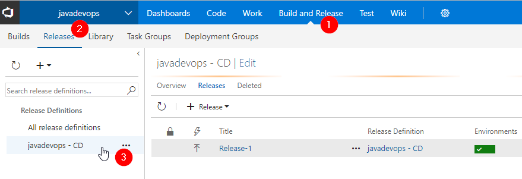

2. Select the **ellipsis** next to your release definition, then choose **Edit**.

     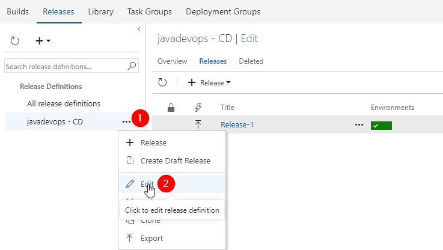

3. The release definition contains a **pipeline**, which defines the release process. 

    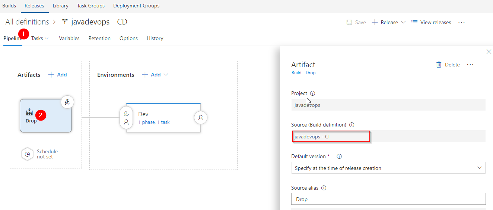

1. On the right-hand side of the browser, select **View releases**. This view shows a history of releases.

    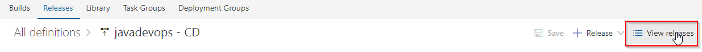

    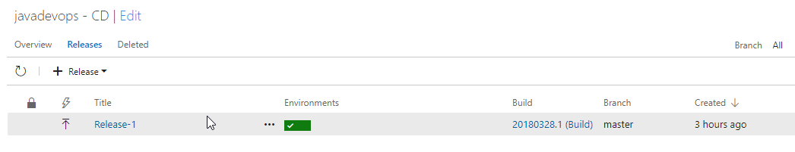

## Exercise 3: Commit the code changes and execute CI/CD

The Azure DevOps project created a **Git** repository in your VSTS account. Follow the steps below to view the repository and make code changes to your application.

1. Click on **Code** tab to view the created Git repository by Azure DevOps project.

     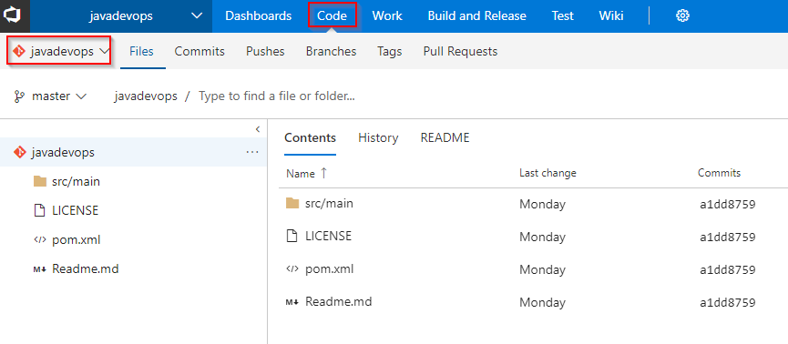

1. You can clone your Git repository in your favorite IDE. In this lab, you can use the web browser to make and commit code changes directly to the master branch.

     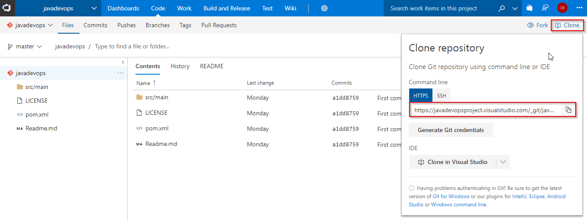

1. On the left-hand side of the browser, navigate to the **src/main/resources/static/index.html** file. Select **Edit**, and make a change. For example, change line number #21 to 
         
    ```csharp
         <div class="success-text">Welcome to Velocity 2018!!! </div>
    ```
1. Choose **Commit**, to save and check-in your changes.

      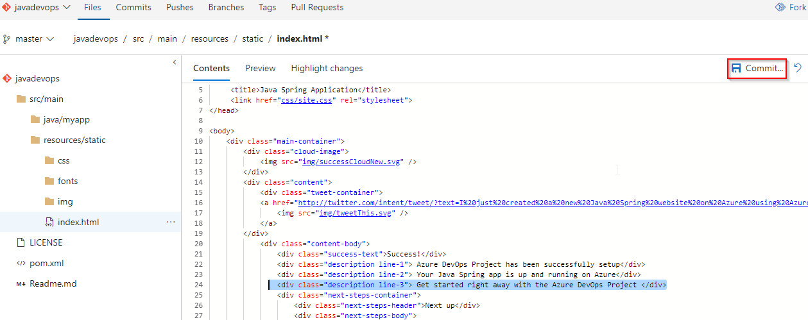

1. In your browser, navigate to the **Builds**. You should now see a build is in progress. The changes you just made are automatically built and deployed via a VSTS CI/CD pipeline.

    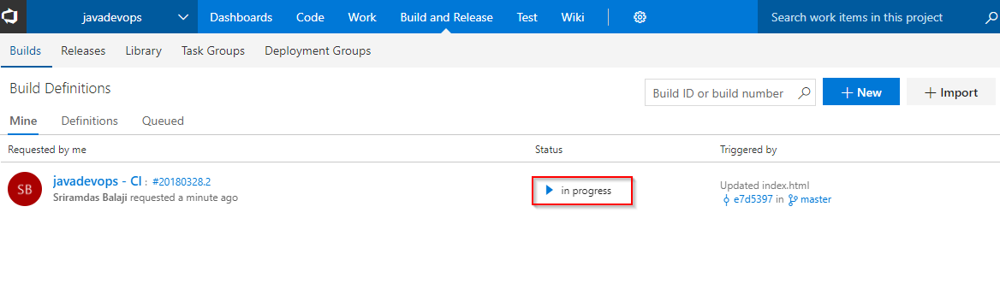

1. In your browser, navigate to the **Azure DevOps project dashboard**. On the right side of the dashboard, select **Browse** to view your updated running application. You will the updated decription line in the web app.

   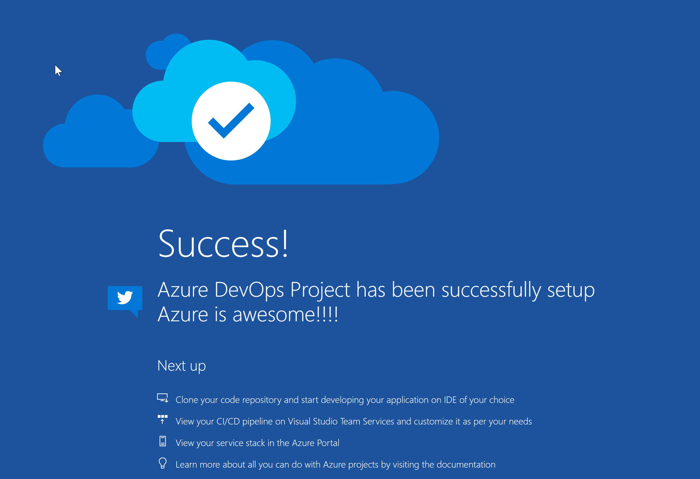