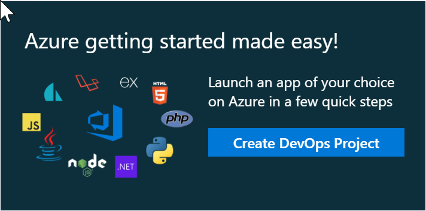
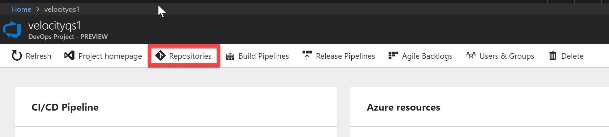

# Quick Start 1: Azure getting started made easy!

The Azure DevOps Project simplifies the initial configuration of a continuous integration (CI) and continuous delivery (CD) pipeline to deploy your app on Azure in a few quick step. It sets you up with everything you need for developing, deploying, and monitoring your app.

1. Sign into the **Microsoft Azure portal** using the credentials provided in the **Resources** tab

1. Select **Maybe later** if you are prompted to start a tour 

1. You will notice a tile on your dashboard with a title **Azure getting started made easy!**

1. Select **Create DevOps Project**

    

1. Azure works for any language, any platform. You can choose the language you use to develop your application. Let us choose **Java**. Select **Next**.

   

1. Assume you are using **Spring**. Select **Next**.

1. You can choose where you want to deploy the application. For simplicity, let's choose **Web App**

1. Finally, you will specify which Team Services and Azure account you want to use. Select **Create new** for Team Services and provide a name for your *account* and  *project* and choose **Done**.

1. In a few minutes, the **project dashboard** loads in the Azure portal. A sample java application is set up in a repository in your VSTS account, a build executes, and your application is deployed to Azure

1. This dashboard provides visibility into your **code repository**, **VSTS CI/CD pipeline**, and your **application in Azure**
   

1. On the right side of the dashboard, select **Browse** to view your running application. The web app will look like this
    

1. Click **Repositories** to view the created Git repository by Azure DevOps project

     

1. You can clone your Git repository in your favorite IDE but for the purpose of this lab, you will edit in the browser itself and commit the changes directly to the master branch

1. On the left-hand side of the browser, navigate to the **src/main/resources/static/index.html** file. Select **Edit**, and make a change. For example, change line number #21 to 
    ```csharp
         <div class="success-text">Azure is awesome!!! </div>
    ```
1. Choose **Commit**, to save and check-in your changes

1. In your browser, navigate to **Builds** under **Build and Release**. You should now see a build is in progress. The changes you just made are automatically built and deployed via a VSTS CI/CD pipeline. The build should take 1-2 minutes to complete. Once the build is successful, navigate to **Releases** and you will notice the deployment has started

1. Wait for the release to finish and then return to the Azure DevOps project on the Azure portal. On the right side of the dashboard, select **Browse** to view your updated running application
   