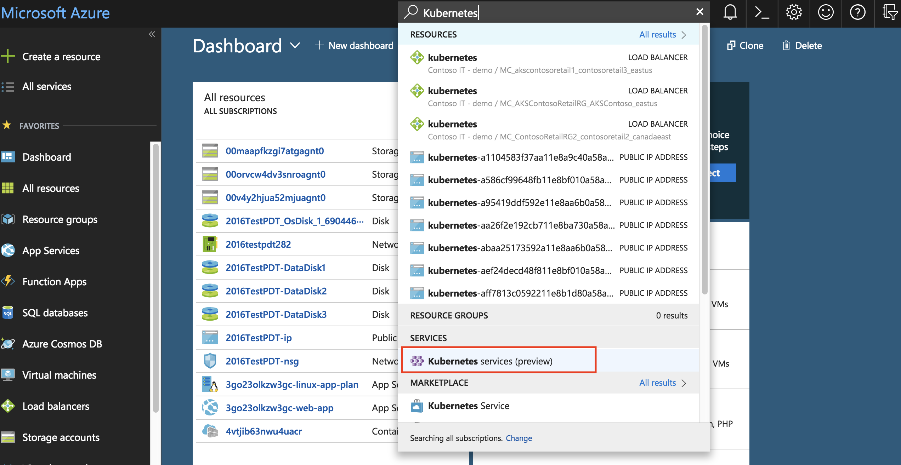

You are tasked with managing 3 different Kubernetes clusters running different web apps in Azure. Things have been going fine for a while now but today morning your users started complaining about performance of applications in the "contosoretail2" kubernetes cluster. and the issue seems to keep deteriorating. You have to meet your 5 minutes SLA to find and fix the issue. You are in PANIC mode – with so many containers how you can figure out what’s wrong so quickly. Don’t worry, we will lead you there - but it’s going to be up to you to find the root causes.

1. Login to the [Microsoft Azure portal](https://portal.azure.com)
2. Your Kubernetes cluster is part of the Azure Kubernetes Service (AKS). To get to AKS, search for "Kubernetes" in the top search bar and select "Kubernetes services (preview)"

3. You will see a list of clusters. Choose "contosoretail2" cluster and click on it.

4. Scroll down the left navigation pane and click on "Health (preview) to see the health of your cluster

5. You can see the memory and CPU usage at a Nodes, Controller and Container level.

6. **Task 1:** Click through the clusters, go through the CPU usage and see if you can find any issue
7. So, you have isolated the problem to a specific container. Now you need to find out the root causes. To take a look at the logs, click on the Containers tab at the top and click on View Logs
8. **Task 2** Find the process responsible for the performance issue

`#Use a query similar to this - INSERT QUERY`

9. Congratulations! You have found the root cause within the SLA and saved the day. While you are it, you have a bonus task.
10. Run a query to find all the VM’s that are missing security patches. 

`#Use a query similar to this - INSERT QUERY`

